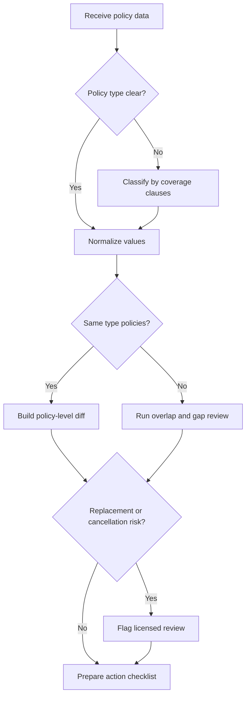
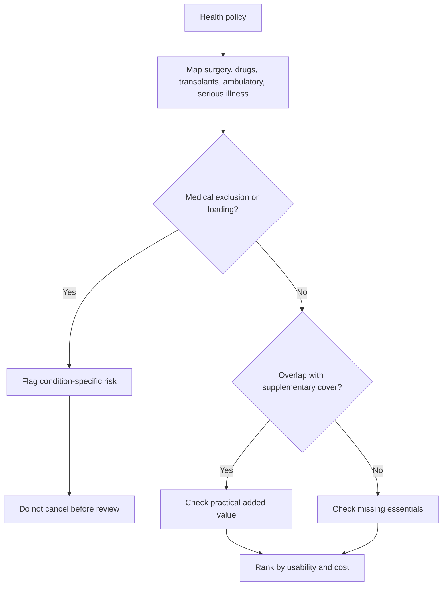
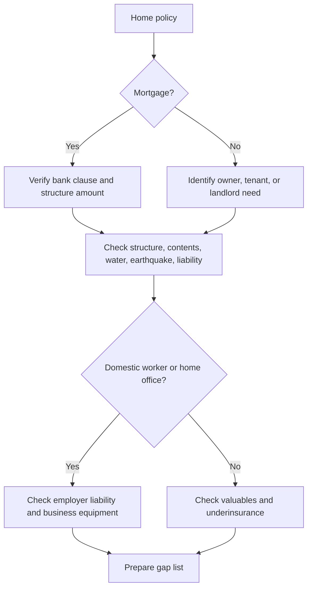
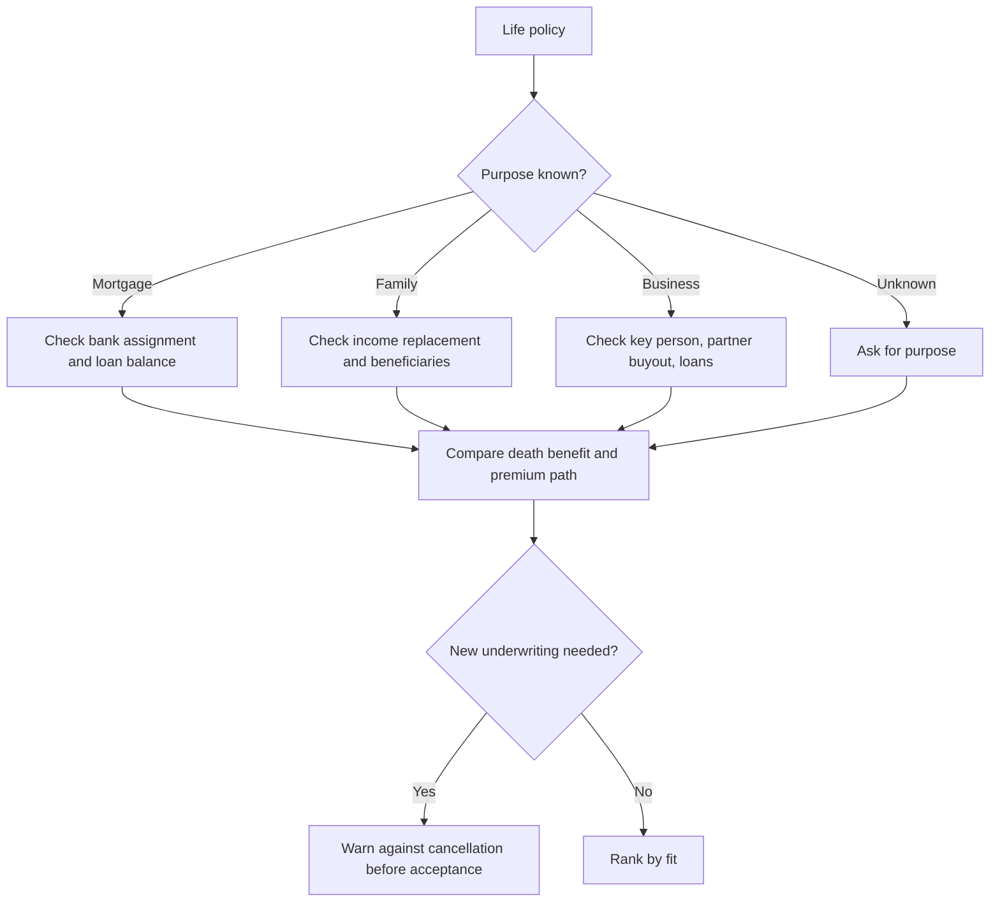

# Insurance Coverage Analyzer

## Purpose

Compare Israeli insurance policies at policy level for **health insurance**, **home insurance**, and **life insurance**. Produce practical coverage diffs for consumers, freelancers, and small businesses. Focus on usable protection, exclusions, deductibles, waiting periods, beneficiary or mortgage assignment issues, duplicate coverages, underinsurance, and renewal negotiation actions.

Treat the output as a decision aid. Direct the user to a licensed professional before cancellation, replacement, medical underwriting, beneficiary changes, mortgage-bank assignment changes, tax questions, legal questions, or medical decisions.

## Privacy and safety

- Redact Israeli ID numbers, full policy numbers, payment details, medical files, government login artifacts, and one-time codes.
- Do not automate login, scrape identity-bound government portals, or bypass identification.
- Store only the fields needed for comparison.
- Preserve source references when available: document name, page, clause, date.
- Mark missing data as unknown instead of guessing.

## Supported policy types

### Health insurance

Analyze private health policies, supplementary health-plan overlap, surgery coverage, transplant and special treatment coverage, drugs outside the health basket, ambulatory services, specialist consultations, diagnostic tests, serious illness riders, waiting periods, medical exclusions, and underwriting loadings.

### Home insurance

Analyze structure, contents, mortgage-lender requirements, water damage, earthquake coverage, third-party liability, employer liability for domestic workers, valuables, jewelry, bicycles, electronics, business equipment kept at home, tenant/landlord differences, and underinsurance.

### Life insurance

Analyze death benefit, mortgage life, beneficiaries, bank assignment, premium structure, index linkage, riders, exclusions, smoking or occupation assumptions, underwriting loadings, business loans, key-person needs, partner buyout needs, and family income replacement.

## Required input

| Field | Reason | Example |
|---|---|---|
| policy_type | Selects comparison logic | `health`, `home`, `life` |
| insurer | Identifies issuer | `Insurer A` |
| policy_name | Distinguishes product generation | `Private Health Plus` |
| policy_number | Enables user verification after redaction | `redacted-1234` |
| holder_type | Household, freelancer, or business context | `freelancer` |
| start_date / renewal_date | Detects waiting periods and renewal pressure | `01-01-2024` |
| premium_monthly_nis / premium_annual_nis | Normalizes cost | `₪185/month` |
| coverages | Builds the diff matrix | `drugs_outside_basket` |
| deductibles | Shows claim-time cost | `₪750` or `10%` |
| exclusions | Determines claim usability | `pre-existing back condition` |
| waiting_period_days | Detects replacement risk | `90` |
| index_linkage | Affects long-term cost | `CPI` |
| source | Supports traceability | `policy.pdf page 4` |

## Normalization rules

1. Convert all prices to **₪ per month** and **₪ per year**.
2. Convert dates to **DD-MM-YYYY**.
3. Keep original wording in notes when it affects interpretation.
4. Normalize policy types:
   - `ביטוח בריאות`, `health`, `private medical` → `health`
   - `ביטוח דירה`, `home`, `apartment`, `contents`, `structure` → `home`
   - `ביטוח חיים`, `life`, `term`, `mortgage life`, `risk`, `ריסק` → `life`
5. Compare same-type policies directly. For mixed types, produce overlap/gap analysis and do not rank by price.
6. Convert percentage deductibles to shekel exposure. Example: 10% on ₪1,200,000 equals ₪120,000.

## Policy-level diff categories

| Category | Health | Home | Life |
|---|---|---|---|
| Premium | monthly and annual ₪ | monthly and annual ₪ | monthly, annual, and future premium path |
| Core benefit | surgery, drugs, transplant | structure, contents, liability | death benefit |
| Claim usability | provider choice, waiting, exclusions | service provider, deductible, exclusions | beneficiary clarity, assignment |
| High-severity risks | underwriting, old policy replacement | mortgage mismatch, earthquake deductible | bank assignment, new underwriting |
| Duplicates | serious illness, surgery overlap | contents/business property | mortgage life/family protection |
| Gaps | no drugs, no ambulatory | no contents, no third-party, no employer liability | no beneficiary, no family income cover |

## Workflow

### Step 1: Classify the policy

Identify the product by coverage content, not by marketing name. A product named "family protection" can be life insurance, health insurance, or a bundle.

### Step 2: Normalize fields

Transform premiums, dates, money, deductibles, and coverage names into structured fields. Keep original language in notes.

### Step 3: Build a coverage matrix

Use a table:

| Coverage domain | Policy A | Policy B | Practical effect |
|---|---|---|---|
| Annual premium | ₪2,220 | ₪2,640 | Policy A cheaper by ₪420 |
| Surgery coverage | covered, ₪1,000,000 | covered, ₪750,000 | Policy A higher limit |
| Deductible | ₪0 | ₪500 | Policy A lower out-of-pocket |
| Waiting period | 90 days | 120 days | Policy A has the shorter review-threshold example |
| Exclusions | knee exclusion | none listed | Verify underwriting before replacement |

### Step 4: Detect duplicates and gaps

Flag duplicates only after checking whether the second policy adds practical value. Overlap is not always waste. For example, private health insurance may overlap with supplementary cover but still add provider choice, higher limits, drugs outside the basket, or overseas treatment.

### Step 5: Assign severity

- **Critical**: likely uninsured catastrophic risk, cancellation gap, missing mortgage compliance, or unaccepted replacement.
- **High**: material claim approval or benefit impact.
- **Medium**: meaningful cost or usability difference.
- **Low**: wording or operational difference with limited expected effect.
- **Unknown**: missing source wording.

### Step 6: Recommend actions

Use imperative actions:

- Verify source wording.
- Request full policy wording.
- Ask insurer to confirm the gap in writing.
- Compare another quote with the same limits and deductibles.
- Negotiate annual ₪ price.
- Avoid cancellation before replacement acceptance.
- Request licensed review before cancellation or beneficiary changes.

## Decision trees

### Overall triage

### Health

### Home

### Life

## Scoring model

Use scoring only as a secondary aid.

| Factor | Weight |
|---|---:|
| Coverage breadth | 30 |
| Claim usability | 25 |
| Price efficiency | 20 |
| Gap protection | 15 |
| Flexibility | 10 |

Explain every score in plain language. A cheaper policy with severe exclusions should not win automatically.

## Concrete examples

### Health example

Policy A costs ₪180/month, includes drugs outside the basket up to ₪2,000,000, surgery deductible ₪0, and a 90-day waiting period. Policy B costs ₪145/month, includes drugs up to ₪1,000,000, surgery deductible ₪500, and a 120-day waiting period. Treat the 90-day value as an example review threshold, not as a statutory rule.

Finding: Policy B is cheaper by ₪420/year, but Policy A is stronger for expensive medication, surgery out-of-pocket cost, and near-term usability.

### Home example

Policy A covers structure ₪1,250,000, contents ₪250,000, earthquake with 10% deductible, and third-party liability ₪1,000,000. The user has a mortgage and a weekly cleaner.

Finding: Verify the bank clause, calculate earthquake exposure as ₪125,000, and confirm employer liability for the cleaner.

### Life example

Policy A offers ₪1,000,000 death benefit at ₪95/month with age-based increases. Policy B offers ₪750,000 at fixed ₪130/month. A separate ₪600,000 mortgage life policy is assigned to the bank.

Finding: Separate bank protection from family cash-flow protection. Model long-term premium, check beneficiaries, and avoid cancellation before written acceptance.

## Web-validated source posture

Use current official sources before relying on regulatory context. Prefer the Capital Market Authority, Israel Tax Authority, Ministry of Health, Knesset National Legislation Database, and official government service pages. For 2026 validation, keep these operating assumptions:

- Har HaBituach is an identity-bound public portal for users to review their own insurance inventory. Do not request passwords, one-time codes, or automated access.
- Capital Market Authority calculators exist for health, home, and life tariff comparison. Treat calculator output as an aid, not as binding policy wording.
- Private health analysis must distinguish the public health basket, supplementary health-plan cover, and private insurance.
- Home insurance analysis must verify standard policy wording, endorsements, war or hostilities exclusions, earthquake terms, and lender clauses.
- Life insurance analysis must separate mortgage-assigned cover from family or business protection.
- The general Israeli VAT rate was validated as 18% from 01/01/2025 through the 2026 validation pass. Do not infer insurance-premium tax treatment from the general VAT rate; refer tax questions to a professional.
- No official public API endpoint or webhook event set was confirmed for this skill. Use manual user-supplied documents and structured local data.

See `references/verification-log.md` for source snippets, URLs, access date, and second-pass confirmation.

## Edge cases

- Old health policies can include terms that are not available in newer policies.
- First-year discounts can hide second-year price increases.
- Mortgage life can protect the bank but leave family income needs uncovered.
- Home contents can exclude business equipment.
- Earthquake deductibles are often percentage-based and can be very large.
- Marketing brochures may conflict with binding policy wording.
- A policy summary may omit exclusions and endorsements.
- Life insurance beneficiary wording may override family expectations.
- A health-fund supplementary plan and private policy can overlap without being identical.
- New health or life coverage can require underwriting and new waiting periods.

## Troubleshooting

| Symptom | Likely cause | Fix |
|---|---|---|
| Prices not comparable | monthly vs annual | normalize both |
| Cheaper quote looks better | lower limits or higher deductible | compare claim scenarios |
| Home quote very cheap | contents, earthquake, water, or liability missing | rebuild matrix |
| Life premium jumps | stepped premium | model multi-year cost |
| Health replacement unclear | underwriting unknown | add licensed review warning |
| Date ambiguous | short year or US format | request DD-MM-YYYY |

## Anti-patterns

Avoid:

- Ranking by premium only.
- Treating a brochure as policy wording.
- Ignoring exclusions, endorsements, or waiting periods.
- Telling the user to cancel old health or life coverage before written replacement acceptance.
- Assuming mortgage life protects dependents.
- Ignoring CPI linkage.
- Ignoring percentage deductibles.
- Treating home-office equipment as ordinary contents without confirmation.
- Treating supplementary health-plan cover and private insurance as identical.

## Production checklist

- Redact identifiers.
- Confirm policy type.
- Normalize dates to DD-MM-YYYY.
- Normalize money to ₪ monthly and annual.
- Build a side-by-side diff.
- Convert percentage deductibles to ₪ exposure.
- Extract exclusions, waiting periods, and endorsements.
- Detect duplicates and gaps.
- Flag replacement, mortgage, beneficiary, underwriting, and business risks.
- Separate facts from assumptions.
- Add source page references when available.
- Provide a prioritized action checklist.
