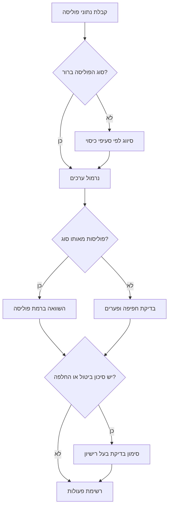
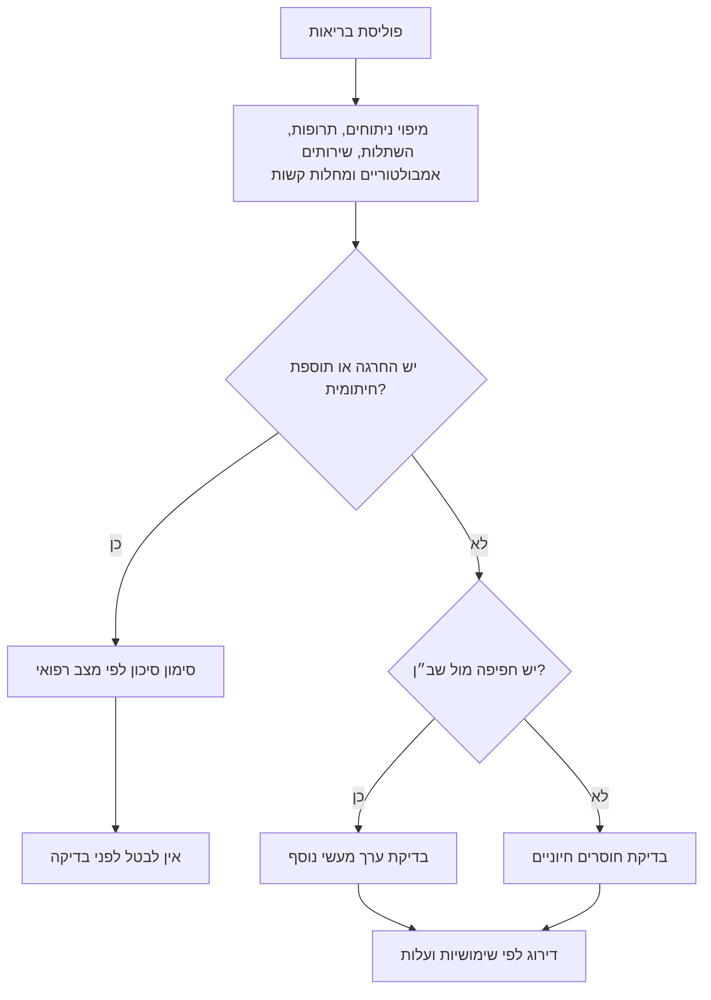
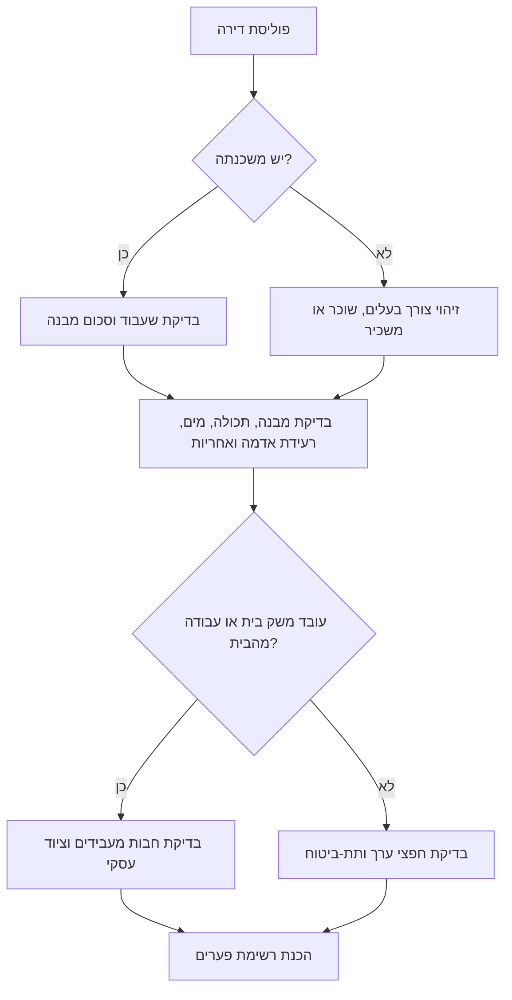
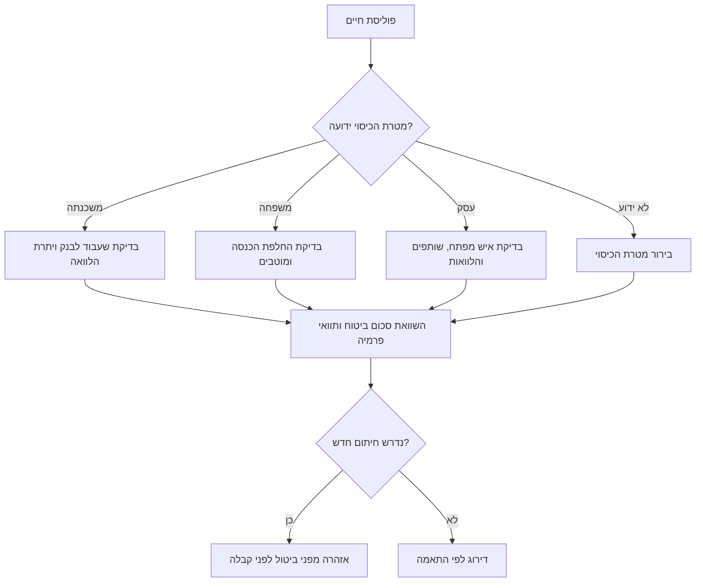

# מנתח כיסויי ביטוח בישראל

## מטרה

השווה פוליסות ביטוח בישראל ברמת סעיפי הפוליסה: **ביטוח בריאות**, **ביטוח דירה** ו**ביטוח חיים**. הפק תוצר שימושי לצרכן, לעצמאי או לעסק קטן: פערי כיסוי, כפל ביטוחי, חריגים, השתתפויות עצמיות, תקופות אכשרה, שעבודים לבנק, מוטבים, תת-ביטוח ופעולות לחידוש שנתי.

התוצר הוא כלי עזר לקבלת החלטות. הפנה לבדיקה של בעל רישיון לפני ביטול, החלפה, חיתום רפואי, שינוי מוטבים, שינוי שעבוד לטובת בנק, שאלת מס, שאלה משפטית או החלטה רפואית.

## פרטיות וזהירות

- טשטש מספרי תעודת זהות, מספרי פוליסה מלאים, פרטי תשלום, מסמכים רפואיים, נתוני כניסה ממשלתיים וקודים חד-פעמיים.
- אל תבצע כניסה אוטומטית לאתרים ממשלתיים ואל תעקוף הזדהות.
- שמור רק שדות שנדרשים להשוואה.
- שמור מקור כאשר קיים: שם מסמך, עמוד, סעיף ותאריך.
- סמן מידע חסר כ״לא ידוע״ במקום לנחש.

## סוגי פוליסות נתמכים

### ביטוח בריאות

נתח ביטוח בריאות פרטי, חפיפה מול שב״ן, ניתוחים, השתלות וטיפולים מיוחדים, תרופות שאינן בסל הבריאות, שירותים אמבולטוריים, ייעוץ מומחים, בדיקות אבחון, מחלות קשות, תקופות אכשרה, החרגות רפואיות ותוספות חיתומיות.

### ביטוח דירה

נתח מבנה, תכולה, דרישות בנק למשכנתה, נזקי מים, רעידת אדמה, אחריות כלפי צד שלישי, חבות מעבידים לעובדי משק בית, תכשיטים, חפצי ערך, אופניים, ציוד אלקטרוני, ציוד עסקי בבית, שוכר מול בעל נכס ותת-ביטוח.

### ביטוח חיים

נתח סכום ביטוח למקרה מוות, ביטוח חיים למשכנתה, מוטבים, שעבוד לבנק, מבנה פרמיה, הצמדה למדד, נספחים, חריגים, הנחות עישון או עיסוק, תוספות חיתומיות, הלוואות עסקיות, צורך באיש מפתח, הסכם שותפים וצורך הכנסה למשפחה.

## קלט נדרש

| שדה | סיבה | דוגמה |
|---|---|---|
| סוג פוליסה | קובע את כללי ההשוואה | `בריאות`, `דירה`, `חיים` |
| חברת ביטוח | מזהה את המבטח | `מבטח א׳` |
| שם פוליסה | מזהה דור מוצר | `בריאות פרטי פלוס` |
| מספר פוליסה | מאפשר אימות אחרי טשטוש | `מוסתר-1234` |
| סוג בעלים | משפחה, עצמאי או עסק | `עצמאי` |
| תאריך התחלה / חידוש | מזהה תקופות אכשרה ולחץ בחידוש | `01/01/2024` |
| פרמיה חודשית / שנתית | מנרמל עלות | `₪185 לחודש` |
| כיסויים | בסיס מטריצת ההשוואה | `תרופות שאינן בסל` |
| השתתפויות עצמיות | מציג עלות בזמן תביעה | `₪750` או `10%` |
| חריגים | קובע שימושיות בתביעה | `מצב רפואי קודם` |
| תקופת אכשרה | מזהה סיכון בהחלפה | `90` |
| הצמדה | משפיעה על עלות לטווח ארוך | `מדד המחירים לצרכן` |
| מקור | מאפשר בדיקה חוזרת | `policy.pdf עמוד 4` |

## כללי נרמול

1. המר כל מחיר ל**₪ לחודש** ול**₪ לשנה**.
2. הצג תאריכים בפורמט **DD/MM/YYYY**.
3. שמור ניסוח מקורי בהערות כאשר הוא משפיע על הפרשנות.
4. נרמל סוגי פוליסה:
   - `ביטוח בריאות`, `health`, `private medical` → `בריאות`
   - `ביטוח דירה`, `home`, `apartment`, `contents`, `structure` → `דירה`
   - `ביטוח חיים`, `life`, `term`, `mortgage life`, `risk`, `ביטוח למקרה מוות` → `חיים`
5. השווה ישירות רק פוליסות מאותו סוג. בפוליסות מסוגים שונים בצע ניתוח חפיפה ופערים ללא דירוג מחיר.
6. המר השתתפות עצמית באחוזים לחשיפה בשקלים. לדוגמה: 10% מתוך ₪1,200,000 הם ₪120,000.

## קטגוריות להשוואה ברמת פוליסה

| קטגוריה | בריאות | דירה | חיים |
|---|---|---|---|
| פרמיה | ₪ לחודש ולשנה | ₪ לחודש ולשנה | ₪ לחודש, לשנה ותוואי עתידי |
| כיסוי מרכזי | ניתוחים, תרופות, השתלות | מבנה, תכולה, אחריות | סכום ביטוח למקרה מוות |
| שימושיות בתביעה | בחירת ספק, אכשרה, חריגים | ספק שירות, השתתפות, חריגים | מוטבים ושעבודים |
| סיכונים חמורים | חיתום והחלפת פוליסה ישנה | אי-התאמה למשכנתה, רעידת אדמה | שעבוד לבנק וחיתום חדש |
| כפילויות | מחלות קשות, ניתוחים מול שב״ן | תכולה מול ציוד עסקי | ביטוח חיים למשכנתה מול הגנת משפחה |
| פערים | אין תרופות, אין שירותים אמבולטוריים | אין תכולה, אין צד ג׳, אין חבות מעבידים | אין מוטבים, אין הכנסה למשפחה |

## תהליך עבודה

### שלב 1: סווג את הפוליסה

זהה מוצר לפי סעיפי הכיסוי ולא לפי שם שיווקי. מוצר בשם ״הגנה למשפחה״ יכול להיות ביטוח חיים, ביטוח בריאות או חבילה.

### שלב 2: נרמל שדות

המר פרמיות, תאריכים, סכומים, השתתפויות עצמיות ושמות כיסויים למבנה אחיד. שמור את שפת המקור בהערות.

### שלב 3: בנה מטריצת כיסויים

| תחום | פוליסה א׳ | פוליסה ב׳ | משמעות מעשית |
|---|---|---|---|
| פרמיה שנתית | ₪2,220 | ₪2,640 | פוליסה א׳ זולה ב₪420 |
| ניתוחים | מכוסה, ₪1,000,000 | מכוסה, ₪750,000 | לפוליסה א׳ גבול אחריות גבוה יותר |
| השתתפות עצמית | ₪0 | ₪500 | בפוליסה א׳ חשיפה נמוכה יותר |
| תקופת אכשרה | 90 ימים | 120 ימים | פוליסה א׳ קצרה יותר בדוגמת סף הבדיקה |
| חריגים | חריג ברך | לא צוינו | יש לבדוק חיתום לפני החלפה |

### שלב 4: אתר כפילויות ופערים

סמן כפילות רק אחרי בדיקה אם הכיסוי השני מוסיף ערך ממשי. חפיפה אינה תמיד בזבוז. לדוגמה, ביטוח בריאות פרטי עשוי לחפוף לשב״ן אך עדיין להוסיף בחירת ספק, גבולות אחריות גבוהים, תרופות שאינן בסל או טיפול בחו״ל.

### שלב 5: קבע חומרה

- **קריטי**: סיכון לנזק חמור שאינו מבוטח, פער ביטול, אי-עמידה בדרישת משכנתה או החלפה שלא אושרה.
- **גבוה**: השפעה מהותית על אישור תביעה או סכום תגמול.
- **בינוני**: הבדל משמעותי בעלות או שימושיות.
- **נמוך**: הבדל ניסוח או תפעול מוגבל.
- **לא ידוע**: חסר מקור.

### שלב 6: המלץ על פעולות

השתמש בפעלים ישירים:

- בדוק ניסוח מקור.
- בקש פוליסה מלאה.
- דרוש אישור בכתב לגבי הפער.
- קבל הצעת מחיר נוספת עם אותם גבולות והשתתפויות.
- נהל משא ומתן על עלות שנתית ב₪.
- אל תבטל לפני קבלה בכתב של חלופה.
- בקש בדיקה של בעל רישיון לפני ביטול או שינוי מוטבים.

## עצי החלטה

### מיון כללי

### בריאות

### דירה

### חיים

## שיטת ניקוד

השתמש בניקוד רק ככלי עזר משני.

| רכיב | משקל |
|---|---:|
| רוחב כיסוי | 30 |
| שימושיות בתביעה | 25 |
| יעילות מחיר | 20 |
| סגירת פערים | 15 |
| גמישות | 10 |

הסבר כל ניקוד בשפה פשוטה. פוליסה זולה עם החרגות חמורות אינה אמורה לנצח אוטומטית.

## דוגמאות

### ביטוח בריאות

פוליסה א׳ עולה ₪180 לחודש, כוללת תרופות שאינן בסל עד ₪2,000,000, השתתפות עצמית ₪0 בניתוחים ותקופת אכשרה של 90 ימים. פוליסה ב׳ עולה ₪145 לחודש, כוללת תרופות עד ₪1,000,000, השתתפות עצמית ₪500 ותקופת אכשרה של 120 ימים. התייחס ל-90 ימים כדוגמת סף בדיקה ולא ככלל סטטוטורי.

ממצא: פוליסה ב׳ זולה ב₪420 לשנה, אך פוליסה א׳ חזקה יותר בתרופות יקרות, בעלות תביעה ובשימושיות קרובה.

### ביטוח דירה

פוליסה א׳ מכסה מבנה ₪1,250,000, תכולה ₪250,000, רעידת אדמה עם השתתפות עצמית 10% וצד שלישי ₪1,000,000. למשתמש יש משכנתה ומנקה שבועית.

ממצא: בדוק שעבוד לבנק, חשב חשיפה ברעידת אדמה כ₪125,000, ואשר חבות מעבידים עבור המנקה.

### ביטוח חיים

פוליסה א׳ נותנת ₪1,000,000 למקרה מוות בעלות ₪95 לחודש עם פרמיה עולה לפי גיל. פוליסה ב׳ נותנת ₪750,000 בעלות קבועה ₪130 לחודש. פוליסת משכנתה נפרדת בסך ₪600,000 משועבדת לבנק.

ממצא: הפרד בין הגנת הבנק לבין תזרים למשפחה. חשב עלות ארוכת טווח, בדוק מוטבים ואל תבטל לפני קבלה בכתב.

## עמדת מקורות לאחר אימות רשת

השתמש במקורות רשמיים ועדכניים לפני הסתמכות על הקשר רגולטורי. העדף את רשות שוק ההון, ביטוח וחיסכון, רשות המסים, משרד הבריאות, מאגר החקיקה הלאומי של הכנסת ודפי שירות ממשלתיים. באימות לשנת 2026, שמור על ההנחות התפעוליות הבאות:

- הר הביטוח הוא פורטל ציבורי מזוהה לבדיקת תיק הביטוח של המשתמש. אל תבקש סיסמאות, קודים חד-פעמיים או גישה אוטומטית.
- מחשבוני רשות שוק ההון קיימים להשוואת תעריפי בריאות, דירה וחיים. התייחס לתוצאה ככלי עזר ולא כנוסח פוליסה מחייב.
- בניתוח בריאות פרטי, הפרד בין סל הבריאות, שב״ן וביטוח פרטי.
- בניתוח דירה, בדוק נוסח פוליסה תקנית, הרחבות, חריגי מלחמה או פעולות איבה, תנאי רעידת אדמה ודרישות בנק.
- בניתוח חיים, הפרד בין כיסוי משועבד למשכנתה לבין הגנה למשפחה או לעסק.
- שיעור המע״מ הכללי בישראל אומת כ-18% החל מ-01/01/2025 גם בבדיקת 2026. אל תסיק מכך טיפול מס בפרמיות ביטוח; הפנה שאלות מס לבעל מקצוע.
- לא אומתו ממשק API ציבורי רשמי או אירועי webhook רשמיים לשימוש המיועד של המיומנות. השתמש במסמכים שהמשתמש מספק ובנתונים מקומיים מובנים.

ראה `references/verification-log.md` לציטוטי מקור, כתובות, תאריך גישה ואימות חוזר.

## מקרי קצה

- פוליסות בריאות ישנות עשויות לכלול תנאים שלא זמינים במוצר חדש.
- הנחת שנה ראשונה עלולה להסתיר התייקרות בשנה השנייה.
- ביטוח חיים למשכנתה עשוי להגן על הבנק אך לא על תלויים.
- ביטוח תכולה עשוי להחריג ציוד עסקי.
- השתתפות עצמית ברעידת אדמה מחושבת לעיתים באחוזים ויכולה להיות גבוהה מאוד.
- עלון שיווקי עלול לסתור פוליסה מחייבת.
- דף פרטי ביטוח עלול לא לכלול חריגים ונספחים.
- ניסוח מוטבים בביטוח חיים עשוי לגבור על ציפייה משפחתית.
- שב״ן וביטוח פרטי יכולים לחפוף אך אינם זהים.
- ביטוח בריאות או חיים חדש עשוי לדרוש חיתום ותקופות אכשרה חדשות.

## פתרון תקלות

| תסמין | סיבה סבירה | תיקון |
|---|---|---|
| מחירים אינם בני השוואה | חודשי מול שנתי | נרמל לשני הפורמטים |
| הצעה זולה נראית עדיפה | גבולות נמוכים או השתתפות גבוהה | השווה תרחישי תביעה |
| הצעת דירה זולה מאוד | חסרים תכולה, רעידת אדמה, מים או אחריות | בנה מחדש מטריצה |
| פרמיית חיים קופצת | פרמיה משתנה עם גיל | חשב עלות רבשנתית |
| החלפת בריאות לא ברורה | חיתום לא ידוע | הוסף אזהרת בדיקת בעל רישיון |
| תאריך דומשמעי | שנה קצרה או פורמט אמריקאי | בקש DD/MM/YYYY |

## טעויות נפוצות

הימנע מאלה:

- דירוג לפי פרמיה בלבד.
- הסתמכות על עלון במקום פוליסה.
- התעלמות מחריגים, נספחים ותקופות אכשרה.
- הנחיה לבטל ביטוח בריאות או חיים ישן לפני קבלת חלופה בכתב.
- הנחה שביטוח חיים למשכנתה מגן על תלויים.
- התעלמות מהצמדה למדד.
- התעלמות מהשתתפות עצמית באחוזים.
- התייחסות לציוד עסקי בבית כתכולה רגילה בלי אישור.
- התייחסות לשב״ן ולביטוח פרטי כמוצר זהה.

## רשימת בדיקות לפני מסירה

- טשטש מזהים.
- אשר סוג פוליסה.
- הצג תאריכים בפורמט DD/MM/YYYY.
- המר סכומים ל₪ לחודש ול₪ לשנה.
- בנה טבלת השוואה צד בצד.
- המר השתתפות עצמית באחוזים לחשיפה בש״ח.
- שלוף חריגים, תקופות אכשרה ונספחים.
- אתר כפילויות ופערים.
- סמן סיכוני החלפה, משכנתה, מוטבים, חיתום ועסק.
- הפרד בין עובדות להנחות.
- הוסף הפניות לעמודים כאשר קיימות.
- סדר פעולות לפי דחיפות.
