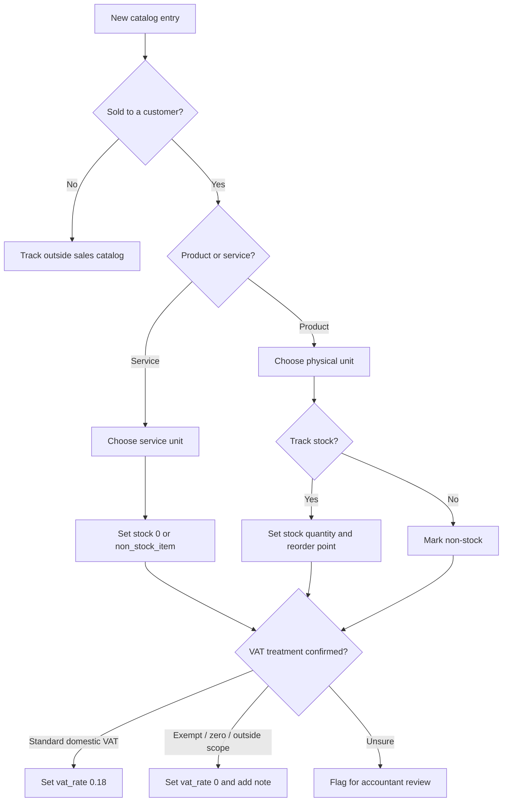
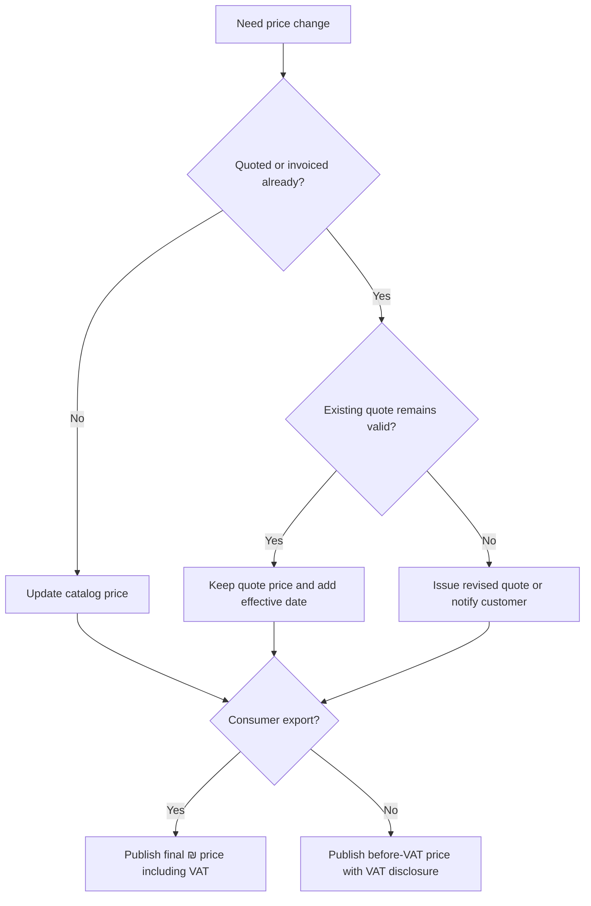
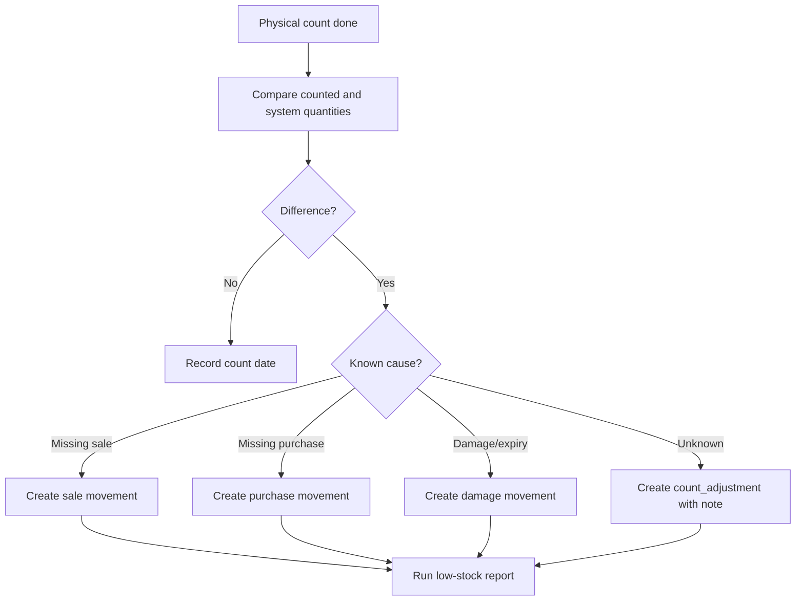

# Inventory & Catalog Manager

Manage a practical catalog for an Israeli small business, freelancer, studio, clinic, market stall, online shop, nonprofit shop, or consumer household inventory. Keep SKUs, Hebrew and English item names, units, VAT treatment, ₪ prices, stock levels, reorder points, supplier references, and audit notes consistent enough for invoices, quotes, price lists, stock counts, POS imports, accounting imports, and e-commerce exports.

Use this skill for:

- Creating or cleaning product and service catalogs.
- Designing SKU conventions that survive spreadsheets, POS systems, and accounting tools.
- Calculating VAT-exclusive and VAT-inclusive prices.
- Managing stock levels, reorder points, and stock movement notes.
- Preparing UTF-8 CSV exports with Hebrew names.
- Migrating from ad-hoc spreadsheets to a structured catalog.
- Explaining operational implications of Israeli VAT, price display, and invoice workflows without replacing professional advice.

Do not use this skill as legal, tax, customs, or accounting advice. Confirm live VAT rates, invoice allocation rules, and statutory obligations with official Israeli sources or a qualified adviser before production use.

## Core rules

1. Store money as decimal strings.
2. Store VAT rate per item.
3. Store stock changes as movement records.
4. Keep internal SKU, supplier SKU, and barcode in separate fields.
5. Keep inactive items for history; do not reuse their SKUs.
6. Keep public exports separate from internal exports.
7. Use `ILS`/₪ by default.
8. Use `DD/MM/YYYY` for human-facing Israeli dates and ISO `YYYY-MM-DD` for machine files.
9. Save CSV as UTF-8; use UTF-8 with BOM when older Excel users require it.
10. Flag uncertain VAT treatment instead of guessing.

## Recommended schema

| Field | Required | Example | Guidance |
|---|---:|---|---|
| `sku` | Yes | `COF-BNS-001` | Stable internal identifier. |
| `name_he` or `name` | Yes | `פולי קפה 1 ק״ג` | Use natural Hebrew for Israeli documents. |
| `name_en` | Optional | `Coffee beans 1 kg` | Useful for suppliers and marketplaces. |
| `category` | Recommended | `coffee` | Keep short and controlled. |
| `unit` | Yes | `unit`, `kg`, `hour`, `box` | Match the sale unit. |
| `price_before_vat` | Yes | `42.37` | Store as decimal string. |
| `vat_rate` | Yes | `0.18` | Decimal rate; `0.18` means 18%. |
| `price_with_vat` | Derived | `50.00` | Calculate for display. |
| `stock_quantity` | Yes | `18` | Allow fractions only when unit requires it. |
| `reorder_point` | Recommended | `5` | Low-stock threshold. |
| `barcode` | Optional | `7290000000000` | Treat as text. |
| `supplier_sku` | Optional | `SUP-9981` | Do not use as internal SKU unless approved. |
| `supplier_name` | Optional | `Supplier Ltd` | Exclude from customer exports when needed. |
| `active` | Yes | `true` | Set `false` for retired items. |
| `tax_treatment` | Recommended | `standard_domestic_vat` | Use notes for zero/exempt/out-of-scope cases. |
| `updated_at` | Recommended | `2026-06-02T10:00:00+03:00` | Use timezone-aware timestamps. |

## SKU conventions

Use uppercase Latin letters, digits, and hyphens.

Good patterns:

- `CAT-SHORT-NNN`: `COF-BNS-001`, `ACC-CBL-003`
- `BRAND-CAT-SIZE`: `ACME-FLTR-10PK`
- `SRV-TYPE-NNN`: `SRV-CONS-001`

Avoid:

| Anti-pattern | Problem | Better |
|---|---|---|
| `Coffee 50nis` | Price changes break identity. | `COF-BNS-001` |
| `ספל-לבן` | External systems may corrupt identifiers. | `MUG-WHT-001` |
| `XL/Blue` | Slash can break imports. | `TSH-BLU-XL` |
| `123` | Too generic. | `MUG-WHT-123` |
| Supplier code only | Supplier changes break history. | Internal SKU plus `supplier_sku` |

## VAT and pricing

Many Israeli domestic sales use the standard VAT rate. Some businesses or transactions may be exempt, zero-rated, or outside scope. Keep the rate per item and keep notes for exceptions.

Formulas:

```text
price_with_vat = price_before_vat × (1 + vat_rate)
price_before_vat = price_with_vat ÷ (1 + vat_rate)
```

Example: ₪50.00 including 18% VAT means `50 / 1.18 = 42.372881...`, stored as `42.37` when rounded to two decimals.

Practical guidance:

- Use `0.18` for 18%, not `18`.
- Use `0` only with a documented reason.
- Preserve the VAT rate used on historical documents.
- Decide whether a price update preserves the before-VAT price or the consumer final price.
- Separate consumer price lists from B2B price lists.

## Stock movements

Record stock changes with reason, reference, timestamp, and note. Avoid silent direct edits.

Common reasons:

| Reason | Meaning |
|---|---|
| `purchase` | Supplier delivery received. |
| `sale` | Customer sale reduced stock. |
| `return_customer` | Customer return added stock. |
| `return_supplier` | Return to supplier reduced stock. |
| `count_adjustment` | Physical count correction. |
| `damage` | Broken, expired, or unusable item removed. |
| `sample` | Demo/sample use. |
| `bundle_build` | Components consumed to make a kit. |
| `bundle_break` | Kit split into components. |

## Decision tree: new catalog item



## Decision tree: price change



## Decision tree: stock reconciliation



## Examples

### Retail product catalog

```csv
sku,name_he,name_en,category,unit,price_before_vat,vat_rate,stock_quantity,reorder_point
COF-BNS-001,פולי קפה 1 ק״ג,Coffee beans 1 kg,coffee,kg,42.37,0.18,18,5
MUG-WHT-001,ספל לבן,White mug,accessories,unit,21.19,0.18,34,8
SRV-GFT-001,אריזת מתנה,Gift wrapping,service,unit,4.24,0.18,0,0
```

### Freelancer services

```csv
sku,name_he,name_en,category,unit,price_before_vat,vat_rate,stock_quantity,reorder_point
SRV-CONS-001,פגישת ייעוץ,Consulting session,services,hour,350.00,0.18,0,0
SRV-SETUP-001,הקמת מערכת,Setup project,services,project,1800.00,0.18,0,0
SRV-TRAIN-001,הדרכה לצוות,Team training,services,session,950.00,0.18,0,0
```

### Consumer household inventory

```csv
sku,name_he,category,unit,price_before_vat,vat_rate,stock_quantity,reorder_point,notes
HOME-MED-001,ערכת עזרה ראשונה,home,unit,84.75,0.18,1,1,Check expiry every six months
HOME-BAT-AAA,סוללות AAA,home,pack,21.19,0.18,3,1,Keep sealed packs
```

## CSV import checklist

- [ ] Back up the current catalog.
- [ ] Save source as UTF-8.
- [ ] Remove merged cells, hidden totals, and formulas.
- [ ] Keep identifiers as text.
- [ ] Normalize money values by removing `₪`, commas, and spaces.
- [ ] Convert `18%` or `18` to `0.18`.
- [ ] Ensure every row has a unique SKU.
- [ ] Validate required fields.
- [ ] Run a dry-run import.
- [ ] Compare exported results with source rows.

## Edge cases

| Edge case | Handling |
|---|---|
| Price source includes VAT | Convert to before-VAT and document the source. |
| Negative stock | Allow only for approved backorder workflow; otherwise investigate. |
| Fractional stock | Allow for kg/liter/meter/hour; review for `unit`. |
| Bundles | Track bundle SKU and component SKUs separately. |
| Retired item | Set `active=false`; do not delete. |
| VAT rate change | preserve historical rates; update future price lists. |
| Supplier barcode conflict | Review manually before POS use. |
| Hebrew corrupted in Excel | Re-export as UTF-8 with BOM. |
| Consumer and B2B mixed export | Split into separate templates. |
| Exempt dealer | Confirm VAT handling before charging VAT. |

## Troubleshooting quick reference

| Symptom | Likely cause | Fix |
|---|---|---|
| Hebrew appears as gibberish | Encoding mismatch | Use UTF-8 or UTF-8 with BOM. |
| VAT differs by ₪0.01 | Rounding mismatch | Apply one rounding policy. |
| Duplicate SKU | Import collision | Deduplicate and preserve history. |
| Low-stock report empty | Missing reorder points | Set reorder points. |
| Stock changed with no trace | Direct edit | Use movement log. |
| Public export shows supplier cost | Wrong export profile | Use allowlisted columns. |
| Import rejects `18%` | Decimal rate expected | Convert to `0.18`. |
| CLI cannot find file | Wrong working directory | Use absolute path. |

## Production checklist

- [ ] SKU rules documented.
- [ ] VAT defaults and exceptions reviewed.
- [ ] Source price meaning confirmed: before VAT or including VAT.
- [ ] Required fields validated.
- [ ] Active and inactive SKUs unique.
- [ ] Prices stored as decimals.
- [ ] VAT rates stored per item.
- [ ] Reorder points set for stock items.
- [ ] Services marked as zero-stock or non-stock.
- [ ] Supplier costs excluded from public exports.
- [ ] Stock movements require reason and reference.
- [ ] Backup exists before every bulk import.
- [ ] Hebrew CSV tested in target apps.
- [ ] Consumer and B2B price lists separated.
- [ ] Low-stock report reviewed regularly.
- [ ] Migration and rollback plans documented.

## Included scripts

```bash
python scripts/inventory-catalog-manager-cli.py init catalog.json
python scripts/inventory-catalog-manager-cli.py add catalog.json COF-BNS-001 "פולי קפה 1 ק״ג" --price-before-vat 42.37 --vat-rate 0.18 --stock 18 --reorder-point 5 --unit kg --category coffee
python scripts/inventory-catalog-manager-cli.py list catalog.json
python scripts/inventory-catalog-manager-cli.py price catalog.json COF-BNS-001
python scripts/inventory-catalog-manager-cli.py stock-adjust catalog.json COF-BNS-001 -3 --reason sale --reference INV-1001
python scripts/inventory-catalog-manager-cli.py low-stock catalog.json
python scripts/inventory-catalog-manager-cli.py export-csv catalog.json catalog.csv
```

## File index

- `SKILL.md` — English operating guide.
- `SKILL_HE.md` — Hebrew operating guide.
- `references/api-reference.md` — Israeli API and regulation reference.
- `references/workflow-guide.md` — end-to-end workflows.
- `references/troubleshooting.md` — diagnosis and recovery guide.
- `references/test-scenarios.md` — 20+ validation scenarios.
- `references/migration-checklist.md` — migration and go-live checklist.
- `scripts/inventory_catalog_manager_client.py` — typed sync and async Python helper.
- `scripts/inventory-catalog-manager-cli.py` — Typer CLI.
- `scripts/examples/` — runnable scenarios.
