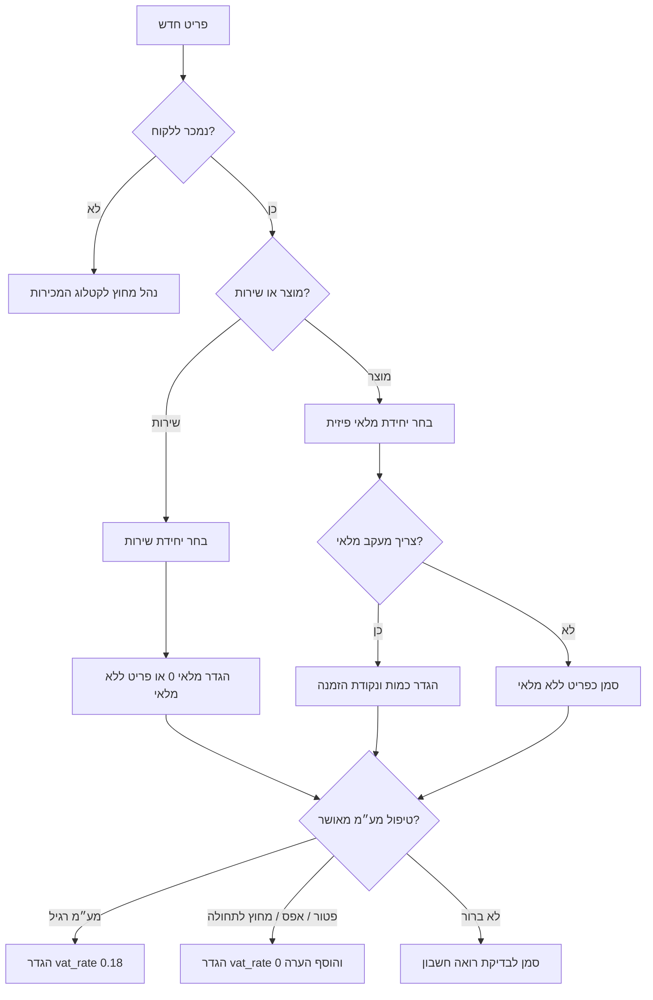
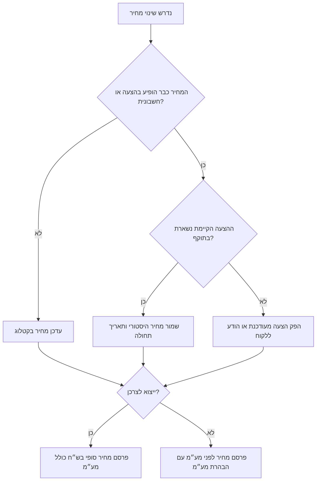
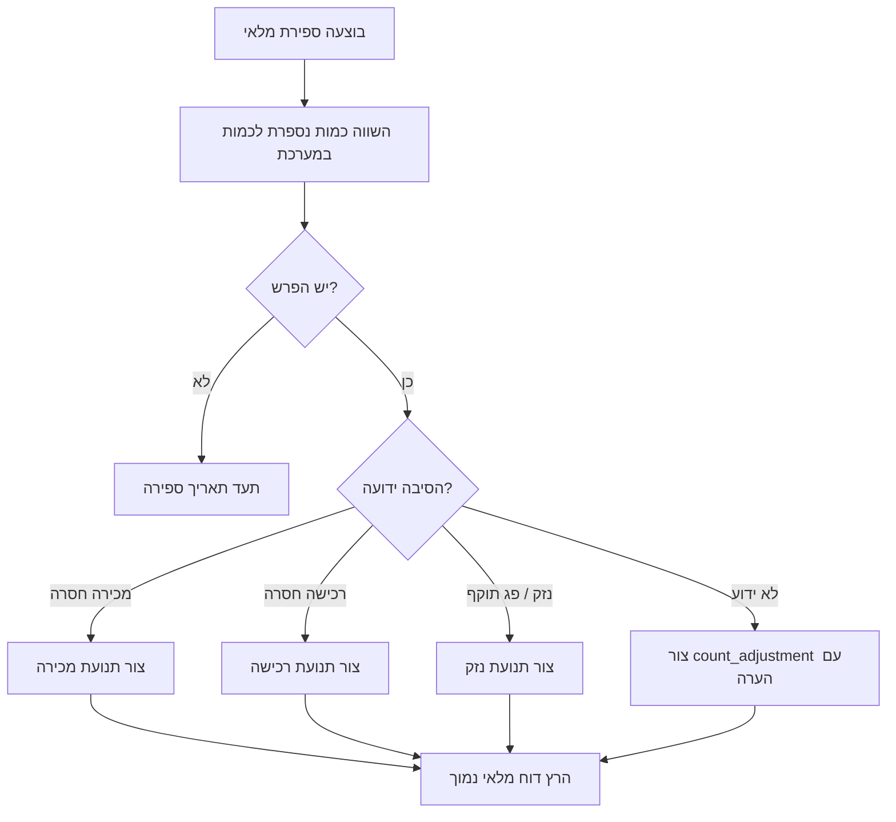

# מנהל מלאי וקטלוג

נהל קטלוג שימושי לעסק קטן בישראל, עוסק מורשה, עוסק פטור, פרילנסר, סטודיו, קליניקה, דוכן, חנות אונליין או מלאי ביתי. שמור מק״טים, שמות בעברית ובאנגלית, יחידות מידה, טיפול מע״מ, מחירים בש״ח, כמות מלאי, נקודת הזמנה מחדש, פרטי ספק והערות בקרה בצורה עקבית שמתאימה לחשבוניות, הצעות מחיר, מחירונים, ספירות מלאי, קופה, הנהלת חשבונות ומסחר אלקטרוני.

השתמש במיומנות זו עבור:

- יצירה וניקוי של קטלוג מוצרים ושירותים.
- תכנון מק״טים שמתאימים לגיליונות, קופות ומערכות חשבוניות.
- חישוב מחיר לפני מע״מ ומחיר כולל מע״מ.
- ניהול מלאי, נקודות הזמנה ותנועות מלאי.
- ייצוא CSV בעברית בקידוד UTF-8.
- מעבר מגיליונות לא אחידים לקטלוג מסודר.
- הסבר תפעולי על מע״מ, מחירונים ותהליכי חשבוניות בישראל, ללא תחליף לייעוץ מקצועי.

אין להשתמש במסמך זה כייעוץ משפטי, חשבונאי, מיסויי או מכסי. אמת שיעורי מע״מ, חובת הקצאת חשבוניות וכללים מחייבים מול מקורות רשמיים או בעל מקצוע לפני שימוש תפעולי.

## כללי יסוד

1. שמור סכומים כספיים כמחרוזות עשרוניות.
2. שמור שיעור מע״מ לכל פריט.
3. שמור שינויי מלאי כתנועות מלאי.
4. הפרד בין מק״ט פנימי, מק״ט ספק וברקוד.
5. שמור פריטים לא פעילים לצורכי היסטוריה; אל תשתמש שוב במק״ט.
6. הפרד בין ייצוא ציבורי לבין ייצוא פנימי.
7. השתמש ב־`ILS` או ₪ כברירת מחדל.
8. השתמש ב־`DD/MM/YYYY` לתצוגה ישראלית וב־`YYYY-MM-DD` לקבצים טכניים.
9. שמור CSV בקידוד UTF-8; השתמש ב־UTF-8 with BOM כשאקסל ישן דורש זאת.
10. סמן טיפול מע״מ לא ברור לבדיקה במקום לנחש.

## סכמת שדות מומלצת

| שדה | חובה | דוגמה | הנחיה |
|---|---:|---|---|
| `sku` | כן | `COF-BNS-001` | מזהה פנימי יציב וייחודי. |
| `name_he` או `name` | כן | `פולי קפה 1 ק״ג` | שם טבעי למסמכים ומדפים בישראל. |
| `name_en` | אופציונלי | `Coffee beans 1 kg` | שימושי לספקים ומרקטפלייסים. |
| `category` | מומלץ | `coffee` | קטגוריה קצרה ומבוקרת. |
| `unit` | כן | `unit`, `kg`, `hour`, `box` | יחידת המכירה בפועל. |
| `price_before_vat` | כן | `42.37` | מחיר לפני מע״מ כמחרוזת עשרונית. |
| `vat_rate` | כן | `0.18` | שיעור עשרוני; `0.18` פירושו 18%. |
| `price_with_vat` | מחושב | `50.00` | מחיר לתצוגה. |
| `stock_quantity` | כן | `18` | שברים רק כשיחידת המידה דורשת זאת. |
| `reorder_point` | מומלץ | `5` | סף מלאי נמוך. |
| `barcode` | אופציונלי | `7290000000000` | שמור כטקסט כדי לא לאבד אפסים מובילים. |
| `supplier_sku` | אופציונלי | `SUP-9981` | לא מחליף מק״ט פנימי. |
| `supplier_name` | אופציונלי | `ספק בע״מ` | אל תייצא ללקוח אם לא נחוץ. |
| `active` | כן | `true` | `false` לפריט שהופסק. |
| `tax_treatment` | מומלץ | `standard_domestic_vat` | הוסף הערה למע״מ אפס, פטור או חריג. |
| `updated_at` | מומלץ | `02-06-2026 10:00` | שמור גם חותמת זמן טכנית. |

## כללי מק״ט

השתמש באותיות לטיניות גדולות, ספרות ומקפים.

דפוסים טובים:

- `CAT-SHORT-NNN`: למשל `COF-BNS-001`, `ACC-CBL-003`
- `BRAND-CAT-SIZE`: למשל `ACME-FLTR-10PK`
- שירותים: `SRV-CONS-001`, `SRV-TRAIN-001`

הימנע מ:

| דפוס בעייתי | הבעיה | חלופה |
|---|---|---|
| `Coffee 50nis` | שינוי מחיר שובר את הזהות. | `COF-BNS-001` |
| `ספל-לבן` | מערכות חיצוניות עלולות לשבש מזהים בעברית. | `MUG-WHT-001` |
| `XL/Blue` | לוכסן עלול לשבור ייבוא. | `TSH-BLU-XL` |
| `123` | כללי מדי. | `MUG-WHT-123` |
| רק מק״ט ספק | שינוי ספק פוגע בהיסטוריה. | מק״ט פנימי + `supplier_sku` |

## מע״מ ותמחור

מכירות מקומיות רבות בישראל חייבות במע״מ רגיל. קיימים עסקים ועסקאות שבהם חל פטור, שיעור אפס או טיפול אחר. שמור שיעור מע״מ לכל פריט והוסף הערה לחריגים.

נוסחאות:

```text
מחיר כולל מע״מ = מחיר לפני מע״מ × (1 + שיעור מע״מ)
מחיר לפני מע״מ = מחיר כולל מע״מ ÷ (1 + שיעור מע״מ)
```

דוגמה: מחיר של ₪50.00 כולל 18% מע״מ הוא `50 / 1.18 = 42.372881...`, כלומר ₪42.37 לאחר עיגול לשתי ספרות.

הנחיות:

- השתמש ב־`0.18` עבור 18%, לא ב־`18`.
- השתמש ב־`0` רק עם סיבה מתועדת.
- שמור במסמכים היסטוריים את שיעור המע״מ שהיה תקף במועד ההפקה.
- קבע אם שינוי מחיר משמר מחיר לפני מע״מ או מחיר סופי לצרכן.
- הפרד בין מחירון לצרכן לבין מחירון עסקי.

## תנועות מלאי

תעד כל שינוי מלאי עם סיבה, אסמכתה, חותמת זמן והערה. אל תערוך כמות בשקט.

סיבות נפוצות:

| סיבה | משמעות |
|---|---|
| `purchase` | קליטת משלוח מספק. |
| `sale` | מכירה ללקוח. |
| `return_customer` | החזרת לקוח. |
| `return_supplier` | החזרה לספק. |
| `count_adjustment` | תיקון בעקבות ספירת מלאי. |
| `damage` | פריט פגום או פג תוקף. |
| `sample` | דוגמית או הדגמה. |
| `bundle_build` | צריכת רכיבים לבניית ערכה. |
| `bundle_break` | פירוק ערכה לרכיבים. |

## עץ החלטה: פריט חדש



## עץ החלטה: שינוי מחיר



## עץ החלטה: התאמת ספירת מלאי



## דוגמאות

### קטלוג חנות

```csv
sku,name_he,name_en,category,unit,price_before_vat,vat_rate,stock_quantity,reorder_point
COF-BNS-001,פולי קפה 1 ק״ג,Coffee beans 1 kg,coffee,kg,42.37,0.18,18,5
MUG-WHT-001,ספל לבן,White mug,accessories,unit,21.19,0.18,34,8
SRV-GFT-001,אריזת מתנה,Gift wrapping,service,unit,4.24,0.18,0,0
```

תצוגה צפויה ללקוחות: פולי קפה ₪50.00 כולל מע״מ; ספל לבן ₪25.00 כולל מע״מ; אריזת מתנה ₪5.00 כולל מע״מ.

### קטלוג שירותים לפרילנסר

```csv
sku,name_he,name_en,category,unit,price_before_vat,vat_rate,stock_quantity,reorder_point
SRV-CONS-001,פגישת ייעוץ,Consulting session,services,hour,350.00,0.18,0,0
SRV-SETUP-001,הקמת מערכת,Setup project,services,project,1800.00,0.18,0,0
SRV-TRAIN-001,הדרכה לצוות,Team training,services,session,950.00,0.18,0,0
```

### מלאי ביתי

```csv
sku,name_he,category,unit,price_before_vat,vat_rate,stock_quantity,reorder_point,notes
HOME-MED-001,ערכת עזרה ראשונה,home,unit,84.75,0.18,1,1,בדיקת תוקף כל חצי שנה
HOME-BAT-AAA,סוללות AAA,home,pack,21.19,0.18,3,1,לשמור מארזים סגורים
```

## בדיקות לפני ייבוא CSV

- [ ] גבה את הקטלוג.
- [ ] שמור את המקור כ־UTF-8.
- [ ] הסר תאים ממוזגים, נוסחאות ושורות כותרת פנימיות.
- [ ] שמור מזהים כטקסט.
- [ ] נקה סימני ₪, פסיקים ורווחים מסכומים.
- [ ] המר `18%` או `18` ל־`0.18`.
- [ ] ודא מק״ט ייחודי בכל שורה.
- [ ] אמת שדות חובה.
- [ ] הרץ ייבוא ניסיון.
- [ ] השווה ייצוא חוזר מול המקור.

## מקרי קצה

| מקרה | טיפול |
|---|---|
| מחיר מקור כולל מע״מ | המר למחיר לפני מע״מ ותעד מקור. |
| מלאי שלילי | אפשר רק בתהליך הזמנות חסר מאושר; אחרת חקור. |
| מלאי בשברים | מתאים לק״ג, ליטר, מטר או שעה; בדוק עבור `unit`. |
| ערכות | נהל מק״ט ערכה ומק״טים לרכיבים בנפרד. |
| פריט שהופסק | סמן `active=false`; אל תמחק. |
| שינוי שיעור מע״מ | שמור שיעורים היסטוריים ועדכן מחירונים עתידיים. |
| התנגשות ברקוד | בדיקה ידנית לפני שימוש בקופה. |
| עברית משובשת באקסל | ייצא UTF-8 עם BOM. |
| ערבוב מחירון צרכני ועסקי | פצל תבניות ייצוא. |
| עוסק פטור | אמת טיפול מע״מ לפני גבייה. |

## פתרון תקלות מהיר

| תסמין | סיבה סבירה | תיקון |
|---|---|---|
| עברית מופיעה כג׳יבריש | קידוד שגוי | השתמש ב־UTF-8 או UTF-8 with BOM. |
| מע״מ שונה באגורה | מדיניות עיגול לא אחידה | קבע מדיניות אחת. |
| מק״ט כפול | התנגשות בייבוא | נקה כפילויות ושמור היסטוריה. |
| דוח מלאי נמוך ריק | נקודות הזמנה חסרות | הגדר נקודות הזמנה. |
| מלאי השתנה בלי עקבות | עריכה ישירה | השתמש ביומן תנועות. |
| עלות ספק מופיעה במחירון | פרופיל ייצוא שגוי | השתמש ברשימת עמודות מותרת. |
| ייבוא דוחה `18%` | נדרש שיעור עשרוני | המר ל־`0.18`. |
| CLI לא מוצא קובץ | תיקיית עבודה שגויה | השתמש בנתיב מלא. |

## מה לא לעשות

- אל תשתמש בשם פריט כמזהה ייחודי.
- אל תשמור רק מחיר כולל מע״מ כאשר נדרש מחיר לפני מע״מ.
- אל תמחק פריטים שהופיעו במסמכים.
- אל תשתמש שוב במק״ט של פריט ישן.
- אל תערוך מלאי בלי סיבה ואסמכתה.
- אל תשלח ללקוח עלויות ספק או מרווחים.
- אל תניח ששיעור מע״מ לא ישתנה.
- אל תנהל קובץ נפרד לכל ספק ללא קטלוג מאסטר.
- אל תשמור סכומי כסף כ־float בסקריפטים.
- אל תתקן רק CSV מיוצא בלי לעדכן את מקור האמת.

## רשימת בדיקות לפני הפעלה

- [ ] כללי מק״ט מתועדים.
- [ ] ברירות מחדל וחריגים במע״מ נבדקו.
- [ ] ברור אם מחיר המקור לפני מע״מ או כולל מע״מ.
- [ ] שדות חובה מאומתים.
- [ ] מק״טים פעילים ולא פעילים ייחודיים.
- [ ] מחירים נשמרים כערכים עשרוניים.
- [ ] שיעור מע״מ נשמר לכל פריט.
- [ ] נקודות הזמנה מוגדרות לפריטי מלאי.
- [ ] שירותים מסומנים ללא מלאי או מלאי אפס.
- [ ] עלויות ספק לא נכללות בייצוא ציבורי.
- [ ] תנועות מלאי דורשות סיבה ואסמכתה.
- [ ] קיים גיבוי לפני כל ייבוא כמותי.
- [ ] עברית נבדקה ביישומי היעד.
- [ ] מחירון צרכני ומחירון עסקי מופרדים.
- [ ] דוח מלאי נמוך נבדק באופן קבוע.
- [ ] תכנית מעבר וחזרה לאחור מתועדת.

## שימוש בסקריפטים

```bash
python scripts/inventory-catalog-manager-cli.py init catalog.json
python scripts/inventory-catalog-manager-cli.py add catalog.json COF-BNS-001 "פולי קפה 1 ק״ג" --price-before-vat 42.37 --vat-rate 0.18 --stock 18 --reorder-point 5 --unit kg --category coffee
python scripts/inventory-catalog-manager-cli.py list catalog.json
python scripts/inventory-catalog-manager-cli.py price catalog.json COF-BNS-001
python scripts/inventory-catalog-manager-cli.py stock-adjust catalog.json COF-BNS-001 -3 --reason sale --reference INV-1001
python scripts/inventory-catalog-manager-cli.py low-stock catalog.json
python scripts/inventory-catalog-manager-cli.py export-csv catalog.json catalog.csv
```

## אינדקס קבצים

- `SKILL.md` — מדריך תפעולי באנגלית.
- `SKILL_HE.md` — מדריך תפעולי בעברית.
- `references/api-reference.md` — מקורות API ורגולציה בישראל.
- `references/workflow-guide.md` — תהליכי עבודה מקצה לקצה.
- `references/troubleshooting.md` — פתרון תקלות.
- `references/test-scenarios.md` — מעל 20 תרחישי בדיקה.
- `references/migration-checklist.md` — רשימת מעבר לייצור.
- `scripts/inventory_catalog_manager_client.py` — כלי Python מסונכרן ואסינכרוני.
- `scripts/inventory-catalog-manager-cli.py` — ממשק שורת פקודה.
- `scripts/examples/` — תרחישים להרצה.
