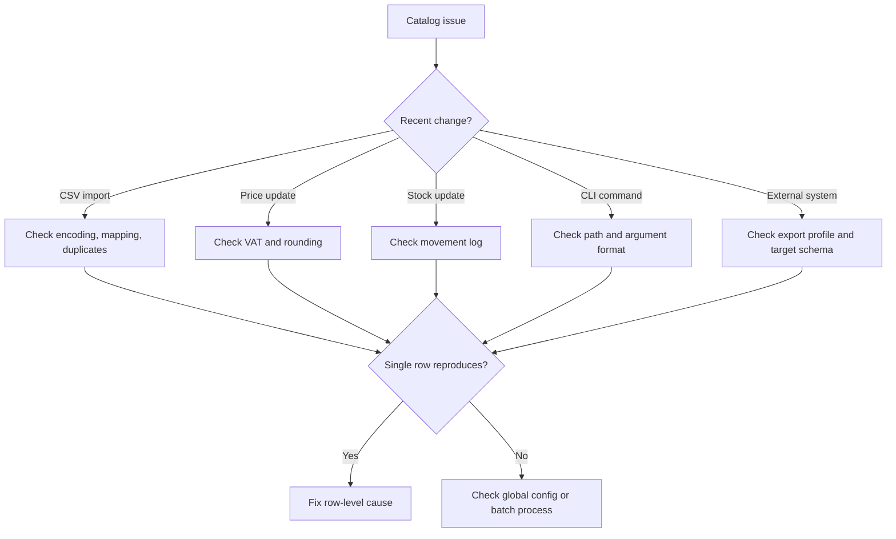

# Troubleshooting Guide

Use this guide to diagnose catalog, SKU, VAT, CSV, stock, and CLI problems.

## Triage

1. Determine whether the problem is data, calculation, encoding, import/export mapping, stock workflow, or CLI usage.
2. Work on a copy.
3. Preserve the failing file.
4. Reproduce with the smallest row set.
5. Fix the source of truth, not only the export.
6. Run the matching test scenario.
7. Re-export and compare.

## Diagnostic decision tree



## Error catalog

| Error | Likely cause | Recovery | Prevention |
|---|---|---|---|
| Duplicate SKU | Two rows share `sku`. | Keep one row; create new SKU for variant. | Validate uniqueness. |
| Invalid SKU | Unsupported symbols. | Normalize uppercase Latin letters, digits, hyphens. | Use generator rules. |
| Missing price | Required field blank. | Fill or calculate from final price. | Reject incomplete rows. |
| Invalid VAT rate | `18%` or `18` used where `0.18` expected. | Convert to decimal. | Normalize imports. |
| Negative price | Refund loaded as item price. | Use credit/refund workflow. | Validate price >= 0. |
| Negative stock | Sales before purchases. | Add missing purchase or document backorder. | Import in correct order. |
| Hebrew gibberish | Wrong encoding. | Re-save as UTF-8. | Use UTF-8 template. |
| Price off by ₪0.01 | Rounding mismatch. | Apply one policy. | Test sample totals. |
| Barcode conflict | One barcode on multiple SKUs. | Review variants and supplier data. | Validate active barcode uniqueness. |
| Low-stock report empty | Reorder points zero. | Set reorder points. | Require threshold for stock items. |
| Supplier cost leaked | Public export includes internal columns. | Re-export sanitized file. | Use allowlist. |
| CLI file not found | Wrong working directory. | Use absolute path. | Document paths. |

## CSV and Hebrew issues

### Hebrew appears corrupted

Fix:

1. Open in a text editor that shows encoding.
2. Save as UTF-8.
3. Use UTF-8 with BOM for older Excel.
4. Import via Data > From Text/CSV and select UTF-8.
5. Avoid copy-paste through tools that alter encoding.

### Columns shift after import

Causes:

- Commas inside descriptions.
- Semicolons used by regional settings.
- Unescaped quotes.

Fix:

1. Use a CSV writer.
2. Quote text fields.
3. Test three rows before bulk import.
4. Avoid manual CSV editing.

## VAT and price issues

### Final price mismatch

Check:

- Source price before VAT or including VAT?
- VAT rate decimal or percent?
- Rounding at unit, line, or document level?
- Exempt, zero-rated, standard-rated, or outside scope?
- Rate changed after price was set?

Example:

```text
Final price: ₪50.00
VAT: 18%
Before-VAT: 50 / 1.18 = 42.372881...
Stored: ₪42.37
Rounded final: ₪50.00
```

### Accounting system rejects VAT

Possible causes:

- VAT rate missing.
- Exempt dealer configuration conflict.
- Rate not accepted for document date.
- Target expects percent instead of decimal.
- Wrong document type.

Fix:

1. Confirm target schema.
2. Convert format during export.
3. Keep source catalog decimal.
4. Test one standard item and one zero-rate item.

## Stock issues

### Stock is negative

Diagnosis:

1. Search movements by SKU.
2. Sort by timestamp.
3. Check whether sale imported before purchase.
4. Check count adjustment.
5. Check bundle component consumption.
6. Check return signs.

Recovery:

- Add documented missing purchase.
- Reverse incorrect movement with opposite movement.
- Keep negative stock only for approved backorder.
- Do not silently edit final quantity.

### Shelf count differs

Causes:

- Missing sale.
- Missing supplier delivery.
- Damage not recorded.
- Unit mismatch, such as packs versus units.
- Variant sold under wrong SKU.
- Manual adjustment without note.

Fix:

1. Recount.
2. Check recent transactions.
3. Correct known missing movements.
4. Use `count_adjustment` for remaining difference.
5. Add note and reference.

## SKU and barcode issues

Duplicate SKU resolution:

| Situation | Resolution |
|---|---|
| Same item, better data | Update approved fields. |
| Same item, supplier SKU changed | Update supplier field. |
| Different size/color | Create new SKU. |
| Discontinued replacement | Mark old inactive; create new SKU. |
| True duplicate row | Remove duplicate import row. |

Same barcode on multiple items:

- Check supplier reuse.
- Check variants without unique barcode.
- Check bundle/component confusion.
- Check data-entry mistakes.
- Fix before POS use.

## CLI issues

File path:

```bash
python scripts/inventory-catalog-manager-cli.py list /full/path/catalog.json
```

Decimal arguments:

```bash
--price-before-vat 42.37
--vat-rate 0.18
--stock 12
```

Avoid:

```bash
--price-before-vat ₪42,37
--vat-rate 18%
```

Stock adjustment:

```bash
python scripts/inventory-catalog-manager-cli.py stock-adjust catalog.json MUG-WHT-001 10 --reason purchase --reference PO-1001
```

## Recovery playbooks

### Restore from backup

1. Stop imports.
2. Copy broken catalog for investigation.
3. Restore latest known-good JSON.
4. Replay valid movements.
5. Re-run tests.
6. Record incident notes.

### Clean bad CSV import

1. Identify import timestamp.
2. Export affected SKUs.
3. Compare with backup.
4. Revert wrong rows.
5. Re-import fixed mapping.
6. Confirm counts and prices.
7. Add validation rule.

### Repair leaked internal export

1. Remove public access.
2. Generate sanitized export.
3. Check exposed fields.
4. Notify responsible person according to policy.
5. Add export allowlist.
6. Separate public and internal templates.

## Preventive controls

- Validate before import.
- Back up before bulk changes.
- Use stock movement logs.
- Use export allowlists.
- Separate consumer and B2B price lists.
- Run pytest before script changes.
- Review low-stock and inactive items regularly.
