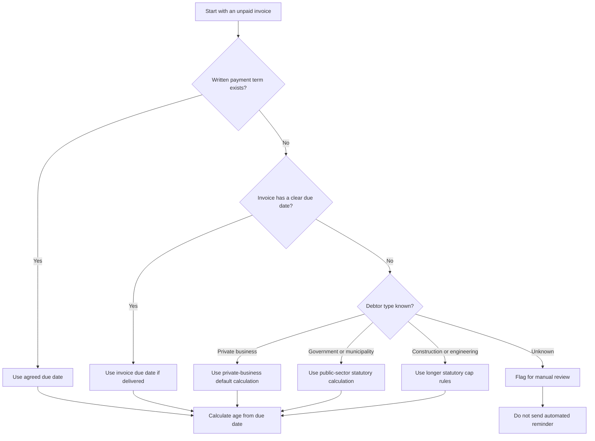
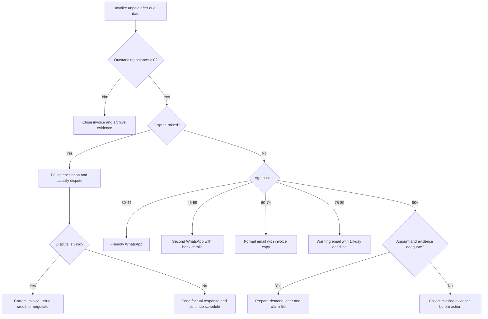
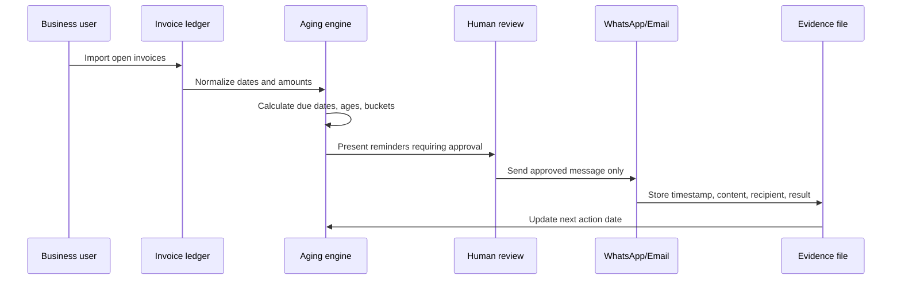

# Invoice Aging & Collection Reminders

## Purpose

Use this skill to manage overdue invoices in Israel, classify unpaid balances by aging bucket, generate Hebrew collection reminders for WhatsApp and email, and decide when to escalate to formal demand letters, small-claims preparation, or enforcement planning.

Treat the skill as an operational assistant, not as a substitute for licensed accounting or legal advice. Confirm current statutory rates, claim thresholds, filing fees, tax-invoice rules, and holiday calendars before production use. The 2026 validation pass confirmed Israel's standard VAT rate as 18%, the small-claims ceiling as ₪39,900, and the fixed-amount enforcement-file ceiling as ₪75,000; still recheck before filing or issuing tax-sensitive documents.

## Core outcomes

- Calculate a due date from an explicit contract term or Israeli payment-practice defaults.
- Measure invoice age from the due date, not from the issue date.
- Group unpaid invoices by client, age, amount, and escalation stage.
- Generate professional Hebrew WhatsApp and email reminders with localized currency and dates.
- Avoid reminders on Friday, Saturday, and configured Israeli holidays.
- Preserve an evidence trail: invoice, contract, delivery confirmation, reminders, replies, postal receipts, and payment records.
- Identify anti-patterns that can harm collection: aggressive language, invented interest rates, missing details, unverified recipients, and repeated spam-like messages.

## Required inputs

| Field | Required | Example | Notes |
|---|---:|---|---|
| `invoice_id` | Yes | `INV-2026-018` | Match the invoice exactly. |
| `client_id` | Yes | `client-avi` | Stable key for grouping. |
| `client_name` | Yes | `אבי כהן בע"מ` | Use the legal or business name. |
| `issue_date` | Yes | `12/02/2026` | Prefer DD/MM/YYYY for Israeli users. |
| `amount` | Yes | `4500.00` | Store numeric amount, format as ₪ only in output. |
| `currency` | Yes | `ILS` | Default to ILS; reject unsupported currencies unless explicitly enabled. |
| `due_date` | Preferred | `31/03/2026` | Use explicit contract terms when available. |
| `payment_terms_days` | Optional | `45` | Use only when an explicit due date is missing. |
| `submitted_date` | Optional | `13/02/2026` | Relevant for some statutory payment calculations. |
| `paid_date` | Optional | `20/04/2026` | Marks invoice paid. |
| `partial_payments` | Optional | `[{date, amount}]` | Subtract from outstanding balance. |
| `email` | Channel | `client@example.com` | Required for email reminders. |
| `whatsapp` | Channel | `+972501234567` | Required for WhatsApp reminders. |
| `mailing_address` | Escalation | `רחוב...` | Needed for registered mail and claim preparation. |

## Tax and filing boundary rules

This skill tracks collection status; it does not issue tax invoices, calculate VAT, request Israel Invoice allocation numbers, or file court/enforcement documents. Apply these guardrails before using reminders beside official documents:

1. Treat invoice amounts as the amount already issued by the bookkeeping system.
2. Do not add VAT, interest, linkage, collection costs, or legal fees unless the source document and reviewer approve them.
3. For Israeli tax invoices, verify whether the bookkeeping system must request an Israel Invoice allocation number before relying on the invoice for input-VAT purposes.
4. For claim preparation, verify the current small-claims ceiling, court filing fee, and enforcement-file fee on the live government page on the filing date.
5. Keep the reminder ledger separate from the official accounting ledger unless an accountant approves the integration.

## Due-date decision rules

1. Use a signed agreement, purchase order, or written payment term when it exists and is enforceable.
2. Use the invoice due date when the invoice reflects the agreed term and was delivered to the client.
3. Use a statutory/default calculation only when no agreed term is available.
4. Use the due date as the aging baseline.
5. Never measure escalation from the invoice issue date when a later due date exists.
6. Never invent late-payment interest. State that statutory late-payment interest may apply and verify the current rate.



## Aging buckets and escalation stages

| Age from due date | Bucket | Default action | Channel | Human review |
|---:|---|---|---|---|
| `< 0` | Not due | No reminder | None | No |
| `0-29` | Current | Monitor | None | No |
| `30-44` | 30 day | Friendly reminder | WhatsApp | Recommended |
| `45-59` | 45 day | Follow-up reminder | WhatsApp | Recommended |
| `60-74` | 60 day | Formal payment request | Email | Required |
| `75-89` | 75 day | Warning before escalation | Email + WhatsApp summary | Required |
| `90+` | 90+ | Final demand / claim preparation | Email + registered mail | Required |

### Escalation decision tree



## Reminder generation rules

Use Hebrew, direct but respectful wording. Include only verified details.

Always include:
- Client name.
- Invoice number.
- Invoice date.
- Outstanding amount after partial payments.
- Due date.
- Payment instructions when relevant.
- A clear request for a status update or payment.
- A record ID for internal tracking.

Never include:
- Threats, humiliation, or public-shaming language.
- Unverified interest rates.
- Legal claims that have not been reviewed.
- Personal data irrelevant to the debt.
- Multiple reminders on the same day for the same invoice unless the client requested a duplicate.

## Hebrew WhatsApp templates

### Friendly reminder, 30 days overdue

```text
היי {client_name},
רציתי לוודא שקיבלת את חשבונית {invoice_id} מתאריך {issue_date} על סך {amount}.
מועד התשלום היה {due_date}, ונשארה יתרה פתוחה של {outstanding_amount}.
אשמח לעדכון לגבי מועד התשלום.
תודה,
{business_name}
```

### Follow-up reminder, 45 days overdue

```text
שלום {client_name},
תזכורת נוספת לגבי חשבונית {invoice_id} שטרם שולמה.
יתרה לתשלום: {outstanding_amount}
מועד פירעון: {due_date}

פרטי תשלום:
{payment_instructions}

נא לעדכן עד {response_deadline}.
בברכה,
{business_name}
```

## Hebrew email templates

### Formal payment request, 60 days overdue

Subject:

```text
דרישת תשלום עבור חשבונית {invoice_id}
```

Body:

```text
לכבוד {client_name},

הנדון: דרישת תשלום עבור חשבונית {invoice_id}

על פי הרישומים, חשבונית {invoice_id} מתאריך {issue_date} על סך {amount}
טרם שולמה במלואה. מועד הפירעון היה {due_date}, והיתרה הפתוחה היא {outstanding_amount}.

נא להסדיר את התשלום בתוך 7 ימים או להעביר אסמכתה לתשלום שבוצע.

פרטי תשלום:
{payment_instructions}

אם קיימת מחלוקת עניינית לגבי החשבונית, נא לפרט אותה בכתב כדי שניתן יהיה לבדוק את הנושא.

בברכה,
{business_name}
```

### Warning before escalation, 75 days overdue

Subject:

```text
התראה לפני המשך טיפול בגביית חשבונית {invoice_id}
```

Body:

```text
לכבוד {client_name},

למרות פניות קודמות, חשבונית {invoice_id} מתאריך {issue_date} נותרה פתוחה.
יתרת החוב: {outstanding_amount}
מועד הפירעון: {due_date}

נא להסדיר את התשלום בתוך 14 ימים, עד {response_deadline}.
בהיעדר תשלום או הסדר כתוב, ייבחנו צעדים נוספים לגביית החוב, לרבות הכנת מכתב דרישה והגשת תביעה מתאימה.

פרטי תשלום:
{payment_instructions}

בברכה,
{business_name}
```

## Handling common edge cases

### Partial payment received

Subtract verified payments from the principal. Send reminders only for the remaining balance. Mention the payment received without creating blame.

Example:

```text
תודה על התשלום החלקי שהתקבל. לפי הרישומים נותרה יתרה של {outstanding_amount} עבור חשבונית {invoice_id}.
```

### Client disputes the invoice

Pause automatic escalation. Classify the dispute:

| Dispute type | Action |
|---|---|
| Service not delivered | Collect delivery proof before sending another demand. |
| Amount mismatch | Reconcile contract, quote, delivery notes, and invoice. |
| Wrong legal entity | Reissue or correct documents after accounting review. |
| Cash-flow delay only | Offer a dated payment arrangement in writing. |
| No specific dispute | Continue escalation with a factual record. |

### Client promises payment

Record the promised date. Suspend reminders until the next business day after the promised date. Resume escalation if no payment or proof arrives.

### Incorrect recipient

Stop sending immediately. Correct contact details. Document the correction. Do not send invoice data to unverified recipients.

### Consumer debtor

Use more restrained wording. Avoid repeated WhatsApp nudges. Preserve privacy. Consider a formal written notice sooner than informal messaging when the relationship is sensitive.

### Public-sector debtor

Confirm statutory deadlines and invoice submission evidence. Escalate through the contract manager or procurement contact before external legal steps.

### Several invoices for one client

Aggregate totals in internal reporting, but identify each invoice separately in messages. Do not hide invoice-level detail behind a single total.

## Production workflow



## Quality gates before sending

- Verify the invoice is unpaid.
- Verify the amount and partial payments.
- Verify the recipient and channel.
- Verify the date is not Friday, Saturday, or configured holiday.
- Verify the message stage matches the current age.
- Verify a human approved formal, warning, and final notices.
- Attach invoice copies only to the correct recipient.
- Save a copy of each message and delivery result.

## Troubleshooting quick table

| Symptom | Likely cause | Fix |
|---|---|---|
| Invoice appears 60+ days overdue too early | Aging measured from issue date | Recalculate from due date. |
| Reminder sent on holiday | Holiday calendar missing | Add the holiday to `blocked_dates`. |
| WhatsApp message rejected | Number not in E.164 format or template not approved | Normalize to `+972...` and use approved templates. |
| Email bounced | Incorrect address or SPF/DKIM issue | Correct address and verify domain authentication. |
| Client claims no invoice received | No delivery evidence | Resend invoice and restart from confirmed receipt when appropriate. |
| Legal warning sounds too aggressive | Template edited manually | Replace with factual wording and remove threats. |

## Anti-patterns

- Sending every overdue client the same final warning without checking disputes.
- Saying "legal action starts tomorrow" when no actual decision exists.
- Quoting Bank of Israel policy interest as if it were statutory late-payment interest.
- Mixing court-awarded interest with pre-lawsuit late-payment interest.
- Sending invoice attachments over WhatsApp to unverified phone numbers.
- Scheduling reminders during Shabbat or holidays.
- Treating a promise to pay as payment.
- Ignoring small partial payments and demanding the original full amount.
- Deleting reminder history after payment.
- Using sarcasm, shame, or public pressure.

## Production checklist

- [ ] Use a single source of truth for invoice status.
- [ ] Store dates as ISO internally and display DD/MM/YYYY to Israeli users.
- [ ] Store amounts as decimals, not floats.
- [ ] Require human approval for formal and legal-stage messages.
- [ ] Keep per-message evidence: content, recipient, channel, timestamp, result.
- [ ] Keep proof of invoice delivery.
- [ ] Keep proof of goods or services delivered.
- [ ] Maintain a configured list of Israeli holidays.
- [ ] Add rate limiting for WhatsApp and email.
- [ ] Add a stop flag for disputed invoices.
- [ ] Recheck current Israeli filing thresholds and fees before legal escalation.
- [ ] Review data-retention and privacy requirements before storing personal data.
- [ ] Back up the collection ledger.
- [ ] Test all CLI commands with sample data.
- [ ] Run the pytest suite before release.

## Minimal JSON ledger

```json
{
  "business": {
    "name": "סטודיו דוגמה",
    "payment_instructions": "בנק 12, סניף 345, חשבון 67890"
  },
  "clients": [
    {
      "client_id": "c-100",
      "name": "לקוח לדוגמה בע\"מ",
      "email": "client@example.co.il",
      "whatsapp": "+972501234567",
      "mailing_address": "רחוב הדוגמה 1, תל אביב"
    }
  ],
  "invoices": [
    {
      "invoice_id": "INV-100",
      "client_id": "c-100",
      "issue_date": "01/01/2026",
      "due_date": "31/01/2026",
      "amount": "2500.00",
      "currency": "ILS",
      "status": "open",
      "partial_payments": []
    }
  ],
  "blocked_dates": ["23/04/2026"]
}
```

## CLI quick start

```bash
python scripts/invoice-aging-collection-cli.py sample-data --out sample-ledger.json
python scripts/invoice-aging-collection-cli.py age sample-ledger.json --as-of 15/04/2026
python scripts/invoice-aging-collection-cli.py reminders sample-ledger.json --as-of 15/04/2026 --channel whatsapp
python scripts/invoice-aging-collection-cli.py render sample-ledger.json --invoice-id INV-100 --stage friendly_whatsapp
```

See `references/workflow-guide.md`, `references/troubleshooting.md`, and `references/test-scenarios.md` for detailed operational guidance.
