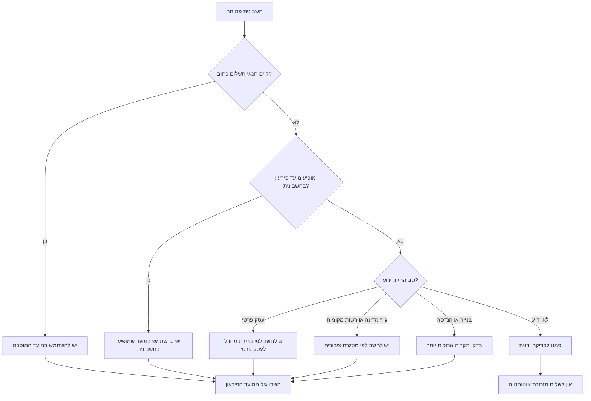
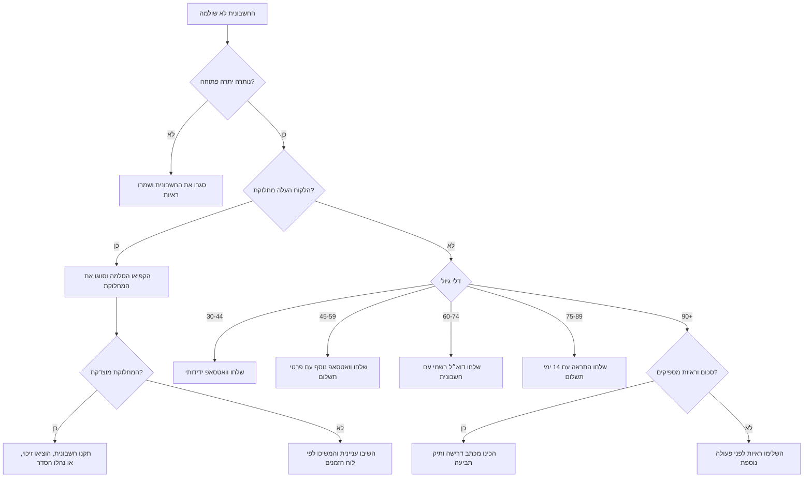
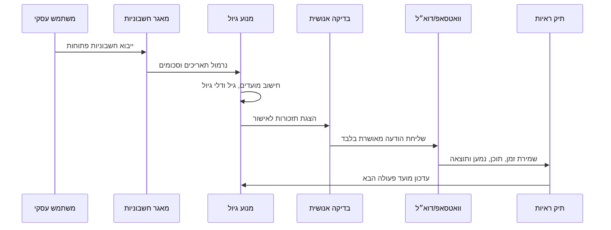

# גיול חשבוניות ותזכורות גבייה

## מטרה

יש להשתמש במיומנות זו כדי לנהל חשבוניות פתוחות בישראל, לסווג יתרות לפי גיול, להכין תזכורות גבייה מקצועיות בעברית לוואטסאפ ולדוא״ל, ולהחליט מתי לעבור למכתב דרישה, הכנת תביעה קטנה, או תכנון אכיפה.

יש להפעיל שיקול דעת מקצועי. יש לאמת שיעורי ריבית, תקרות תביעה, אגרות, כללי חשבוניות מס, מועדים וחגים לפני שימוש תפעולי. בבדיקת 2026 אומתו שיעור מע״מ רגיל של 18%, תקרת תביעה קטנה של ₪39,900 ותקרת תיק הוצאה לפועל לתביעה על סכום קצוב של ₪75,000; יש לבדוק שוב לפני הגשה או שימוש במסמך בעל משמעות מס.

## תוצרים מרכזיים

- חישוב מועד פירעון לפי הסכם, הזמנת עבודה, חשבונית, או ברירת מחדל רלוונטית.
- מדידת איחור ממועד הפירעון ולא מתאריך הפקת החשבונית.
- קיבוץ חשבוניות פתוחות לפי לקוח, גיל חוב, סכום ושלב גבייה.
- יצירת הודעות גבייה בעברית עם סכומים ב-₪ ותאריכים בפורמט DD/MM/YYYY.
- מניעת שליחת תזכורות בימי שישי, שבתות וחגים שהוגדרו.
- שמירת תיק ראיות: חשבונית, הסכם, אישור אספקה, תזכורות, תגובות, אישורי דואר ותשלומים.
- זיהוי טעויות מסוכנות: ניסוח מאיים, ריבית לא מאומתת, פרטים חסרים, נמען לא מאומת ושליחה חוזרת בתדירות מוגזמת.

## נתוני חובה

| שדה | חובה | דוגמה | הערה |
|---|---:|---|---|
| `invoice_id` | כן | `INV-2026-018` | חייב להתאים לחשבונית המקורית. |
| `client_id` | כן | `client-avi` | מזהה קבוע לקיבוץ לקוחות. |
| `client_name` | כן | `אבי כהן בע"מ` | יש להשתמש בשם המשפטי או בשם העסק. |
| `issue_date` | כן | `12/02/2026` | פורמט ישראלי מומלץ: DD/MM/YYYY. |
| `amount` | כן | `4500.00` | יש לשמור ערך מספרי; להציג ₪ רק בפלט. |
| `currency` | כן | `ILS` | ברירת מחדל: שקל חדש. |
| `due_date` | רצוי | `31/03/2026` | עדיף על חישוב אוטומטי. |
| `payment_terms_days` | אופציונלי | `45` | לשימוש כאשר אין תאריך פירעון מפורש. |
| `submitted_date` | אופציונלי | `13/02/2026` | רלוונטי בחלק מחישובי מוסר תשלומים. |
| `paid_date` | אופציונלי | `20/04/2026` | מסמן חשבונית ששולמה. |
| `partial_payments` | אופציונלי | `[{date, amount}]` | מפחית מהיתרה הפתוחה. |
| `email` | לפי ערוץ | `client@example.com` | חובה לדוא״ל. |
| `whatsapp` | לפי ערוץ | `+972501234567` | חובה לוואטסאפ. |
| `mailing_address` | להסלמה | `רחוב...` | נדרש לדואר רשום ולהכנת תביעה. |

## גבולות מס והגשה

מיומנות זו מנהלת מעקב גבייה; היא אינה מפיקה חשבוניות מס, אינה מחשבת מע״מ, אינה מבקשת מספרי הקצאה במודל חשבוניות ישראל, ואינה מגישה מסמכים לבית משפט או להוצאה לפועל. פעלו לפי הכללים הבאים לפני שימוש בתזכורות לצד מסמכים רשמיים:

1. התייחסו לסכום החשבונית כסכום שכבר הופק במערכת הנהלת החשבונות.
2. אל תוסיפו מע״מ, ריבית, הצמדה, הוצאות גבייה או שכר טרחה ללא מסמך מקור ואישור מקצועי.
3. עבור חשבונית מס ישראלית, בדקו אם מערכת הנהלת החשבונות חייבת לבקש מספר הקצאה במודל חשבוניות ישראל.
4. לפני הכנת תביעה, בדקו באתר הרשמי את תקרת התביעה הקטנה, אגרת בית המשפט ואגרת פתיחת תיק הוצאה לפועל.
5. שמרו הפרדה בין יומן התזכורות לבין ספרי החשבונות הרשמיים, אלא אם רואה חשבון אישר את החיבור.

## קביעת מועד פירעון

1. יש להשתמש בהסכם חתום, הזמנת עבודה או תנאי תשלום כתוב כאשר הוא קיים וניתן להסתמך עליו.
2. יש להשתמש במועד הפירעון שמופיע בחשבונית כאשר הוא משקף את ההסכמה והחשבונית נמסרה ללקוח.
3. השתמשו בחישוב ברירת מחדל רק כאשר אין תנאי תשלום מוסכם.
4. יש למדוד את גיל החוב ממועד הפירעון.
5. אין למדוד הסלמה מתאריך ההפקה כאשר קיים מועד פירעון מאוחר יותר.
6. אין להמציא שיעור ריבית. יש לציין שריבית פיגורים חוקית עשויה לחול ולבדוק את השיעור העדכני.



## דלי גיול ושלבי הסלמה

| ימים ממועד הפירעון | דלי | פעולה | ערוץ | בדיקה אנושית |
|---:|---|---|---|---|
| `< 0` | טרם הגיע מועד | ללא תזכורת | אין | לא |
| `0-29` | שוטף | מעקב | אין | לא |
| `30-44` | 30 יום | תזכורת ידידותית | וואטסאפ | מומלץ |
| `45-59` | 45 יום | תזכורת נוספת | וואטסאפ | מומלץ |
| `60-74` | 60 יום | דרישת תשלום רשמית | דוא״ל | חובה |
| `75-89` | 75 יום | התראה לפני הסלמה | דוא״ל + סיכום בוואטסאפ | חובה |
| `90+` | 90+ | מכתב דרישה / הכנת תביעה | דוא״ל + דואר רשום | חובה |

## עץ החלטה להסלמה



## כללי ניסוח לתזכורות

נסחו בעברית מקצועית, עניינית ומכבדת. השתמשו רק בפרטים מאומתים.

חובה לכלול:
- שם הלקוח.
- מספר חשבונית.
- תאריך חשבונית.
- יתרה פתוחה לאחר תשלומים חלקיים.
- מועד פירעון.
- פרטי תשלום כאשר רלוונטי.
- בקשה ברורה לתשלום או לעדכון.
- מזהה פנימי לשמירת תיעוד.

אסור לכלול:
- איומים, השפלה או לחץ פומבי.
- שיעורי ריבית שלא אומתו.
- טענות משפטיות שלא נבדקו.
- פרטים אישיים שאינם נחוצים לחוב.
- כמה תזכורות באותו יום עבור אותה חשבונית, אלא אם הלקוח ביקש שליחה חוזרת.

## תבניות וואטסאפ בעברית

### תזכורת ידידותית, 30 ימי איחור

```text
היי {client_name},
רציתי לוודא שקיבלת את חשבונית {invoice_id} מתאריך {issue_date} על סך {amount}.
מועד התשלום היה {due_date}, ונשארה יתרה פתוחה של {outstanding_amount}.
אשמח לעדכון לגבי מועד התשלום.
תודה,
{business_name}
```

### תזכורת נוספת, 45 ימי איחור

```text
שלום {client_name},
תזכורת נוספת לגבי חשבונית {invoice_id} שטרם שולמה.
יתרה לתשלום: {outstanding_amount}
מועד פירעון: {due_date}

פרטי תשלום:
{payment_instructions}

נא לעדכן עד {response_deadline}.
בברכה,
{business_name}
```

## תבניות דוא״ל בעברית

### דרישת תשלום רשמית, 60 ימי איחור

נושא:

```text
דרישת תשלום עבור חשבונית {invoice_id}
```

גוף ההודעה:

```text
לכבוד {client_name},

הנדון: דרישת תשלום עבור חשבונית {invoice_id}

על פי הרישומים, חשבונית {invoice_id} מתאריך {issue_date} על סך {amount}
טרם שולמה במלואה. מועד הפירעון היה {due_date}, והיתרה הפתוחה היא {outstanding_amount}.

נא להסדיר את התשלום בתוך 7 ימים או להעביר אסמכתה לתשלום שבוצע.

פרטי תשלום:
{payment_instructions}

אם קיימת מחלוקת עניינית לגבי החשבונית, נא לפרט אותה בכתב כדי שניתן יהיה לבדוק את הנושא.

בברכה,
{business_name}
```

### התראה לפני הסלמה, 75 ימי איחור

נושא:

```text
התראה לפני המשך טיפול בגביית חשבונית {invoice_id}
```

גוף ההודעה:

```text
לכבוד {client_name},

למרות פניות קודמות, חשבונית {invoice_id} מתאריך {issue_date} נותרה פתוחה.
יתרת החוב: {outstanding_amount}
מועד הפירעון: {due_date}

נא להסדיר את התשלום בתוך 14 ימים, עד {response_deadline}.
בהיעדר תשלום או הסדר כתוב, ייבחנו צעדים נוספים לגביית החוב, לרבות הכנת מכתב דרישה והגשת תביעה מתאימה.

פרטי תשלום:
{payment_instructions}

בברכה,
{business_name}
```

## מקרי קצה נפוצים

### התקבל תשלום חלקי

הפחיתו תשלומים מאומתים מהקרן. שלחו תזכורת רק על היתרה. ציינו את התשלום שהתקבל באופן ענייני.

```text
תודה על התשלום החלקי שהתקבל. לפי הרישומים נותרה יתרה של {outstanding_amount} עבור חשבונית {invoice_id}.
```

### הלקוח חולק על החשבונית

עצרו הסלמה אוטומטית וסווגו את המחלוקת:

| סוג מחלוקת | פעולה |
|---|---|
| השירות לא סופק | אספו הוכחת אספקה לפני תזכורת נוספת. |
| סכום לא תואם | התאימו בין הסכם, הצעת מחיר, תעודות משלוח וחשבונית. |
| ישות משפטית שגויה | תקנו מסמכים לאחר בדיקה חשבונאית. |
| דחיית תשלום עקב תזרים | דרשו הסדר כתוב עם תאריך. |
| אין מחלוקת מסוימת | המשיכו בהסלמה מתועדת ועניינית. |

### הלקוח הבטיח לשלם

תעדו את תאריך ההבטחה. עצרו תזכורות עד יום העסקים שלאחר תאריך ההבטחה. חזרו למסלול אם לא התקבל תשלום או אישור ביצוע.

### נמען שגוי

הפסיקו שליחה מיד. תקנו את פרטי הקשר. תעדו את התיקון. אין לשלוח פרטי חשבונית לנמען לא מאומת.

### חייב צרכני

בחרו ניסוח מרוסן במיוחד. הימנעו מהצפת הודעות בוואטסאפ. שמרו על פרטיות. שקלו הודעה כתובה רשמית מוקדם יותר כאשר הקשר רגיש.

### חייב ציבורי

בדקו מועדים סטטוטוריים ואישור מסירת חשבונית. הסלימו דרך מנהל ההתקשרות או איש הרכש לפני צעדים חיצוניים.

### כמה חשבוניות לאותו לקוח

הציגו סיכום פנימי מצטבר, אך פרטו כל חשבונית בנפרד בהודעות. אל תסתירו פירוט חשבוניות מאחורי סכום כולל בלבד.

## תהליך עבודה תפעולי



## בדיקות איכות לפני שליחה

- ודאו שהחשבונית עדיין לא שולמה.
- ודאו סכום ותשלומים חלקיים.
- ודאו נמען וערוץ.
- ודאו שהתאריך אינו יום שישי, שבת או חג שהוגדר.
- ודאו ששלב ההודעה תואם את גיל החוב.
- דרשו אישור אנושי להודעות רשמיות, התראות ומכתבים סופיים.
- צרפו חשבונית רק לנמען הנכון.
- שמרו עותק של כל הודעה ותוצאת מסירה.

## פתרון תקלות מקוצר

| תסמין | סיבה אפשרית | תיקון |
|---|---|---|
| חשבונית קופצת מוקדם מדי ל-60+ | גיול מתאריך הפקה | חשבו ממועד הפירעון. |
| תזכורת נשלחה בחג | חסר תאריך חסום | הוסיפו את החג ל-`blocked_dates`. |
| וואטסאפ נדחה | מספר לא בפורמט E.164 או תבנית לא מאושרת | נרמלו ל-`+972...` והשתמשו בתבנית מאושרת. |
| דוא״ל חזר | כתובת שגויה או בעיית SPF/DKIM | תקנו כתובת ובדקו אימות דומיין. |
| הלקוח טוען שלא קיבל חשבונית | אין הוכחת מסירה | שלחו מחדש ותעדו אישור קבלה. |
| התראה נשמעת מאיימת מדי | שינוי ידני בתבנית | חזרו לניסוח עובדתי ומכבד. |

## טעויות שיש להימנע מהן

- שליחת התראה סופית לכל לקוח בלי לבדוק מחלוקות.
- כתיבת "מחר נפתח הליך משפטי" כאשר לא התקבלה החלטה כזו.
- ציטוט ריבית בנק ישראל כאילו היא ריבית פיגורים סטטוטורית.
- ערבוב בין ריבית לפני תביעה לבין ריבית שנפסקת בפסק דין.
- שליחת חשבוניות בוואטסאפ למספר לא מאומת.
- תזמון הודעות בשבת או בחגים.
- התייחסות להבטחת תשלום כאל תשלום שבוצע.
- דרישת הסכום המקורי לאחר שהתקבל תשלום חלקי.
- מחיקת היסטוריית תזכורות אחרי קבלת התשלום.
- שימוש בציניות, בושה או לחץ פומבי.

## רשימת בדיקה לפרודקשן

- [ ] מקור אמת יחיד לסטטוס חשבוניות.
- [ ] שמירת תאריכים בפורמט ISO והצגה בפורמט DD/MM/YYYY.
- [ ] שמירת סכומים כמספרים עשרוניים, לא כ-float.
- [ ] אישור אנושי להודעות רשמיות ולשלבי הסלמה.
- [ ] שמירת ראיות לכל הודעה: תוכן, נמען, ערוץ, זמן ותוצאה.
- [ ] שמירת הוכחת מסירת חשבונית.
- [ ] שמירת הוכחת אספקת שירות או מוצר.
- [ ] תחזוקת רשימת חגים ישראלית.
- [ ] הגבלת קצב שליחה לוואטסאפ ולדוא״ל.
- [ ] סימון עצירת טיפול לחשבוניות במחלוקת.
- [ ] בדיקת תקרות ואגרות ישראליות עדכניות לפני הסלמה משפטית.
- [ ] בדיקת דרישות פרטיות ושמירת מידע.
- [ ] גיבוי מאגר הגבייה.
- [ ] בדיקת כל פקודות ה-CLI עם נתוני דוגמה.
- [ ] הרצת בדיקות pytest לפני הפצה.

## JSON מינימלי

```json
{
  "business": {
    "name": "סטודיו דוגמה",
    "payment_instructions": "בנק 12, סניף 345, חשבון 67890"
  },
  "clients": [
    {
      "client_id": "c-100",
      "name": "לקוח לדוגמה בע\"מ",
      "email": "client@example.co.il",
      "whatsapp": "+972501234567",
      "mailing_address": "רחוב הדוגמה 1, תל אביב"
    }
  ],
  "invoices": [
    {
      "invoice_id": "INV-100",
      "client_id": "c-100",
      "issue_date": "01/01/2026",
      "due_date": "31/01/2026",
      "amount": "2500.00",
      "currency": "ILS",
      "status": "open",
      "partial_payments": []
    }
  ],
  "blocked_dates": ["23/04/2026"]
}
```

## התחלה מהירה ב-CLI

```bash
python scripts/invoice-aging-collection-cli.py sample-data --out sample-ledger.json
python scripts/invoice-aging-collection-cli.py age sample-ledger.json --as-of 15/04/2026
python scripts/invoice-aging-collection-cli.py reminders sample-ledger.json --as-of 15/04/2026 --channel whatsapp
python scripts/invoice-aging-collection-cli.py render sample-ledger.json --invoice-id INV-100 --stage friendly_whatsapp
```

ראו גם `references/workflow-guide.md`, `references/troubleshooting.md` ו-`references/test-scenarios.md`.
