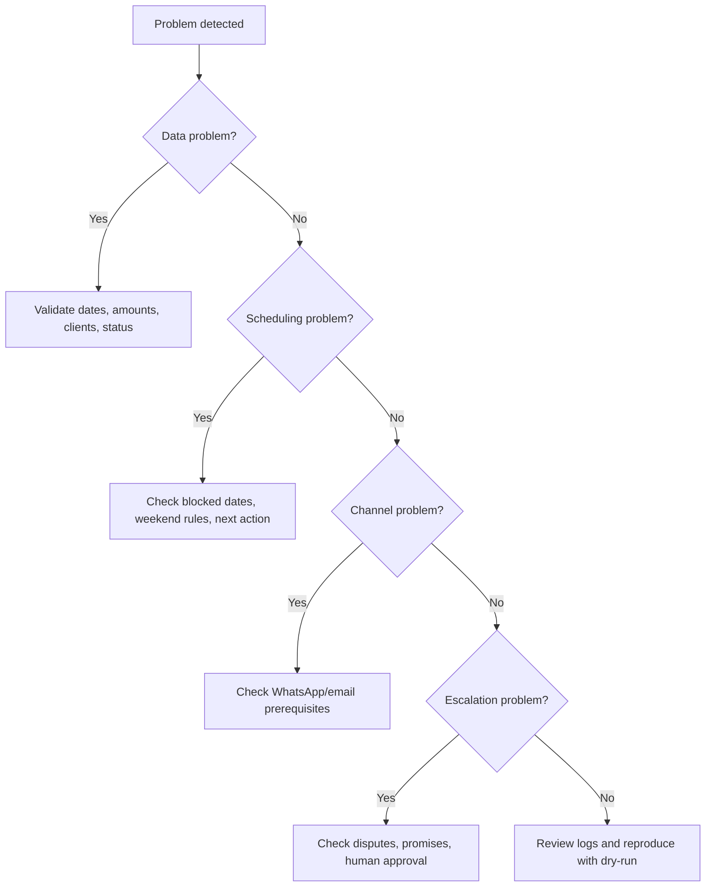

# Troubleshooting

## Diagnostic flow



## Problems and fixes

### Invoice is marked overdue too early

**Likely causes**

- Due date is missing and issue date was used incorrectly.
- Payment terms were applied from issue date instead of end-of-month.
- Public-sector or construction rules were not configured.

**Fix**

1. Add an explicit `due_date` where available.
2. Confirm `submitted_date` for public-sector invoices.
3. Recalculate the aging report.
4. Store the corrected source of the due date.

### Invoice stays current even after due date

**Likely causes**

- `as_of` date was entered in the wrong format.
- Due date was parsed as MM-DD-YYYY instead of DD/MM/YYYY.
- Invoice status is `paid` or `cancelled`.

**Fix**

1. Use `15/04/2026` or `2026-04-15`.
2. Run validation.
3. Check status and payment records.
4. Reopen only after confirming a data error.

### Outstanding balance is negative

**Likely causes**

- Partial payments exceed invoice amount.
- A refund or credit note was entered as payment.
- Amount was duplicated during import.

**Fix**

1. Move credit notes to a separate adjustment field.
2. Correct duplicated payments.
3. Reject the ledger until balance is zero or positive.

### Reminder generated for a paid invoice

**Likely causes**

- `paid_date` exists but `status` remains open.
- Payment was logged in bank notes but not in the ledger.
- Partial payments total the invoice amount but status was not closed.

**Fix**

1. Set `status` to `paid`.
2. Add `paid_date`.
3. Re-run the report.
4. Confirm no reminder appears.

### Reminder falls on Friday, Saturday, or holiday

**Likely causes**

- `blocked_dates` is empty.
- Holiday dates are in ISO while parser expects DD/MM/YYYY in that file.
- A custom scheduler ignored the next-business-day helper.

**Fix**

1. Add dates to `blocked_dates`.
2. Use consistent date formatting.
3. Use the client helper `next_business_day`.
4. Test the specific date in dry-run mode.

### WhatsApp number is rejected

**Likely causes**

- Local mobile format starts with `05`.
- Number includes spaces or hyphens.
- Number is not a mobile number.
- WhatsApp Business template is not approved.

**Fix**

1. Normalize `050-123-4567` to `+972501234567`.
2. Remove separators.
3. Confirm opt-in and template rules where applicable.
4. Use dry-run output before sending.

### Email reminder goes to spam

**Likely causes**

- Domain lacks SPF, DKIM, or DMARC.
- Message contains aggressive language.
- Attachments trigger filtering.
- Too many similar messages were sent at once.

**Fix**

1. Configure domain authentication.
2. Use neutral wording.
3. Attach only invoice PDFs.
4. Rate-limit sending.
5. Monitor bounces.

### Client says the invoice was never received

**Likely causes**

- Invoice sent to a wrong address.
- No delivery proof exists.
- Attachment was blocked.

**Fix**

1. Send the invoice again to a verified address.
2. Ask for confirmation of receipt.
3. Store the confirmation.
4. Reset escalation timing if fairness requires it.

### Client raises a dispute after a legal warning

**Likely causes**

- Earlier reminders did not invite written dispute details.
- Service acceptance evidence was not attached.
- Client is using delay tactics.

**Fix**

1. Pause automatic reminders.
2. Request a specific written dispute.
3. Attach delivery proof.
4. Resume escalation only after review.

### Interest calculation is challenged

**Likely causes**

- A fixed percentage was inserted without authority.
- Bank of Israel policy rate was used incorrectly.
- Court interest and pre-lawsuit interest were mixed.

**Fix**

1. Remove the unverified rate.
2. State principal separately.
3. State that statutory late-payment interest may apply subject to verification.
4. Confirm with an accountant or legal adviser before filing.

### Small-claims route looks unavailable

**Likely causes**

- Claim exceeds current threshold.
- Debtor is not in the right jurisdiction.
- Claim includes multiple legal issues beyond unpaid invoices.
- A company representation limitation applies.

**Fix**

1. Verify the current small-claims ceiling.
2. Split only when legally and factually appropriate.
3. Consider Magistrate Court for larger or complex claims.
4. Get legal advice when the procedural route is unclear.

## Logging checklist

Capture the following fields for each generated reminder:

```json
{
  "invoice_id": "INV-100",
  "client_id": "c-100",
  "stage": "formal_email",
  "channel": "email",
  "recipient": "client@example.co.il",
  "generated_at": "2026-04-15T09:30:00+03:00",
  "approved_by": "human",
  "sent_at": "2026-04-15T10:02:00+03:00",
  "delivery_status": "sent",
  "message_hash": "sha256:..."
}
```

## Recovery procedures

### Restore from backup

1. Stop sending reminders.
2. Restore the latest ledger backup.
3. Reconcile against bank payments.
4. Re-run validation.
5. Resume only after comparing reminder history.

### Roll back a bad template

1. Disable the edited template.
2. Restore the last approved template.
3. Review messages generated since the change.
4. Send corrections only when necessary and factual.
5. Document the incident.

### Correct a privacy incident

1. Stop the affected workflow.
2. Identify recipients and data exposed.
3. Preserve logs.
4. Notify appropriate internal or professional contacts.
5. Delete misdirected exports where possible.
6. Update validation rules to prevent recurrence.
