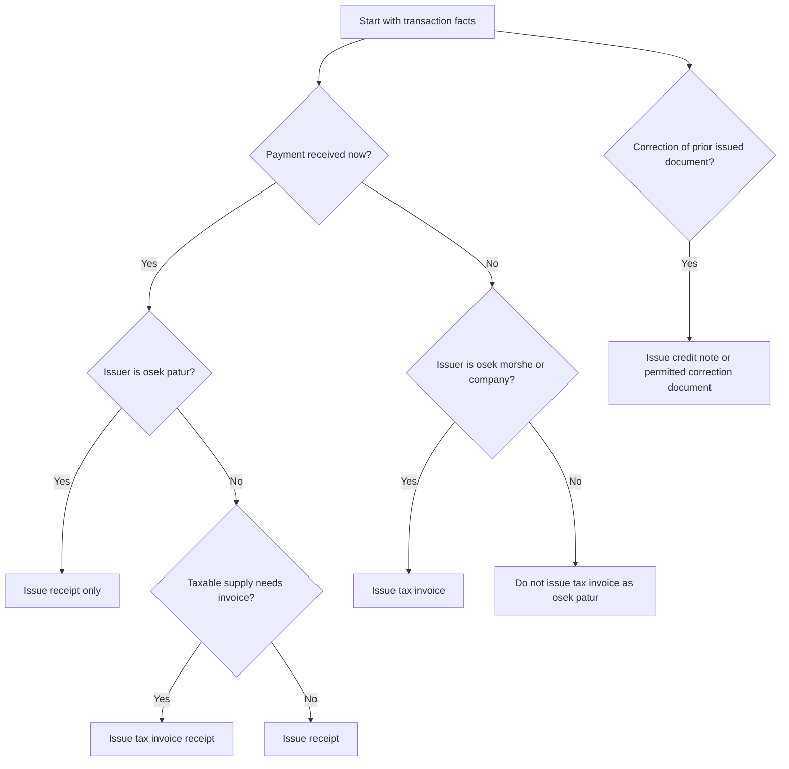
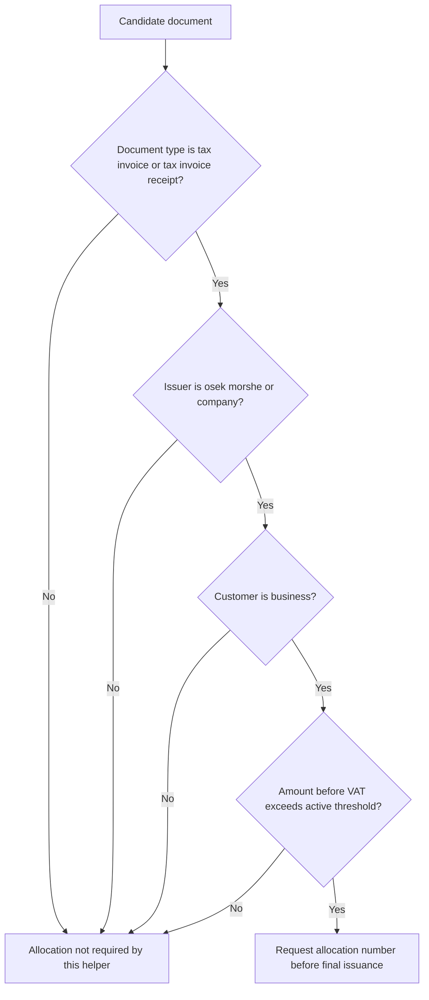

# Invoice Generator Skill

Generate structured drafts for Israeli tax invoices, receipts, tax invoice receipts, and credit notes. Use the skill for practical drafting, validation, VAT calculation, allocation-number readiness checks, and Hebrew review output before official issuance.

This skill does not replace accounting software, bookkeeping supervision, or direct filing obligations. Treat generated output as a preparation layer and verify production use against current Israel Tax Authority instructions.

## Core use cases

- Issue a tax invoice for an osek morshe or company that sells to another VAT-registered business.
- Issue a receipt for an osek patur or a paid consumer transaction.
- Issue a tax invoice receipt when the taxable transaction and payment happen together.
- Issue a credit note against a prior invoice when a return, cancellation, discount, or overcharge requires correction.
- Prepare a semantic allocation-number request payload for B2B tax invoices when the threshold is reached.
- Render a Hebrew markdown draft with Israeli currency and DD/MM/YYYY dates for internal review.

## Document selection decision tree



## Allocation-number decision tree




## Web-validated 2026 allocation rules

Apply the active threshold by document date, not only by calendar year. For 2026, use ₪10,000.00 before VAT from 01/01/2026 through 31/05/2026 and ₪5,000.00 before VAT from 01/06/2026 onward. Treat the trigger as greater than the threshold. A taxable B2B invoice for exactly ₪5,000.00 before VAT on 01/06/2026 does not trigger this helper; ₪5,000.01 does.

Require a non-zero VAT component for allocation checks. Zero-rate exports, exempt transactions, receipts, and credit notes do not trigger allocation in this helper. Use `customer_type: business` only for an Israeli VAT-registered business customer and include the customer's 9-digit identifier before any official allocation request.

## Required input fields

| Field | Required | Notes |
|---|---:|---|
| `document_type` | Yes | `tax_invoice`, `receipt`, `tax_invoice_receipt`, or `credit_note`. |
| `document_number` | Yes | Preserve the business sequence. Do not reuse numbers. |
| `issue_date` | Yes | Accepts `YYYY-MM-DD`, `DD-MM-YYYY`, or `DD/MM/YYYY`; Hebrew output uses `DD/MM/YYYY`. |
| `issuer.name` | Yes | Legal business name or trade name used in the records. |
| `issuer.tax_id` | Recommended | Use a 9-digit Israeli identifier where applicable. |
| `issuer.status` | Yes | `morshe`, `patur`, or `company`. |
| `customer.name` | Yes | Use the legal customer name for B2B documents. |
| `customer.tax_id` | Required for many B2B flows | Use a 9-digit identifier when available. |
| `customer.customer_type` | Recommended | `business`, `consumer`, `foreign`, `nonprofit`, or `government`. |
| `lines` | Required except some receipt-only summaries | Include description, quantity, unit, and unit price. |
| `payments` | Required for receipt and tax invoice receipt | Include method, amount, reference, and payment date when known. |

## Concrete examples

### B2B tax invoice requiring allocation

```json
{
  "document_type": "tax_invoice",
  "document_number": "INV-2026-0042",
  "issue_date": "15/06/2026",
  "issuer": {
    "name": "יעל כהן ייעוץ",
    "tax_id": "123456789",
    "status": "morshe"
  },
  "customer": {
    "name": "חברת לקוח בע\"מ",
    "tax_id": "515555555",
    "customer_type": "business"
  },
  "currency": "ILS",
  "lines": [
    {"description": "ייעוץ אסטרטגי", "quantity": "40", "unit": "שעה", "unit_price": "450.00"}
  ]
}
```

Expected totals: ₪18,000.00 before VAT, ₪3,240.00 VAT at 18%, ₪21,240.00 total. With the web-validated 15/06/2026 threshold, the amount before VAT exceeds ₪5,000.00, so an allocation number is required for B2B final issuance.

### Receipt for an osek patur

```json
{
  "document_type": "receipt",
  "document_number": "REC-2026-0011",
  "issue_date": "12/03/2026",
  "issuer": {"name": "דני לוי תיקונים", "tax_id": "012345674", "status": "patur"},
  "customer": {"name": "לקוח פרטי", "customer_type": "consumer"},
  "lines": [{"description": "תיקון בבית לקוח", "quantity": "1", "unit": "ביקור", "unit_price": "850.00"}],
  "payments": [{"method": "bit", "amount": "850.00", "reference": "BIT-7781", "paid_at": "12/03/2026"}]
}
```

Expected result: no VAT and no allocation-number requirement.

### Credit note against an allocated invoice

```json
{
  "document_type": "credit_note",
  "document_number": "CN-2026-0007",
  "issue_date": "20/06/2026",
  "issuer": {"name": "יעל כהן ייעוץ", "tax_id": "123456789", "status": "morshe"},
  "customer": {"name": "חברת לקוח בע\"מ", "tax_id": "515555555", "customer_type": "business"},
  "original_document_number": "INV-2026-0042",
  "original_allocation_number": "123456789012345",
  "credit_reason": "הנחה בדיעבד עקב חיוב יתר",
  "lines": [{"description": "זיכוי בגין חיוב יתר", "quantity": "1", "unit": "זיכוי", "unit_price": "500.00"}]
}
```

Expected result: negative subtotal, negative VAT, negative total, and a clear reference to the original invoice.

## Edge cases

### Foreign currency

Add a note with the exchange rate basis. Keep the currency code in `currency`; render output still shows the currency code when the document is not in shekels.

### Zero-rate exports

Set `vat_rate` to `0` and provide `zero_rate_basis`. Keep supporting documentation in the transaction file. Do not assume every foreign customer transaction qualifies.

### Discounts

Use `discount` for fixed discounts and `discount_percent` for percentage discounts. The validator rejects a line when the total discount exceeds the line amount.

### Mixed VAT rates

Set `vat_rate` on individual lines only when the accounting treatment supports mixed rates. Avoid mixing exempt, zero-rate, and standard-rate lines without a bookkeeping review.

### Partial payments

For a receipt or tax invoice receipt, list each payment separately. The helper validates that payment details exist, but production systems may also require reconciliation against bank deposits, credit-card confirmations, or withholding-tax certificates.

### Osek patur upgrade to osek morshe

Change `issuer.status` on and after the effective date. Do not retroactively convert earlier receipts into tax invoices unless the bookkeeper confirms the required correction workflow.

## CLI workflow

```bash
pip install -e .
pip install -r requirements-dev.txt
invoice-generator example --kind tax-invoice > invoice.json
CREATE_RESPONSE=$(invoice-generator create invoice.json --env sandbox)
DOCUMENT_ID=$(python -c 'import json,sys; print(json.load(sys.stdin)["id"])' <<< "$CREATE_RESPONSE")
invoice-generator validate "$DOCUMENT_ID" --env sandbox
invoice-generator allocation-required "$DOCUMENT_ID" --env sandbox
invoice-generator shaam-payload "$DOCUMENT_ID" --env sandbox
invoice-generator render "$DOCUMENT_ID" --env sandbox --output invoice.md
```

## Python workflow

```python
from invoice_generator import DocumentSpec, ShaamClient, SHAAM_SANDBOX_BASE_URL, render_hebrew_markdown, sample_tax_invoice

document = DocumentSpec.from_dict(sample_tax_invoice())
document.validate().raise_for_errors()
print(document.calculate_totals().to_dict())
print(document.requires_allocation())
print(render_hebrew_markdown(document))

client = ShaamClient(base_url=SHAAM_SANDBOX_BASE_URL, access_token="token")
# response = client.request_allocation(document)
```

## Troubleshooting quick map

| Symptom | Likely cause | Corrective action |
|---|---|---|
| Osek patur tax invoice error | Issuer status conflicts with document type | Use receipt workflow or update status only when registration changed. |
| Allocation warning appears | B2B taxable amount exceeds the active threshold | Request and store an allocation number before final issuance. |
| Receipt validation fails | Missing payment details | Add payment method, amount, date, and reference. |
| Foreign currency warning appears | Missing exchange-rate note | Add rate source and date to `notes`. |
| Credit note validation fails | Missing original document number | Add original invoice or receipt reference. |

## Anti-patterns

- Do not issue a tax invoice as an osek patur.
- Do not split one B2B invoice into artificial smaller invoices to avoid allocation requirements.
- Do not reuse document numbers after validation errors.
- Do not delete an issued document to fix a mistake; issue a permitted correction document.
- Do not omit customer tax identifiers on B2B invoices when the production system requires them.
- Do not treat sandbox allocation responses as production allocation numbers.

## Production checklist

1. Confirm current VAT rate, active allocation threshold, and official API schema.
2. Confirm the issuer registration status and document numbering sequence.
3. Validate customer identity and B2B classification.
4. Calculate subtotal, VAT, total, discounts, and currency conversion.
5. Request an allocation number when the amount before VAT exceeds the active threshold and the document has a non-zero VAT component.
6. Store the allocation number, request payload, response payload, and final document copy.
7. Reconcile receipts against bank, credit-card, cash, cheque, and payment-app records.
8. Keep supporting documents for zero-rate, exempt, foreign currency, and credit-note cases.
9. Run the test suite before changing validators or threshold tables.
10. Use production credentials only in production flows.
