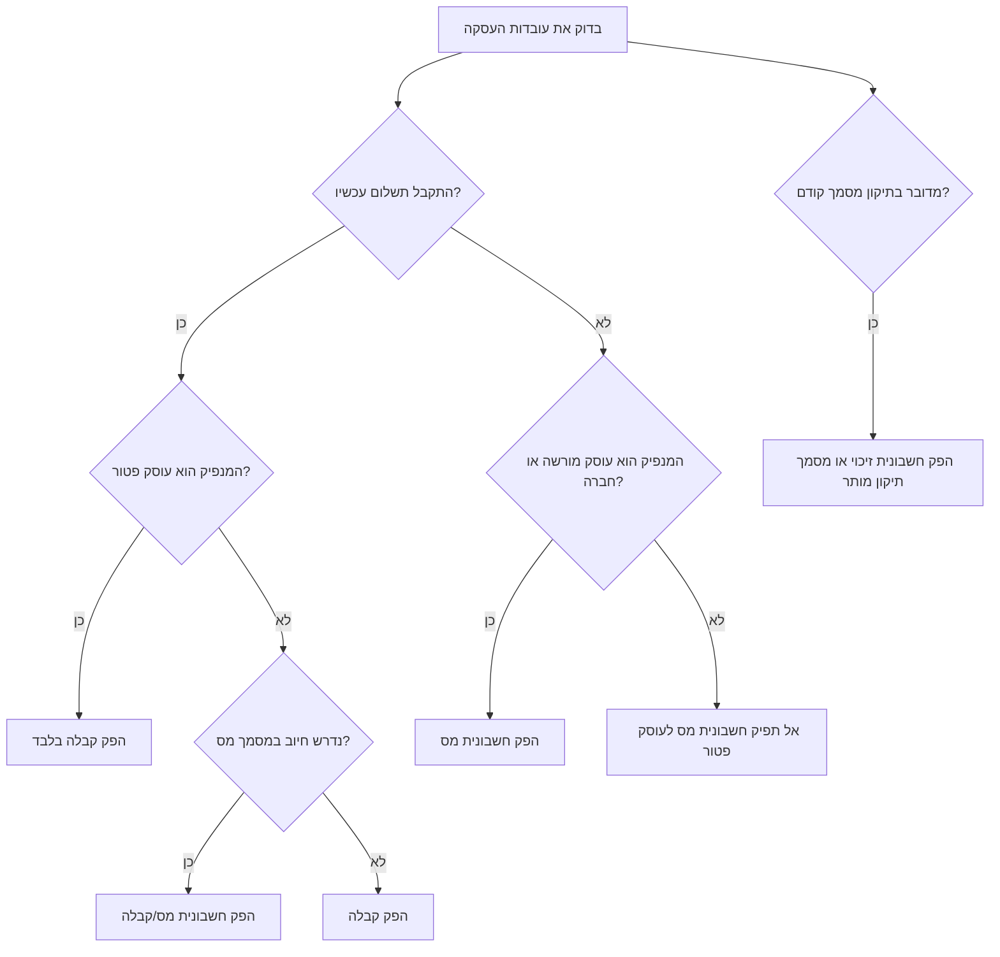
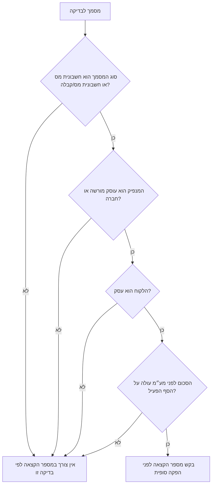

# מחולל חשבוניות וקבלות בישראל

הפק טיוטות מובנות למסמכי הנהלת חשבונות בישראל: חשבונית מס, קבלה, חשבונית מס/קבלה וחשבונית זיכוי. השתמש בכלי לבחירת סוג המסמך, חישוב מע״מ, בדיקת צורך במספר הקצאה, הכנת מטען נתונים לבקשת הקצאה, והפקת טיוטת Markdown בעברית לפני הפקה רשמית.

השתמש בתוצאה כשכבת הכנה ובקרה. הפק מסמכים רשמיים רק דרך תוכנת הנהלת חשבונות מתאימה, תהליך הנהלת חשבונות מאושר, או מערכות רשות המסים החלות על העסק.

## מתי להשתמש בכל מסמך

- הפק חשבונית מס כאשר עוסק מורשה או חברה מחייבים לקוח עסקי או לקוח אחר בעסקה החייבת במע״מ.
- הפק קבלה כאשר התקבל תשלום, במיוחד אצל עוסק פטור או בעסקה צרכנית ששולמה במקום.
- הפק חשבונית מס/קבלה כאשר החיוב והתשלום מתבצעים באותו מועד.
- הפק חשבונית זיכוי כאשר צריך לתקן חשבונית קודמת עקב החזרה, ביטול, הנחה בדיעבד או חיוב יתר.
- בקש מספר הקצאה לפני הפקה סופית של חשבונית מס עסקית כאשר הסכום לפני מע״מ עולה על הסף הפעיל.

## תרשים החלטה לבחירת מסמך



## תרשים החלטה למספר הקצאה



## שדות חובה

| שדה | חובה | הערות |
|---|---:|---|
| `document_type` | כן | `tax_invoice`, `receipt`, `tax_invoice_receipt`, או `credit_note`. |
| `document_number` | כן | שמור על רצף המספור של העסק. אל תשתמש במספר שכבר הופק. |
| `issue_date` | כן | ניתן להזין `YYYY-MM-DD`, `DD-MM-YYYY` או `DD/MM/YYYY`; פלט עברי מוצג כ-`DD/MM/YYYY`. |
| `issuer.name` | כן | שם העסק הרשמי או שם מסחרי הרשום בספרים. |
| `issuer.tax_id` | מומלץ | הזן מזהה ישראלי בן 9 ספרות כאשר קיים. |
| `issuer.status` | כן | `morshe`, `patur`, או `company`. |
| `customer.name` | כן | בעסקה עסקית הזן את שם הלקוח המשפטי. |
| `customer.tax_id` | לרוב נדרש בעסקאות עסקיות | הזן מזהה בן 9 ספרות כאשר קיים. |
| `customer.customer_type` | מומלץ | `business`, `consumer`, `foreign`, `nonprofit`, או `government`. |
| `lines` | כן למעט סיכומי קבלה מסוימים | הזן תיאור, כמות, יחידה ומחיר יחידה. |
| `payments` | כן בקבלה ובחשבונית מס/קבלה | הזן אמצעי תשלום, סכום, אסמכתה ותאריך תשלום כאשר ידועים. |

## דוגמאות מעשיות

### חשבונית מס עסקית עם צורך במספר הקצאה

```json
{
  "document_type": "tax_invoice",
  "document_number": "INV-2026-0042",
  "issue_date": "15/06/2026",
  "issuer": {
    "name": "יעל כהן ייעוץ",
    "tax_id": "123456789",
    "status": "morshe"
  },
  "customer": {
    "name": "חברת לקוח בע\"מ",
    "tax_id": "515555555",
    "customer_type": "business"
  },
  "currency": "ILS",
  "lines": [
    {"description": "ייעוץ אסטרטגי", "quantity": "40", "unit": "שעה", "unit_price": "450.00"}
  ]
}
```

תוצאה צפויה: ₪18,000.00 לפני מע״מ, ₪3,240.00 מע״מ בשיעור 18%, וסך הכול ₪21,240.00. לפי הסף המאומת ליום 15/06/2026, סכום לפני מע״מ העולה על ₪5,000.00 מחייב בדיקת מספר הקצאה בעסקה עסקית חייבת במע״מ.

### קבלה לעוסק פטור

```json
{
  "document_type": "receipt",
  "document_number": "REC-2026-0011",
  "issue_date": "12/03/2026",
  "issuer": {"name": "דני לוי תיקונים", "tax_id": "012345674", "status": "patur"},
  "customer": {"name": "לקוח פרטי", "customer_type": "consumer"},
  "lines": [{"description": "תיקון בבית לקוח", "quantity": "1", "unit": "ביקור", "unit_price": "850.00"}],
  "payments": [{"method": "bit", "amount": "850.00", "reference": "BIT-7781", "paid_at": "12/03/2026"}]
}
```

תוצאה צפויה: אין מע״מ ואין צורך במספר הקצאה.

### חשבונית זיכוי מול חשבונית קודמת

```json
{
  "document_type": "credit_note",
  "document_number": "CN-2026-0007",
  "issue_date": "20/06/2026",
  "issuer": {"name": "יעל כהן ייעוץ", "tax_id": "123456789", "status": "morshe"},
  "customer": {"name": "חברת לקוח בע\"מ", "tax_id": "515555555", "customer_type": "business"},
  "original_document_number": "INV-2026-0042",
  "original_allocation_number": "123456789012345",
  "credit_reason": "הנחה בדיעבד עקב חיוב יתר",
  "lines": [{"description": "זיכוי בגין חיוב יתר", "quantity": "1", "unit": "זיכוי", "unit_price": "500.00"}]
}
```

תוצאה צפויה: סכומים שליליים, מע״מ שלילי, וסימוכין ברורים למסמך המקורי.

## מצבי קצה

### מטבע חוץ

הוסף הערה עם שער ההמרה, מקור השער ותאריך השער. השאר את קוד המטבע בשדה `currency`. אם המסמך אינו בשקלים, הפלט מציג את קוד המטבע במקום ₪.

### שיעור אפס ביצוא

הגדר `vat_rate` כ-`0` והוסף `zero_rate_basis`. שמור אסמכתאות תומכות בתיק העסקה. אל תניח שכל עסקה עם לקוח זר זכאית לשיעור אפס.

### הנחות

השתמש ב-`discount` להנחה בסכום קבוע וב-`discount_percent` להנחה באחוזים. הבודק דוחה שורה שבה ההנחה הכוללת גבוהה מסכום השורה.

### שיעורי מע״מ שונים

הגדר `vat_rate` ברמת שורה רק כאשר הטיפול החשבונאי מאפשר זאת. הימנע מערבוב שורות פטורות, שורות בשיעור אפס ושורות בשיעור רגיל בלי בדיקת מנהל חשבונות.

### תשלומים חלקיים

בקבלה או בחשבונית מס/קבלה, פרט כל תשלום בנפרד. הבודק מוודא שקיימים פרטי תשלום, אך במערכת רשמית ייתכן שיידרש גם שיוך להפקדה, אישור אשראי, שיק או אישור ניכוי מס במקור.

### מעבר מעוסק פטור לעוסק מורשה

עדכן את `issuer.status` רק מהמועד שבו שינוי הסיווג נכנס לתוקף. אל תהפוך קבלות ישנות לחשבוניות מס בלי אישור מקצועי על דרך התיקון.

## תהליך עבודה בשורת פקודה

```bash
pip install -e .
pip install -r requirements-dev.txt
invoice-generator example --kind tax-invoice > invoice.json
CREATE_RESPONSE=$(invoice-generator create invoice.json --env sandbox)
DOCUMENT_ID=$(python -c 'import json,sys; print(json.load(sys.stdin)["id"])' <<< "$CREATE_RESPONSE")
invoice-generator validate "$DOCUMENT_ID" --env sandbox
invoice-generator allocation-required "$DOCUMENT_ID" --env sandbox
invoice-generator shaam-payload "$DOCUMENT_ID" --env sandbox
invoice-generator render "$DOCUMENT_ID" --env sandbox --output invoice.md
```

## תהליך עבודה בפייתון

```python
from invoice_generator import DocumentSpec, ShaamClient, SHAAM_SANDBOX_BASE_URL, render_hebrew_markdown, sample_tax_invoice

document = DocumentSpec.from_dict(sample_tax_invoice())
document.validate().raise_for_errors()
print(document.calculate_totals().to_dict())
print(document.requires_allocation())
print(render_hebrew_markdown(document))

client = ShaamClient(base_url=SHAAM_SANDBOX_BASE_URL, access_token="token")
# response = client.request_allocation(document)
```

## מפת תקלות קצרה

| סימן | סיבה סבירה | פעולה מתקנת |
|---|---|---|
| מתקבלת שגיאה על חשבונית מס לעוסק פטור | סוג המסמך אינו מתאים לסיווג המנפיק | השתמש בקבלה או עדכן סיווג רק אם הרישום השתנה בפועל. |
| מתקבלת אזהרה על מספר הקצאה | סכום עסקי לפני מע״מ עלה על הסף הפעיל | בקש מספר הקצאה ושמור אותו לפני ההפקה הסופית. |
| אימות קבלה נכשל | חסרים פרטי תשלום | הוסף אמצעי תשלום, סכום, תאריך ואסמכתה. |
| מתקבלת אזהרה על מטבע חוץ | חסרה הערת שער המרה | הוסף מקור שער ותאריך שער בשדה `notes`. |
| חשבונית זיכוי נכשלת | חסר מספר המסמך המקורי | הוסף הפניה לחשבונית או לקבלה המקורית. |

## פעולות שיש להימנע מהן

- אל תפיק חשבונית מס לעוסק פטור.
- אל תפצל עסקה עסקית אחת למסמכים מלאכותיים כדי להימנע ממספר הקצאה.
- אל תשתמש שוב במספר מסמך לאחר שגיאת אימות.
- אל תמחק מסמך שהופק כדי לתקן טעות; הפק מסמך תיקון מותר.
- אל תשמיט מזהה לקוח בעסקה עסקית כאשר המערכת הרשמית דורשת אותו.
- אל תשתמש בתגובת סביבת ניסוי כמספר הקצאה בסביבת ייצור.

## רשימת בדיקה לפני הפקה בייצור

1. אמת את שיעור המע״מ, סף מספר ההקצאה הפעיל ומבנה הממשק הרשמי.
2. אמת את סיווג המנפיק ואת רצף מספור המסמכים.
3. אמת את זהות הלקוח ואת סיווגו כעסקי, פרטי, זר או אחר.
4. חשב סכום לפני מע״מ, מע״מ, סך הכול, הנחות ושערי המרה.
5. בקש מספר הקצאה כאשר הסכום לפני מע״מ עולה על הסף הפעיל ולמסמך יש רכיב מע״מ שאינו אפס.
6. שמור את מספר ההקצאה, מטען הבקשה, תגובת הממשק והמסמך הסופי.
7. התאם קבלות להפקדות, אשראי, מזומן, שיקים ואישורי ניכוי מס במקור.
8. שמור אסמכתאות לעסקאות בשיעור אפס, פטור, מטבע חוץ וזיכוי.
9. הרץ את בדיקות החבילה לפני שינוי בודקים או טבלאות ספים.
10. השתמש בהרשאות ייצור רק בתהליך ייצור.
