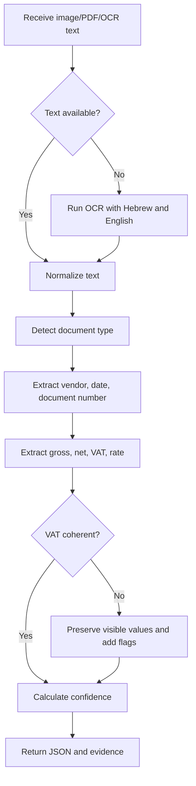
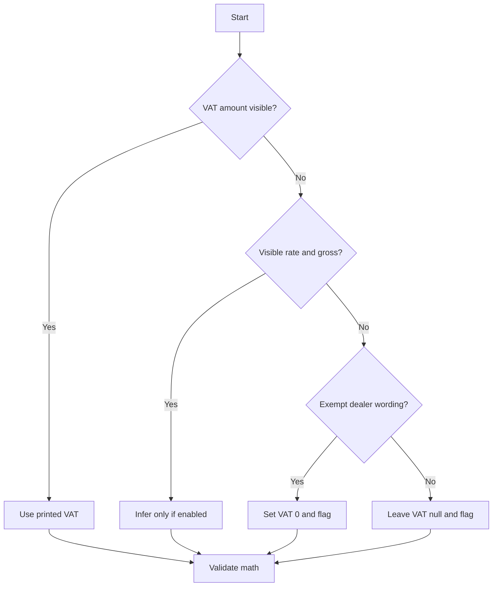
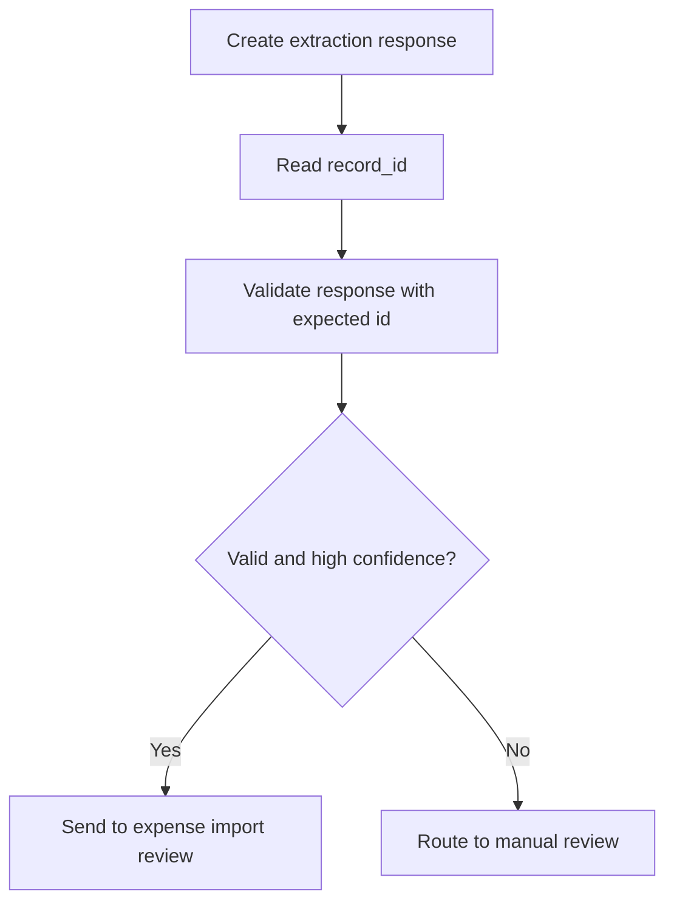

# Invoice OCR Extractor

Extract structured expense-entry fields from Hebrew and English invoice photos, scans, screenshots, PDFs, and OCR text for Israeli small businesses, freelancers, and consumers.

## Use when

- A supplier invoice or receipt must become a bookkeeping row.
- A Hebrew/English document includes vendor, total, VAT, document number, or date.
- A payment screenshot must be checked before expense entry.
- A batch of OCR text files needs review flags and CSV export.

## Output fields

Return JSON with `vendor`, `document_type`, `document_number`, `date`, `currency`, `total_gross`, `vat_amount`, `total_net`, `vat_rate`, `payment_method`, `business_id`, `business_id_type`, `allocation_number`, `confidence`, `review_flags`, and `raw_evidence`.


## Web-validated Israeli parameters

As of the 01/06/2026 verification pass, the standard Israeli VAT rate remains 18%. Use the VAT rate printed on the document whenever it is visible, and keep `18.0` only as a configurable default. For Israel Invoices allocation review, flag ILS tax invoices above ₪10,000 before VAT from 01/01/2026 through 31/05/2026, and above ₪5,000 before VAT from 01/06/2026, when no `מספר הקצאה` or `Allocation Number` is visible. Treat this as a review flag, not as tax advice.

## Core rules

1. Preserve uncertainty; use `null` when evidence is weak.
2. Prefer printed totals over inferred values.
3. Infer VAT only when enabled and clearly explain the inference.
4. Use the VAT rate printed on the document when visible.
5. Do not infer VAT for `עוסק פטור` unless VAT appears explicitly.
6. Keep foreign currency unchanged; do not convert without a separate exchange-rate workflow.
7. Keep credit-note signs; do not strip minus signs.
8. Treat payment confirmations as risky unless tax-invoice wording appears.
9. Add review flags for missing vendor, date, document number, total, or VAT.
10. Keep raw evidence snippets for important fields.

## Document type mapping

| Evidence | Output |
|---|---|
| `חשבונית מס קבלה`, `Tax Invoice Receipt` | `tax_invoice_receipt` |
| `חשבונית מס`, `Tax Invoice` | `tax_invoice` |
| `קבלה`, `Receipt` | `receipt` |
| `חשבונית עסקה`, `Invoice` | `invoice` |
| `חשבונית זיכוי`, `Credit Note` | `credit_note` |
| `פרופורמה`, `Proforma` | `proforma` |
| unclear | `unknown` |

## Vendor extraction

Prefer a business-like line near the top or near `עוסק מורשה`, `ח.פ.`, `VAT No.`, `Company No.`, `Ltd`, or `בע"מ`. Down-rank lines after `לכבוד`, `לקוח`, `Bill To`, or `Customer`. Never use document titles, totals, phone numbers, or customer names as vendor names.

## Document number extraction

Prefer labels such as `מספר חשבונית`, `חשבונית מס מס'`, `קבלה מס'`, `Invoice No.`, `Receipt No.`, and `Document No.`. Exclude `ח.פ.`, `ע.מ.`, phone numbers, card approval numbers, bank account numbers, and allocation numbers.

## Date extraction

Accept `21/05/2026`, `21.05.2026`, `21/05/2026`, and ISO `2026-05-21`. Return `DD/MM/YYYY`. For `4/5/26`, return `04/05/2026` and flag ambiguity when needed.

## Amount extraction

Prioritize gross totals in this order: `סה"כ לתשלום`, `סך לתשלום`, `סה"כ שולם`, `Grand Total`, `Total to Pay`, `Amount Paid`, then a weak bottom amount with a warning. Do not confuse subtotal, net, balance, change, phone number, approval number, or business ID with total.

## VAT extraction

- Extract printed `מע"מ`, `מעמ`, `מע מ`, `VAT`, or `%` lines.
- Validate `net + VAT = gross` within a small tolerance.
- If gross and visible VAT rate exist but VAT amount is missing, infer only when configured.
- If `עוסק פטור` appears and VAT is missing, set VAT to `0.0`, set net equal to gross, and flag that VAT was not inferred.

## Decision tree



## VAT decision tree



## Example: Hebrew tax invoice receipt

```text
א.ב. שירותי מחשוב בע"מ
ח.פ. 512345678
חשבונית מס קבלה מס' 2026-104
תאריך: 21/05/2026
סה"כ לפני מע"מ: ₪1,000.00
מע"מ 18%: ₪180.00
סה"כ לתשלום: ₪1,180.00
שולם באשראי
```

```json
{"vendor":"א.ב. שירותי מחשוב בע\"מ","document_type":"tax_invoice_receipt","document_number":"2026-104","date":"21/05/2026","currency":"ILS","total_net":1000.0,"vat_amount":180.0,"total_gross":1180.0,"vat_rate":18.0,"payment_method":"credit_card"}
```

## Example: exempt dealer receipt

```text
נועה לוי - עוסק פטור
קבלה מס' 45
תאריך 02/05/2026
סה"כ לתשלום ₪300.00
```

Expected: `vat_amount = 0.0`, `total_net = 300.0`, and review flag `Document indicates exempt dealer; VAT not inferred`.

## Edge cases

- **Multiple totals:** select the strongest gross-total label and flag conflicts.
- **Credit notes:** preserve negative signs; flag positive credit-note amounts.
- **Foreign currency:** preserve USD/EUR/GBP and flag conversion requirement.
- **Payment apps:** classify as payment method, not tax invoice, unless invoice wording exists.
- **Copy/duplicate:** extract fields and flag `Copy/duplicate indicator visible`.
- **Restaurant tips:** include tip only when part of total paid; flag unclear VAT treatment.
- **Poor OCR:** normalize common digit mistakes such as `O` to `0` and `l` to `1` near amounts.

## Confidence scoring

Suggested weights: gross total `0.20`, valid date `0.15`, document number `0.15`, vendor `0.15`, coherent VAT `0.20`, document type `0.10`, business ID `0.05`. Subtract for short OCR text, VAT mismatch, inferred VAT, weak total labels, or missing vendor.

## Troubleshooting quick table

| Symptom | Action |
|---|---|
| subtotal selected | strengthen gross-total labels |
| VAT missing | match `מעמ`, `מע מ`, and `VAT` |
| vendor is customer | down-rank lines after `לכבוד` or `Customer` |
| wrong document number | exclude IDs, phones, approvals, allocation numbers |
| image OCR unavailable | provide OCR text or install an OCR engine |

## Anti-patterns

Do not select the largest number blindly. Do not force VAT on exempt dealer receipts. Do not convert currency without a rate. Do not treat a payment confirmation as a tax invoice. Do not remove negative signs. Do not store raw OCR text longer than needed.

## Production checklist

- [ ] OCR configured for Hebrew and English.
- [ ] Images rotated, cropped, and deskewed.
- [ ] Output schema versioned.
- [ ] Confidence and review flags displayed.
- [ ] VAT inference configuration documented.
- [ ] Duplicate key uses vendor, document number, date, and gross total.
- [ ] Raw OCR text protected or redacted.
- [ ] Source file hash retained.
- [ ] Human review required below `0.85` confidence.
- [ ] Current Israeli VAT and recordkeeping requirements verified against official sources.
## Version 2.1 correction pass

Use the installable `invoice_ocr_extractor` module for Python integrations. Treat the CLI `parse` command as a create operation: it returns a structured extraction response containing `record_id`. Pass that `record_id` into validation or downstream review queues to prevent mismatched records.

```bash
python -m invoice_ocr_extractor.cli parse --text-file invoice.txt --pretty > create-response.json
EXTRACTION_ID=$(python -c 'import json; print(json.load(open("create-response.json", encoding="utf-8"))["record_id"])')
python -m invoice_ocr_extractor.cli validate --json-file create-response.json --expected-id "$EXTRACTION_ID"
```


