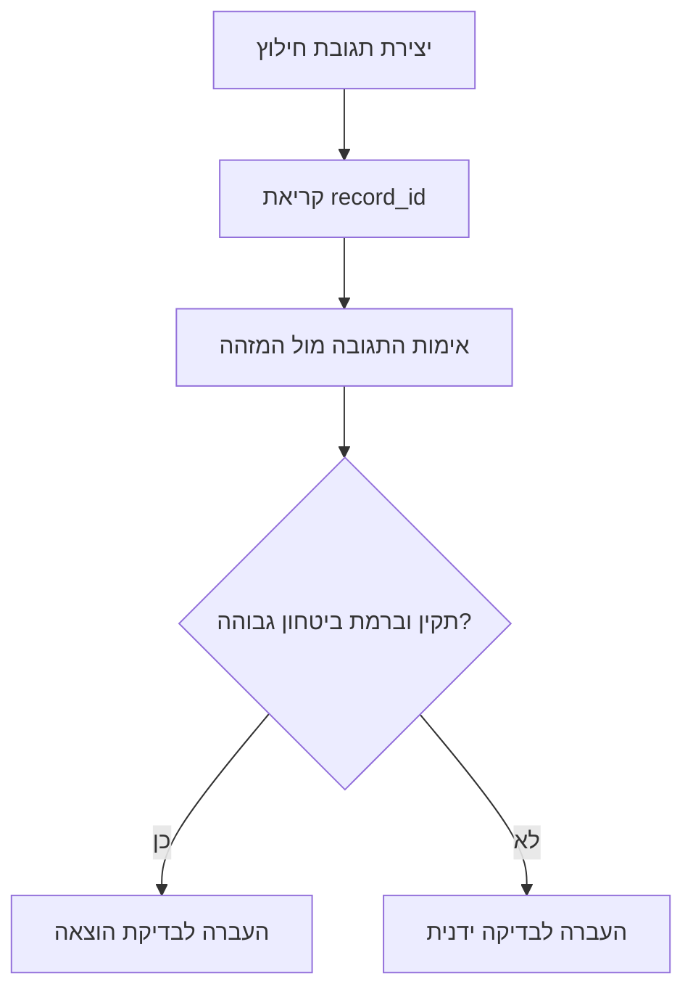

# מחלץ נתונים מחשבוניות באמצעות OCR

מחלץ שדות מובנים מחשבוניות, חשבוניות מס, קבלות וחשבוניות מס/קבלה בעברית ובאנגלית מתוך צילום, סריקה, PDF או טקסט OCR. מתאים לעסקים קטנים, לעצמאים, לפרילנסרים ולצרכנים בישראל שרוצים להכין נתוני הוצאה להזנה בהנהלת חשבונות.

## מתי להשתמש

- כאשר צריך להפוך חשבונית ספק לרשומת הוצאה.
- כאשר מסמך בעברית או באנגלית כולל ספק, סכום, מע"מ, מספר מסמך או תאריך.
- כאשר צילום מסך מאפליקציית תשלום דורש בדיקה לפני הזנה.
- כאשר תיקיית קובצי OCR צריכה להפוך לקובץ CSV עם הערות בדיקה.

## שדות פלט

להחזיר JSON עם `vendor`, `document_type`, `document_number`, `date`, `currency`, `total_gross`, `vat_amount`, `total_net`, `vat_rate`, `payment_method`, `business_id`, `business_id_type`, `allocation_number`, `confidence`, `review_flags`, ו-`raw_evidence`.


## פרמטרים ישראליים שנבדקו מול מקורות עדכניים

נכון לבדיקת 01/06/2026, שיעור המע"מ הסטנדרטי בישראל הוא 18%. להשתמש בשיעור המע"מ שמודפס במסמך כאשר הוא גלוי, ולהשאיר `18.0` כברירת מחדל ניתנת להגדרה בלבד. בבדיקת חשבוניות ישראל, לסמן לבדיקה חשבונית מס או חשבונית מס/קבלה בשקלים כאשר הסכום לפני מע"מ גבוה מ-₪10,000 מתאריך 01/01/2026 עד 31/05/2026, ומעל ₪5,000 מתאריך 01/06/2026, אם לא מופיע `מספר הקצאה` או `Allocation Number`. להתייחס לכך כהערת בדיקה ולא כייעוץ מס.

## כללי עבודה

1. לשמור על אי-ודאות; כאשר אין ראיה מספקת להחזיר `null`.
2. להעדיף סכומים שמופיעים במסמך על פני חישוב משוער.
3. לחשב מע"מ רק כאשר ההגדרה מאפשרת זאת והחישוב ברור.
4. להשתמש בשיעור המע"מ שמודפס במסמך כאשר הוא גלוי.
5. לא לחשב מע"מ לעוסק פטור אם מע"מ אינו מודפס.
6. לשמור מטבע זר כפי שהוא ולא לבצע המרה ללא תהליך שער חליפין נפרד.
7. לשמור סימני מינוס בחשבוניות זיכוי.
8. להתייחס לאישור תשלום כאל מסמך בסיכון, אלא אם מופיע ניסוח חשבונאי מתאים.
9. להוסיף הערות בדיקה עבור ספק, תאריך, מספר מסמך, סכום או מע"מ חסרים.
10. לשמור קטעי ראיה עבור שדות חשובים.

## מיפוי סוגי מסמכים

| טקסט במסמך | ערך בפלט |
|---|---|
| `חשבונית מס קבלה`, `Tax Invoice Receipt` | `tax_invoice_receipt` |
| `חשבונית מס`, `Tax Invoice` | `tax_invoice` |
| `קבלה`, `Receipt` | `receipt` |
| `חשבונית עסקה`, `Invoice` | `invoice` |
| `חשבונית זיכוי`, `Credit Note` | `credit_note` |
| `פרופורמה`, `Proforma` | `proforma` |
| לא ברור | `unknown` |

## חילוץ ספק

להעדיף שורה עסקית בראש המסמך או ליד `עוסק מורשה`, `ח.פ.`, `VAT No.`, `Company No.`, `Ltd` או `בע"מ`. להוריד עדיפות לשורות שמופיעות אחרי `לכבוד`, `לקוח`, `Bill To` או `Customer`. לא להשתמש בכותרות מסמך, סכומים, טלפונים או שם לקוח כשם ספק.

## חילוץ מספר מסמך

להעדיף `מספר חשבונית`, `חשבונית מס מס'`, `קבלה מס'`, `Invoice No.`, `Receipt No.` ו-`Document No.`. להחריג ח.פ., ע.מ., טלפון, מספר אישור אשראי, חשבון בנק ומספר הקצאה.

## תאריך

לקבל `21/05/2026`, `21.05.2026`, `21/05/2026` ו-`2026-05-21`. להחזיר תמיד `DD/MM/YYYY`. עבור `4/5/26`, להחזיר `04/05/2026` ולהוסיף הערת דו-משמעות במקרה הצורך.

## סכומים

סדר עדיפות לסכום כולל: `סה"כ לתשלום`, `סך לתשלום`, `סה"כ שולם`, `Grand Total`, `Total to Pay`, `Amount Paid`, ולאחר מכן סכום חלש בתחתית המסמך עם הערת בדיקה. לא להתבלבל בין סכום ביניים, יתרה, עודף, טלפון, מספר אישור או מזהה עסקי לבין סכום לתשלום.

## מע"מ

- לזהות `מע"מ`, `מעמ`, `מע מ`, `VAT` ושורות עם `%`.
- לבדוק ש-`סכום לפני מע"מ + מע"מ = סכום כולל`.
- כאשר יש סכום כולל ושיעור מע"מ גלוי אך סכום המע"מ חסר, לחשב רק אם ההגדרה מאפשרת.
- כאשר מופיע `עוסק פטור` ואין מע"מ מודפס, לקבוע מע"מ `0.0`, להשוות נטו לברוטו ולהוסיף הערת בדיקה.

## עץ החלטה

```mermaid
flowchart TD
A[קבלת תמונה, PDF או OCR] --> B{יש טקסט?}
B -- לא --> C[הפעלת OCR בעברית ובאנגלית]
B -- כן --> D[נרמול טקסט]
C --> D
D --> E[זיהוי סוג מסמך]
E --> F[חילוץ ספק, תאריך ומספר]
F --> G[חילוץ ברוטו, נטו, מע"מ ושיעור]
G --> H{המע"מ עקבי?}
H -- כן --> I[חישוב ביטחון]
H -- לא --> J[שמירת ערכים גלויים והוספת הערות]
J --> I
I --> K[החזרת JSON וראיות]
```

## דוגמה ישראלית

```text
א.ב. שירותי מחשוב בע"מ
ח.פ. 512345678
חשבונית מס קבלה מס' 2026-104
תאריך: 21/05/2026
סה"כ לפני מע"מ: ₪1,000.00
מע"מ 18%: ₪180.00
סה"כ לתשלום: ₪1,180.00
שולם באשראי
```

פלט צפוי כולל ספק, סוג מסמך `tax_invoice_receipt`, מספר `2026-104`, תאריך `21/05/2026`, נטו `1000.0`, מע"מ `180.0`, ברוטו `1180.0`, שיעור `18.0` ואמצעי תשלום `credit_card`.

## עוסק פטור

כאשר מופיע `עוסק פטור`, לא להניח מע"מ לקיזוז. אם אין מע"מ מודפס, להחזיר מע"מ אפס ולהוסיף הערה: `Document indicates exempt dealer; VAT not inferred`.

## מקרי קצה

- כמה סכומים: לבחור תווית ברוטו חזקה ולסמן סתירות.
- חשבונית זיכוי: לשמור סימני מינוס ולסמן סכומים חיוביים לבדיקה.
- מטבע זר: לשמור USD/EUR/GBP ולהוסיף צורך בהמרה.
- אפליקציות תשלום: לזהות אמצעי תשלום, אך לא להניח שמדובר בחשבונית מס.
- העתק או כפילות: לחלץ שדות ולהוסיף הערת כפילות.
- טיפ במסעדה: לכלול רק אם הוא חלק מ-`סה"כ שולם`; לסמן טיפול מע"מ לא ברור.
- OCR חלש: לתקן `O` ל-`0` ו-`l` ל-`1` בהקשר מספרי.

## ניקוד ביטחון

משקלים מומלצים: סכום כולל `0.20`, תאריך תקין `0.15`, מספר מסמך `0.15`, ספק `0.15`, מע"מ עקבי `0.20`, סוג מסמך `0.10`, מזהה עסקי `0.05`. להפחית עבור טקסט קצר, אי-התאמת מע"מ, חישוב משוער, תווית סכום חלשה או ספק חסר.

## תקלות נפוצות

| תסמין | פעולה |
|---|---|
| נבחר סכום ביניים | לחזק תוויות ברוטו |
| מע"מ חסר | לזהות גם `מעמ`, `מע מ`, `VAT` |
| שם לקוח זוהה כספק | להוריד עדיפות אחרי `לכבוד` או `Customer` |
| מספר מסמך שגוי | להחריג מזהים, טלפונים, אישורים והקצאה |
| אין OCR לתמונה | לספק טקסט OCR או להתקין מנוע OCR |

## רשימת בדיקות לייצור

- [ ] OCR מוגדר לעברית ולאנגלית.
- [ ] תמונות מיושרות, חתוכות ומסובבות נכון.
- [ ] סכמת פלט כוללת גרסה.
- [ ] רמת ביטחון והערות מוצגות לבודק.
- [ ] מדיניות חישוב מע"מ מתועדת.
- [ ] זיהוי כפילויות משתמש בספק, מספר מסמך, תאריך וסכום כולל.
- [ ] טקסט OCR מוגן או מטושטש.
- [ ] נשמר hash של קובץ המקור.
- [ ] נדרשת בדיקה ידנית מתחת ל-`0.85`.
- [ ] דרישות מע"מ וניהול ספרים בישראל נבדקות מול מקורות רשמיים עדכניים.
## תיקוני גרסה 2.1

השתמשו במודול ההתקנה `invoice_ocr_extractor` לצורך שילוב בקוד. פקודת `parse` יוצרת תגובת חילוץ הכוללת `record_id`. העבירו את המזהה הזה לשלב האימות או לתור הבדיקה כדי למנוע התאמה שגויה בין רשומות.

```bash
python -m invoice_ocr_extractor.cli parse --text-file invoice.txt --pretty > create-response.json
EXTRACTION_ID=$(python -c 'import json; print(json.load(open("create-response.json", encoding="utf-8"))["record_id"])')
python -m invoice_ocr_extractor.cli validate --json-file create-response.json --expected-id "$EXTRACTION_ID"
```


