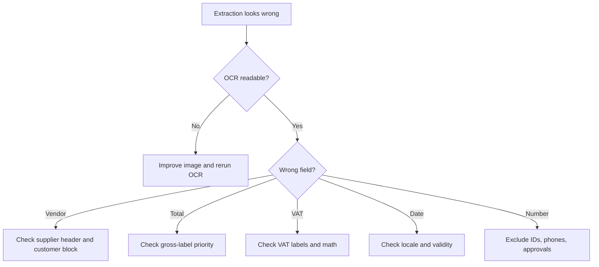

# Troubleshooting

## No OCR text

Improve lighting, crop page, rotate upright, render PDF at higher resolution, enable Hebrew and English OCR, or provide OCR text manually.

## Wrong vendor

Ignore lines after `לכבוד`, `לקוח`, `Bill To`, and `Customer`. Prefer lines near business IDs and legal suffixes such as `בע"מ`, `Ltd`, or `עוסק מורשה`.

## Wrong total

Prefer `סה"כ לתשלום`, `סה"כ שולם`, `Grand Total`, `Total to Pay`, and `Amount Paid`. Down-rank `Subtotal`, `Net`, `Before VAT`, `Balance`, and `Change`.

## VAT missing or wrong

Match `מע"מ`, `מעמ`, `מע מ`, `VAT`, and `%`. Preserve printed values. Add `VAT math mismatch` when net, VAT, and gross do not reconcile. Do not infer VAT for `עוסק פטור`.

## Date wrong

Normalize to `DD/MM/YYYY`. Treat `YYYY-MM-DD` as ISO. Flag ambiguous dates where day and month are both 12 or less.

## Document number wrong

Prefer explicit invoice/receipt labels. Exclude `ח.פ.`, `ע.מ.`, phone, approval, and allocation labels.

## Payment confirmation

Return a warning and request the supplier invoice/receipt before VAT entry.

## Logging and privacy

Log hashes, confidence, and flags. Avoid logging full OCR text unless protected and necessary.

## Escalate to manual review

Escalate for missing vendor, missing gross total, VAT mismatch, payment confirmation, cropped image, multiple invoices in one image, foreign currency, unknown document type, or possible duplicate.

## Allocation number missing on a high-value 2026 tax invoice

Symptoms:

- `document_type` is `tax_invoice` or `tax_invoice_receipt`.
- The invoice is in ILS.
- The amount before VAT is above the current threshold for the document date.
- No `מספר הקצאה` or `Allocation Number` is visible.

Action:

- Add a review flag.
- Do not replace the invoice number with the allocation number.
- Verify the current Tax Authority threshold before input VAT handling.
