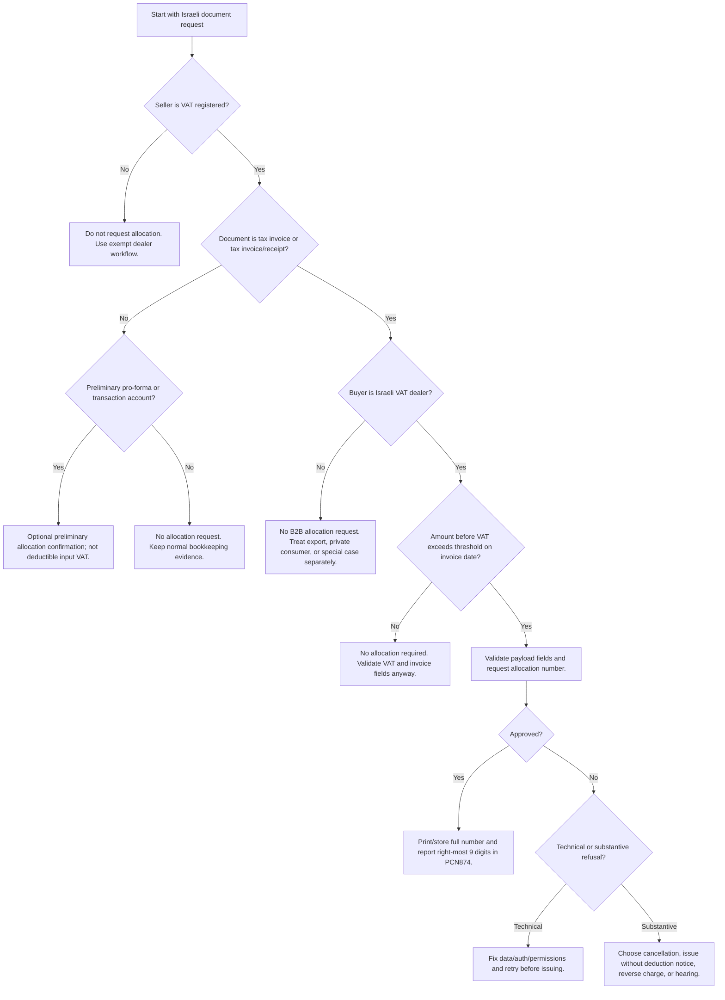

# E-Invoicing: Israeli Tax Invoice Allocation Compliance

Use this skill to prepare, validate, and troubleshoot Israeli B2B tax invoices that may require a Tax Authority allocation number under the Chashbonit Yisrael model. Apply it to tax invoices, tax invoice/receipts, preliminary allocation confirmations, allocation-number verification, and recipient-side checks.

This skill is not accounting advice. Validate edge cases with a licensed Israeli accountant or tax adviser before filing.

## Current operating facts

- Standard VAT rate: 18% from 01-01-2025 onward.
- Allocation threshold basis: invoice total before VAT.
- Allocation threshold from 01-01-2026 through 31-05-2026: above ₪10,000 before VAT.
- Allocation threshold from 01-06-2026 onward: above ₪5,000 before VAT.
- Primary allocation document types: tax invoice and tax invoice/receipt.
- Customer-side deduction risk: without an allocation number where required, input VAT deduction can be denied.
- Authentication: OAuth2 user-restricted authorization with service permissions.
- Sandbox and production endpoints differ; never hard-code a single host across all services.

## Decision tree



## Required inputs

Collect these fields before preparing an API request:

| Field | Rule |
|---|---|
| `invoice_id` | Stable internal bookkeeping ID, unique per request. |
| `invoice_type` | Use the official document type. Use `305` for tax invoice/receipt and `300` for tax invoice. |
| `vat_number` | Seller VAT dealer number, 9 digits with a valid check digit. |
| `customer_vat_number` | Buyer VAT dealer number for Israeli B2B allocation requests. |
| `invoice_date` | Printed invoice date, `YYYY-MM-DD`. |
| `invoice_issuance_date` | System issuance date, `YYYY-MM-DD`. |
| `accounting_software_number` | Registered software number or document producer company number where applicable. |
| `amount_before_discount` | Gross amount before discount, before VAT. |
| `discount` | Absolute discount amount, never negative. |
| `payment_amount` | Net taxable amount before VAT. |
| `vat_amount` | VAT amount, normally `payment_amount * 0.18`. |
| `payment_amount_including_vat` | Total after VAT. |
| `items` | Line-level details where available, with quantity, unit price, discounts, VAT rate, and line totals. |

## Concrete examples

### Example 1: B2B consulting invoice above the 01-06-2026 threshold

Facts: Israeli VAT-registered consultant invoices an Israeli VAT-registered company on 15-06-2026 for ₪6,000 before VAT.

Decision: Request an allocation number before sending the final invoice.

```json
{
  "invoice_id": "INV-2026-0615-001",
  "invoice_type": 305,
  "vat_number": 123456782,
  "customer_vat_number": 777777715,
  "customer_name": "Example Customer Ltd",
  "invoice_date": "2026-06-15",
  "invoice_issuance_date": "2026-06-15",
  "accounting_software_number": 123456782,
  "amount_before_discount": 6000.00,
  "discount": 0.00,
  "payment_amount": 6000.00,
  "vat_amount": 1080.00,
  "payment_amount_including_vat": 7080.00,
  "items": [
    {
      "index": 1,
      "description": "Monthly consulting services",
      "quantity": 1,
      "price_per_unit": 6000.00,
      "discount": 0.00,
      "total_amount": 6000.00,
      "vat_rate": 18.00,
      "vat_amount": 1080.00
    }
  ]
}
```

### Example 2: B2B invoice below the threshold

Facts: Israeli VAT-registered supplier invoices an Israeli VAT-registered customer on 10-06-2026 for ₪4,900 before VAT.

Decision: No allocation number required. Still validate VAT math and mandatory bookkeeping fields.

### Example 3: Foreign customer export service

Facts: Israeli supplier issues a zero-rated invoice to a non-Israeli customer.

Decision: Do not request a Chashbonit Yisrael B2B allocation number. Keep export evidence and zero-rate support documentation.

### Example 4: Pro-forma request before payment

Facts: Cash-basis supplier needs buyer assurance before issuing the tax invoice.

Decision: Use preliminary allocation confirmation for document code `332` where the API workflow applies. Do not treat the preliminary confirmation as deductible input VAT.

## CLI quick use

```bash
python scripts/israeli_e_invoice_compliance_cli.py validate invoice.json
python scripts/israeli_e_invoice_compliance_cli.py threshold --invoice-date 2026-06-15 --amount 6000
python scripts/israeli_e_invoice_compliance_cli.py approve invoice.json --environment sandbox --token "$ITA_TOKEN"
```

## Python quick use

```python
from scripts.israeli_e_invoice_compliance_client import (
    Environment,
    InvoiceApprovalRequest,
    InvoiceComplianceClient,
)

request = InvoiceApprovalRequest.from_payload(payload)
request.raise_for_validation_errors()

client = InvoiceComplianceClient(access_token="...", environment=Environment.SANDBOX)
response = client.request_approval(request)
print(response.approved, response.confirmation_number)
```

## Troubleshooting

| Symptom | Likely cause | Action |
|---|---|---|
| `401 Unauthorized` | Missing, expired, or wrong OAuth2 token. | Refresh token and verify OAuth2 user-restricted flow. |
| `403 Forbidden` | Missing Tax Authority permission for the service or dealer. | Re-grant digital authorization for the operator and VAT dealer. |
| `404 Not Found` | Wrong endpoint host or path. | Check sandbox versus production path and service version. |
| `406 Not Acceptable` | Permission mismatch for seller or customer VAT number. | Confirm the authorized dealer and request party. |
| `422 Unprocessable Entity` | JSON shape does not match schema. | Validate fields, numeric precision, date format, and required conditional fields. |
| Error `431` | VAT number incorrect. | Validate 9-digit check digit and dealer number. |
| Error `434` | Invoice date too old. | Confirm retroactive request rules and avoid reusing stale dates. |
| Error `435` | Invoice date more than a month ahead. | Use the actual printed invoice date. |
| Error `446` | Missing `user_id` and `user_name`. | Send one of the conditional service-operator fields when required. |
| Error `460` | Invoice not approved. | Follow held-invoice alternatives and document the selected decision. |

## Anti-patterns

- Do not calculate the threshold on the amount including VAT.
- Do not request an allocation number for every receipt or pro-forma by default.
- Do not place a preliminary allocation confirmation on a tax invoice as if it were an allocation number.
- Do not send production requests with sandbox credentials.
- Do not retry a substantive refusal as a new invoice with changed IDs to bypass controls.
- Do not omit the buyer VAT number for an Israeli B2B invoice above the threshold.
- Do not print only an internal request ID; print the allocation number returned by the Tax Authority.
- Do not ignore the PCN874 shortened-number requirement; store the full number and report the right-most 9 digits where required.

## Output checklist

Before finalizing an invoice, verify:

1. Document type is correct.
2. Seller and buyer VAT numbers pass check-digit validation.
3. Invoice date selects the correct threshold.
4. Amount before VAT is used for the threshold test.
5. VAT is calculated at 18% unless a valid zero-rate or exemption applies.
6. Allocation number is present when required.
7. Refusal handling is documented when allocation is not approved.
8. The invoice copy, request payload, response payload, and authorization trail are retained.
