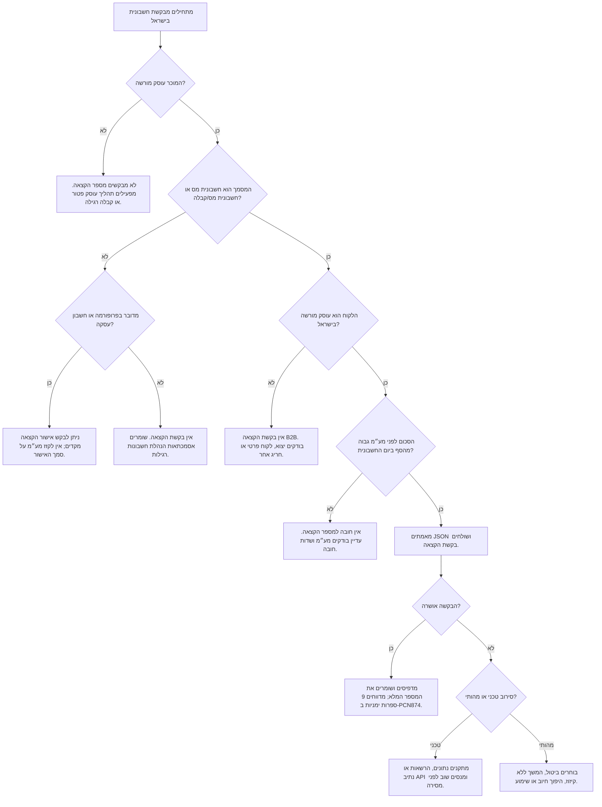

# חשבונית ישראל: אימות והקצאת מספר לחשבונית מס

השתמש במיומנות זו להכנת חשבוניות מס ישראליות, בדיקת הצורך במספר הקצאה, אימות מבנה JSON, טיפול בתקלות API, ובדיקת חשבוניות ספק לפי מספר הקצאה. המיקוד הוא עסקאות B2B בישראל שבהן הלקוח מבקש לקזז מס תשומות.

אין לראות בתוכן ייעוץ מס. במקרים גבוליים יש לפנות לרואה חשבון או יועץ מס בישראל.

## עובדות עבודה עדכניות

- שיעור המע״מ הרגיל: 18% החל מ-01-01-2025.
- בדיקת הסף נעשית לפי סכום החשבונית לפני מע״מ.
- מ-01-01-2026 עד 31-05-2026: נדרש מספר הקצאה מעל ₪10,000 לפני מע״מ.
- החל מ-01-06-2026: נדרש מספר הקצאה מעל ₪5,000 לפני מע״מ.
- סוגי המסמך העיקריים: חשבונית מס וחשבונית מס/קבלה.
- ללא מספר הקצאה כאשר הוא נדרש, הלקוח עלול לאבד את הזכות לניכוי מס תשומות.
- ההזדהות לשירות נעשית בהרשאת OAuth2 מוגבלת משתמש והרשאות שירות מתאימות.
- קיימים נתיבי sandbox ו-production נפרדים; אין לערבב בין סביבות.

## עץ החלטה



## שדות חובה לפני בקשת API

| שדה | כלל |
|---|---|
| `invoice_id` | מזהה פנימי יציב וייחודי לחשבונית. |
| `invoice_type` | קוד מסמך רשמי. `300` לחשבונית מס, `305` לחשבונית מס/קבלה. |
| `vat_number` | מספר עוסק של המוכר, 9 ספרות כולל ספרת ביקורת תקינה. |
| `customer_vat_number` | מספר העוסק של הלקוח בעסקת B2B ישראלית. |
| `invoice_date` | תאריך החשבונית המודפס, `YYYY-MM-DD`; להצגה מקומית השתמש ב-DD-MM-YYYY. |
| `invoice_issuance_date` | תאריך ההפקה במערכת, `YYYY-MM-DD`. |
| `accounting_software_number` | מספר רישום תוכנה או מספר ח.פ. מפיק המסמך לפי הצורך. |
| `amount_before_discount` | סכום לפני הנחה ולפני מע״מ. |
| `discount` | סכום הנחה חיובי בלבד, ללא מינוס. |
| `payment_amount` | סכום נטו לפני מע״מ. |
| `vat_amount` | סכום המע״מ, לרוב `payment_amount * 0.18`. |
| `payment_amount_including_vat` | הסכום לתשלום כולל מע״מ. |
| `items` | פירוט שורות: כמות, מחיר יחידה, הנחה, שיעור מע״מ וסכום שורה. |

## דוגמאות מעשיות

### דוגמה 1: שירות ייעוץ B2B מעל הסף של 01-06-2026

נתונים: יועץ שהוא עוסק מורשה מפיק ב-15-06-2026 חשבונית מס/קבלה לחברה ישראלית על ₪6,000 לפני מע״מ.

החלטה: חובה לבקש מספר הקצאה לפני שליחת החשבונית הסופית.

```json
{
  "invoice_id": "INV-2026-0615-001",
  "invoice_type": 305,
  "vat_number": 123456782,
  "customer_vat_number": 777777715,
  "customer_name": "לקוח לדוגמה בע\"מ",
  "invoice_date": "2026-06-15",
  "invoice_issuance_date": "2026-06-15",
  "accounting_software_number": 123456782,
  "amount_before_discount": 6000.00,
  "discount": 0.00,
  "payment_amount": 6000.00,
  "vat_amount": 1080.00,
  "payment_amount_including_vat": 7080.00,
  "items": [
    {
      "index": 1,
      "description": "שירותי ייעוץ חודשיים",
      "quantity": 1,
      "price_per_unit": 6000.00,
      "discount": 0.00,
      "total_amount": 6000.00,
      "vat_rate": 18.00,
      "vat_amount": 1080.00
    }
  ]
}
```

### דוגמה 2: חשבונית B2B מתחת לסף

נתונים: ספק ישראלי מפיק ב-10-06-2026 חשבונית על ₪4,900 לפני מע״מ ללקוח ישראלי עוסק מורשה.

החלטה: אין חובה למספר הקצאה. עדיין יש לוודא חישוב מע״מ ושדות חובה.

### דוגמה 3: לקוח בחו״ל

נתונים: ספק ישראלי נותן שירות ללקוח זר בעסקה בשיעור מע״מ אפס.

החלטה: אין לבקש מספר הקצאה לפי מודל B2B ישראלי. יש לשמור אסמכתאות יצוא ושיעור אפס.

### דוגמה 4: חשבון עסקה לפני תשלום

נתונים: ספק על בסיס מזומן נדרש לתת ודאות ללקוח לפני הפקת חשבונית מס.

החלטה: ניתן להשתמש באישור הקצאה מקדים למסמך `332` כאשר התהליך מתאים. אין להתייחס לאישור המקדים כמספר הקצאה לחשבונית מס.

## שימוש מהיר ב-CLI

```bash
python scripts/israeli_e_invoice_compliance_cli.py validate invoice.json
python scripts/israeli_e_invoice_compliance_cli.py threshold --invoice-date 2026-06-15 --amount 6000
python scripts/israeli_e_invoice_compliance_cli.py approve invoice.json --environment sandbox --token "$ITA_TOKEN"
```

## שימוש מהיר ב-Python

```python
from scripts.israeli_e_invoice_compliance_client import Environment, InvoiceApprovalRequest, InvoiceComplianceClient

request = InvoiceApprovalRequest.from_payload(payload)
request.raise_for_validation_errors()
client = InvoiceComplianceClient(access_token="...", environment=Environment.SANDBOX)
response = client.request_approval(request)
print(response.approved, response.confirmation_number)
```

## פתרון תקלות

| סימפטום | סיבה נפוצה | פעולה מומלצת |
|---|---|---|
| `401 Unauthorized` | טוקן חסר, פג תוקף או לא מתאים. | לרענן טוקן ולוודא זרימת OAuth2 נכונה. |
| `403 Forbidden` | אין הרשאה לשירות או לעוסק. | להעניק הרשאה דיגיטלית מתאימה למפעיל ולעוסק. |
| `404 Not Found` | נתיב או host שגוי. | לבדוק סביבת sandbox או production וגרסת שירות. |
| `406 Not Acceptable` | חוסר התאמה בהרשאות למספר עוסק. | לבדוק שהעוסק והלקוח מורשים לשירות. |
| `422 Unprocessable Entity` | מבנה JSON אינו מתאים לסכמה. | לבדוק שדות חובה, פורמט תאריך, דיוק מספרי ושדות מותנים. |
| שגיאה `431` | מספר עוסק שגוי. | לאמת 9 ספרות וספרת ביקורת. |
| שגיאה `434` | תאריך החשבונית ישן מדי. | לבדוק כללי בקשה רטרואקטיבית ולתקן תאריך. |
| שגיאה `435` | תאריך החשבונית רחוק מדי קדימה. | להשתמש בתאריך החשבונית בפועל. |
| שגיאה `446` | חסרים `user_id` וגם `user_name`. | לשלוח אחד משדות מפעיל השירות כאשר נדרש. |
| שגיאה `460` | החשבונית לא אושרה. | להפעיל תהליך חשבונית מעוכבת ולתעד החלטה. |

## דפוסי שימוש שגויים

- אין לבדוק את סף החובה לפי סכום כולל מע״מ.
- אין לבקש מספר הקצאה לכל קבלה או פרופורמה כברירת מחדל.
- אין להדפיס אישור הקצאה מקדים כאילו היה מספר הקצאה לחשבונית מס.
- אין לשלוח בקשות production עם טוקן sandbox.
- אין לעקוף סירוב מהותי באמצעות החלפת מספר חשבונית וניסיון חוזר.
- אין להשמיט מספר עוסק של לקוח בעסקת B2B מעל הסף.
- אין להדפיס מזהה בקשה פנימי במקום מספר ההקצאה שהוחזר.
- אין להתעלם מדרישת 9 הספרות הימניות בדיווח PCN874.

## רשימת בדיקה לפני מסירה

1. סוג המסמך נכון.
2. מספרי העוסק של המוכר והלקוח תקינים.
3. תאריך החשבונית מפעיל את הסף הנכון.
4. בדיקת הסף נעשתה לפני מע״מ.
5. המע״מ חושב לפי 18% אלא אם קיימת עילת שיעור אפס או פטור.
6. מספר הקצאה קיים כאשר הוא נדרש.
7. החלטה במקרה של סירוב תועדה.
8. נשמרו עותק חשבונית, payload, response ונתיב הרשאה.
