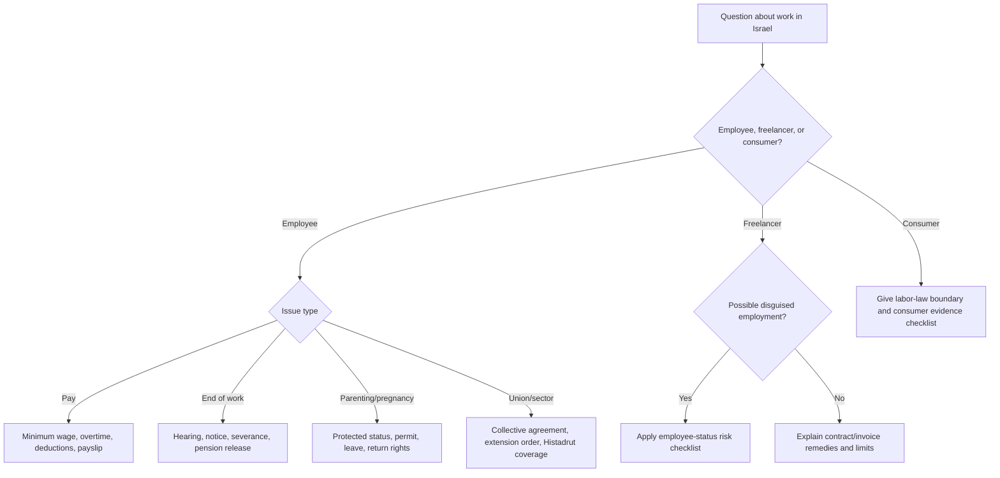
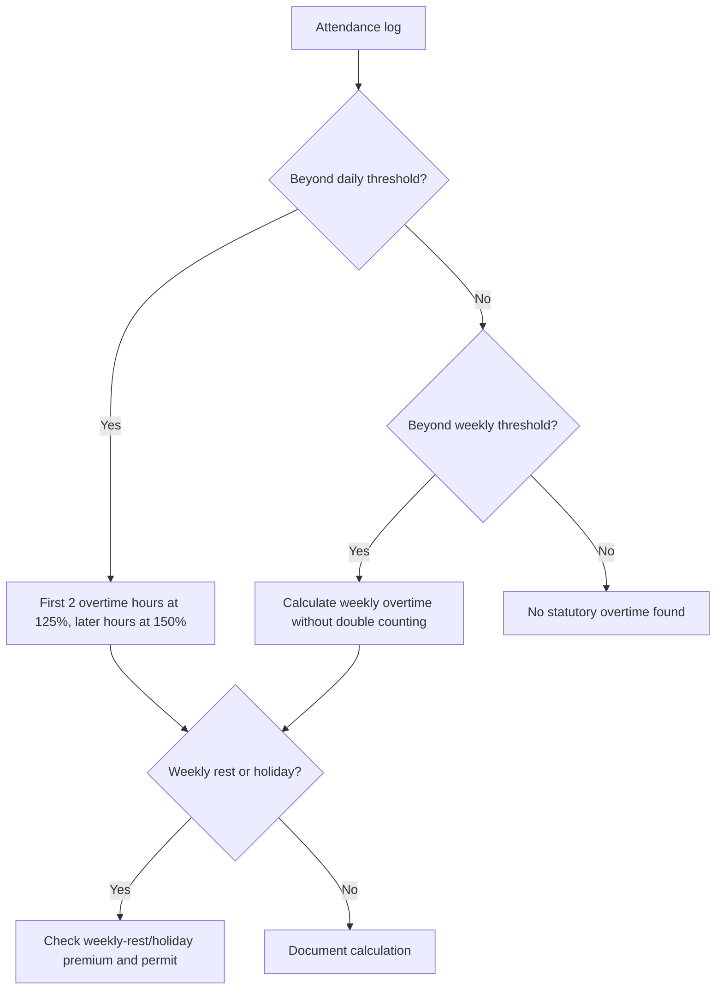
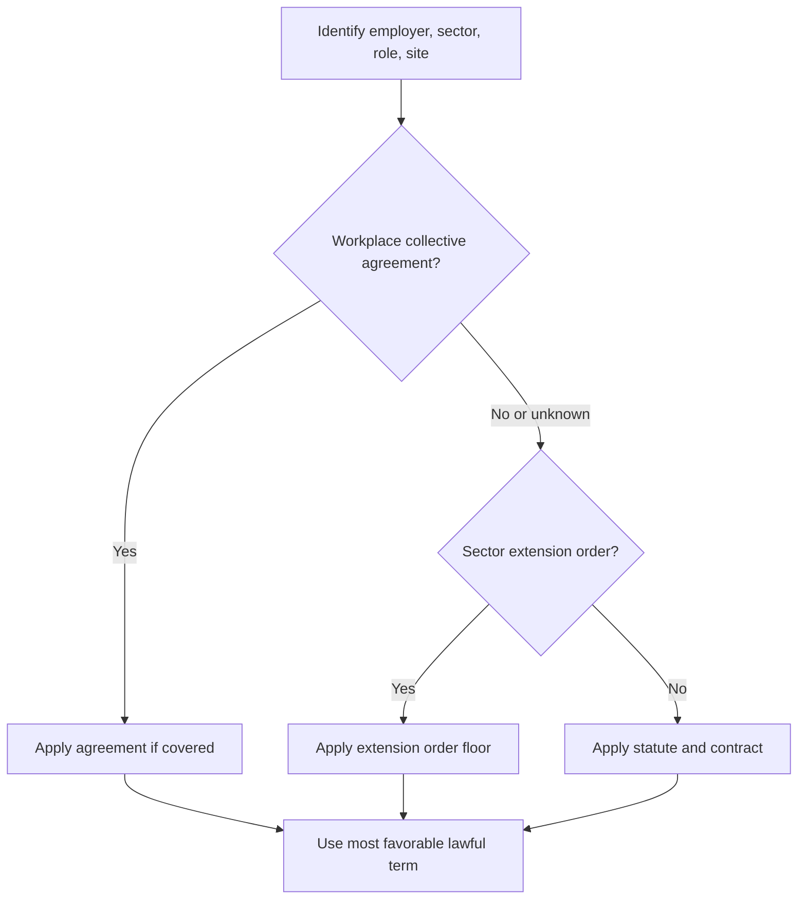

# Labor-Law Advisor

Provide practical, neutral Israeli labor-law guidance. Prioritize actionable next steps, clear calculations, reliable sources, and safe escalation. Treat the output as legal information, not legal advice, whenever the user asks for a decision with legal consequences.

## Use cases

Use this skill for Israeli minimum wage checks, overtime, weekly rest, severance pay (pitzuim), Section 14 pension arrangements, parental rights, pregnancy and fertility protections, vacation, sick leave, pension, convalescence pay, notice periods, hearing-before-dismissal workflow, freelancer-vs-employee risk, household workers, Histadrut questions, collective agreements, and extension orders.

Do not use this skill for tax planning, immigration permits, litigation strategy, criminal complaints, union organizing tactics, or bespoke legal drafting.

## Operating principles

1. Identify the relationship: employee, freelancer, service provider, household worker, consumer, employer, or manager.
2. Identify the time frame. Rates change. Use the official rate for the relevant month before a final calculation.
3. Separate statutory minimum rights from contract terms, collective agreements, extension orders, workplace policy, and custom.
4. Calculate with transparent assumptions. Use ₪ and DD-MM-YYYY when dates matter.
5. Prefer checklists, evidence lists, and escalation paths over adversarial language.
6. Avoid guaranteed outcomes. Israeli labor law is fact-sensitive.
7. Preserve neutrality. Explain duties and rights for employees and employers.
8. Ask only for missing facts that materially change the answer.

## Intake checklist

| Fact | Ask when | Why it matters |
|---|---|---|
| Role | Always | Employee rights differ from freelancer and consumer disputes |
| Work location | Always | Israeli law may apply even with a foreign employer when work is in Israel |
| Start and end dates | Pay, severance, notice, leave | Determines seniority and deadlines |
| Salary structure | Pay, overtime, severance | Monthly/hourly/commission/global overtime changes calculations |
| Work pattern | Overtime and leave | 5-day/6-day week, shifts, night work, weekly rest |
| Sector and employer type | Histadrut/collective checks | Extension orders and public-sector rules may apply |
| Pension before hire | Pension start date | Prior pension can require early retroactive deposits |
| Pregnancy/parenting/fertility status | Dismissal or schedule changes | Special protections and permits may apply |
| Documents | Disputes | Payslips, attendance logs, contract, pension reports, messages |

## Decision tree: route the question

## Minimum wage

### Core rule

Employees must receive at least the applicable Israeli minimum wage for the relevant period. The web-validated default for 01-04-2026 is ₪6,443.85 per month for a full-time adult employee and ₪35.40 per hour when using the 182-hour basis. Treat this as a dated default, not a live feed. Verify the current rate on an official source before payroll action.

### Calculation checklist

1. Determine the pay month and effective date.
2. Determine monthly or hourly status.
3. Exclude reimbursements, expense refunds, and conditional extras unless a specific rule allows inclusion.
4. For hourly workers, compare hourly wage to hourly minimum and multiply any shortfall by regular hours.
5. For monthly workers, compare gross base salary to the full-time monthly minimum or the pro-rated minimum.
6. Calculate overtime separately; overtime premiums do not cure base-wage underpayment.
7. Check deductions that reduce pay below the legal floor.

### Example: part-time monthly employee

Employee works 50% position and receives ₪3,000 in 04-2026.

`required_salary = ₪6,443.85 × 50% = ₪3,221.93`

Shortfall: ₪221.93 before checking overtime, travel, pension, and other rights.

### Example: hourly employee

Employee receives ₪34.00/hour for 120 regular hours in 04-2026.

`required = ₪35.40 × 120 = ₪4,248.00`  
`actual = ₪34.00 × 120 = ₪4,080.00`  
`shortfall = ₪168.00`

### Edge cases

| Case | Treatment |
|---|---|
| Tips | In hospitality, tips can count only under recognized conditions and proper payroll treatment. |
| Global salary | A fixed salary does not erase overtime rights unless the global overtime component is real, separate, reasonable, and documented. |
| Commissions | Check average and guarantee mechanisms; slow months still need a wage floor. |
| Youth workers | Youth minimum wage differs by age; verify the youth table. |
| Foreign workers | Minimum wage applies; special permitted deductions and sector rules may also apply. |
| Household workers | Minimum wage, pension, vacation, sick leave, convalescence, and severance may apply in a private home. |
| Invoice workers | If the relationship is legally employment, wage rights may apply retroactively. |

## Overtime and weekly rest

### Core rule

Overtime is generally paid at 125% for the first two overtime hours and 150% for additional overtime hours. Check daily thresholds, weekly thresholds, night work, pre-holiday days, weekly rest, permits, and sectoral rules. Avoid double counting the same hour.

Common modern private-sector baseline: 42 weekly hours for a full-time week. A common 5-day daily threshold is 8.6 hours on regular days, but the shortened day, 6-day schedules, night work, sector rules, and permits can change the threshold.

### Example

Hourly wage ₪40, regular threshold 8.6 hours, actual work 11 hours.

- Regular: 8.6 × ₪40 = ₪344
- First overtime: 2 × ₪40 × 125% = ₪100
- Additional overtime: 0.4 × ₪40 × 150% = ₪24
- Total: ₪468

### Anti-patterns

- Treating a signature on a global salary clause as enough.
- Paying overtime only above 42 weekly hours while ignoring daily overtime.
- Ignoring required pre-shift setup, shift handover, or post-shift closing time.
- Using "manager" labels to avoid overtime without analyzing actual authority, discretion, trust, and salary.

## Severance pay (pitzuim)

### Core rule

A dismissed employee with at least one year of continuous employment is generally entitled to severance pay of one monthly wage per year of service. Certain resignations can be treated like dismissal, including some childcare, health, relocation, retirement, and worsening-condition cases, subject to conditions and notice.

Section 14 arrangements can change the result. Under a valid arrangement, employer severance contributions may replace all or part of statutory severance, and the employee is generally entitled to released funds even after resignation, subject to lawful exceptions.

### Basic formula

`severance = last_monthly_salary × years_of_service`

### Example

Dismissal after 3 years and 4 months, last salary ₪12,000:

`₪12,000 × (3 + 4/12) = ₪40,000`

Check pension severance balance, Section 14 coverage, fixed additions, commissions, final payslip, Form 161, and release letters.

### Edge cases

| Case | Check |
|---|---|
| Salary increased | Last salary method is common for regular monthly salary; variable pay may require averaging. |
| Commissions | Use recognized averaging; do not blindly use the last month. |
| Salary reduced before dismissal | Check whether prior salary should be used. |
| Resignation for childcare | Check timing, genuine childcare reason, and proper notice. |
| Employer changed entity | Check continuity of workplace and employment. |
| Section 14 partial rate | Compare period, contribution rate, and coverage; top-up may be owed. |

## Parental, pregnancy, and family rights

### Pregnancy and fertility

Dismissal, reduction of scope, pay cuts, harmful changes, or non-renewal involving pregnancy or fertility treatment can require a Ministry of Labor permit and can create discrimination risk. Do not advise termination first and correction later. Check tenure, status, employer knowledge, business reason, and dates.

### Birth and parenting period

Separate job-protected leave from National Insurance paid benefits. Partners, adoption, surrogacy, and unpaid extensions require condition-specific checks. Return-to-work protections may restrict dismissal or reduction shortly after return.

### Example: proposed dismissal of pregnant employee

1. Confirm tenure, pregnancy notice date, and dismissal reason.
2. Check permit requirement.
3. Stop implementation if permit may be required.
4. Preserve objective documentation unrelated to pregnancy.
5. Conduct a lawful hearing only when permitted and fair.
6. Escalate before irreversible action.

## Histadrut, collective agreements, and extension orders

Check collective arrangements whenever the user mentions Histadrut, union dues, a workers' committee, a sector with extension orders, or rights above the statutory minimum.

High-signal sectors include cleaning, security, construction, transport, hotels, nursing/caregiving, agriculture, catering, education, manpower contractors, service contractors, and public-sector workplaces.

### Verification steps

1. Ask for employer legal name, sector, role, site, and payslip line items.
2. Search Ministry of Labor collective agreements and extension orders.
3. Use Histadrut or committee publications as leads, then verify the actual agreement/order.
4. Check coverage clauses, exclusions, dates, and role definitions.
5. Compare statute, contract, custom, agreement, and extension order.
6. Apply the most favorable lawful floor.

## Freelancer and disguised employment triage

A freelancer can still be recognized as an employee when the relationship functions like employment.

| Indicator | Employee direction | Contractor direction |
|---|---|---|
| Integration | Part of regular business | External project/service |
| Control | Fixed hours and manager instructions | Controls schedule and method |
| Economic dependence | Main or only client | Multiple clients and business risk |
| Tools/place | Company tools/site | Own tools/site |
| Substitution | Personal service required | Can send substitute |
| Payment | Invoice label but staff-like reality | Independent pricing and VAT |
| Duration | Continuous indefinite work | Defined project |

Small businesses should budget for misclassification exposure: minimum wage, overtime, pension, vacation, sick leave, severance, notice, and payslip-related claims.

## Document checklist

Request copies or data, not originals:

- Employment agreement and written notice of employment terms.
- Payslips for the relevant period.
- Attendance logs and shift schedules.
- Pension reports with employer, employee, and severance deposits.
- Termination letter, resignation letter, hearing summons, hearing minutes.
- Messages about salary, schedule, pregnancy, leave, illness, or complaints.
- Collective agreement or extension order.
- Invoices, receipts, service agreement, and communications for freelancer status.
- Bank transfers matching payroll or invoices.

## Troubleshooting

| Symptom | Likely issue | Action |
|---|---|---|
| Payslip has global overtime but no time records | Improper overtime structure | Request attendance records and separate calculation |
| Employer refuses pension release | Section 14 or release dispute | Request Form 161, release letters, and fund statement |
| No written contract | Written-notice violation possible | Request written terms and preserve payslips |
| Salary below minimum after deductions | Unlawful deductions possible | List each deduction and legal basis |
| Dismissal during pregnancy/leave | Permit issue | Stop and escalate before deadlines expire |
| Histadrut dues on payslip | Collective coverage likely | Identify agreement, order, and committee |

## Source verification note

Use `references/verification-log.md` as the latest two-pass web validation record. Re-check rates and forms before live payroll or termination action because Israeli labor, tax, and National Insurance figures can change by date.

## Production checklist

- [ ] Jurisdiction and work location confirmed.
- [ ] Dates converted to DD-MM-YYYY or clear date ranges.
- [ ] Role identified: employee, freelancer, consumer, or employer.
- [ ] Statutory minimum separated from contract and collective terms.
- [ ] Rates have effective dates and verification note.
- [ ] Calculations show formulas and assumptions.
- [ ] Evidence checklist provided.
- [ ] Deadline or limitation risk flagged.
- [ ] High-risk issues escalated: pregnancy, fertility, parenting, harassment, discrimination, dismissal permit, large underpayment, collective dispute.
- [ ] No attribution claims, visual assets, or channel-specific callouts.

## Safe response templates

### Minimum wage

"Using the 01-04-2026 default rate in this package, a 50% monthly position requires at least ₪3,221.93 gross base salary before lawful deductions. A ₪3,000 salary appears ₪221.93 short. Verify the current Ministry of Labor rate for the pay month, then compare payslips and attendance logs."

### Overtime

"Calculate overtime from the attendance log, not from the payslip label. Apply daily overtime first, then weekly thresholds without double counting. Mark regular hours, first two overtime hours at 125%, later overtime at 150%, and weekly-rest/holiday work separately."

### Severance

"Estimate severance as last monthly salary × years of service, then check Section 14, pension severance balance, variable pay, and whether resignation is treated like dismissal. Request fund reports, Form 161, and release letters."

### Parental rights

"Do not treat pregnancy, fertility, or parenting cases as ordinary termination. Check protected status, tenure, permit requirement, National Insurance benefit route, and return-to-work protection before changes."

## Safety boundaries

Do not instruct users to falsify payslips, hide employees, manipulate records, misclassify workers, threaten unlawful termination, evade pension contributions, or waive statutory minimum rights. Do not claim a specific court outcome. Do not provide a final numeric answer for date-sensitive rates when the relevant date is missing; state assumptions or request the date.
