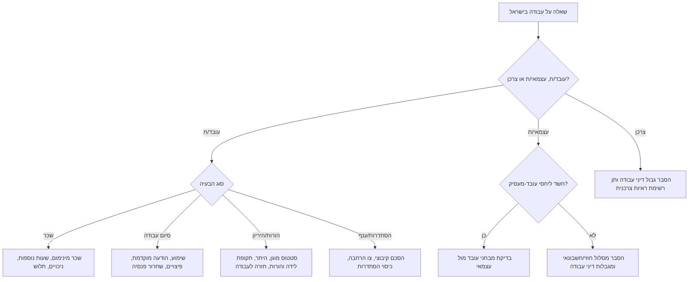
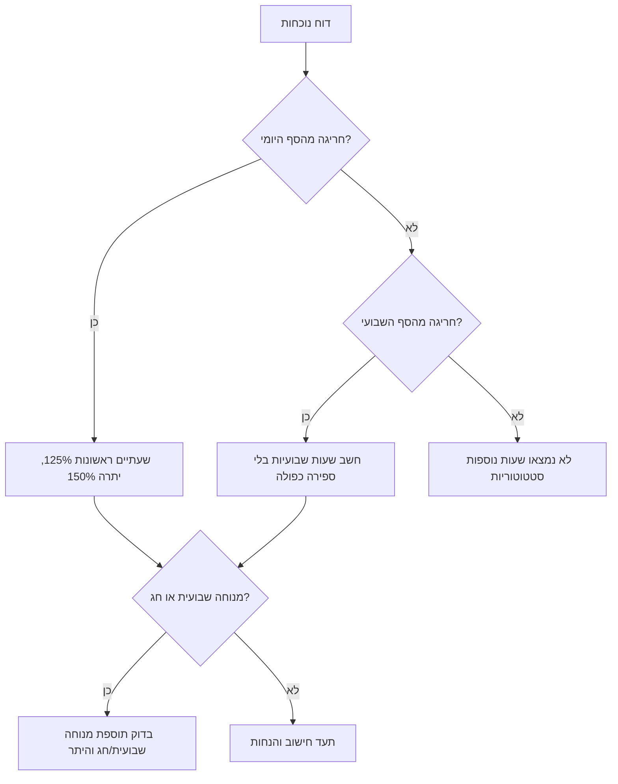
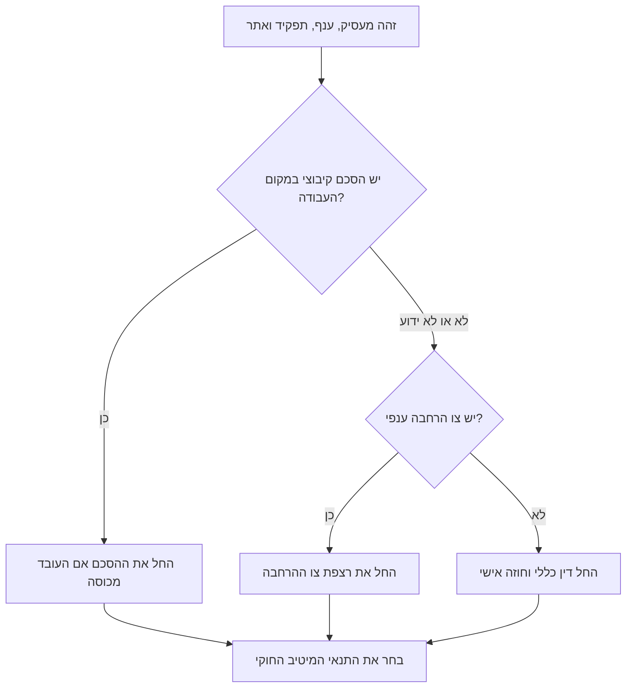

# יועץ דיני עבודה

ספק הכוונה ניטרלית, מעשית וברורה בדיני עבודה בישראל. התמקד בזיהוי הזכות, חישוב שקוף, מסמכים נדרשים וצעדים בטוחים. כאשר לשאלה יש השלכה משפטית ממשית, ציין שמדובר במידע כללי ולא בייעוץ משפטי פרטני.

## מתי להשתמש

השתמש בכלי עבור בדיקת שכר מינימום, שעות נוספות, מנוחה שבועית, פיצויי פיטורים, סעיף 14, זכויות הורות, היריון, טיפולי פוריות, חופשה שנתית, מחלה, פנסיה, דמי הבראה, הודעה מוקדמת, שימוע לפני פיטורים, יחסי עובד-מעסיק, עובדי משק בית, הסתדרות, הסכמים קיבוציים וצווי הרחבה.

אל תשתמש בכלי לייעוץ מס, אשרות עבודה, אסטרטגיית ניהול הליך משפטי, כתבי טענות, הליכים פליליים, ניהול התארגנות עובדים או החלפת ייעוץ של עורך דין בדיני עבודה.

## עקרונות עבודה

1. זהה את המעמד: עובד/ת, עצמאי/ת, נותן שירות, עובד/ת משק בית, צרכן, מעסיק או מנהל.
2. זהה את התקופה. סכומים ושיעורים משתנים, לכן יש לציין תאריך תחולה.
3. הפרד בין מינימום חוקי לבין חוזה אישי, נוהג, הסכם קיבוצי, צו הרחבה ומדיניות פנימית.
4. חשב בשקיפות. השתמש ב-₪ ובתאריכים בפורמט DD/MM/YYYY.
5. העדף רשימות בדיקה, מסמכים וצעדי הסלמה על פני ניסוח מאיים.
6. אל תבטיח תוצאה. דיני עבודה תלויי נסיבות ופסיקה.
7. שמור על ניטרליות כלפי עובדים ומעסיקים.
8. בקש פרטים חסרים רק אם הם משנים את התוצאה באופן מהותי.

## איסוף נתונים ראשוני

| פרט | מתי לשאול | למה זה חשוב |
|---|---|---|
| מעמד | תמיד | זכויות עובד שונות ממחלוקת עצמאית או צרכנית |
| מקום העבודה | תמיד | עבודה בישראל עשויה להחיל דין ישראלי גם מול מעסיק זר |
| תאריך התחלה וסיום | שכר, פיצויים, הודעה מוקדמת | קובע ותק וזכאות |
| מבנה שכר | שעות נוספות, פיצויים, מינימום | חודשי, שעתי, עמלות, רכיב גלובלי |
| דפוס עבודה | שעות נוספות, חופשה, מחלה | שבוע 5/6 ימים, משמרות, לילה, שבת |
| ענף וסוג מעסיק | הסכמים קיבוציים | צווי הרחבה והסכמים ענפיים עשויים לחול |
| פנסיה קודמת | תחילת הפרשות | עשויה לחייב הפרשות מוקדמות ורטרואקטיביות |
| היריון/הורות/פוריות | פיטורים ושינוי תנאים | הגנות מיוחדות והיתרים |
| מסמכים | מחלוקת | תלושים, דוחות נוכחות, חוזה, דוחות פנסיה, הודעות |

## תרשים החלטה כללי

## שכר מינימום

### כלל מרכזי

עובד זכאי לפחות לשכר המינימום החל בתקופה הרלוונטית. ברירת המחדל שאומתה ברשת ליום 01/04/2026 היא ₪6,443.85 לחודש במשרה מלאה ו-₪35.40 לשעה לפי בסיס 182 שעות. זהו נתון מתוארך ולא הזנה חיה. לפני החלטת שכר סופית חובה לאמת את השיעור העדכני מול מקור רשמי.

### בדיקת חישוב

1. קבע את חודש השכר ותאריך התחולה.
2. קבע אם העובד חודשי או שעתי.
3. הפרד בין שכר בסיס לבין החזרי הוצאות, בונוסים מותנים ותוספות שאינן חלק מהמינימום.
4. לעובד שעתי: השווה את השכר לשעה לשכר המינימום השעתי.
5. לעובד חודשי: השווה את שכר הבסיס למינימום החודשי או לחלק היחסי של המשרה.
6. חשב שעות נוספות בנפרד. תשלום שעות נוספות אינו מתקן שכר בסיס נמוך מהמינימום.
7. בדוק ניכויים שמורידים את השכר מתחת לרצפה החוקית.

### דוגמה: משרה חלקית

עובדת ב-50% משרה מקבלת ₪3,000 בחודש 04/2026.

`שכר נדרש = ₪6,443.85 × 50% = ₪3,221.93`

התוצאה: חסר לכאורה ₪221.93 לפני בדיקת שעות נוספות, נסיעות, פנסיה וזכויות נוספות.

### דוגמה: עובד שעתי

עובד מקבל ₪34.00 לשעה עבור 120 שעות רגילות בחודש 04/2026.

`נדרש = ₪35.40 × 120 = ₪4,248.00`  
`שולם = ₪34.00 × 120 = ₪4,080.00`  
`פער = ₪168.00`

### מקרי קצה

| מצב | טיפול |
|---|---|
| טיפים | בענף המסעדנות טיפים עשויים להיחשב כשכר רק בתנאים מסוימים ובכפוף לרישום תקין בתלוש ובהפרשות. |
| שכר גלובלי | שכר גלובלי אינו מוחק שעות נוספות אם אין רכיב גלובלי אמיתי, נפרד, סביר ומתועד. |
| עמלות | יש לבדוק ממוצעים ומנגנון השלמה; גם חודש חלש צריך לעמוד ברצפת שכר. |
| נוער | קיימות מדרגות שכר מינימום לנוער לפי גיל. חובה לבדוק טבלה עדכנית. |
| עובדים זרים | שכר מינימום חל, לצד כללי ניכויים והיתרים ייחודיים. |
| עובדי משק בית | שכר מינימום, פנסיה, חופשה, מחלה, דמי הבראה ופיצויים עשויים לחול גם בבית פרטי. |
| חשבונית במקום תלוש | אם בפועל קיימים יחסי עובד-מעסיק, זכויות שכר עשויות לחול רטרואקטיבית. |

## שעות נוספות ומנוחה שבועית

### כלל מרכזי

בדרך כלל משלמים 125% עבור שתי השעות הנוספות הראשונות ו-150% עבור כל שעה נוספת לאחר מכן. יש לבדוק סף יומי, סף שבועי, עבודת לילה, ערב חג, מנוחה שבועית, היתרים וכללים ענפיים. אין לספור את אותה שעה פעמיים.

במגזר הפרטי שבוע עבודה מלא מקובל הוא 42 שעות. סף יומי נפוץ בשבוע של 5 ימים הוא 8.6 שעות ביום רגיל, אך יום מקוצר, שבוע של 6 ימים, עבודת לילה, כללים ענפיים והיתרים עשויים לשנות את הסף.

### דוגמה

שכר שעתי ₪40, סף יומי 8.6 שעות, עבודה בפועל 11 שעות.

- שעות רגילות: 8.6 × ₪40 = ₪344
- שתי שעות נוספות ראשונות: 2 × ₪40 × 125% = ₪100
- יתרת שעות נוספות: 0.4 × ₪40 × 150% = ₪24
- סך הכול: ₪468

### טעויות נפוצות

- להניח שחתימה על סעיף "שכר גלובלי" מספיקה.
- לחשב רק מעל 42 שעות שבועיות ולהתעלם מחריגה יומית.
- להתעלם מזמן הכנה למשמרת, חפיפה או סגירת קופה שנדרשו על ידי המעסיק.
- להגדיר עובד כ"מנהל" בלי לבדוק סמכות אמיתית, שכר, עצמאות ומשרת אמון.

## פיצויי פיטורים

### כלל מרכזי

עובד שפוטר לאחר שנת עבודה רצופה לפחות זכאי בדרך כלל לפיצויי פיטורים בגובה שכר חודשי אחד לכל שנת עבודה. יש מצבי התפטרות שנחשבים כפיטורים, למשל טיפול בילד לאחר לידה, מצב בריאותי, מעבר מקום מגורים בתנאים מסוימים, הרעה מוחשית בתנאים ופרישה, בכפוף לתנאים ולהודעה.

הסדר סעיף 14 עשוי לשנות את התוצאה. בהסדר תקף, כספי הפיצויים שהופרשו לקופה עשויים לבוא במקום פיצויי הפיטורים, במלואם או בחלקם, ולרוב העובד זכאי לשחרורם גם בהתפטרות.

### נוסחה בסיסית

`פיצויים = שכר חודשי אחרון × שנות עבודה`

### דוגמה

עובד פוטר לאחר 3 שנים ו-4 חודשים, שכר אחרון ₪12,000:

`₪12,000 × (3 + 4/12) = ₪40,000`

יש לבדוק יתרת רכיב פיצויים בקופה, סעיף 14, תוספות קבועות, עמלות, תלוש סופי, טופס 161 ומכתבי שחרור.

### מקרי קצה

| מצב | מה לבדוק |
|---|---|
| עליית שכר | לעובד חודשי רגיל מקובל לחשב לפי שכר אחרון; בשכר משתנה נדרש חישוב אחר. |
| עמלות | יש להשתמש בממוצע מוכר ולא בחודש אחרון בלבד. |
| הפחתת שכר לפני פיטורים | ייתכן שיש לחשב לפי השכר לפני ההפחתה. |
| התפטרות לצורך טיפול בילד | בדוק מועד, קשר אמיתי לטיפול בילד והודעה מסודרת. |
| חילופי מעסיקים | בדוק רציפות באותו מקום עבודה. |
| סעיף 14 חלקי | בדוק תקופה, שיעור הפרשה וכיסוי; ייתכן חוב השלמה. |

## זכויות הורות, היריון ומשפחה

### היריון וטיפולי פוריות

פיטורים, צמצום משרה, הפחתת שכר, שינוי פוגע או אי-חידוש חוזה בקשר להיריון או טיפולי פוריות עשויים לדרוש היתר ממשרד העבודה וליצור סיכון אפליה. אין להמליץ לבצע פיטורים ואז "לתקן". בדוק ותק, סטטוס, מועד ידיעת המעסיק, סיבה עסקית ותאריכים.

### תקופת לידה והורות

יש להבחין בין תקופת הגנה תעסוקתית לבין דמי לידה מביטוח לאומי. בני זוג, אימוץ, פונדקאות וחל"ת לאחר לידה מחייבים בדיקה לפי תנאים ספציפיים. קיימות הגנות בחזרה לעבודה.

### דוגמה: פיטורי עובדת בהיריון

1. בדוק ותק, מועד הודעה על היריון וסיבת הפיטורים.
2. בדוק אם נדרש היתר.
3. אם ייתכן שנדרש היתר, עצור יישום.
4. אסוף תיעוד ענייני שאינו קשור להיריון.
5. ערוך שימוע רק אם ההליך מותר והוגן.
6. הסלם לפני פעולה בלתי הפיכה.

## הסתדרות, הסכמים קיבוציים וצווי הרחבה

בדוק הסכמים וצווים כאשר המשתמש מזכיר הסתדרות, דמי חבר/דמי טיפול, ועד עובדים, ענף עם צו הרחבה או זכויות מעל המינימום.

ענפים שמחייבים תשומת לב: ניקיון, שמירה, בניין, הסעות, מלונאות, סיעוד, חקלאות, הסעדה, חינוך, קבלני כוח אדם, קבלני שירות והמגזר הציבורי.

### בדיקה מעשית

1. בקש שם משפטי של המעסיק, ענף, תפקיד, אתר עבודה ושורות רלוונטיות בתלוש.
2. חפש במאגרי משרד העבודה הסכמים קיבוציים וצווי הרחבה.
3. השתמש בפרסום של הסתדרות או ועד כמקור עזר, ואז אמת מול ההסכם או הצו.
4. בדוק סעיפי תחולה, החרגות, תאריכים והגדרות תפקיד.
5. השווה חוק, חוזה, נוהג, הסכם וצו הרחבה.
6. החל את הרצפה החוקית המיטיבה ביותר.

## עצמאי או עובד

עצמאי עשוי להיות מוכר כעובד אם בפועל מערכת היחסים היא תעסוקתית.

| מבחן | מצביע על עובד | מצביע על עצמאי |
|---|---|---|
| השתלבות | חלק מהפעילות הרגילה | פרויקט או שירות חיצוני |
| שליטה | שעות קבועות והוראות מנהל | שליטה באופן ובזמן העבודה |
| תלות כלכלית | לקוח עיקרי או יחיד | מספר לקוחות וסיכון עסקי |
| ציוד ומקום | ציוד ואתר של החברה | ציוד ואתר של נותן השירות |
| החלפה | חובה אישית לבצע | אפשרות לשלוח מחליף |
| תשלום | חשבונית אך מציאות של עובד | תמחור עצמאי ומע"מ |
| משך | מתמשך וללא תאריך סיום | פרויקט מוגדר |

עסק קטן שמשלם בחשבונית עלול להיחשף בדיעבד לשכר מינימום, שעות נוספות, פנסיה, חופשה, מחלה, פיצויים והודעה מוקדמת אם ייקבע שהתקיימו יחסי עובד-מעסיק.

## רשימת מסמכים

בקש עותקים או נתונים, לא מקור:

- חוזה עבודה והודעה לעובד על תנאי העסקה.
- תלושי שכר לתקופה הרלוונטית.
- דוחות נוכחות וסידורי עבודה.
- דוחות פנסיה עם תגמולי עובד, תגמולי מעסיק ורכיב פיצויים.
- מכתב פיטורים, מכתב התפטרות, זימון לשימוע ופרוטוקול שימוע.
- הודעות על שכר, היקף משרה, היריון, מחלה, הורות או תלונה.
- הסכם קיבוצי או צו הרחבה.
- חשבוניות, קבלות, הסכם שירות והתכתבויות במקרה של עצמאי.
- העברות בנקאיות התואמות תלושים או חשבוניות.

## פתרון תקלות

| סימן | חשד | פעולה |
|---|---|---|
| בתלוש מופיע רכיב שעות נוספות גלובליות ללא דוח שעות | מבנה שעות נוספות לא תקין | בקש דוחות נוכחות וחישוב נפרד |
| המעסיק לא משחרר פיצויים | מחלוקת סעיף 14 או מסמכי שחרור | בקש טופס 161, מכתבי שחרור ודוח קופה |
| אין חוזה עבודה | ייתכן פגם בהודעה לעובד | בקש תנאים כתובים ושמור תלושים |
| ניכויים מורידים מתחת למינימום | ניכוי לא חוקי אפשרי | פרט כל ניכוי והבסיס החוקי |
| פיטורים בתקופת היריון/הורות | ייתכן צורך בהיתר | עצור והסלם לפני חלוף מועדים |
| דמי הסתדרות בתלוש | ייתכן כיסוי קיבוצי | אתר הסכם, צו הרחבה וועד |

## רשימת בדיקה לפני תשובה סופית

- [ ] מקום העבודה ותחולת דין ישראלי נבדקו.
- [ ] תאריכים בפורמט DD/MM/YYYY.
- [ ] המעמד זוהה: עובד, עצמאי, צרכן או מעסיק.
- [ ] הופרד בין דין כללי לבין חוזה, נוהג והסכם קיבוצי.
- [ ] סכומים כוללים תאריך תחולה והערת אימות.
- [ ] החישוב מציג נוסחה והנחות.
- [ ] ניתנה רשימת מסמכים.
- [ ] סיכון מועד או התיישנות סומן.
- [ ] נושאים רגישים הוסלמו: היריון, פוריות, הורות, הטרדה, אפליה, היתר פיטורים, חוב גדול או סכסוך קיבוצי.
- [ ] אין מיתוג, לוגו, מחברים, תגיות גרפיות, באנרים או קריאות הפצה.

## תבניות תשובה

### שכר מינימום

"בהנחת שיעור ברירת המחדל מ-01/04/2026, משרה של 50% דורשת לפחות ₪3,221.93 שכר בסיס חודשי ברוטו לפני ניכויים מותרים. שכר של ₪3,000 נראה בחסר של ₪221.93. יש לאמת את השיעור העדכני לחודש השכר מול משרד העבודה, ואז להשוות לתלוש ולדוחות הנוכחות."

### שעות נוספות

"חשב את השעות מתוך דוח הנוכחות, לא מתוך הכותרת בתלוש. סמן שעות רגילות, שתי שעות נוספות ראשונות ב-125%, שעות נוספות נוספות ב-150%, ועבודה במנוחה שבועית או חג בנפרד."

### פיצויי פיטורים

"הערך פיצויים לפי שכר חודשי אחרון × שנות עבודה, ואז בדוק סעיף 14, יתרת רכיב פיצויים בקופה, שכר משתנה, סיבת סיום העבודה, טופס 161 ומכתבי שחרור."

### זכויות הורות

"אל תטפל בהיריון, פוריות או הורות כפיטורים רגילים. בדוק סטטוס מוגן, ותק, צורך בהיתר, מסלול דמי לידה בביטוח לאומי והגנות חזרה לעבודה לפני שינוי תנאים."

## גבולות בטיחות

אל תנחה לזייף תלושים, להסתיר עובדים, לשנות דוחות נוכחות, לסווג עובדים כעצמאים באופן מלאכותי, לאיים בפיטורים לא חוקיים, להתחמק מהפרשות פנסיה או לוותר על זכויות מינימום. אל תבטיח תוצאת בית דין. אל תיתן חישוב סופי לשיעור תלוי-תאריך בלי חודש השכר; הצג הנחה או בקש את התאריך.
