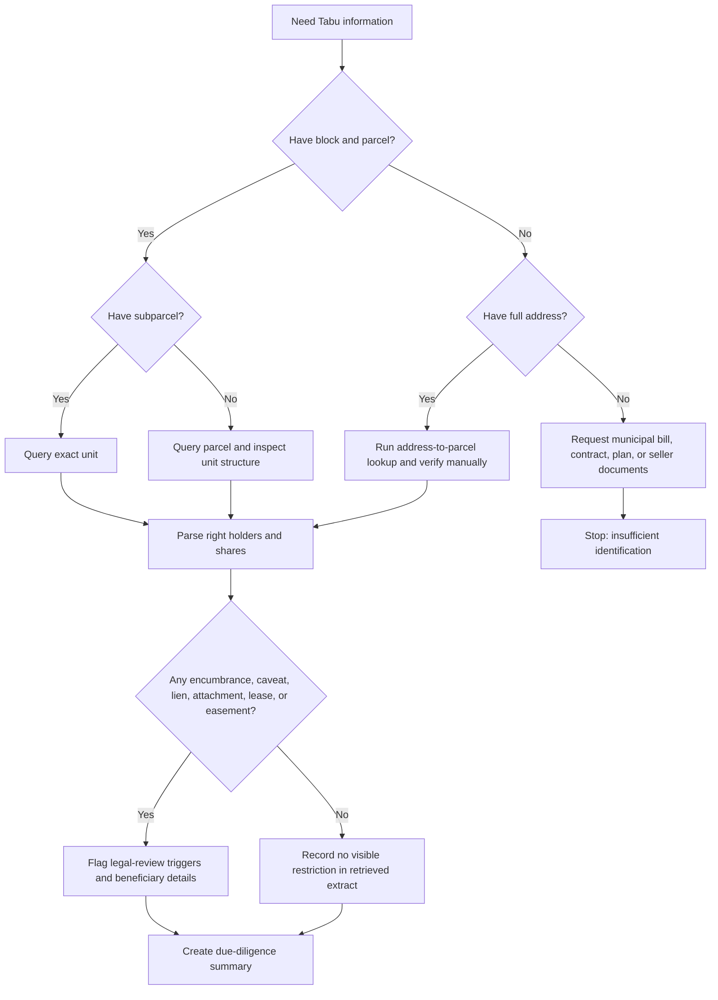
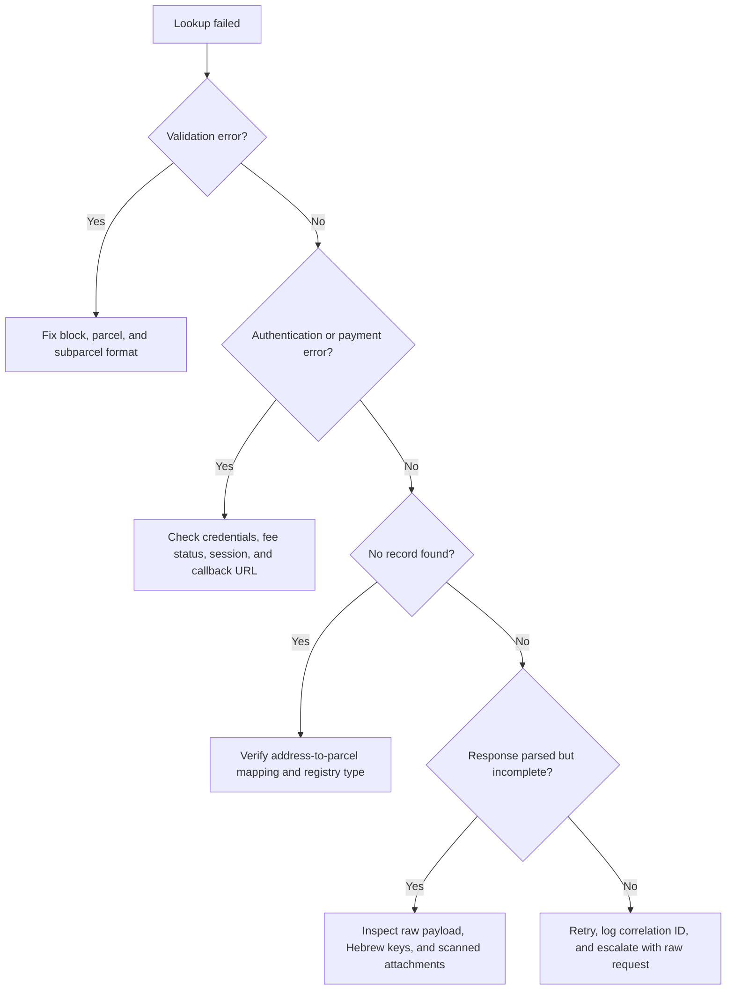

# Land Registry Data Fetcher (Tabu)

Use this skill to retrieve, normalize, explain, and quality-check Israeli Tabu land registry information about a property. Focus on ownership, encumbrances, mortgages, caveats, liens, attachments, leases, easements, warnings, and other rights that can affect a business or consumer decision.

This skill supports Israeli small businesses, freelancers, and consumers who need a structured view before signing, paying, pledging collateral, buying a property, leasing premises, or sending a case to professional review.

## Core outcomes

Produce a clear property-status pack:

1. Identify the property by block, parcel, and subparcel.
2. Retrieve or request the official registry extract through the configured service.
3. Parse right holders, shares, encumbrances, caveats, liens, leases, and easements.
4. Flag contradictions, missing identifiers, outdated records, and legal-review triggers.
5. Summarize practical consequences in neutral language.
6. Preserve raw evidence and timestamps for audit.

## When to use this skill

Use it when the user asks to:

- Check who owns an apartment, shop, office, storage unit, land plot, or industrial unit.
- Verify whether a seller, landlord, borrower, or guarantor appears in the registry.
- Check for a mortgage, lien, caveat, attachment, easement, long lease, or other encumbrance.
- Prepare a due-diligence checklist before purchase, rental, financing, or business registration.
- Convert a Tabu extract into a concise business-readable summary.
- Build a structured client or CLI around a configured Israeli land-registry gateway.

Do not use it as a substitute for a lawyer, licensed real-estate professional, surveyor, or official registry certificate. Use it to organize facts and highlight issues for review.

## Required inputs

Prefer the most precise identifier available.

| Priority | Identifier | Hebrew | Notes |
|---:|---|---|---|
| 1 | Block + parcel + subparcel | גוש + חלקה + תת-חלקה | Best for condominium units and specific assets |
| 2 | Block + parcel | גוש + חלקה | Suitable for land or where no subparcel exists |
| 3 | Full address | כתובת מלאה | Use only when parcel data is missing; geocoding can be ambiguous |
| 4 | Deed or reference number | מספר שטר / אסמכתה | Useful for reconciling a specific transaction |
| 5 | Right-holder name | שם בעל זכות | Use only as supporting data; names can be duplicated |

Collect these fields when possible:

- City/locality, street, house number, entrance, apartment/unit number.
- Block, parcel, subparcel.
- Intended action: purchase, lease, collateral, guarantee, inheritance, business premises, litigation check.
- Extract date.
- Seller/landlord/borrower/guarantor name and masked ID.
- Known mortgage bank, lien holder, caveat beneficiary, or attorney reference.

## Decision tree



## Standard workflow

### 1. Normalize the property identifier

Accept user input such as:

```text
גוש 30001 חלקה 12 תת חלקה 4
Block: 30001, Parcel: 12, Subparcel: 4
30001/12/4
```

Normalize to:

```json
{
  "block": 30001,
  "parcel": 12,
  "subparcel": 4
}
```

Reject:

- Zero or negative values.
- Non-numeric parcel identifiers.
- Address-only lookups presented as definitive without verification.
- Unclear subparcel references such as "unit 4" where it may mean apartment number, not subparcel.

### 2. Retrieve the record

Use a configured official portal workflow or internal adapter. Do not treat the example adapter paths as official public API paths. The included client accepts a `base_url` and does not hard-code a single production endpoint because authentication, payment, availability, and portal routing can change.

Example with a local fixture:

```bash
land-registry-tabu --mock-file scripts/fixtures/sample_parcel_response.json parcel --block 30001 --parcel 12 --subparcel 4
```

Example with a configured gateway:

```bash
TABU_API_KEY="replace-with-token" land-registry-tabu --env sandbox parcel --block 30001 --parcel 12 --subparcel 4
```

### 3. Use order workflows when required

Some adapters require an order, payment reference, or asynchronous processing. Create the order, extract the order ID, then read status:

```bash
CREATE_RESPONSE="$(land-registry-tabu --mock-file scripts/fixtures/sample_parcel_response.json --order-mock-file scripts/fixtures/sample_order_response.json create-order --block 30001 --parcel 12 --subparcel 4)"
ORDER_ID="$(python -c 'import json,sys; print(json.load(sys.stdin)["order_id"])' <<< "$CREATE_RESPONSE")"
land-registry-tabu --mock-file scripts/fixtures/sample_parcel_response.json --order-mock-file scripts/fixtures/sample_order_response.json order-status --order-id "$ORDER_ID"
```

### 4. Parse rights and warnings

A business-readable summary should include:

- Property identifier and address.
- Retrieval date and time.
- Right-holder names.
- Masked identifying numbers only, unless a lawful reason requires otherwise.
- Right type: ownership, lease, long lease, easement, mortgage, caveat, lien, attachment, trustee, administrator, or other right.
- Share: for example `1/1`, `1/2`, `25%`.
- Encumbrance beneficiary and amount, if present.
- Registration dates and deed numbers, when present.
- Warnings and contradictions.

## Practical interpretation table

| Finding | Practical meaning |
|---|---|
| Seller is not listed as owner | Do not rely on the seller's authority without professional review |
| Mortgage exists | Require payoff letter, bank consent, or escrow instructions |
| Caveat exists | Identify beneficiary and legal basis before signing |
| Attachment or lien exists | Treat as high-risk until released or clarified |
| Easement exists | Check use restrictions, access, utilities, and business impact |
| Long lease exists | Confirm lease period, renewals, and transfer rights |
| Share mismatch exists | Verify co-owner consent and transaction scope |
| Extract is old | Retrieve a fresh extract close to signing or payment |

## Edge cases

### Apartment number differs from subparcel

Apartment number in an address is not always the Tabu subparcel number. Confirm with the condominium order, seller documents, previous extract, or official lookup. Flag any mismatch.

### Building is not registered as a condominium

The parcel may contain several units without subparcel records. Request additional documents: sharing agreement, construction permits, sale agreement, lease schedule, and planning records.

### Rights appear under a company

Check company name, registration number, liquidation/receivership status, signatory authority, charges, and board approvals. For small businesses leasing premises, confirm that the landlord has authority to lease the exact unit.

### Inherited property

The registry may show a deceased owner, heirs, estate administrator, or pending registration. Request probate/inheritance orders and attorney confirmation.

### Bank mortgage listed after payoff

Mortgage release can lag behind payoff. Request a signed release or updated registry extract before closing.

### Multiple registries

Some rights may be handled outside ordinary Tabu records, including Israel Land Authority arrangements, housing company records, cooperative societies, or pending registration projects. Flag when the official extract does not fully answer the ownership question.

## Troubleshooting decision tree



## Anti-patterns

Avoid these mistakes:

- Treating an address lookup as conclusive without block/parcel confirmation.
- Equating apartment number with subparcel number.
- Ignoring a mortgage because the seller says it will be removed.
- Treating a caveat as either harmless or fatal without reading its beneficiary and basis.
- Relying on an old extract near signing.
- Copying full ID numbers into unnecessary reports.
- Mixing planning/zoning status with ownership status.
- Assuming a property is transferable because it is occupied by the seller.
- Hiding unknowns in a confident summary.
- Running production checks without retaining raw payloads and timestamps.

## Production checklist

Before production use:

- Configure an approved gateway base URL.
- Verify the current Israeli government payment and authentication process.
- Use HTTPS and certificate validation.
- Store API keys in environment variables or a secrets manager.
- Log request ID, timestamp, endpoint, and normalized property identifier.
- Avoid logging full ID numbers, payment tokens, or sensitive personal data.
- Encrypt stored extracts and restrict access.
- Add retention limits for personal data.
- Validate input before sending requests.
- Preserve raw response payloads for audit.
- Unit-test Hebrew and English field names.
- Test address ambiguity and no-record scenarios.
- Implement retry with backoff for transient failures.
- Do not retry payment requests blindly.
- Use idempotency keys where supported.
- Display legal-review triggers prominently.
- Include "verify against fresh official extract" in final reports.
- Provide a manual override workflow for scanned or non-standard records.
- Review privacy obligations before sharing reports with third parties.
- Keep endpoint mappings and fee tables configurable.

## Python usage

```python
from land_registry_tabu import FileJsonTransport, LandRegistryTabuClient, ParcelId, TabuClientConfig

client = LandRegistryTabuClient(
    TabuClientConfig(base_url="https://sandbox.example.internal.gov-adapter.local"),
    transport=FileJsonTransport("scripts/fixtures/sample_parcel_response.json"),
)
extract = client.get_by_parcel(ParcelId(30001, 12, 4))
print(extract.to_json())
```

## Final response guidance

When reporting findings to a user:

- State what was retrieved and from which identifier.
- Separate facts from risk interpretation.
- State uncertainty plainly.
- Recommend professional review for legal consequences.
- Do not guarantee ownership, transferability, or debt status from a parsed extract alone.
