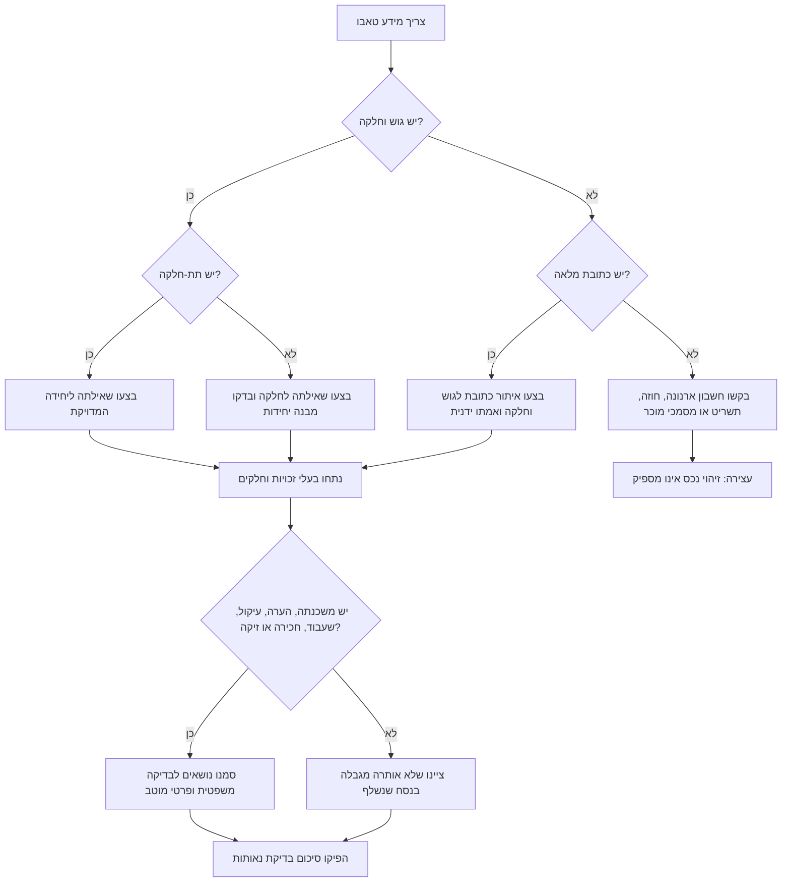
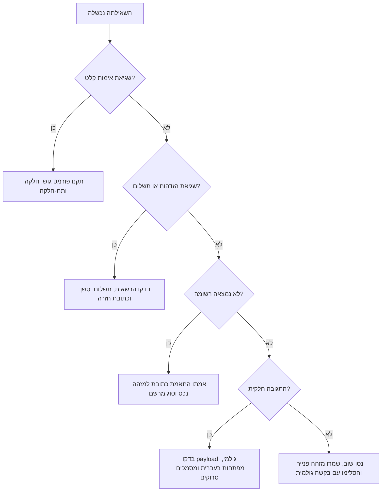

# מאתר נתוני טאבו

השתמשו במיומנות זו לאיתור, נרמול, הסבר ובדיקת איכות של מידע מטאבו בישראל: בעלות, משכנתאות, שעבודים, הערות אזהרה, עיקולים, חכירות, זיקות הנאה וזכויות אחרות שעשויות להשפיע על החלטה עסקית או צרכנית.

המיומנות מתאימה לעסקים קטנים, עצמאים, נותני שירותים וצרכנים בישראל שצריכים תמונת מצב מסודרת לפני חתימה, תשלום, שכירות, רכישה, קבלת נכס כבטוחה או העברת תיק לבדיקה מקצועית.

## תוצרים עיקריים

הפיקו תיק מצב נכס ברור:

1. זהו את הנכס לפי גוש, חלקה ותת-חלקה.
2. שלפו או הזמינו נסח דרך השירות המוגדר.
3. נתחו בעלי זכויות, חלקים, משכנתאות, שעבודים, הערות, עיקולים, חכירות וזיקות הנאה.
4. סמנו סתירות, מזהים חסרים, נסח ישן ונושאים שמחייבים בדיקה משפטית.
5. סכמו השלכות מעשיות בשפה ניטרלית.
6. שמרו נתונים גולמיים, תאריך ושעת שליפה לצורכי בקרה.

## מתי להשתמש

השתמשו כאשר המשתמש מבקש:

- לבדוק מי רשום כבעלים של דירה, חנות, משרד, מחסן, מגרש או יחידה תעשייתית.
- לוודא שמוכר, משכיר, לווה או ערב מופיע כבעל זכות.
- לבדוק אם רשומים משכנתה, שעבוד, הערת אזהרה, עיקול, זיקת הנאה או חכירה.
- להכין רשימת בדיקת נאותות לפני רכישה, שכירות, מימון או שימוש בנכס לעסק.
- להפוך נסח טאבו לסיכום תמציתי וברור לבעל עסק, רואה חשבון, עורך דין או צרכן.
- לבנות לקוח תוכנה או כלי שורת פקודה סביב שער נתונים מוגדר.

אין להשתמש במיומנות כתחליף לעורך דין, שמאי, מודד, יועץ מס, רואה חשבון או נסח רשמי ועדכני. השתמשו בה לארגון עובדות ולהצפת נושאים לבדיקה.

## קלט נדרש

העדיפו את הזיהוי המדויק ביותר שקיים.

| עדיפות | מזהה | הערות |
|---:|---|---|
| 1 | גוש + חלקה + תת-חלקה | מתאים לדירות וליחידות ספציפיות בבית משותף |
| 2 | גוש + חלקה | מתאים למגרש, קרקע או נכס ללא תת-חלקה |
| 3 | כתובת מלאה | השתמשו רק כשאין גוש וחלקה; התאמה לפי כתובת עלולה להיות עמומה |
| 4 | מספר שטר או אסמכתה | שימושי להתאמה לעסקה מסוימת |
| 5 | שם בעל זכות | מתאים רק כמידע תומך; שמות עשויים לחזור על עצמם |

אספו ככל האפשר:

- יישוב, רחוב, מספר בית, כניסה, מספר דירה או יחידה.
- גוש, חלקה ותת-חלקה.
- מטרת הבדיקה: רכישה, שכירות, בטוחה, ערבות, ירושה, נכס לעסק או בדיקת סיכון.
- תאריך הנסח בפורמט DD/MM/YYYY, לדוגמה 04/06/2026.
- שם מוכר, משכיר, לווה או ערב ומספר מזהה מוסתר.
- בנק משכנתאות, בעל שעבוד, מוטב הערת אזהרה או מספר שטר ידוע.
- סכומים ב-₪, לדוגמה ₪1,200,000.

## עץ החלטה



## תהליך עבודה סטנדרטי

### 1. נרמול מזהה הנכס

קבלו קלט כגון:

```text
גוש 30001 חלקה 12 תת חלקה 4
Block: 30001, Parcel: 12, Subparcel: 4
30001/12/4
```

נרמלו ל-JSON:

```json
{
  "block": 30001,
  "parcel": 12,
  "subparcel": 4
}
```

דחו:

- ערכים אפסיים או שליליים.
- מזהים שאינם מספריים.
- בדיקת כתובת בלבד שמוצגת כוודאית.
- ניסוח כמו "דירה 4" כאשר לא ברור אם מדובר בתת-חלקה או במספר דירה.

### 2. שליפת הרשומה

השתמשו בתהליך פורטל רשמי או במתאם פנימי שמוגדר מראש. אין להציג את נתיבי הדוגמה כנתיבי ממשק רשמיים. הלקוח המצורף מקבל `base_url` ואינו מקבע נקודת קצה אחת, מפני שהזדהות, תשלום, זמינות וניתוב עשויים להשתנות.

דוגמה עם קובץ בדיקה מקומי:

```bash
land-registry-tabu --mock-file scripts/fixtures/sample_parcel_response.json parcel --block 30001 --parcel 12 --subparcel 4
```

דוגמה עם שער מוגדר:

```bash
TABU_API_KEY="replace-with-token" land-registry-tabu --env sandbox parcel --block 30001 --parcel 12 --subparcel 4
```

### 3. שימוש בתהליך הזמנה כאשר נדרש

חלק מהשערים דורשים הזמנה, אסמכתת תשלום או עיבוד שאינו מיידי. צרו הזמנה, חלצו את מזהה ההזמנה, ולאחר מכן קראו את המצב:

```bash
CREATE_RESPONSE="$(land-registry-tabu --mock-file scripts/fixtures/sample_parcel_response.json --order-mock-file scripts/fixtures/sample_order_response.json create-order --block 30001 --parcel 12 --subparcel 4)"
ORDER_ID="$(python -c 'import json,sys; print(json.load(sys.stdin)["order_id"])' <<< "$CREATE_RESPONSE")"
land-registry-tabu --mock-file scripts/fixtures/sample_parcel_response.json --order-mock-file scripts/fixtures/sample_order_response.json order-status --order-id "$ORDER_ID"
```

### 4. ניתוח זכויות וסימני אזהרה

סיכום שימושי צריך לכלול:

- מזהה נכס וכתובת.
- תאריך ושעת שליפה.
- שמות בעלי הזכויות.
- מספרים מזהים מוסתרים בלבד, אלא אם קיימת הצדקה חוקית אחרת.
- סוג זכות: בעלות, חכירה, חכירה לדורות, זיקת הנאה, משכנתה, הערת אזהרה, שעבוד, עיקול, נאמנות, מנהל עיזבון או זכות אחרת.
- חלק יחסי: לדוגמה `1/1`, `1/2`, `25%`.
- מוטב שעבוד וסכום ב-₪, אם מופיע.
- תאריכי רישום ומספרי שטר, אם מופיעים.
- סתירות ואזהרות.

## טבלת פרשנות מעשית

| ממצא | משמעות מעשית |
|---|---|
| המוכר אינו רשום כבעלים | אין להסתמך על סמכותו ללא בדיקה מקצועית |
| רשומה משכנתה | דרשו מכתב כוונות, הסכמת בנק או הוראות נאמנות |
| רשומה הערת אזהרה | זהו את המוטב ואת הבסיס המשפטי לפני חתימה |
| רשום עיקול או שעבוד | התייחסו כסיכון גבוה עד להסרה או הבהרה |
| רשומה זיקת הנאה | בדקו מגבלות שימוש, מעבר, תשתיות והשפעה על פעילות עסקית |
| רשומה חכירה לדורות | בדקו תקופה, חידוש, העברה ודמי חכירה |
| החלק הרשום אינו תואם לעסקה | נדרשת הסכמת שותפים או תיקון מסמכים |
| הנסח ישן | הפיקו נסח עדכני סמוך לחתימה או לתשלום |

## מקרי קצה נפוצים

### מספר דירה אינו בהכרח תת-חלקה

מספר דירה בכתובת אינו תמיד מספר תת-חלקה בטאבו. אמתו מול צו בית משותף, תשריט, נסח קודם או מסמכי מוכר. סמנו כל אי התאמה.

### הבניין אינו רשום כבית משותף

ייתכן שהחלקה כוללת כמה יחידות ללא תתי-חלקות. בקשו הסכם שיתוף, היתר בנייה, חוזה מכר, לוח שטחים ומידע תכנוני.

### הזכויות רשומות על שם חברה

בדקו שם חברה, מספר ח.פ., פירוק או כינוס, מורשי חתימה, שעבודים והחלטות דירקטוריון. בעסק קטן ששוכר חנות או משרד, ודאו שלמשכיר יש סמכות להשכיר את היחידה המדויקת.

### נכס מירושה

ייתכן שהנסח מציג בעלים שנפטר, יורשים, מנהל עיזבון או רישום בתהליך. בקשו צו ירושה או צו קיום צוואה ואישור עורך דין.

### משכנתה קיימת למרות שההלוואה נפרעה

מחיקת משכנתה עשויה להתעכב. דרשו אישור מחיקה חתום או נסח עדכני לפני סגירה.

### הערת אזהרה לטובת קונה או מלווה

הערת אזהרה אינה בהכרח שלילית. בדקו מוטב, תאריך, סכום ומסמך רישום. הבחינו בין הערה מגינה לבין תביעה חוסמת.

### ריבוי מרשמים

חלק מהזכויות עשויות להתנהל מחוץ לנסח טאבו רגיל: רשות מקרקעי ישראל, חברה משכנת, אגודה שיתופית או פרויקט שטרם נרשם. סמנו כאשר הנסח לבדו אינו עונה על שאלת הבעלות.

## תבנית סיכום

```markdown
## סיכום טאבו

נכס: גוש 30001 חלקה 12 תת-חלקה 4
כתובת: רחוב הדוגמה 10, תל אביב-יפו
תאריך נסח: 04/06/2026

### בעלי זכויות
- דנה כהן - בעלות - 1/2 - ת"ז *****678
- עמית לוי - בעלות - 1/2 - ת"ז *****321

### שעבודים ואזהרות
- משכנתה: בנק לדוגמה בע"מ, ₪1,200,000, נרשמה ב-15/02/2022
- הערת אזהרה: עו"ד לדוגמה, נרשמה ב-20/03/2024

### דגלי סיכון
- משכנתה מחייבת הסרה או הסכמת בנק לפני העברה.
- יש לזהות את מוטב הערת האזהרה לפני חתימה.
- יש לוודא שמספר הדירה תואם לתת-חלקה.

### פעולות המשך
1. הפיקו נסח עדכני לפני תשלום.
2. העבירו את הנסח הגולמי לעורך דין לבדיקה משפטית.
3. קבלו מכתב כוונות מהבנק או הוראות נאמנות.
```

## עץ פתרון תקלות



## אנטי-דפוסים

הימנעו מטעויות אלה:

- הסתמכות על כתובת בלבד ללא אימות גוש וחלקה.
- הנחה שמספר דירה זהה לתת-חלקה.
- התעלמות ממשכנתה מפני שהמוכר טוען שהיא תוסר.
- התייחסות להערת אזהרה כחסרת משמעות או כחסימה מוחלטת בלי לבדוק מוטב ובסיס.
- הסתמכות על נסח ישן סמוך לחתימה.
- העתקת מספרי תעודת זהות מלאים לדוחות שאינם דורשים זאת.
- ערבוב בין מצב תכנוני לבין מצב זכויות.
- הנחה שנכס ניתן להעברה רק מפני שהמוכר מחזיק בו בפועל.
- הצגת ודאות כאשר קיימים פערים.
- הפעלת תהליך ייצור ללא שמירת נתונים גולמיים ותאריך שליפה.

## רשימת בדיקה לייצור

לפני שימוש ייצור:

- הגדירו כתובת בסיס לשער רשמי או מאושר.
- אמתו תהליך תשלום והזדהות עדכני מול ערוצים רשמיים.
- השתמשו ב-HTTPS ובאימות תעודות.
- שמרו מפתחות גישה במשתני סביבה או בכספת סודות.
- תעדו מזהה בקשה, תאריך, שעה, נקודת קצה ומזהה נכס מנורמל.
- אל תתעדו מספרי תעודת זהות מלאים, אסימוני תשלום או מידע אישי עודף.
- הצפינו נסחים שמורים והגבילו הרשאות.
- הגדירו מדיניות שמירת מידע.
- אמתו קלט לפני שליחת בקשה.
- שמרו תגובות גולמיות לצורכי ביקורת.
- בדקו מפתחות בעברית ובאנגלית.
- בדקו תרחישי כתובת עמומה ואי מציאת רשומה.
- הפעילו ניסיון חוזר עם השהיה מדורגת לתקלות זמניות.
- אל תנסו שוב תשלומים באופן עיוור.
- השתמשו במפתח אי כפילות כאשר השירות תומך בכך.
- הציגו דגלים לבדיקה משפטית באופן בולט.
- כללו המלצה לוודא נסח רשמי ועדכני.
- הכינו מסלול טיפול ידני לרשומות סרוקות או חריגות.
- בדקו חובות פרטיות לפני שיתוף דוחות עם צדדים שלישיים.
- השאירו נקודות קצה ותעריפים כפרמטרים ניתנים לעדכון.
