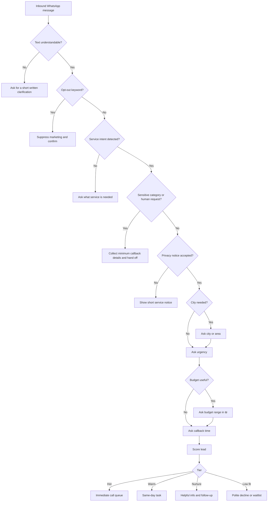

# Lead Qualification Bot

Build and operate a WhatsApp-first lead qualification bot for Israeli small businesses, freelancers, clinics, and consumer-facing service providers. The bot collects key details in Hebrew, scores fit and urgency, records consent, and routes qualified leads to the right human or workflow.

Use this guide for local prototypes, CRM automations, no-code flows, support queues, and production WhatsApp Business Platform implementations.

## Outcomes

- Qualify inbound WhatsApp messages in Hebrew.
- Collect only the details needed for follow-up.
- Normalize Israeli phones, ₪ budgets, cities, DD/MM/YYYY dates, and local business hours.
- Separate service follow-up from promotional consent.
- Escalate sensitive legal, tax, medical, safety, refund, and complaint cases.
- Produce structured records for CRM, CSV, webhook, or human handoff.

## Business fit

| Business | Common message | Critical fields |
|---|---|---|
| Tradesperson | "כמה עולה לתקן נזילה?" | city, issue, urgency, photo, callback time |
| Accountant/bookkeeper | "פתחתי עוסק פטור" | entity type, activity date, documents volume, professional handoff |
| Lawyer | "צריך עו״ד לחוזה" | area, deadline, city, conflict check, callback consent |
| Clinic | "אפשר תור?" | service, branch, urgency, preferred time, safe disclaimer |
| Freelancer | "צריך אתר" | scope, deadline, budget, examples, decision maker |
| Course provider | "אפשר פרטים?" | topic, level, start timing, opt-in for updates |
| Retail/service | "יש משלוחים?" | product, quantity, city, date, payment expectation |

## Operating principles

1. Acknowledge the need before asking for data.
2. Ask one question per WhatsApp message.
3. Keep most Hebrew messages under 350 characters.
4. Prefer plain professional Hebrew over formal legalese.
5. Make budget optional unless it is essential to the service.
6. Never present the bot as a human.
7. Never diagnose, give binding legal/tax/medical advice, or guarantee outcomes.
8. Route hot and sensitive cases quickly.
9. Store consent, notice version, timestamp, channel, and purpose.
10. Delete or archive stale leads according to a documented retention rule.

## Recommended lead schema

```json
{
  "lead_id": "L-2026-000123",
  "received_at": "2026-06-03T10:15:00+03:00",
  "channel": "whatsapp",
  "language": "he",
  "customer": {
    "full_name": "דנה כהן",
    "phone_e164": "+972501234567",
    "city": "תל אביב",
    "email": "dana@example.co.il"
  },
  "intent": "price_quote",
  "service_category": "plumbing",
  "description": "נזילה מתחת לכיור",
  "urgency": "same_day",
  "budget_ils": {"min": 350, "max": 600},
  "preferred_contact_time": "03/06/2026 16:00-18:00",
  "consent": {
    "privacy_notice_shown": true,
    "service_followup": true,
    "marketing": false,
    "consent_timestamp": "2026-06-03T10:17:00+03:00"
  },
  "qualification": {
    "score": 88,
    "tier": "hot",
    "reasons": ["service_detected", "same_day_urgency", "city_detected", "budget_detected"]
  },
  "routing": {"owner": "hot_leads", "sla_minutes": 15, "next_action": "call_customer"}
}
```

## Conversation pattern

### Opening

```text
שלום, הגעת ל[שם העסק]. כדי לעזור במהירות, אפשר לכתוב בכמה מילים מה צריך?
```

When intent is already clear:

```text
הבנתי, מדובר ב[סיכום קצר]. כדי לבדוק התאמה ולחזור עם תשובה מדויקת, אשאל 3 שאלות קצרות.
```

### Core questions

```text
באיזו עיר או אזור השירות נדרש?
```

```text
זה דחוף להיום, לשבוע הקרוב, או שאין לחץ?
```

```text
מה טווח התקציב המשוער ב-₪, אם כבר יש כזה?
```

```text
מה השעה הנוחה ביותר לשיחת חזרה?
```

### Service consent

```text
כדי לטפל בפנייה, הפרטים יישמרו לצורך חזרה אליך ומתן שירות. אפשר להמשיך?
```

### Marketing consent

```text
רוצה לקבל גם עדכונים והטבות בוואטסאפ? אפשר להסיר בכל רגע.
```

### Summary

```text
מעולה, מסכם:
שם: דנה
עיר: תל אביב
צורך: תיקון נזילה
דחיפות: היום
תקציב: כ-500 ₪

נציג יחזור אליך בהקדם.
```

## Scoring model

| Signal | Points |
|---|---:|
| Service matches offering | 20 |
| City/service area detected | 15 |
| Urgency detected and operationally feasible | 15 |
| Budget detected or not required | 15 |
| Phone available | 10 |
| Clear description | 10 |
| Decision maker identified | 10 |
| Service consent captured | 5 |

| Score | Tier | Action |
|---:|---|---|
| 80-100 | Hot | Human call within 15 minutes during business hours |
| 60-79 | Warm | Same-day callback or booking link |
| 40-59 | Nurture | Send helpful info and ask one follow-up |
| 20-39 | Low fit | Polite decline, waitlist, or referral |
| 0-19 | Spam/invalid | Stop automation and suppress marketing |
| Any sensitive request | Human | Immediate handoff |
| Refund/complaint | Support | Route to support, not sales |

## Decision tree



## Human handoff triggers

Escalate when the user mentions: severe pain, medical treatment, minors, pregnancy, self-harm, legal dispute, firing, debt, tax liability, emergency electrical/fire risk, refund, cancellation, complaint, anger, vulnerability, or explicit requests such as "נציג", "אדם", "תתקשרו", "לא בוט".

Use:

```text
כדי לטפל בזה נכון, אעביר את הפנייה לנציג. אפשר להשאיר שם ושעה נוחה לחזרה?
```

## WhatsApp edge cases

| Situation | Response |
|---|---|
| "כמה עולה?" only | "בשמחה. המחיר תלוי בסוג השירות ובמיקום. מה בדיוק צריך ובאיזו עיר?" |
| Voice note only | "קיבלתי את ההודעה הקולית. כדי לא לפספס, אפשר לכתוב עיר ודחיפות במילה או שתיים?" |
| Photo only | "התמונה התקבלה. מה רואים בתמונה ומה תרצה לבדוק?" |
| Refuses budget | "אין בעיה. אפשר להתקדם גם בלי תקציב." |
| Outside service area | "כרגע השירות לא זמין באזור הזה. אפשר להשאיר פרטים לרשימת המתנה." |
| After hours | "הפנייה התקבלה. שעות המענה הן א׳-ה׳ 09:00-18:00." |
| Opt-out | "הבקשה התקבלה. לא יישלחו אליך הודעות שיווקיות נוספות." |

## Israeli localization

| Item | Format |
|---|---|
| Currency | ₪1,200 or 1,200 ₪; keep one style |
| Date | DD/MM/YYYY |
| Time | 24-hour clock, Israel time |
| Phone display | 050-123-4567 |
| Phone storage | +972501234567 |
| Work week | Sunday-Thursday as default |
| VAT | מע״מ |
| Invoice | חשבונית מס, קבלה, or חשבונית מס/קבלה |
| Entity | עוסק פטור, עוסק מורשה, חברה בע״מ, עמותה |

## Israeli compliance references

Review current requirements before production. Common sources include Protection of Privacy Law, Protection of Privacy Regulations (Data Security), Communications Law section 30A for promotional messages, Consumer Protection Law, Equal Rights for Persons with Disabilities digital accessibility expectations, Israel Tax Authority guidance, payment provider requirements, and WhatsApp Business Platform policies.

## Troubleshooting quick table

| Symptom | Likely cause | Fix |
|---|---|---|
| Same question repeats | Session state not saved | Persist state after every inbound message |
| Hebrew is unreadable | CSV encoding issue | Export UTF-8 or UTF-8 with BOM |
| Hot leads missed | Score threshold too strict | Tune with real converted leads |
| Too many poor leads | Missing service-area rule | Require service and location for hot tier |
| Opt-out ignored | Keyword normalization missing | Normalize Hebrew and English opt-out words |
| Duplicate CRM records | No idempotency | Use WhatsApp message ID and normalized phone |
| Users abandon | Too many fields | Ask three critical questions before handoff |

## Anti-patterns

Avoid collecting ID numbers without a clear legal need, bundling marketing consent with service consent, sending promotions after opt-out, diagnosing from photos, promising tax refunds, giving legal advice, making every lead hot, hiding the human handoff path, keeping sensitive attachments forever, or asking more than two clarification questions in a row.

## Production checklist

- [ ] Services, service area, hours, owners, SLA, and disqualifiers are defined.
- [ ] Hebrew copy is approved for each flow state.
- [ ] Privacy notice and marketing opt-in are separate.
- [ ] Opt-out keywords are tested in Hebrew and English.
- [ ] Phone normalization and duplicate detection are tested.
- [ ] CRM or CSV mapping includes consent fields.
- [ ] Sensitive handoff is tested.
- [ ] After-hours and emergency copy is tested.
- [ ] Access permissions and retention rules are documented.
- [ ] At least 20 test scenarios pass.
- [ ] Monitoring and fallback phone number are available.

## Local scripts

```bash
python -m pip install -e ".[dev]"
python scripts/lead-qualification-bot-cli.py qualify --message "צריך נזילה היום בתל אביב תקציב 500 שח" --phone "050-123-4567"
pytest -q
```
