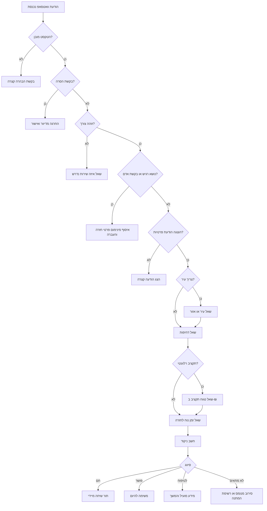

# בוט סינון לידים

בנה והפעל בוט סינון לידים שמותאם לוואטסאפ עבור עסקים קטנים, עצמאים, קליניקות, נותני שירות ועסקים צרכניים בישראל. הבוט אוסף פרטים חיוניים בעברית, מזהה התאמה ודחיפות, מתעד הסכמה, ומעביר לידים מתאימים לאדם או למערכת המשך.

## מטרות

- סינון פניות נכנסות מוואטסאפ בעברית.
- איסוף מינימלי של פרטים: צורך, עיר, דחיפות, דרך חזרה והסכמה.
- שימוש בפורמטים ישראליים: ₪, DD/MM/YYYY, מספרי טלפון ישראליים ושעות פעילות מקומיות.
- הפרדה בין טיפול בפנייה לבין דיוור שיווקי.
- העברת נושאים משפטיים, רפואיים, מיסויים, בטיחותיים ותלונות לנציג.
- יצירת רשומת ליד ל-CRM, CSV, webhook או תור נציגים.

## התאמה לעסקים בישראל

| סוג עסק | הודעה נפוצה | פרטים חשובים |
|---|---|---|
| בעל מקצוע | "כמה עולה לתקן נזילה?" | עיר, תקלה, דחיפות, תמונה, זמן חזרה |
| מנהל חשבונות | "פתחתי עוסק פטור" | סוג עסק, תאריך התחלה, כמות מסמכים, העברה מקצועית |
| עורך דין | "צריך עו״ד לחוזה" | תחום, דדליין, עיר, פרטי חזרה |
| קליניקה | "אפשר תור?" | טיפול, סניף, דחיפות, שעות מועדפות |
| פרילנסר | "צריך אתר" | היקף, דדליין, תקציב, דוגמאות |
| קורסים | "אפשר פרטים?" | תחום, רמה, מועד רצוי, הסכמה לעדכונים |
| חנות | "יש משלוחים?" | מוצר, כמות, עיר, תאריך, תשלום |

## עקרונות שיחה

1. קודם לענות לצורך, אחר כך לשאול שאלות.
2. לשאול שאלה אחת בכל הודעת וואטסאפ.
3. לשמור על הודעות קצרות וברורות.
4. להשתמש בעברית ישראלית מקצועית: חשבונית מס, קבלה, מע״מ, עוסק פטור, עוסק מורשה, חברה בע״מ, הסרה.
5. לא לחייב תקציב אם אפשר להתקדם בלעדיו.
6. לא להציג את הבוט כאדם.
7. לא לאבחן, לא לתת ייעוץ משפטי/רפואי/מיסויי מחייב, ולא להבטיח תוצאה.
8. להעביר לידים חמים ומקרים רגישים במהירות.
9. לתעד נוסח הסכמה, גרסה, שעה, ערוץ ומטרה.
10. להגדיר תקופת שמירה ומחיקה.

## מבנה רשומת ליד

```json
{
  "lead_id": "L-2026-000123",
  "received_at": "2026-06-03T10:15:00+03:00",
  "channel": "whatsapp",
  "language": "he",
  "customer": {
    "full_name": "דנה כהן",
    "phone_e164": "+972501234567",
    "city": "תל אביב",
    "email": "dana@example.co.il"
  },
  "intent": "price_quote",
  "service_category": "plumbing",
  "description": "נזילה מתחת לכיור",
  "urgency": "same_day",
  "budget_ils": {"min": 350, "max": 600},
  "preferred_contact_time": "03/06/2026 16:00-18:00",
  "consent": {
    "privacy_notice_shown": true,
    "service_followup": true,
    "marketing": false,
    "consent_timestamp": "2026-06-03T10:17:00+03:00"
  },
  "qualification": {
    "score": 88,
    "tier": "hot",
    "reasons": ["service_detected", "same_day_urgency", "city_detected", "budget_detected"]
  }
}
```

## פתיחת שיחה

```text
שלום, הגעת ל[שם העסק]. כדי לעזור במהירות, אפשר לכתוב בכמה מילים מה צריך?
```

אם הצורך כבר ברור:

```text
הבנתי, מדובר ב[סיכום קצר]. כדי לבדוק התאמה ולחזור עם תשובה מדויקת, אשאל 3 שאלות קצרות.
```

## שאלות סינון

```text
באיזו עיר או אזור השירות נדרש?
```

```text
זה דחוף להיום, לשבוע הקרוב, או שאין לחץ?
```

```text
מה טווח התקציב המשוער ב-₪, אם כבר יש כזה?
```

```text
מה השעה הנוחה ביותר לשיחת חזרה?
```

## פרטיות והסכמה

טיפול בפנייה:

```text
כדי לטפל בפנייה, הפרטים יישמרו לצורך חזרה אליך ומתן שירות. אפשר להמשיך?
```

דיוור שיווקי נפרד:

```text
רוצה לקבל גם עדכונים והטבות בוואטסאפ? אפשר להסיר בכל רגע.
```

אם הלקוח מסרב לדיוור:

```text
אין בעיה. נטפל בפנייה בלי לשלוח עדכונים שיווקיים.
```

## סיכום לפני חזרה

```text
מעולה, מסכם:
שם: דנה
עיר: תל אביב
צורך: תיקון נזילה
דחיפות: היום
תקציב: כ-500 ₪

נציג יחזור אליך בהקדם.
```

## ניקוד וסיווג

| סימן התאמה | נקודות |
|---|---:|
| השירות קיים בעסק | 20 |
| עיר או אזור שירות זוהו | 15 |
| דחיפות ברורה ומתאימה | 15 |
| תקציב זוהה או אינו נדרש | 15 |
| טלפון זמין | 10 |
| תיאור ברור | 10 |
| מקבל החלטות זוהה | 10 |
| הסכמה לטיפול תועדה | 5 |

| ניקוד | סיווג | פעולה |
|---:|---|---|
| 80-100 | חם | שיחת נציג בתוך 15 דקות בשעות פעילות |
| 60-79 | פושר | חזרה באותו יום או קישור לקביעת שיחה |
| 40-59 | לטיפוח | שליחת מידע ושאלת המשך אחת |
| 20-39 | לא מתאים | סירוב מנומס, רשימת המתנה או הפניה |
| 0-19 | ספאם/לא תקין | עצירת אוטומציה והחרגה מדיוור |
| כל נושא רגיש | נציג | העברה מיידית |
| החזר/תלונה | תמיכה | ניתוב לשירות לקוחות |

## עץ החלטות



## מתי להעביר לנציג

העבר לאדם כאשר מופיעים כאב חזק, טיפול רפואי, קטינים, הריון, פגיעה עצמית, סכסוך משפטי, פיטורים, חוב, חבות מס, סכנת חשמל/שריפה, החזר כספי, ביטול, תלונה, כעס חריג, או בקשה מפורשת כמו "נציג", "אדם", "תתקשרו", "לא בוט".

נוסח מומלץ:

```text
כדי לטפל בזה נכון, אעביר את הפנייה לנציג. אפשר להשאיר שם ושעה נוחה לחזרה?
```

## תרחישי קצה

| מצב | מענה |
|---|---|
| רק "כמה עולה?" | "בשמחה. המחיר תלוי בסוג השירות ובמיקום. מה בדיוק צריך ובאיזו עיר?" |
| הודעה קולית בלבד | "קיבלתי את ההודעה הקולית. כדי לא לפספס, אפשר לכתוב עיר ודחיפות במילה או שתיים?" |
| תמונה בלבד | "התמונה התקבלה. מה רואים בתמונה ומה תרצה לבדוק?" |
| אין תקציב | "אין בעיה. אפשר להתקדם גם בלי תקציב." |
| מחוץ לאזור | "כרגע השירות לא זמין באזור הזה. אפשר להשאיר פרטים לרשימת המתנה." |
| מחוץ לשעות | "הפנייה התקבלה. שעות המענה הן א׳-ה׳ 09:00-18:00." |
| בקשת הסרה | "הבקשה התקבלה. לא יישלחו אליך הודעות שיווקיות נוספות." |

## פורמטים ישראליים

| פריט | פורמט |
|---|---|
| מטבע | ₪1,200 או 1,200 ₪ |
| תאריך | DD/MM/YYYY |
| שעה | 24 שעות, שעון ישראל |
| הצגת טלפון | 050-123-4567 |
| שמירת טלפון | +972501234567 |
| שבוע עבודה | ברירת מחדל: א׳-ה׳ |
| מסמכים | חשבונית מס, קבלה, חשבונית מס/קבלה |
| סוג עסק | עוסק פטור, עוסק מורשה, חברה בע״מ, עמותה |

## מקורות ציות בישראל

לפני הפעלה יש לבדוק דרישות עדכניות. מקורות נפוצים: חוק הגנת הפרטיות, תקנות הגנת הפרטיות (אבטחת מידע), סעיף 30א לחוק התקשורת בנושא מסרים שיווקיים, חוק הגנת הצרכן, דרישות נגישות לשירותים דיגיטליים, הנחיות רשות המסים, דרישות ספקי תשלום ומדיניות WhatsApp Business Platform.

## טעויות נפוצות

הימנע מבקשת תעודת זהות בלי צורך, איחוד הסכמה שיווקית עם טיפול בפנייה, שליחת דיוור אחרי הסרה, אבחון מתמונה, הבטחת החזר מס, מתן ייעוץ משפטי, סיווג כל ליד כחם, הסתרת אפשרות לנציג, שמירת קבצים רגישים ללא מגבלת זמן, או יותר משתי שאלות הבהרה ברצף.

## רשימת בדיקות

- [ ] שירותים, אזורי שירות, שעות, בעלי תפקידים ו-SLA הוגדרו.
- [ ] כל הודעות הבוט נכתבו בעברית טבעית.
- [ ] הודעת פרטיות והסכמה שיווקית נפרדות.
- [ ] מילות הסרה בעברית ובאנגלית נבדקו.
- [ ] נירמול טלפון וזיהוי כפילויות נבדקו.
- [ ] מיפוי CRM/CSV כולל שדות הסכמה.
- [ ] העברת נושאים רגישים נבדקה.
- [ ] הודעות מחוץ לשעות פעילות נבדקו.
- [ ] הרשאות גישה ותקופות שמירה תועדו.
- [ ] לפחות 20 תרחישי בדיקה עברו.
