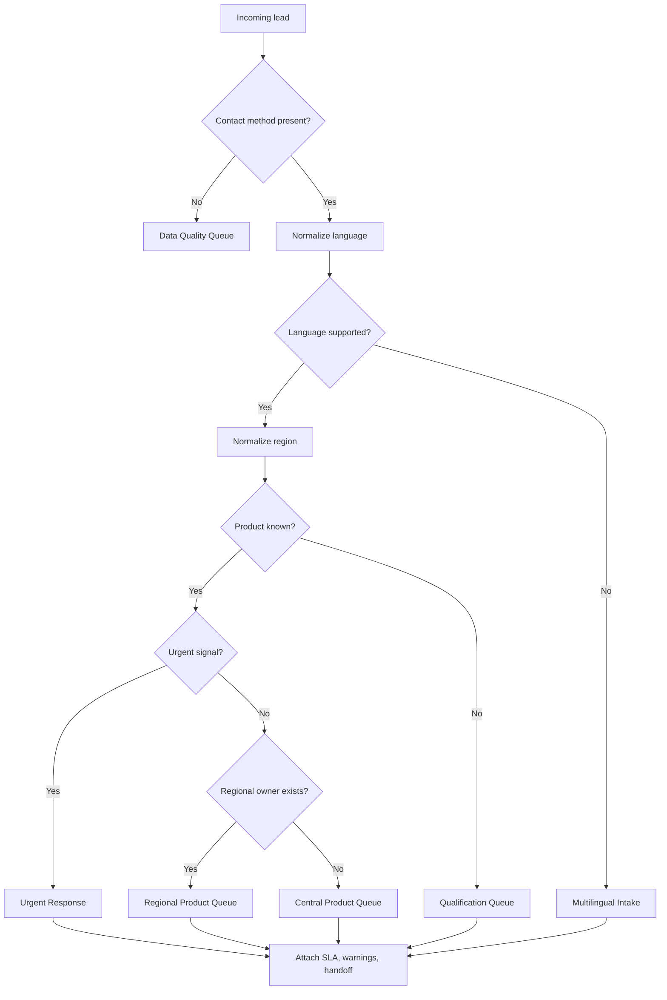

# Lead Router

Route incoming leads to the right person, team, queue, or escalation path for an Israeli business. Use language, region, product interest, urgency, channel, consent status, and business rules to decide who handles the lead first and what context must travel with it.

The skill is designed for small businesses, freelancers, clinics, service providers, agencies, retailers, installers, advisors, and consumer-facing operations in Israel. It supports Hebrew, English, Russian, and Arabic leads, Israeli geography, common phone formats, and operational guardrails for privacy, marketing consent, accessibility, and auditability.

Live-source validation for this release is recorded in `references/verification-log.md`. Treat the exact lead-routing capability as package behavior verified by tests, not as a public external standard.

## Outcomes

Use this skill to:

- Classify inbound leads from web forms, WhatsApp, phone notes, CRM forms, marketplaces, lead ads, email, and CSV exports.
- Detect or normalize lead language: Hebrew (`HE`), English (`EN`), Russian (`RU`), Arabic (`AR`), or unknown.
- Normalize Israeli regions from city names, area codes, free text, and branch names.
- Route by product interest, service type, department, urgency, estimated value, channel, and availability.
- Return a consistent route result with assignee, department, priority, SLA, explanation, warnings, and handoff note.
- Avoid common errors such as sending Arabic text to Hebrew-only staff, treating `03` as proof of Tel Aviv residence, or sending marketing follow-up without consent.

## Input fields

| Field | Meaning | Example |
|---|---|---|
| `name` | Lead name or company name | `דנה לוי` |
| `phone` | Local or international phone | `052-1234567`, `+972-52-123-4567` |
| `email` | Contact email | `dana@example.co.il` |
| `message` | Free-text request | `צריכה הצעת מחיר להתקנה באזור חיפה` |
| `language` | Optional explicit language | `he`, `עברית`, `ru` |
| `city` | City, town, settlement, or area | `חיפה`, `Tel Aviv`, `נצרת` |
| `region` | Optional normalized or free-text region | `north`, `מרכז` |
| `product_interest` | Product, service, or department hint | `installation`, `billing`, `תמיכה` |
| `channel` | Source channel | `whatsapp`, `web_form`, `phone`, `email`, `meta_lead_ad` |
| `budget` | Numeric estimated value in ₪ | `7500` |
| `is_urgent` | Explicit urgent flag | `true` |
| `consent_marketing` | Marketing consent flag | `true`, `false`, `unknown` |
| `created_at` | Lead timestamp | `2026-06-04T09:30:00+03:00` |

Minimum useful input: one contact method and one of `message`, `product_interest`, `city`, or `region`.

## Output fields

| Field | Meaning |
|---|---|
| `assignee` | Person, queue, or team receiving the lead |
| `department` | Department or function |
| `priority` | `low`, `normal`, `high`, or `urgent` |
| `sla_minutes` | Target first response time |
| `language` | Normalized language decision |
| `region` | Normalized region decision |
| `product_interest` | Normalized product or service category |
| `confidence` | Decision confidence from `0.0` to `1.0` |
| `reason_codes` | Machine-readable routing reasons |
| `handoff_note` | Human-readable context for the receiving person |
| `warnings` | Missing consent, weak signal, unsupported language, duplicate risk, invalid phone, or other issues |

## Quick start

```python
from lead_router import LeadRouterClient

router = LeadRouterClient()
result = router.route_lead({
    "name": "דנה",
    "phone": "052-1234567",
    "message": "אני צריכה הצעת מחיר להתקנה באזור חיפה",
    "channel": "whatsapp",
    "consent_marketing": False
})
print(result.to_json())
```

## Routing model

The default router uses deterministic scoring:

1. Normalize the lead.
2. Detect or confirm language.
3. Normalize region from explicit region, city, message text, and phone area code.
4. Normalize product interest from explicit field and free text.
5. Assign priority from urgency, product type, budget, channel, and support coverage.
6. Evaluate routing rules by specificity and score.
7. Return the highest-scoring rule.
8. Apply fallback handling when signals are missing or conflicting.
9. Add warnings for compliance, data quality, and operational risk.
10. Generate a handoff note.



## Scoring model

| Signal | Score contribution |
|---|---:|
| Exact product match | +40 |
| Exact region match | +25 |
| Exact language match | +20 |
| Channel match | +5 |
| Urgent match | +15 |
| Budget above rule threshold | +10 |
| Fallback/default rule | +1 |
| Missing contact method | Data Quality Queue |

Tie-breakers: higher priority, lower SLA, more specific rule, earlier rule.

## Language handling

- Hebrew script usually means `HE`.
- Arabic script usually means `AR`.
- Cyrillic script usually means `RU`.
- Latin script with common English service terms usually means `EN`.
- Explicit user selection overrides detection unless it conflicts with message script.
- Mixed language is allowed. Route by strongest signal and add `LANGUAGE_MIXED`.
- Unsupported language routes to multilingual intake.

Examples:

| Input | Decision | Note |
|---|---|---|
| `צריך הצעת מחיר` | `HE` | Hebrew script |
| `Need pricing for installation` | `EN` | English text |
| `Нужна поддержка` | `RU` | Cyrillic script |
| `مرحبا، أحتاج خدمة` | `AR` | Arabic script |
| `Hi, צריך עזרה` | `HE` with mixed warning | Strong Hebrew signal |

Do not infer language from name alone. A lead named `איברהים`, `מריה`, or `John` can prefer any supported language. Use explicit preference, message text, or prior CRM preference.

## Region handling

Priority order:

1. Explicit `region`.
2. City or locality.
3. Message text.
4. Branch selected in the form.
5. Phone area code as a weak hint only.

| Region | Common signals |
|---|---|
| `CENTER` | תל אביב, רמת גן, גבעתיים, חולון, בת ים, פתח תקווה |
| `SHARON` | נתניה, הרצליה, רעננה, כפר סבא, חדרה |
| `HAIFA` | חיפה, קריות, נשר, טירת כרמל |
| `NORTH` | גליל, גולן, נצרת, עפולה, טבריה, כרמיאל |
| `JERUSALEM` | ירושלים, בית שמש, מעלה אדומים |
| `SOUTH` | באר שבע, אשדוד, אשקלון, קריית גת, דימונה |
| `EILAT` | אילת, הערבה |
| `WEST_BANK` | אריאל, מודיעין עילית, ביתר עילית, יהודה ושומרון |

Edge cases:

- `03` phone numbers can belong to businesses or migrated numbers. Treat area code as weak evidence.
- Mobile numbers usually do not identify region.
- A city in the message can describe installation location, residence, or branch preference. Preserve original phrase in the handoff note.
- For on-site service, region should carry more weight than language. For remote consulting, language and specialty should carry more weight than region.

## Product interest handling

| Product | Common signals |
|---|---|
| `sales` | quote, pricing, הצעת מחיר, מחיר, רכישה |
| `installation` | התקנה, installer, field visit, טכנאי |
| `support` | תקלה, לא עובד, broken, проблема, مشكلة |
| `billing` | חשבונית, קבלה, payment, charge, חיוב |
| `appointments` | תור, פגישה, callback, consultation |
| `enterprise` | company, bulk, branches, רשת, procurement |
| `urgent` | דחוף, emergency, עכשיו |
| `general` | unclear or missing interest |

## Priority rules

| Condition | Priority | SLA |
|---|---|---:|
| Safety issue, service outage, urgent repair | `urgent` | 10 minutes |
| Hot sales/service lead via WhatsApp or phone | `high` | 30 minutes |
| Standard sales lead | `normal` | 120 minutes |
| Billing question | `normal` | 240 minutes |
| Missing contact method | `low` | manual review |
| Marketing-only lead without consent | `low` | do not market |

## Israeli operational guardrails

- Collect only fields needed for routing and follow-up. Avoid storing ID numbers, medical information, financial documents, or family details unless required and legally justified.
- Separate service follow-up from promotional messaging. A quote request is not automatically marketing consent.
- Store consent source, timestamp, wording, and channel when marketing is intended.
- Provide an accessible fallback contact method.
- Keep an audit log with timestamp, input snapshot, normalized values, chosen rule, score, warnings, and manual override history.
- Show amounts in ₪ for Israeli staff and customers.
- Do not calculate VAT inside the router. If a billing note must mention VAT, the standard Israeli VAT rate validated for this release is 18% from 01/01/2025; re-check the official Tax Authority source before issuing invoices.
- Display dates to Israeli operators as `DD/MM/YYYY` when not using ISO timestamps.

## Concrete examples

### WhatsApp installation lead

Input:

```json
{"name":"יוסי כהן","phone":"050-1112222","message":"צריך התקנה השבוע ברמת גן. אפשר מחיר?","channel":"whatsapp","consent_marketing":false}
```

Expected:

```json
{"department":"installation","region":"CENTER","language":"HE","priority":"high","sla_minutes":30,"warnings":["MARKETING_CONSENT_MISSING"]}
```

### Russian support lead

```json
{"name":"Марина","phone":"+972-54-111-2222","city":"חיפה","message":"Устройство не работает, нужна помощь","channel":"web_form"}
```

Expected: Russian Support Queue, `support`, `RU`, `HAIFA`, `high`.

### Arabic sales lead

```json
{"name":"أحمد","phone":"0523334444","city":"נצרת","message":"مرحبا، أريد عرض سعر للخدمة","product_interest":"sales"}
```

Expected: Arabic Sales Queue, `sales`, `AR`, `NORTH`.

### English enterprise lead

```json
{"name":"Dan","email":"dan@example.com","message":"We have 8 branches and need a national rollout quote","budget":90000}
```

Expected: Enterprise Desk, `enterprise`, `high`, SLA 60 minutes or better.

## Suggested CRM fields

| Field | Type | Required | Notes |
|---|---|---|---|
| `lead_id` | string | yes | External ID or generated ID |
| `created_at` | datetime | yes | Use Asia/Jerusalem timezone for local display |
| `source_channel` | enum | yes | `web_form`, `whatsapp`, `phone`, `email`, `meta_lead_ad`, `csv` |
| `contact_phone` | string | conditional | Store normalized E.164 when possible |
| `contact_email` | string | conditional | Validate syntax before automation |
| `preferred_language` | enum | no | `HE`, `EN`, `RU`, `AR`, `UNKNOWN` |
| `normalized_region` | enum | no | Keep original city separately |
| `product_interest` | enum | no | Use controlled list |
| `route_assignee` | string | yes | Person, team, or queue |
| `route_reason_codes` | array | yes | Enables reporting |
| `marketing_consent` | enum | yes | `granted`, `denied`, `unknown` |
| `first_response_due_at` | datetime | yes | Derived from SLA |
| `manual_override_reason` | string | no | Required when overridden |

## Troubleshooting quick checks

- If all leads route to general intake, verify product aliases and city aliases.
- If Hebrew leads route as English, confirm source encoding and avoid stripping Unicode.
- If Russian messages route incorrectly, keep Cyrillic characters during form processing.
- If Arabic messages lose directionality, preserve UTF-8 and avoid aggressive right-to-left cleanup.
- If too many leads become urgent, separate genuine emergency words from sales urgency.
- If branch owners report wrong regions, inspect whether area-code inference is overriding city fields.

## Anti-patterns

- Route by phone prefix before checking city or explicit region.
- Send every lead to the salesperson with the highest close rate.
- Treat language detection as identity or nationality.
- Auto-subscribe quote requests to campaigns.
- Remove original free text after classification.
- Allow rules without an owner, fallback, SLA, or test scenario.
- Depend on a single employee name instead of a queue.
- Hide confidence and warning information from the receiving team.
- Overfit rules to one campaign without review.

## Production checklist

- [ ] Confirm every active route has an owner, backup, working hours, and SLA.
- [ ] Test Hebrew, English, Russian, and Arabic messages on real devices.
- [ ] Verify UTF-8 storage end to end.
- [ ] Keep consent fields separate from service-request fields.
- [ ] Configure duplicate handling by phone and email.
- [ ] Add monitoring for unrouted, low-confidence, and manually overridden leads.
- [ ] Store rule version and decision explanation for every route.
- [ ] Confirm phone normalization and regional mapping with local staff.
- [ ] Run the scenarios in `references/test-scenarios.md`.
- [ ] Run `pytest scripts/test_lead_router_client.py`.
- [ ] Review `references/api-reference.md` before production.
