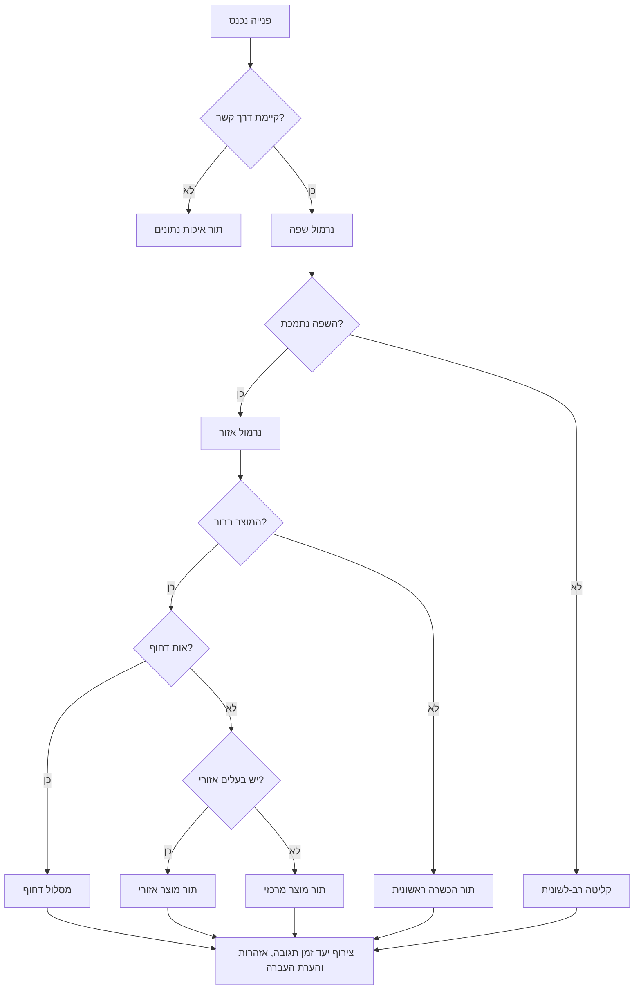

# Lead Router

נתב פניות נכנסות לאדם, למחלקה, לתור טיפול או למסלול הסלמה תפעולית מתאים לעסק ישראלי. השתמש בשפה, אזור, עניין במוצר, דחיפות, ערוץ הגעה, מצב הסכמה וכללי עסק כדי לקבוע מי מטפל בפנייה תחילה ואיזה מידע עובר אליו.

המיומנות מתאימה לעסקים קטנים, עצמאים, קליניקות, נותני שירות, סוכנויות, חנויות, מתקינים, יועצים ועסקים צרכניים בישראל. היא תומכת בעברית, אנגלית, רוסית וערבית, במיפוי אזורים בישראל, בפורמטים נפוצים של טלפונים, ובדגשים תפעוליים של פרטיות, הסכמה שיווקית, נגישות ותיעוד החלטות.

## תוצאות רצויות

השתמש במיומנות כדי:

- סווגו פניות מטופסי אתר, WhatsApp, סיכומי שיחה, מערכת ניהול קשרי לקוחות, זירות מסחר, טפסי מטא, דואר אלקטרוני וקובצי נתונים מופרדי פסיקים.
- לזהות או לנרמל שפת פנייה: עברית (`HE`), אנגלית (`EN`), רוסית (`RU`), ערבית (`AR`) או שפה לא ידועה.
- לנרמל אזור בישראל לפי יישוב, קידומת טלפון, טקסט חופשי ובחירת סניף.
- לנתב לפי מוצר, שירות, מחלקה, דחיפות, שווי משוער, ערוץ וזמינות צוות.
- החזירו תוצאת ניתוב עקבית עם נמען, מחלקה, עדיפות, יעד זמן תגובה, הסבר, אזהרות והערת העברה.
- להימנע מטעויות כמו שליחת טקסט בערבית לצוות דובר עברית בלבד, שימוש בקידומת `03` כהוכחת מגורים בתל אביב, או דיוור שיווקי ללא הסכמה.

## שדות קלט

| שדה | משמעות | דוגמה |
|---|---|---|
| `name` | שם הפונה או שם החברה | `דנה לוי` |
| `phone` | טלפון מקומי או בינלאומי | `052-1234567`, `+972-52-123-4567` |
| `email` | דואר אלקטרוני ליצירת קשר | `dana@example.co.il` |
| `message` | תוכן הבקשה | `צריכה הצעת מחיר להתקנה באזור חיפה` |
| `language` | שפה מוצהרת אם קיימת | `he`, `עברית`, `ru` |
| `city` | עיר, יישוב או אזור | `חיפה`, `Tel Aviv`, `נצרת` |
| `region` | אזור מנורמל או חופשי | `north`, `מרכז` |
| `product_interest` | מוצר, שירות או מחלקה | `installation`, `billing`, `תמיכה` |
| `channel` | מקור הפנייה | `whatsapp`, `web_form`, `phone`, `email`, `meta_lead_ad` |
| `budget` | שווי משוער בש״ח | `7500` |
| `is_urgent` | דחיפות מפורשת | `true` |
| `consent_marketing` | הסכמה שיווקית | `true`, `false`, `unknown` |
| `created_at` | מועד יצירת הפנייה | `04/06/2026 09:30` |

קלט מינימלי שימושי: דרך קשר אחת ואחד מהשדות `message`, `product_interest`, `city` או `region`.

## שדות פלט

| שדה | משמעות |
|---|---|
| `assignee` | אדם, צוות או תור טיפול שמקבל את הפנייה |
| `department` | מחלקה או תחום טיפול |
| `priority` | `low`, `normal`, `high` או `urgent` |
| `sla_minutes` | יעד זמן לתגובה ראשונה |
| `language` | החלטת שפה מנורמלת |
| `region` | החלטת אזור מנורמלת |
| `product_interest` | עניין מוצר או שירות מנורמל |
| `confidence` | רמת ביטחון בין `0.0` ל-`1.0` |
| `reason_codes` | סיבות ניתוב בפורמט שמתאים למערכות |
| `handoff_note` | הערה אנושית לצוות המקבל |
| `warnings` | אזהרות על הסכמה, איכות נתונים, שפה לא נתמכת, כפילות, טלפון לא תקין ועוד |

## התחלה מהירה

```python
from lead_router import LeadRouterClient

router = LeadRouterClient()
result = router.route_lead({
    "name": "דנה",
    "phone": "052-1234567",
    "message": "אני צריכה הצעת מחיר להתקנה באזור חיפה",
    "channel": "whatsapp",
    "consent_marketing": False
})
print(result.to_json())
```

## מודל ניתוב

הנתב המובנה משתמש בניקוד דטרמיניסטי וקל לבקרה:

1. נרמל את נתוני הפנייה.
2. זהה או אשר שפה.
3. נרמל אזור לפי שדה אזור, יישוב, טקסט חופשי וקידומת טלפון.
4. נרמל עניין במוצר לפי שדה מפורש וטקסט חופשי.
5. קבע עדיפות לפי דחיפות, סוג מוצר, תקציב, ערוץ וכיסוי צוות.
6. בדוק כללי ניתוב לפי התאמה וניקוד.
7. החזר את הכלל עם הניקוד הגבוה ביותר.
8. הפעל ברירת מחדל כאשר חסרים נתונים או קיימת סתירה.
9. הוסף אזהרות על תאימות, איכות נתונים וסיכון תפעולי.
10. צור הערת העברה.



## מודל ניקוד

| אות | תרומה לניקוד |
|---|---:|
| התאמת מוצר מדויקת | +40 |
| התאמת אזור מדויקת | +25 |
| התאמת שפה מדויקת | +20 |
| התאמת ערוץ | +5 |
| התאמת דחיפות | +15 |
| תקציב מעל רף הכלל | +10 |
| כלל ברירת מחדל | +1 |
| אין דרך קשר | תור איכות נתונים |

במקרה של תיקו: עדיפות גבוהה יותר, יעד זמן תגובה קצר יותר, כלל ספציפי יותר, ואז כלל מוקדם יותר.

## טיפול בשפה

- כתב עברי מוביל בדרך כלל ל-`HE`.
- כתב ערבי מוביל בדרך כלל ל-`AR`.
- כתב קירילי מוביל בדרך כלל ל-`RU`.
- כתב לטיני עם מונחי שירות באנגלית מוביל בדרך כלל ל-`EN`.
- בחירת שפה מפורשת גוברת על זיהוי אוטומטי, אלא אם קיימת סתירה ברורה מול הטקסט.
- שפה מעורבת מותרת. נתב לפי האות החזק ביותר והוסף `LANGUAGE_MIXED`.
- שפה לא נתמכת עוברת לקליטה רב-לשונית.

| קלט | החלטה | הערה |
|---|---|---|
| `צריך הצעת מחיר` | `HE` | כתב עברי |
| `Need pricing for installation` | `EN` | טקסט באנגלית |
| `Нужна поддержка` | `RU` | כתב קירילי |
| `مرحبا، أحتاج خدمة` | `AR` | כתב ערבי |
| `Hi, צריך עזרה` | `HE` עם אזהרה | אות עברי חזק |

אין להסיק שפה לפי שם בלבד. פנייה בשם `איברהים`, `מריה` או `John` עשויה להגיע בכל אחת מהשפות הנתמכות. השתמש בהעדפה מפורשת, בטקסט ההודעה או בהעדפת מערכת ניהול קשרי לקוחות קודמת.

## טיפול באזור

סדר עדיפויות:

1. שדה `region` מפורש.
2. עיר או יישוב.
3. טקסט ההודעה.
4. סניף שנבחר בטופס.
5. קידומת טלפון כרמז חלש בלבד.

| אזור | אותות נפוצים |
|---|---|
| `CENTER` | תל אביב, רמת גן, גבעתיים, חולון, בת ים, פתח תקווה |
| `SHARON` | נתניה, הרצליה, רעננה, כפר סבא, חדרה |
| `HAIFA` | חיפה, קריות, נשר, טירת כרמל |
| `NORTH` | גליל, גולן, נצרת, עפולה, טבריה, כרמיאל |
| `JERUSALEM` | ירושלים, בית שמש, מעלה אדומים |
| `SOUTH` | באר שבע, אשדוד, אשקלון, קריית גת, דימונה |
| `EILAT` | אילת, הערבה |
| `WEST_BANK` | אריאל, מודיעין עילית, ביתר עילית, יהודה ושומרון |

מקרי קצה:

- קידומת `03` יכולה להשתייך לעסק, למרכזייה או למספר שנויד. השתמש בה כרמז חלש בלבד.
- מספר נייד בדרך כלל אינו מזהה אזור.
- עיר שמופיעה בהודעה יכולה להיות מקום התקנה, מקום מגורים או העדפת סניף. שמור את הניסוח המקורי בהערת ההעברה.
- בשירות שמצריך הגעה פיזית, אזור חשוב יותר משפה. בייעוץ מרחוק, שפה ומומחיות חשובות יותר מאזור.

## טיפול בעניין במוצר

| מוצר | אותות נפוצים |
|---|---|
| `sales` | הצעת מחיר, מחיר, רכישה, quote, pricing |
| `installation` | התקנה, מתקין, טכנאי, field visit |
| `support` | תקלה, לא עובד, broken, проблема, مشكلة |
| `billing` | חשבונית, קבלה, תשלום, חיוב, payment |
| `appointments` | תור, פגישה, שיחת חזרה, consultation |
| `enterprise` | חברה, רשת, סניפים, פריסה ארצית, procurement |
| `urgent` | דחוף, חירום, עכשיו |
| `general` | עניין חסר או לא ברור |

## כללי עדיפות

| תנאי | עדיפות | יעד זמן תגובה |
|---|---|---:|
| בעיית בטיחות, השבתת שירות או תיקון דחוף | `urgent` | 10 דקות |
| פנייה מכירה או שירות חם מ-WhatsApp או מטלפון | `high` | 30 דקות |
| פנייה מכירה רגיל | `normal` | 120 דקות |
| שאלה על חשבונית או תשלום | `normal` | 240 דקות |
| חסרה דרך קשר | `low` | בדיקה ידנית |
| פנייה שיווקית ללא הסכמה | `low` | אל תבצעו דיוור |

## דגשים לעסק ישראלי

- אספו רק שדות שנדרשים לניתוב ולטיפול. אל תשמרו תעודת זהות, מידע רפואי, מסמכים פיננסיים או פרטים משפחתיים אלא אם יש צורך תפעולי ובסיס חוקי.
- הפרידו בין טיפול בבקשת שירות לבין מסרים פרסומיים. בקשה להצעת מחיר אינה בהכרח הסכמה לדיוור.
- שמרו מקור הסכמה, מועד, נוסח וערוץ כאשר מתוכנן שימוש שיווקי.
- ספקו דרך קשר חלופית נגישה.
- שמרו יומן ביקורת עם מועד, צילום קלט, ערכים מנורמלים, כלל שנבחר, ניקוד, אזהרות ושינויים ידניים.
- הציגו סכומים בש״ח, למשל ₪7,500.
- אל תחשבו מע״מ בתוך הנתב. אם הערת העברה חייבת להזכיר מע״מ, שיעור המע״מ התקני שאומת לגרסה זו הוא 18% מ-01/01/2025; בדקו שוב מקור רשמי של רשות המסים לפני הפקת חשבוניות.
- הציגו תאריכים למפעילים בישראל בפורמט `DD/MM/YYYY`, למשל `04/06/2026`.

## דוגמאות

### פנייה התקנה מ-WhatsApp

```json
{"name":"יוסי כהן","phone":"050-1112222","message":"צריך התקנה השבוע ברמת גן. אפשר מחיר?","channel":"whatsapp","consent_marketing":false}
```

תוצאה צפויה: מחלקת התקנות, `CENTER`, עברית, עדיפות גבוהה, יעד זמן תגובה של 30 דקות, אזהרת חוסר הסכמה שיווקית.

### פנייה תמיכה ברוסית

```json
{"name":"Марина","phone":"+972-54-111-2222","city":"חיפה","message":"Устройство не работает, нужна помощь","channel":"web_form"}
```

תוצאה צפויה: Russian Support Queue, תמיכה, `RU`, `HAIFA`, עדיפות גבוהה.

### פנייה מכירה בערבית

```json
{"name":"أحمد","phone":"0523334444","city":"נצרת","message":"مرحبا، أريد عرض سعر للخدمة","product_interest":"sales"}
```

תוצאה צפויה: Arabic Sales Queue, מכירות, `AR`, `NORTH`.

### פנייה ארגוני באנגלית

```json
{"name":"Dan","email":"dan@example.com","message":"We have 8 branches and need a national rollout quote","budget":90000}
```

תוצאה צפויה: Enterprise Desk, לקוח ארגוני, עדיפות גבוהה, יעד זמן תגובה של 60 דקות או פחות.

## שדות מומלצים ב-מערכת ניהול קשרי לקוחות

| שדה | סוג | חובה | הערות |
|---|---|---|---|
| `lead_id` | טקסט | כן | מזהה חיצוני או מזהה שנוצר במערכת |
| `created_at` | תאריך ושעה | כן | הצגה מקומית לפי שעון ישראל |
| `source_channel` | רשימה | כן | `web_form`, `whatsapp`, `phone`, `email`, `meta_lead_ad`, `csv` |
| `contact_phone` | טקסט | מותנה | רצוי לשמור בפורמט E.164 |
| `contact_email` | טקסט | מותנה | לאמת תחביר לפני אוטומציה |
| `preferred_language` | רשימה | לא | `HE`, `EN`, `RU`, `AR`, `UNKNOWN` |
| `normalized_region` | רשימה | לא | לשמור את היישוב המקורי בנפרד |
| `product_interest` | רשימה | לא | להשתמש ברשימה סגורה |
| `route_assignee` | טקסט | כן | אדם, צוות או תור טיפול |
| `route_reason_codes` | רשימה | כן | תומך בדוחות ובבקרת איכות |
| `marketing_consent` | רשימה | כן | `granted`, `denied`, `unknown` |
| `first_response_due_at` | תאריך ושעה | כן | נגזר מה-יעד זמן תגובה |
| `manual_override_reason` | טקסט | לא | חובה כאשר מבצעים שינוי ידני |

## בדיקות מהירות

- אם כל הפניות מגיעים לקליטה כללית, בדוק כינויי מוצר וכינויי יישובים.
- אם פניות בעברית מזוהות כאנגלית, ודא שאין מחיקת Unicode בתהליך הטופס.
- אם הודעות ברוסית מזוהות לא נכון, שמור תווים קיריליים עד סוף העיבוד.
- אם טקסט בערבית משתבש, שמרו UTF-8 ואל תנקו סימני ימין-לשמאל בצורה אגרסיבית.
- אם יותר מדי פניות מוגדרים דחופים, הפרד בין חירום אמיתי לבין דחיפות מכירתית.
- אם בעלי סניפים מתלוננים על אזור לא נכון, בדוק האם קידומת טלפון עוקפת שדה עיר.

## דפוסי אנטי

- ניתוב לפי קידומת טלפון לפני בדיקת עיר או אזור מפורש.
- שליחת כל הפניות לאיש המכירות עם אחוז הסגירה הגבוה ביותר.
- התייחסות לזיהוי שפה כזהות או לאום.
- צירוף אוטומטי של כל מבקש הצעת מחיר לקמפיינים.
- מחיקת הטקסט המקורי אחרי הסיווג.
- כלל ניתוב ללא בעלים, גיבוי, יעד זמן תגובה או תרחיש בדיקה.
- תלות בשם עובד יחיד במקום בתור טיפול.
- הסתרת ביטחון ההחלטה והאזהרות מהצוות המקבל.
- התאמת יתר לקמפיין זמני ללא בדיקה תקופתית.

## צ'ק-ליסט לפרודקשן

- [ ] לוודא שלכל מסלול יש בעלים, גיבוי, שעות פעילות ו-יעד זמן תגובה.
- [ ] לבדוק הודעות בעברית, אנגלית, רוסית וערבית במכשירים אמיתיים.
- [ ] לוודא שמירת UTF-8 מקצה לקצה.
- [ ] להפריד שדות הסכמה שיווקית משדות בקשת שירות.
- [ ] להגדיר טיפול בכפילויות לפי טלפון ודואר אלקטרוני.
- [ ] להגדיר ניטור לפניות לא מנותבים, ביטחון נמוך ושינויים ידניים.
- [ ] לשמור גרסת כללים והסבר החלטה לכל ניתוב.
- [ ] לאמת נרמול טלפון ומיפוי אזורים עם צוות מקומי.
- [ ] להריץ את התרחישים ב-`references/test-scenarios.md`.
- [ ] להריץ `pytest scripts/test_lead_router_client.py`.
- [ ] לעבור על `references/api-reference.md` לפני עלייה לאוויר.
