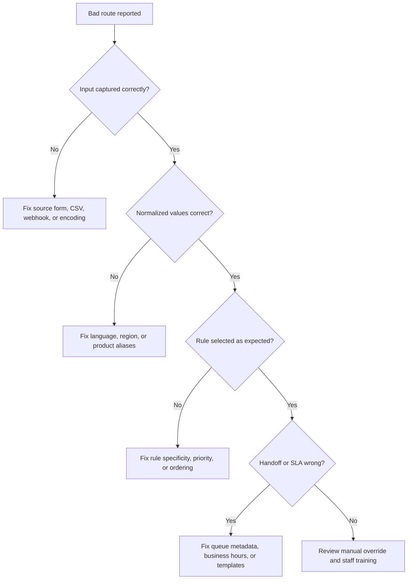

# Troubleshooting

Use this guide when routing results look wrong, unstable, unfair, or hard to explain.

## Hebrew leads route as English

Likely causes:

- Source system strips Unicode before routing.
- Message field is empty and only `product_interest` contains an English option.
- Explicit `language=en` is submitted by default.
- Front-end placeholder text is routed instead of customer text.

Fix:

- Remove default language values.
- Preserve UTF-8 end to end.
- Prefer user-entered text over labels.
- Add Hebrew aliases for every product.

## Russian messages route to general intake

Likely causes:

- Cyrillic text was transliterated or replaced.
- Russian support rule has lower specificity than general support.
- Missing Russian aliases: `не работает`, `помощь`, `проблема`, `счет`.

Fix:

- Keep original text.
- Add Russian aliases.
- Place language-specific support rules before generic fallbacks.

## Arabic messages display incorrectly

Likely causes:

- Incorrect character encoding.
- Right-to-left marks were removed too aggressively.
- CRM field or report does not support bidirectional text.

Fix:

- Use UTF-8 everywhere.
- Store original text separately from normalized fields.
- Avoid copy/paste through tools that corrupt right-to-left text.
- Use Arabic-capable fonts in reports.

## Too many leads route to urgent

Likely causes:

- Words like `today`, `השבוע`, or `now` are weighted too heavily.
- Sales promotions use urgent language.
- Product `urgent` is selected by default.
- Channel `whatsapp` incorrectly forces urgent.

Fix:

- Reserve urgent for safety, outage, or immediate repair.
- Use `high` for hot sales leads.
- Review reason codes for `URGENT_TEXT`.

## Wrong region

Likely causes:

- Phone area code overrides explicit city.
- City aliases are missing.
- Message mentions a city that is not the service location.
- A nearby locality is absent from the map.

Fix:

- Make phone area code a weak hint only.
- Add missing city aliases.
- Ask for service location when ambiguous.
- Review boundaries with staff.

## Billing requests go to sales

Likely causes:

- Missing finance aliases such as `חשבונית`, `קבלה`, `חיוב`, `invoice`, `receipt`.
- Sales quote keywords outscore billing terms.
- Payment support is mapped to sales.

Fix:

- Add finance aliases.
- Prioritize billing rules above generic sales.
- Keep billing SLA separate from sales SLA.

## Leads without consent enter campaigns

Likely causes:

- Service request and marketing consent share one checkbox.
- Unknown consent is treated as true.
- CRM automation subscribes all new leads.

Fix:

- Use a separate opt-in field.
- Treat unknown as no marketing consent.
- Allow service follow-up only.
- Store consent text, timestamp, source, and channel.

## Staff cannot understand why a route happened

Likely causes:

- Reason codes are hidden.
- Handoff note is overwritten.
- Rule version is not stored.
- Manual overrides are not recorded.

Fix:

- Display reason codes and confidence in internal views.
- Store route result as immutable audit data.
- Require override reasons.
- Include low-confidence routes in quality review.

## CLI cannot import the client

Likely causes:

- Script was moved without `lead_router_client.py`.
- Current working directory is different.
- Hyphenated filename cannot be imported with normal `import`.

Fix:

- Keep CLI and client in the same `scripts` folder.
- Run `python scripts/lead_router_cli.py --help` from the package root.
- Use the included import helper.

## Batch CSV output is empty

Likely causes:

- CSV uses a different delimiter.
- File is not UTF-8.
- Header names differ.
- Output path is not writable.

Fix:

- Export as UTF-8 CSV.
- Use expected header names.
- Test with one row.
- Write output to a known writable folder.

## Confidence is always low

Likely causes:

- Rules are too generic.
- Alias tables are missing.
- Leads contain only phone numbers.
- Product and region fields are not mapped from the source.

Fix:

- Add required form fields for product and city.
- Expand aliases.
- Add explicit rules for high-volume combinations.
- Route incomplete leads to qualification instead of hiding uncertainty.

## Duplicate leads create multiple tasks

Likely causes:

- Duplicate detection is outside router and not configured.
- Phone normalization differs by source.
- Email casing differs.
- Meta lead and web form submit the same contact.

Fix:

- Normalize phone to E.164.
- Lowercase email domain.
- Search recent leads by phone and email before task creation.
- Route duplicates to existing owner when active.
- Add `DUPLICATE_RISK`.

## Safe debugging checklist

- Use synthetic leads in development.
- Redact phone and email from logs.
- Keep original Unicode text in test fixtures.
- Avoid exporting sensitive lead data into unsecured spreadsheets.
- Do not test marketing automation with real customers unless consent and templates are correct.

## Escalation matrix

| Problem | First owner | Backup |
|---|---|---|
| Bad language detection | Operations owner | CRM admin |
| Wrong regional route | Regional manager | Sales operations |
| Consent mistake | Compliance or management owner | CRM admin |
| Broken webhook | Integration owner | CRM admin |
| CLI/batch issue | Operations analyst | Developer |
| Repeated manual overrides | Process owner | Department manager |
