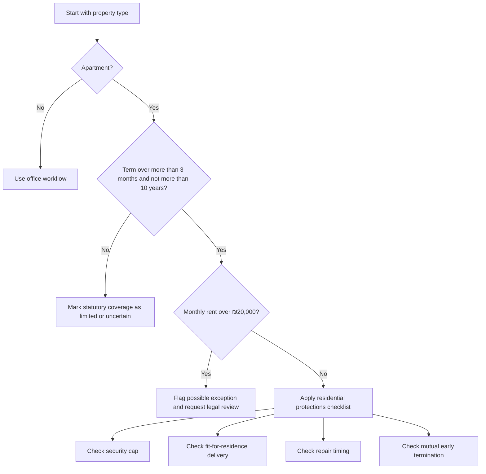
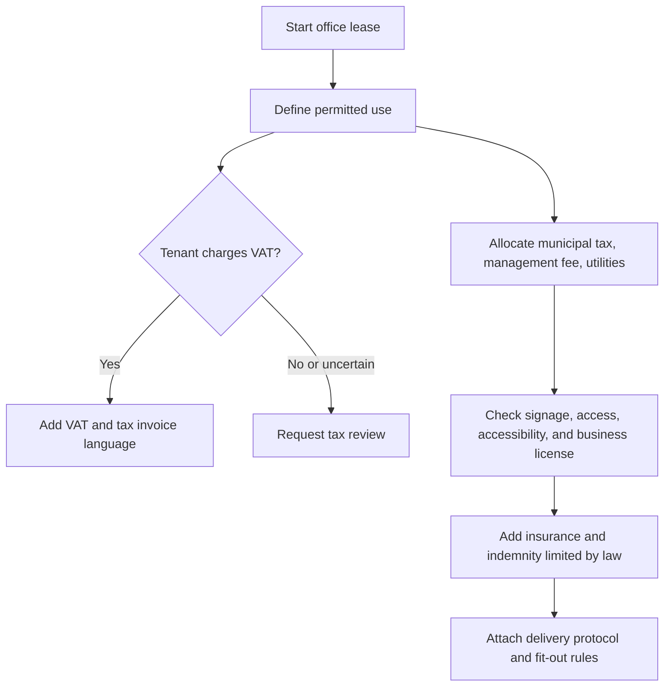
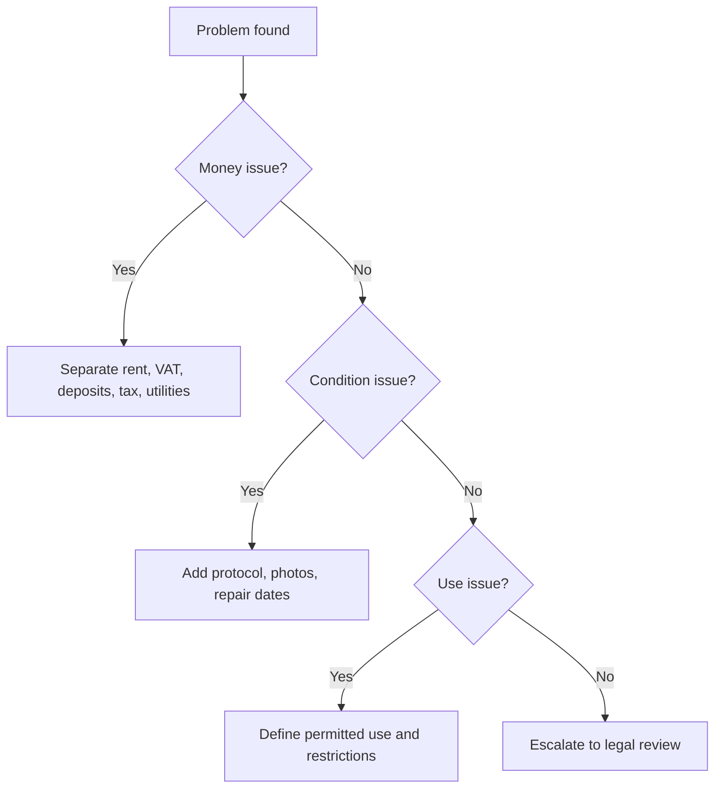

# Lease Agreement Drafter

Draft Israeli apartment and office lease agreements in Hebrew or English from structured facts. Use the skill for small businesses, freelancers, landlords, tenants, and consumers who need a practical draft, issue checklist, and review workflow before signing.

This skill does not replace legal, tax, engineering, accessibility, insurance, or planning advice. Treat the output as a structured drafting aid. Verify the current version of every statute, regulation, municipal rule, tax position, and factual statement before signing.

## Core outcomes

- Produce a Hebrew-first residential or office lease draft with parties, premises, term, rent, payments, security, repairs, permitted use, insurance, termination, and appendices.
- Flag common Israeli law issues, including residential guarantee caps, fit-for-residence duties, repair timing, one-sided early termination, VAT treatment, municipal tax allocation, and office permitted use.
- Create review checklists for signing, handover, ongoing management, renewal, and exit.
- Keep dates in DD/MM/YYYY and money in ₪.
- Keep drafting neutral, imperative, and direct.

## Required intake

Collect the following before drafting:

| Area | Required facts | Useful details |
| --- | --- | --- |
| Parties | Full legal names, identification numbers, addresses, phone, email | Corporate registration number, signing authority, guarantors |
| Premises | Address, city, property type, registry details if available | Area, rooms, parking, storage, furnishings, defects, equipment |
| Term | Start date, end date, option, notice period | Delivery date, renewal conditions, exit notice method |
| Money | Monthly rent, payment day, security amount, management fees | Index linkage, VAT, invoices, late payment interest |
| Use | Residential use or office activity | Business license, signage, accessibility, pets, sublease |
| Operations | Repairs, insurance, municipal tax, utilities, house committee | Handover protocol, meter readings, keys, photographs |

## Residential apartment decision tree



## Office lease decision tree



## Drafting procedure

1. Classify the lease as apartment or office.
2. Check whether the residential lease amendments likely apply.
3. Normalize all dates to DD/MM/YYYY.
4. Express all amounts in ₪ and state whether VAT applies.
5. Separate rent, management fee, municipal tax, utilities, and deposits.
6. Avoid automatic forfeiture language for security deposits.
7. Add delivery and return protocols.
8. Add a repairs clause that distinguishes urgent defects from ordinary defects.
9. Make early termination rights mutual or legally balanced.
10. Add appendices rather than burying operational details in long clauses.

## Clause library

### Parties

Use exact legal names. For companies, require corporate number and signing authority. For an individual landlord acting through an agent, attach written authorization.

Example:

```text
The landlord declares that the landlord owns the premises or is authorized to lease them and will provide supporting documents before signature.
```

### Premises and purpose

For an apartment, state residential use only unless a lawful home-office carve-out is reviewed. For an office, state the business activity precisely.

Example:

```text
The tenant may use the premises solely as a consulting office, without retail activity, manufacturing, lodging, food preparation, or public reception beyond ordinary office meetings unless approved in writing.
```

### Rent and VAT

Residential apartment rent for periods up to 25 years is generally VAT-exempt, except for specific statutory exceptions. Office rent commonly requires VAT treatment and tax invoice handling when the landlord is a dealer or the transaction is taxable. Use 18% as the current standard VAT rate verified on 04/06/2026, then flag uncertain cases for tax review.

### Security

For a covered residential apartment lease, check the common statutory cap: the lower of one third of total rent for the term or three months rent. Do not draft unlimited checks, open-ended guarantees, or automatic forfeiture.

### Repairs

State delivery fitness, urgent defect timing, ordinary repair timing, tenant notice duties, access coordination, and exclusion for damage caused by misuse.

### Early termination

Avoid one-sided landlord-only termination. If early termination exists, state notice period, replacement tenant process, settlement of payments, and mutuality.

## Edge cases

### Short apartment lease

A lease of three months or less may fall outside parts of the residential amendment framework. Still draft fit-for-use, security, payment, and handover clauses.

### Luxury apartment

Monthly rent above the statutory threshold can change coverage. Mark the issue for legal review and avoid presenting mandatory protections as certain.

### Protected tenancy

Do not use this skill to create or modify protected tenancy rights. If any party mentions key money, protected tenant status, historical tenancy, or a pre-existing protected arrangement, stop and request specialist review.

### Roommate replacement

Use written consent, objective approval standards, identity checks, guarantor updates, and deposit allocation. Avoid indefinite joint liability after an approved replacement unless reviewed.

### Freelancer renting a small office

Add VAT, tax invoice, municipal tax, management fee, business license, signage, shared areas, access hours, insurance, data privacy for clients, and equipment removal.

### Apartment with home office use

Do not convert a residential lease into a commercial lease accidentally. Add a narrow non-public administrative use clause only after checking municipal, tax, insurance, and building restrictions.

## Anti-patterns

| Anti-pattern | Why it fails | Safer drafting move |
| --- | --- | --- |
| "Deposit is forfeited for any breach" | May be punitive, unclear, and disproportionate | Permit draw only for proven debt or damage after notice |
| "Tenant waives all rights under law" | Mandatory protections may not be waived | State that mandatory law prevails |
| "Landlord may terminate at any time" | One-sided and unstable | Add mutual right, defined cause, and notice |
| "Tenant handles every repair" | Conflicts with residential repair duties | Split ordinary use, misuse damage, and landlord systems |
| "VAT as applicable" | Creates uncertainty | State exact VAT treatment or require tax review |
| "Premises as is" | Does not solve fit-for-residence duties | Add disclosure and delivery protocol |

## Troubleshooting map



## Production checklist

Before sending the draft:

- Verify identities, addresses, and signing authority.
- Confirm ownership or authorization to lease.
- Confirm registry details when available.
- Check residential coverage and security cap.
- Confirm VAT treatment for office leases.
- Add handover protocol with meter readings and photos.
- Attach inventory list for furnished property.
- Define insurance requirements.
- Define repair timing and access coordination.
- Confirm municipal tax, utilities, and management fee allocation.
- Add notice addresses and accepted delivery methods.
- Remove one-sided or punitive terms.
- Add signature blocks and appendix list.
- Mark unresolved legal, tax, planning, or engineering issues.

## Output structure

Return a draft with these sections:

1. Title and review warning.
2. Parties.
3. Premises.
4. Term and option.
5. Rent and payments.
6. Security.
7. Condition and repairs.
8. Use, insurance, and liability.
9. Early termination and breach.
10. Special conditions.
11. Findings.
12. Appendices.

## Quality standard

Prefer short operative clauses over long narrative paragraphs. Use concrete deadlines, sums, dates, addresses, and document names. Do not add vague promises. Do not invent facts. Flag missing information instead of hiding it.

## Disclaimer / הבהרה

This skill is a preparation and automation aid only. It does not constitute tax, legal, financial, or other professional advice, and its output must be reviewed by a licensed professional (רו"ח / עו"ד / יועץ מס) before any filing, payment, or contractual use.

כלי זה מהווה שכבת הכנה ואוטומציה בלבד. אין בו ייעוץ מס, ייעוץ משפטי או ייעוץ מקצועי אחר, ויש לאמת כל פלט מול בעל מקצוע מורשה לפני הגשה, תשלום או שימוש חוזי.
