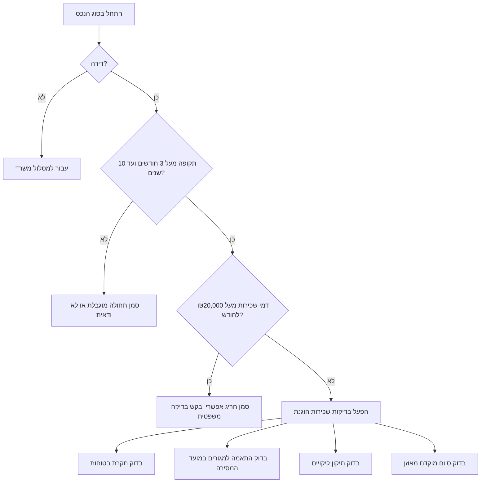

# מחולל הסכמי שכירות

נסח טיוטות הסכם שכירות לדירות ולמשרדים בישראל על בסיס נתונים מובנים. השתמש בכלי עבור עסקים קטנים, עצמאים, משכירים, שוכרים וצרכנים הזקוקים לטיוטה מעשית, רשימת בדיקה וזיהוי סיכונים לפני חתימה.

הטיוטה אינה מחליפה ייעוץ משפטי, מס, ביטוח, הנדסה, תכנון, נגישות או רישוי עסקים. בדוק את הדין העדכני ואת נסיבות העסקה לפני חתימה.

## תוצרים מרכזיים

- הפק טיוטה בעברית או באנגלית להסכם שכירות דירה או משרד.
- אתר כשלים נפוצים: תקרת בטוחות בדירת מגורים, התאמה למגורים, תיקון ליקויים, סיום מוקדם חד צדדי, מע"מ, ארנונה, דמי ניהול ושימוש מותר.
- צור רשימות בדיקה לחתימה, מסירה, ניהול שוטף, הארכה ופינוי.
- כתוב תאריכים בתבנית DD/MM/YYYY וסכומים בשקלים: ₪.
- שמור על לשון ציווי ניטרלית וברורה.

## נתונים שיש לאסוף

| תחום | חובה לאסוף | רצוי להוסיף |
| --- | --- | --- |
| צדדים | שם מלא, מספר מזהה, כתובת, טלפון, דואר אלקטרוני | מספר תאגיד, מורשי חתימה, ערבים |
| המושכר | כתובת, עיר, סוג נכס, פרטי גוש וחלקה אם קיימים | שטח, מספר חדרים, חניה, מחסן, ריהוט, ציוד וליקויים |
| תקופה | תאריך התחלה, תאריך סיום, אופציה, הודעה מוקדמת | מועד מסירה, תנאי הארכה, דרך מסירת הודעות |
| תשלומים | דמי שכירות חודשיים, יום תשלום, בטוחות, דמי ניהול | הצמדה למדד, מע"מ, חשבונית מס, ריבית פיגורים |
| שימוש | מגורים או פעילות משרדית | רישיון עסק, שילוט, נגישות, בעלי חיים, שכירות משנה |
| תפעול | תיקונים, ביטוח, ארנונה, חשמל, מים, ועד בית | פרוטוקול מסירה, מונים, מפתחות ותמונות |

## עץ החלטה לדירת מגורים



## עץ החלטה למשרד

```mermaid
graph TD
    A[התחל שכירות משרד] --> B[הגדר שימוש מותר]
    B --> C{העסקה חייבת במע"מ?}
    C -->|כן| D[הוסף מע"מ וחשבונית מס]
    C -->|לא או לא ידוע| E[בקש בדיקת מס]
    B --> F[חלק ארנונה, דמי ניהול ושירותים]
    F --> G[בדוק שילוט, גישה, נגישות ורישיון עסק]
    G --> H[הוסף ביטוח ושיפוי לפי דין]
    H --> I[צרף פרוטוקול מסירה וכללי התאמות]
```

## הליך ניסוח

1. סווג את העסקה כדירה או כמשרד.
2. בדוק אם תיקוני חוק השכירות והשאילה עשויים לחול.
3. נרמל תאריכים לתבנית DD/MM/YYYY.
4. הצג כל סכום ב-₪ וציין אם מע"מ חל.
5. הפרד בין דמי שכירות, דמי ניהול, ארנונה, שירותים ובטוחות.
6. הימנע מחילוט אוטומטי של בטוחה.
7. הוסף פרוטוקול מסירה ופרוטוקול השבה.
8. הוסף סעיף תיקונים המבחין בין פגם דחוף לבין פגם רגיל.
9. נסח זכות סיום מוקדם באופן הדדי או מאוזן.
10. העבר פרטים תפעוליים לנספחים חתומים.

## דוגמאות סעיפים

### הצהרת משכיר

```text
המשכיר מצהיר כי הוא בעל הזכויות במושכר או מוסמך להשכירו, וכי ימסור לשוכר אסמכתה מתאימה לפני החתימה.
```

### מטרת השימוש

בדירת מגורים, קבע שימוש למגורים בלבד אלא אם נבדק שימוש ביתי מצומצם. במשרד, הגדר את הפעילות במדויק.

```text
השוכר רשאי להשתמש במושכר כמשרד ייעוץ בלבד, ללא מסחר קמעונאי, ייצור, לינה, הכנת מזון או קבלת קהל חריגה, אלא אם ניתנה הסכמה בכתב ומראש.
```

### דמי שכירות ומע"מ

בדירת מגורים לתקופה שאינה עולה על 25 שנים, דמי השכירות פטורים בדרך כלל ממע"מ, למעט חריגים בדין. במשרד, בדוק אם המשכיר הוא עוסק ואם העסקה חייבת במע"מ. השתמש בשיעור 18% כשיעור המע"מ הסטנדרטי שאומת ביום 04/06/2026, ודרוש בדיקת מס בכל מקרה גבולי.

### בטוחות

בדירת מגורים שעליה חלים תיקוני חוק השכירות והשאילה, בדוק את תקרת הבטוחות: הנמוך מבין שליש מדמי השכירות לכל התקופה לבין שלושה חודשי שכירות. אל תנסח שטרות פתוחים, ערבות בלתי מוגבלת או חילוט אוטומטי.

### תיקונים וליקויים

קבע חובת מסירה כשהמושכר מתאים לשימוש המוסכם. דרוש פרוטוקול מסירה עם תמונות, קריאות מונים, מספר מפתחות, רשימת ציוד, ליקויים ידועים ומועדי תיקון.

### סיום מוקדם

הימנע מזכות סיום מוקדם חד צדדית למשכיר בלבד. אם קיימת זכות סיום מוקדם, קבע הודעה מוקדמת, איתור שוכר חלופי, התחשבנות סופית והדדיות.

## מקרי קצה

### שכירות קצרה בדירה

כאשר התקופה עד 3 חודשים, חלק ממנגנוני ההגנה עשויים שלא לחול. עדיין כלול התאמה לשימוש, בטוחות, תשלומים, מסירה והשבה.

### דירת יוקרה

כאשר דמי השכירות החודשיים גבוהים מהסף הרלוונטי, תחולת חלק מההוראות עשויה להשתנות. סמן את הנושא לבדיקה משפטית ואל תציג הגנות קוגנטיות כוודאיות.

### דיירות מוגנת

אל תיצור או תשנה זכויות דיירות מוגנת באמצעות כלי זה. אם מוזכרים דמי מפתח, דייר מוגן, שכירות היסטורית או הסדר מוגן קודם, עצור והעבר לבדיקה מקצועית.

### החלפת שותף בדירה

דרוש הסכמה בכתב, קריטריונים ענייניים לאישור, בדיקת זהות, עדכון ערבים וחלוקת בטוחות. אל תשאיר אחריות בלתי מוגבלת לשוכר שיצא לאחר שאושר מחליף, אלא לאחר בדיקה משפטית.

### עצמאי השוכר משרד קטן

הוסף מע"מ, חשבונית מס, ארנונה, דמי ניהול, רישיון עסק, שילוט, שטחים משותפים, שעות גישה, ביטוח, פרטיות לקוחות ופינוי ציוד בסיום.

### עבודה מהבית בדירת מגורים

אל תהפוך הסכם מגורים להסכם מסחרי ללא כוונה. אפשר שימוש מנהלי מצומצם שאינו כולל קבלת קהל רק לאחר בדיקת מגבלות עירייה, מס, ביטוח ותקנון בית משותף.

## ניסוחים שיש להימנע מהם

| ניסוח בעייתי | סיכון | ניסוח בטוח יותר |
| --- | --- | --- |
| "הבטוחה תחולט בגין כל הפרה" | סנקציה גורפת ולא מידתית | מימוש רק בגין חוב מוכח או נזק לאחר הודעה |
| "השוכר מוותר על כל זכות לפי דין" | זכות קוגנטית אינה ניתנת לוויתור | קבע שהוראות דין קוגנטיות גוברות |
| "המשכיר רשאי לסיים בכל עת" | חד צדדי ולא יציב | קבע זכות הדדית, עילה מוגדרת והודעה מוקדמת |
| "השוכר יתקן כל תקלה" | עלול לסתור חובות משכיר | חלק בין בלאי, שימוש לא סביר ומערכות המשכיר |
| "מע"מ ככל שיחול" | עמימות מסחרית | קבע טיפול מס ברור או דרוש בדיקת מס |
| "המושכר במצבו כפי שהוא" | אינו פותר התאמה למגורים | הוסף גילוי ליקויים ופרוטוקול מסירה |

## מפת טיפול בתקלות

```mermaid
graph TD
    A[נמצא כשל] --> B{כספי?}
    B -->|כן| C[הפרד שכירות, מע"מ, בטוחות, ארנונה ושירותים]
    B -->|לא| D{מצב המושכר?}
    D -->|כן| E[הוסף פרוטוקול, תמונות ומועדי תיקון]
    D -->|לא| F{שימוש?}
    F -->|כן| G[הגדר שימוש מותר והגבלות]
    F -->|לא| H[העבר לבדיקה משפטית]
```

## רשימת בדיקה לפני שליחה

- אמת שמות, מספרים מזהים וכתובות.
- אמת בעלות או הרשאה להשכיר.
- בדוק פרטי גוש, חלקה ותת חלקה כאשר קיימים.
- בדוק תחולת תיקוני חוק השכירות והשאילה.
- בדוק תקרת בטוחות בדירת מגורים.
- בדוק טיפול במע"מ בשכירות משרד.
- הוסף פרוטוקול מסירה עם מונים ותמונות.
- צרף רשימת מצאי בדירה מרוהטת.
- הגדר ביטוח ואחריות.
- הגדר תיקון פגמים ותיאום כניסה.
- חלק ארנונה, חשמל, מים, ועד בית ודמי ניהול.
- קבע כתובות למסירת הודעות ודרכי מסירה.
- הסר תנאים חד צדדיים או עונשיים.
- הוסף חתימות ונספחים.
- סמן שאלות משפט, מס, תכנון, הנדסה או ביטוח שלא נפתרו.

## מבנה פלט מומלץ

1. כותרת ואזהרת בדיקה.
2. צדדים.
3. המושכר.
4. תקופה ואופציה.
5. דמי שכירות ותשלומים.
6. בטוחות.
7. מצב המושכר ותיקונים.
8. שימוש, ביטוח ואחריות.
9. סיום מוקדם והפרות.
10. תנאים מיוחדים.
11. ממצאי בדיקה.
12. נספחים.

## תקן איכות

העדף סעיפים קצרים ומעשיים. השתמש בתאריכים, סכומים, כתובות ושמות מסמכים מדויקים. אל תמציא עובדות. סמן מידע חסר במקום להסתיר אותו.
