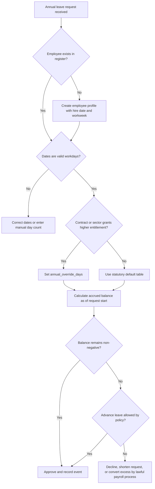
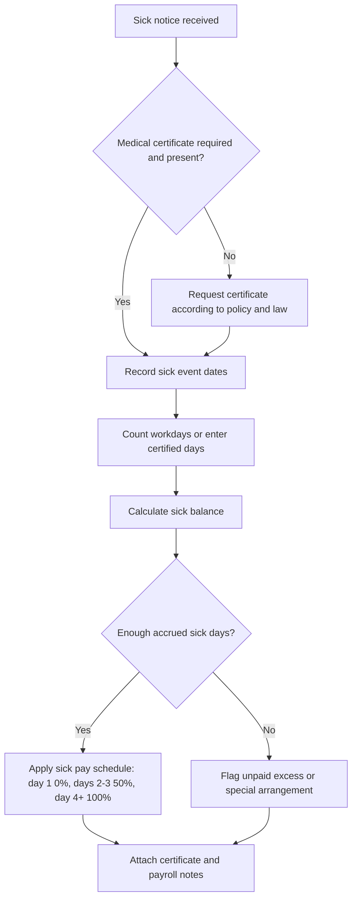
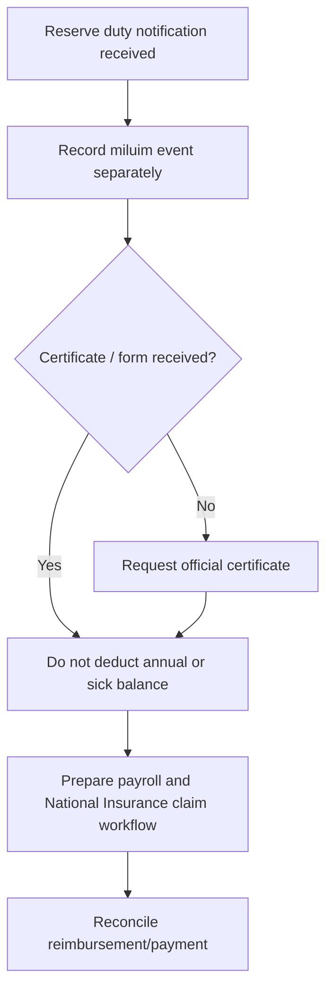
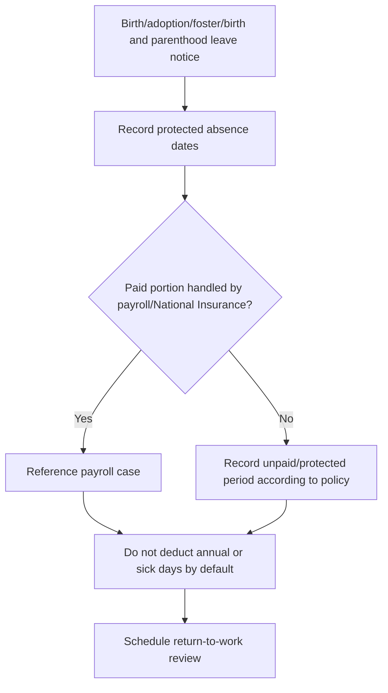
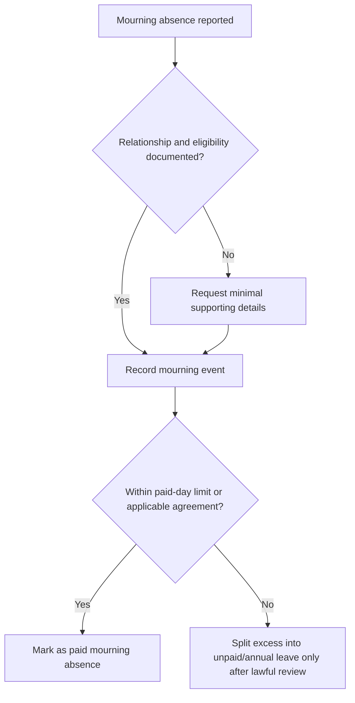

# Annual Leave & Sick-Day Tracker

Use this skill to design, audit, or operate a practical leave register for Israeli small businesses, freelancers who employ staff, household employers, payroll coordinators, and consumers checking payslips. Track statutory and policy balances, identify payroll risks, and prepare clean handoffs to accountants or payroll bureaus.

This skill does not replace legal, tax, or payroll advice. Treat statutory tables as configurable inputs. Verify current law, extension orders, collective agreements, personal contracts, and employer policies before payroll close.

## Operating principles

1. Track each absence as an event, not as a monthly note.
2. Separate entitlement accrual from payment treatment.
3. Keep annual leave, sick leave, reserve duty, birth and parenthood leave, and mourning leave in distinct ledgers.
4. Preserve source documents: approval, medical certificate, reserve duty certificate, birth/adoption/foster documentation, or mourning declaration.
5. Use Israeli workweek logic: 5-day workweek normally counts Sunday-Thursday; 6-day workweek normally counts Sunday-Friday.
6. Store dates in `DD/MM/YYYY` for local files or ISO `YYYY-MM-DD` for integrations. Never mix formats in the same CSV.
7. Keep every default overrideable because Israeli employment terms often depend on sector, seniority, work scope, and collective agreements.

## What the tracker covers

| Area | Default handling | Balance impact | Payroll risk to check |
|---|---:|---:|---|
| Annual leave | Accrues by seniority and workweek | Deduct used days | Negative balance, incorrect seniority year, forced vacation notice |
| Sick days | Accrues 1.5 days/month up to 90 days by default | Deduct sick days | Sick pay schedule, medical certificate, unpaid continuation |
| Miluim | Track protected reserve-duty absence | No annual/sick deduction | National Insurance claim, certificate dates, pension/social benefit handling |
| Birth and parenthood leave | Track protected leave period | No annual/sick deduction by default | Start/end dates, protected period, benefits, return-to-work restrictions |
| Mourning days | Track paid bereavement/shiva days by policy/statutory context | No annual/sick deduction by default | Relationship, eligibility, collective agreement, excess days |

## Web-validated 2026 baseline

Treat the following as the verified default baseline for this release. Adjust employee records when a contract, extension order, collective agreement, sector rule, or employer policy is more generous.

| Seniority year | 5-day statutory net workdays | 6-day statutory net workdays |
|---:|---:|---:|
| 1-5 | 12 | 14 |
| 6 | 14 | 16 |
| 7 | 15 | 18 |
| 8 | 16 | 19 |
| 9 | 17 | 20 |
| 10 | 18 | 21 |
| 11 | 19 | 22 |
| 12 | 20 | 23 |
| 13+ | 20 | 24 |

For many 5-day workplaces covered by the short-workweek extension order, net annual leave may be more generous from year 6 onward. Enter `annual_override_days` instead of changing historical events. Sick days remain configurable with the default `1.5` days per full month and `90` day cap. The default sick-pay equivalent remains day 1 at `0%`, days 2-3 at `50%`, and day 4 onward at `100%` unless a more generous arrangement applies.

The 2026 validation pass also records the current Israeli VAT rate as `18%` from `01/01/2025`. VAT is not used in leave-balance calculations; include it only when preparing external billing or professional-service examples.

## Core data model

### Employee profile

Required fields:

```csv
employee_id,name,hire_date,work_week_days
E001,Dana Levi,01/01/2024,5
```

Recommended fields:

```csv
opening_annual_balance,opening_sick_balance,annual_override_days,sick_monthly_accrual,sick_cap_days,mourning_paid_days_limit,notes
0,0,,1.5,90,7,Standard full-time employee
```

Use `annual_override_days` when a contract, sector rule, collective agreement, or employer policy gives a more generous entitlement than the default statutory table.

### Leave event

```csv
employee_id,absence_type,start_date,end_date,days,approved,reference,notes
E001,annual,18/08/2024,22/08/2024,,true,VAC-2024-001,Summer vacation
E001,sick,01/09/2024,03/09/2024,,true,MED-4432,Medical certificate received
E001,miluim,10-10-2024,17-10-2024,,true,3010-RESERVE,Reserve duty certificate received
```

Allowed `absence_type` values:

- `annual`
- `sick`
- `miluim`
- `parental`
- `mourning`

Leave `days` empty to count Israeli workdays automatically. Fill `days` for half-days, part-time schedules, amended certificates, or payroll-approved exceptions.

## Annual leave decision tree



## Sick leave decision tree



## Miluim decision tree



## Birth and parenthood leave decision tree



## Mourning day decision tree



## Concrete examples

### Example 1: New employee on a 5-day workweek

Hire date: `01/01/2024`  
As-of date: `31/12/2024`  
Default entitlement: 12 annual workdays  
Sick accrual: 18 days (`1.5 × 12`)  
Annual leave taken: `18/08/2024` to `22/08/2024` = 5 workdays  

Result:

```json
{
  "annual_accrued": 12.0,
  "annual_used": 5.0,
  "annual_balance": 7.0,
  "sick_accrued": 18.0,
  "sick_used": 0.0,
  "sick_balance": 18.0
}
```

### Example 2: Sick leave payment equivalent

A continuous 5-day sick event pays by default as:

| Sick day | Payment rate | Paid-day equivalent |
|---:|---:|---:|
| 1 | 0% | 0 |
| 2 | 50% | 0.5 |
| 3 | 50% | 0.5 |
| 4 | 100% | 1 |
| 5 | 100% | 1 |

Total paid-day equivalent: `3.0`.

### Example 3: Miluim during a busy payroll month

Do not deduct annual leave or sick balance. Record the event, attach the certificate, and reconcile payroll treatment against the National Insurance process. For 2026 and later, check current extension orders for additional spouse/reservist absence rights before closing payroll. Keep the event visible in the absence calendar so managers understand capacity loss.

### Example 4: Mourning days exceeding policy

If the default paid limit is 7 days and the recorded event is 8 days, keep all 8 days in the mourning ledger and raise a warning. Do not automatically deduct the extra day from annual leave. Review employment contract, collective agreement, religion/custom, and employer policy first.

### Example 5: Part-time employee

Do not blindly use full-time statutory defaults. Enter the actual work pattern and override `days` on events if automatic Sunday-Thursday counting overstates absence. For recurring part-time schedules, keep a separate roster file and feed approved day counts into `events.csv`.

## Edge cases

### Employee starts mid-year

Prorate accrual by calendar months touched unless payroll policy requires a more exact method. Example: hire on `01/07/2024` gives `6.0` annual days under a 12-day annual entitlement.

### Employee leaves mid-month

Set the as-of date to the termination date. Prorate only through that date and reconcile final annual leave redemption or negative balance handling with payroll/legal advice.

### Employee moves from 6-day to 5-day workweek

Split the year into two periods or set a manual annual entitlement override for the transition year. Keep an audit note explaining the method.

### Employee transfers from contractor to employee

Use the statutory employment start date, not the supplier onboarding date. If continuity has been recognized by agreement or ruling, set the hire date accordingly and attach the basis.

### Overlapping events

Do not double-deduct. Split or reject overlaps. A sick certificate during approved vacation may require legal review before converting vacation days back to sick days.

### Holidays inside leave period

Automatic counting uses workdays only and does not know public holidays. Deduct holiday days only when policy and law allow it. For production, maintain a holiday calendar and subtract non-working holiday dates before payroll close.

### Half-days

Set `days=0.5` manually. Store the start/end dates anyway so the calendar remains understandable.

### Negative balances

Negative annual balance may represent approved advance vacation. Negative sick balance usually signals unpaid excess sick leave or a special arrangement. Never hide negative balances; explain them in the payroll note.

### Unsigned or unapproved requests

Set `approved=false` until approval. Unapproved events remain in the raw file but should not reduce balances.

### Multiple legal bases

When personal contract, collective agreement, sector order, or employer policy is more generous than statutory minimum, apply the more generous rule and document the source.

## Anti-patterns

- Do not merge annual leave and sick leave into one "absence" column.
- Do not deduct miluim from vacation.
- Do not deduct birth and parenthood leave from sick days.
- Do not assume every Israeli employee works Monday-Friday.
- Do not calculate sick pay from total monthly sick days when the payroll rule depends on each continuous event.
- Do not overwrite historical balances after payroll closes. Add adjustment events instead.
- Do not store medical details beyond the minimum needed for payroll and compliance.
- Do not rely on screenshots of WhatsApp approvals as the only audit trail when a formal approval workflow exists.
- Do not hard-code statutory rates without a yearly review.
- Do not use this tool as a substitute for a licensed payroll system where formal payroll filing is required.

## Production checklist

Before first payroll close:

- [ ] Confirm workweek type for every employee.
- [ ] Confirm hire date and recognized seniority.
- [ ] Confirm annual entitlement table or override.
- [ ] Confirm sick accrual cap and monthly accrual.
- [ ] Confirm holiday calendar treatment.
- [ ] Confirm carryover and expiration policy.
- [ ] Confirm approval workflow and required documents.
- [ ] Import opening balances from prior payroll system.
- [ ] Run at least 20 test scenarios from `references/test-scenarios.md`.
- [ ] Reconcile sample employees against accountant/payroll bureau results.
- [ ] Lock closed months and record corrections as adjustments.
- [ ] Define data retention and privacy controls.
- [ ] Schedule annual legal review.

## Troubleshooting quick checks

| Symptom | Likely cause | Fix |
|---|---|---|
| Vacation balance too high | Missing approved annual events | Import events and rerun summary |
| Vacation balance too low | Holidays/weekends counted as leave | Override event days or add holiday-aware preprocessing |
| Sick pay too high | Continuous events merged incorrectly | Split unrelated sick events |
| Sick pay too low | One continuous illness split by mistake | Merge medically continuous days if payroll policy permits |
| Miluim deducted from vacation | Wrong absence type | Change `absence_type` to `miluim` |
| Hebrew CSV opens garbled in Excel | Missing UTF-8 BOM | Use exported CSV or save as UTF-8 with BOM |
| Date rejected | Mixed date formats | Use `DD/MM/YYYY` or ISO consistently |
| Unknown employee error | Event employee_id not in employees.csv | Add employee or correct ID |

## command-line tool quick start

```bash
python scripts/leave_sick_day_tracker_cli.py template ./data
python scripts/leave_sick_day_tracker_cli.py summary ./data/employees.csv ./data/events.csv --as-of 31/12/2024
python scripts/leave_sick_day_tracker_cli.py sick-pay --days 5
```

## File index

- `SKILL.md` — English operating guide.
- `SKILL_HE.md` — Hebrew operating guide with Israeli terminology.
- `references/api-reference.md` — statutory/regulatory references and data contracts.
- `references/workflow-guide.md` — end-to-end workflows.
- `references/troubleshooting.md` — issue-focused diagnostics.
- `references/test-scenarios.md` — 20+ concrete validation cases.
- `references/migration-checklist.md` — migration from spreadsheet or payroll bureau exports.
- `scripts/leave_sick_day_tracker_client.py` — typed sync/async client and calculation engine.
- `scripts/leave_sick_day_tracker_cli.py` — Click-based command-line tool.
- `scripts/test_leave_sick_day_tracker_client.py` — pytest suite.
- `scripts/examples/` — runnable scenarios.


## Installable package check

Run this before using the tracker in production:

```bash
pip install -e .
python -c "from leave_sick_day_tracker import LeaveTrackerClient; print(LeaveTrackerClient.__name__)"
pytest
python -m compileall scripts/ -q
```

Use underscored script filenames only. Avoid dynamic imports from hyphenated Python filenames because they are difficult to package, test, and reuse.
