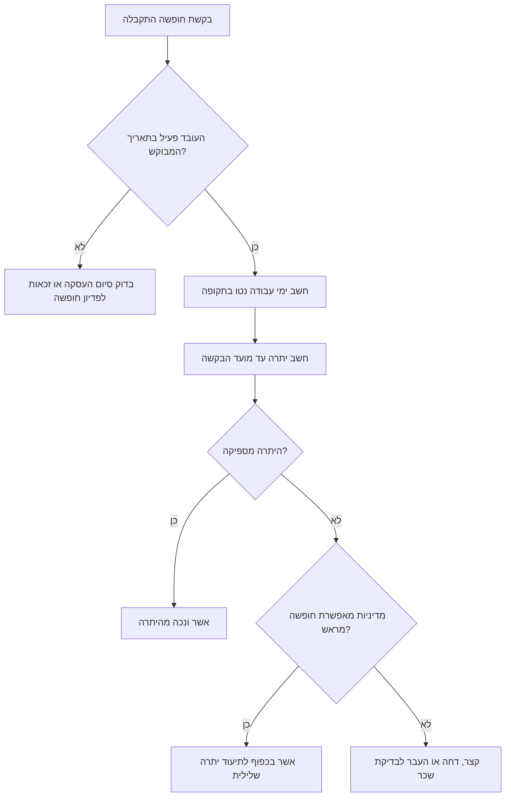
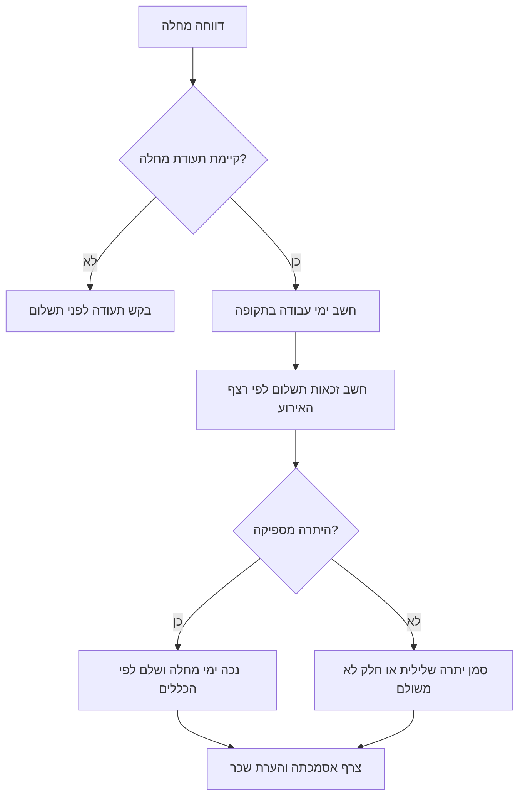

# מעקב ימי חופשה ומחלה

הפעל מעקב מקומי ליתרות חופשה שנתית, ימי מחלה, שירות מילואים, תקופת לידה והורות וימי אבל. שמור קבצי מקור, חשב יתרות, בדוק חריגות, והכן קובץ סיכום לשכר או לבקרה פנימית.

## מטרת השימוש

השתמש במיומנות זו לעסק קטן, עצמאי שמעסיק עובדים, חשב שכר, מנהל משרד, או צרכן שרוצה להבין את יתרת הזכויות. אל תחליף ייעוץ משפטי או בדיקת חשב שכר מוסמך כאשר יש הסכם קיבוצי, צו הרחבה ענפי, נוהג מיטיב, סיום העסקה, חופשה ללא תשלום, או מחלוקת.

## כללי בסיס

- חשב חופשה שנתית בימי עבודה נטו לפי שבוע עבודה של 5 או 6 ימים.
- צבור ימי מחלה לפי 1.5 ימים לחודש, עד תקרה ברירת מחדל של 90 ימים, אלא אם חל הסדר מיטיב.
- חשב דמי מחלה לאירוע רציף: יום ראשון 0%, יום שני ושלישי 50%, יום רביעי ואילך 100%.
- אל תנכה שירות שירות מילואים, תקופת לידה והורות או ימי אבל מיתרת החופשה השנתית, אלא אם קיימת הוראה חוקית או חוזית מפורשת אחרת.
- שמור אסמכתאות: אישור חופשה, תעודת מחלה, אישור שירות מילואים, הודעת לידה או מסמך אבל.
- הצג סכומים כספיים בשקלים חדשים, למשל ₪1,250.00, ותאריכים בפורמט DD/MM/YYYY.

## קבצי קלט

### employees.csv

```csv
employee_id,name,hire_date,work_week_days,opening_annual_balance,opening_sick_balance,annual_override_days,sick_monthly_accrual,sick_cap_days,mourning_paid_days_limit,notes
E001,Dana Levi,01/01/2024,5,0,0,,1.5,90,7,עובדת לדוגמה
```

### events.csv

```csv
employee_id,absence_type,start_date,end_date,days,approved,reference,notes
E001,annual,18/08/2024,22/08/2024,,true,VAC-2024-001,חופשה מאושרת
E001,sick,01/09/2024,03/09/2024,,true,SICK-2024-004,תעודת מחלה התקבלה
E001,miluim,03/03/2024,14/03/2024,,true,MIL-2024-011,אישור מילואים
```

## תהליך עבודה מומלץ

1. פתח תיקיית עבודה לפי חודש שכר.
2. צור תבניות קלט.
3. מלא עובדים פעילים ועובדים שעזבו במהלך התקופה.
4. הזן אירועי היעדרות מאושרים בלבד.
5. הפעל חישוב יתרות לתאריך סגירת השכר.
6. בדוק אזהרות על יתרה שלילית, אירוע מחלה ארוך, או ימי אבל מעל מגבלת המדיניות.
7. שמור קובץ סיכום וצרף אותו לתיק השכר.
8. תעד כל חריגה שאושרה על ידי מעסיק או חשב שכר.

## דוגמת שימוש בשורת פקודה

```bash
pip install -e .
pip install -r requirements-dev.txt
leave-sick-day-tracker template ./data
leave-sick-day-tracker summary ./data/employees.csv ./data/events.csv --as-of 31/12/2024
```

## דוגמת שימוש בפייתון

```python
from leave_sick_day_tracker import EmployeeProfile, LeaveEvent, LeaveTrackerClient

employee = EmployeeProfile("E001", "Dana Levi", "01/01/2024")
tracker = LeaveTrackerClient([employee])
tracker.record_event(LeaveEvent("E001", "annual", "18/08/2024", "22/08/2024"))
print(tracker.balance("E001", "31/12/2024").to_dict())
```

## עץ החלטה לחופשה שנתית



## עץ החלטה למחלה



## מקרי קצה

- עובד התחיל באמצע חודש: צבור לפי חודשים שנוגעים בתקופת ההעסקה, ואז בדוק אם נדרש חישוב מדויק יותר לפי מדיניות השכר.
- עובד במשרה חלקית: שמור את שיעור המשרה בשדה הערות או הוסף עמודה פנימית לפני חישוב השכר.
- שבוע עבודה שונה: הגדר 5 או 6 ימי עבודה, ואל תערבב עובדים בעלי שבוע עבודה שונה באותו חישוב ללא בדיקה.
- חופשה שחוצה שנה: חשב את הצבירה לפי כל שנת לוח בנפרד.
- מחלה רציפה עם סוף שבוע באמצע: ודא אם נדרש לספור ימים קלנדריים או ימי עבודה לפי שיטת השכר הנהוגה.
- שירות מילואים: שמור אישור רשמי ואל תנכה מיתרת חופשה או מחלה.
- תקופת לידה והורות: הפרד בין תקופה בתשלום, תקופה ללא תשלום, והשלכות ותק לפי הדין והמדיניות.
- אבל: בדוק קרבה משפחתית, תקנון פנימי והסכם קיבוצי.
- יתרה שלילית: אל בצע ניכוי כספי ללא בדיקה מוקדמת של דין, חוזה, הסכמה ותיעוד.

## תקלות נפוצות

- תאריך לא נקלט: השתמש ב-DD/MM/YYYY או YYYY-MM-DD.
- יתרה גבוהה מדי: בדוק יתרת פתיחה, כפל אירועים, והגדרת שבוע עבודה.
- יתרה נמוכה מדי: בדוק אירועים שלא אושרו, תאריכים שחוצים סוף שבוע, וחישוב ידני שהוזן בעמודת `days`.
- מחלה לא שולמה כמצופה: ודא שהאירוע רציף ושלא פוצל לכמה אירועים.
- עברית נראית הפוכה בקובץ: פתח את CSV בקידוד UTF-8 עם חתימת BOM או ייבא דרך אשף נתונים.

## דפוסים שיש להימנע מהם

- אל תעדכן יתרות ידנית ללא רישום אירוע.
- אל תערבב חופשה, מחלה ומילואים באותו סוג היעדרות.
- אל תשתמש בתאריך אמריקאי MM/DD/YYYY.
- אל תמחק אירוע שגוי; סמן אותו כלא מאושר והוסף אירוע מתקן.
- אל תניח שכל הענפים במשק כפופים לאותה מדיניות מיטיבה.

## רשימת בדיקה לפני שימוש שוטף

- ודא שכל העובדים כוללים תאריך תחילת עבודה תקין.
- ודא ששבוע העבודה מוגדר נכון לכל עובד.
- אשר יתרות פתיחה מול תלוש אחרון או מערכת קודמת.
- הרץ לפחות 20 תרחישי בדיקה מתוך `references/test-scenarios.md`.
- שמור גיבוי לפני עדכון חודש שכר.
- העבר חריגות לחשב שכר לפני סגירת שכר.

## פלט צפוי

הפלט כולל יתרת חופשה, יתרת מחלה, ימי מחלה ששולמו במונחי ימים, ימי שירות מילואים, ימי תקופת לידה והורות, ימי אבל ואזהרות. הצג סכומי פדיון או התאמות שכר ב-₪ רק לאחר אישור מקצועי.
