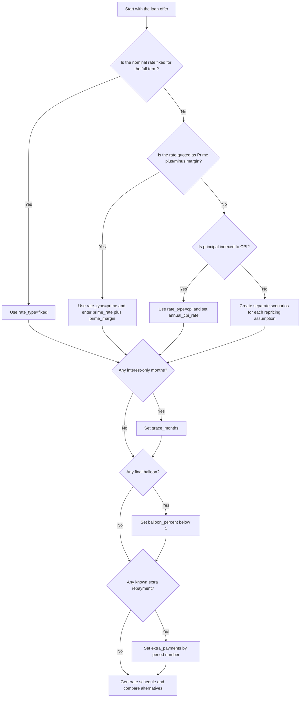
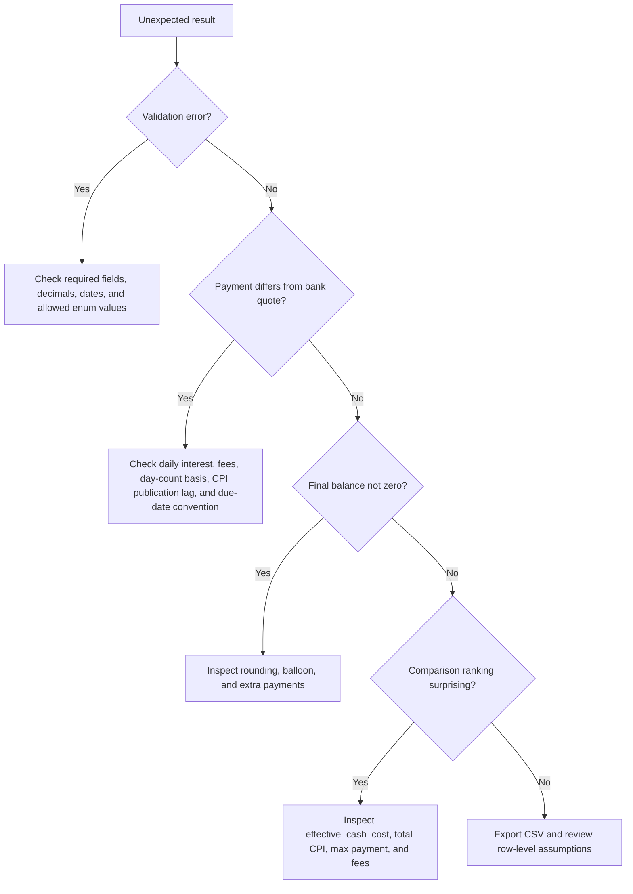

# Loan Amortization Planner

Calculate auditable repayment schedules for Israeli fixed-rate, prime-linked, and CPI-linked loans. Use the skill for small-business cash-flow planning, freelancer financing, consumer loans, equipment purchases, renovation loans, vehicle balloon loans, and offer comparison.

The planner is offline-first. It does not call a bank, credit bureau, Bank of Israel endpoint, or tax authority service. Enter the assumptions explicitly, keep the source of each assumption in the workpaper, and treat the result as planning support rather than legal, tax, or banking advice.

## What this skill does

- Build monthly or quarterly amortization schedules in ₪.
- Support fixed-rate, prime-linked, and CPI-linked scenarios.
- Model grace periods, balloon payments, one-off extra repayments, origination fees, and early-repayment fees.
- Compare multiple offers by total interest, CPI adjustment, total paid, maximum payment, and effective cash cost.
- Export JSON and CSV schedules for review, bookkeeping files, or decision memos.
- Provide a structured Python helper, Typer CLI, runnable examples, and pytest coverage.

## Files

| Path | Purpose |
|---|---|
| `SKILL.md` | English operating guide |
| `SKILL_HE.md` | Hebrew operating guide |
| `README.md` | Installation, quick start, and file index |
| `references/api-reference.md` | Regulatory/API and data-source reference |
| `references/workflow-guide.md` | End-to-end business workflows |
| `references/troubleshooting.md` | Errors, symptoms, causes, and fixes |
| `references/test-scenarios.md` | 20+ concrete validation scenarios |
| `references/migration-checklist.md` | Migration and adoption checklist |
| `scripts/loan_amortization_planner_client.py` | Typed sync/async structured helper |
| `scripts/loan_amortization_planner_cli.py` | Typer CLI |
| `scripts/examples/` | Runnable scenario scripts |
| `scripts/test_loan_amortization_planner_client.py` | pytest suite |


## Web-validated official assumptions

The package remains offline-first. Enter every rate explicitly and refresh assumptions before production use. The following public-source checks were added on 2026-06-02:

| Assumption | Verified value or rule | Operational effect |
|---|---|---|
| Standard Israeli VAT | 18% from 01/01/2025 and still used in 2026 public references | VAT is not calculated by the planner; use this only for surrounding cash-flow workpapers |
| Bank of Israel rate | 3.75% after the 25/05/2026 Monetary Committee decision | Use as the current base rate if modelling a fresh prime-linked case |
| Prime interest | Bank of Israel interest + 1.5% | Current implied planning input is 5.25%, before any lender margin |
| CPI publication timing | Price indices are published on the 15th of the month at 18:30, with holiday/weekend adjustments | CPI scenarios remain forecast inputs unless imported from an external data process |
| CBS CPI API | `https://api.cbs.gov.il/index/...` endpoint family exists for index data | The package does not call it automatically |

The shipped examples use 5.25% as the current prime base rate where a live-current example is needed. Fixed-rate and CPI-rate examples remain illustrative planning assumptions.

## Inputs

Use annual nominal rates as decimals. For example, enter 6.5% as `0.065`.

```json
{
  "name": "equipment loan",
  "principal": "250000",
  "term_months": 72,
  "start_date": "01/07/2026",
  "rate_type": "fixed",
  "annual_interest_rate": "0.065",
  "origination_fee": "1200"
}
```

### Field reference

| Field | Required | Example | Notes |
|---|---:|---|---|
| `principal` | Yes | `"250000"` | Loan amount in ₪ before fees |
| `term_months` | Yes | `72` | Total contractual term |
| `start_date` | Yes | `"01/07/2026"` | Accepts `DD/MM/YYYY` or `YYYY-MM-DD` |
| `rate_type` | No | `"fixed"` | `fixed`, `prime`, or `cpi` |
| `annual_interest_rate` | Conditional | `"0.065"` | Required for fixed/CPI; optional for prime |
| `prime_rate` | Conditional | `"0.06"` | Required when `rate_type` is `prime` |
| `prime_margin` | No | `"0.015"` | Added to `prime_rate` |
| `annual_cpi_rate` | No | `"0.025"` | CPI assumption for CPI-linked scenarios |
| `payment_frequency` | No | `"monthly"` | `monthly` or `quarterly` |
| `grace_months` | No | `3` | Interest-only periods at the beginning |
| `balloon_percent` | No | `"0.25"` | Principal percent deferred to final period |
| `origination_fee` | No | `"1000"` | Added to effective cash cost |
| `early_payment_fee` | No | `"350"` | Added to effective cash cost |
| `rate_changes` | No | `{"13": "0.085"}` | Period-specific annual rate override |
| `extra_payments` | No | `{"7": "25000"}` | One-off additional principal payments |

## Decision tree



## Calculation model

For each period, calculate opening balance, optional CPI indexation, periodic interest, scheduled principal, extra principal, total payment, and closing balance.

For fixed and prime loans:

1. Determine annual nominal rate.
2. Convert to periodic rate by dividing by payments per year.
3. Calculate annuity payment for remaining periods.
4. Split payment into interest and principal.
5. Apply extra repayments against principal.

For CPI-linked loans:

1. Apply periodic CPI assumption to the opening balance.
2. Calculate interest on the indexed balance.
3. Recalculate the payment using the indexed balance and remaining term.
4. Track CPI adjustment separately from interest.

Rounding uses standard two-decimal rounding for ₪ amounts. For bank-grade reconciliation, keep a bank statement export and verify the final period because lenders may use daily interest, actual CPI publication dates, business-day shifts, or internal rounding rules.

## Concrete examples

### 1. Fixed equipment loan

```bash
python scripts/loan_amortization_planner_cli.py schedule examples/fixed-equipment.json --csv-out out.csv
```

```json
{
  "principal": "250000",
  "term_months": 72,
  "start_date": "01/07/2026",
  "rate_type": "fixed",
  "annual_interest_rate": "0.065",
  "origination_fee": "1200"
}
```

Use this when a small business receives a straightforward bank loan to buy equipment and wants the monthly debt-service amount.

### 2. Prime-linked working-capital loan

```json
{
  "principal": "120000",
  "term_months": 36,
  "start_date": "15/06/2026",
  "rate_type": "prime",
  "prime_rate": "0.0525",
  "prime_margin": "0.018",
  "rate_changes": {"13": "0.085"}
}
```

Use this when the offer states "Prime + 1.8%" and the business wants a sensitivity case where the effective annual rate changes in year two.

### 3. CPI-linked renovation loan

```json
{
  "principal": "180000",
  "term_months": 84,
  "start_date": "01/08/2026",
  "rate_type": "cpi",
  "annual_interest_rate": "0.042",
  "annual_cpi_rate": "0.025"
}
```

Use this when the contract indexes principal to the consumer price index and management wants to separate inflation adjustment from interest.

### 4. Balloon vehicle loan

```json
{
  "principal": "160000",
  "term_months": 36,
  "start_date": "01/09/2026",
  "rate_type": "fixed",
  "annual_interest_rate": "0.068",
  "balloon_percent": "0.25"
}
```

Use this when a commercial vehicle loan defers 25% of principal to the final payment. Check whether the final payment can be covered by vehicle resale, refinancing, or operating cash.

### 5. VAT-refund extra repayment

```json
{
  "principal": "90000",
  "term_months": 48,
  "start_date": "01/07/2026",
  "annual_interest_rate": "0.07",
  "extra_payments": {"7": "25000"},
  "early_payment_fee": "350"
}
```

Use this when a freelancer expects a VAT refund and wants to reduce principal early. Enter the early-payment fee separately so the effective cost remains honest.

## Edge cases

| Case | Expected behavior | Review point |
|---|---|---|
| Zero interest | Principal divided over term | Final payment rounding |
| Prime without `prime_rate` | Validation error | Enter current assumption manually |
| CPI with negative CPI assumption | Allowed mathematically | Confirm contract treatment of negative index |
| Grace equals term | Validation error | At least one amortizing period is required |
| Quarterly payments with 10-month term | Validation error | Term must divide into quarters |
| Large extra payment | Schedule can end early | Check lender prepayment limits |
| Balloon percent `1` | Validation error | Balloon must be less than 100% |
| Month-end start date | Due date rolls to last valid day | Confirm bank due-date convention |
| Rate change mid-period | Not modelled directly | Use period-level approximation |
| Daily interest contract | Not modelled directly | Reconcile with lender statement |

## Anti-patterns

- Do not mix percent notation and decimal notation. Use `0.065`, not `6.5`.
- Do not compare CPI-linked and fixed loans using only the headline interest rate.
- Do not omit fees when comparing offers.
- Do not treat the prime rate as automatically current. Enter the assumption used in the decision memo.
- Do not use a single CPI forecast as certainty. Build low, base, and high scenarios.
- Do not assume an early repayment always saves money. Include exit fees and lost liquidity.
- Do not ignore VAT timing when modelling freelancer or small-business cash flow.
- Do not use this schedule as the only legal interpretation of a loan contract.

## Troubleshooting quick guide



## Production checklist

Before using results in a credit memo, budget, or client-facing report:

- Confirm principal, net disbursement, and all fees.
- Confirm nominal rate, linkage type, margin, and reset rules.
- Confirm whether CPI adjustment is daily, monthly, known-index, or published-index based.
- Confirm repayment frequency and exact due date.
- Confirm whether grace is full grace or interest-only grace.
- Confirm whether balloon is contractual and whether it accrues interest.
- Confirm early repayment fee and notice requirements.
- Run at least three scenarios for variable-rate loans.
- Export CSV and archive the input JSON with the decision memo.
- Label output as planning support and not lender confirmation.
- Reconcile the first payment against lender documentation before relying on later rows.
- Review tax/accounting treatment with a qualified adviser when material.

## Output interpretation

| Output | Meaning |
|---|---|
| `total_interest` | Interest charged over the generated schedule |
| `total_cpi_adjustment` | Added principal from CPI assumptions |
| `total_paid` | Payments made to the lender, excluding separate fees |
| `fees` | Entered origination and early-payment fees |
| `effective_cash_cost` | `total_paid + fees - principal` |
| `max_payment` | Highest scheduled payment, useful for liquidity checks |
| `final_balance` | Should normally be zero unless scenario ends early or uses custom assumptions |
| `periods` | Number of generated payment periods |

## Suggested scenario set

For a prime-linked loan, prepare at least:

1. Base case: current prime plus margin.
2. Up case: prime increases after 12 periods.
3. Down case: prime decreases after 12 periods.
4. Liquidity case: same rate as base, plus delayed customer receipts and no extra repayment.
5. Early repayment case: expected VAT refund or seasonal surplus applied to principal.

For a CPI-linked loan, prepare at least:

1. CPI at 0%.
2. CPI at a low planning assumption.
3. CPI at a high stress assumption.
4. CPI plus a short grace period.
5. Fixed-rate alternative with the same term and fees.

## Disclaimer / הבהרה

This skill is a preparation and automation aid only. It does not constitute tax, legal, financial, or other professional advice, and its output must be reviewed by a licensed professional (רו"ח / עו"ד / יועץ מס) before any filing, payment, or contractual use.

כלי זה מהווה שכבת הכנה ואוטומציה בלבד. אין בו ייעוץ מס, ייעוץ משפטי או ייעוץ מקצועי אחר, ויש לאמת כל פלט מול בעל מקצוע מורשה לפני הגשה, תשלום או שימוש חוזי.
