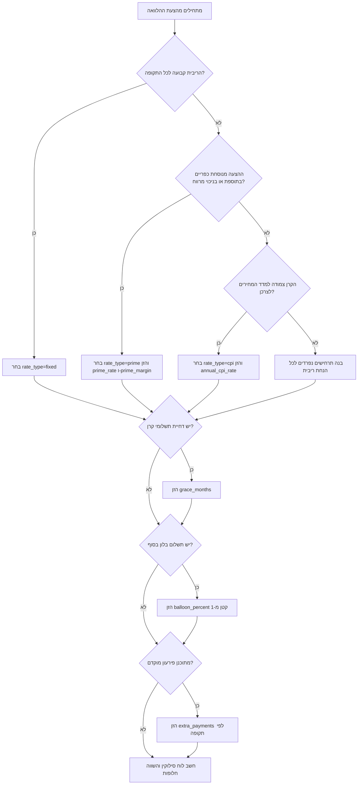
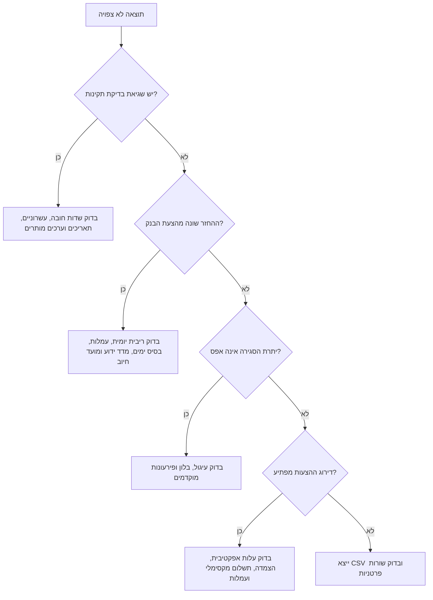

# מתכנן סילוקין להלוואות

חשב לוחות סילוקין ניתנים לבקרה עבור הלוואות בישראל: ריבית קבועה, מסלול צמוד פריים, ומסלול צמוד מדד. השתמש בכלי לתכנון תזרים של עסקים קטנים, עצמאים, משקי בית, רכישת ציוד, שיפוץ, רכב מסחרי, הלוואות בלון והשוואת הצעות אשראי.

הכלי פועל מקומית ואינו פונה לבנק, ללשכת אשראי, לבנק ישראל או לרשות המסים. הזן את ההנחות במפורש, שמור אסמכתה לכל הנחה, והתייחס לתוצאה ככלי תכנון ולא כייעוץ משפטי, מס, חשבונאי או בנקאי.

## מה הכלי עושה

- בונה לוח סילוקין חודשי או רבעוני ב-₪.
- תומך בריבית קבועה, פריים, והצמדה למדד המחירים לצרכן.
- מדמה תקופת דחיית תשלומי קרן, תשלום בלון, פירעונות מוקדמים חד-פעמיים, עמלת הקמה ועמלת פירעון מוקדם.
- משווה בין הצעות לפי סך ריבית, הפרשי הצמדה, סך תשלומים, תשלום מקסימלי ועלות מזומן אפקטיבית.
- מייצא JSON ו-CSV לצורך בדיקה, תיעוד הנהלת חשבונות או מזכר החלטה.
- כולל קובץ Python מובנה, CLI, דוגמאות רצות ובדיקות pytest.

## קבצים

| נתיב | מטרה |
|---|---|
| `SKILL.md` | מדריך הפעלה באנגלית |
| `SKILL_HE.md` | מדריך הפעלה בעברית |
| `README.md` | התקנה, התחלה מהירה ואינדקס קבצים |
| `references/api-reference.md` | מקורות מידע, רגולציה ומבני קלט/פלט |
| `references/workflow-guide.md` | תהליכי עבודה מקצה לקצה |
| `references/troubleshooting.md` | תקלות, סיבות ופתרונות |
| `references/test-scenarios.md` | יותר מ-20 תרחישי בדיקה |
| `references/migration-checklist.md` | רשימת מעבר והטמעה |
| `scripts/loan_amortization_planner_client.py` | עזר חישוב מסודר, סינכרוני ואסינכרוני |
| `scripts/loan_amortization_planner_cli.py` | ממשק פקודה |
| `scripts/examples/` | תרחישים ניתנים להרצה |
| `scripts/test_loan_amortization_planner_client.py` | חבילת בדיקות pytest |


## הנחות רשמיות שנבדקו באינטרנט

החבילה ממשיכה לפעול ללא חיבור למקורות חיצוניים. הזן כל שיעור במפורש ורענן הנחות לפני שימוש מקצועי. הבדיקות הציבוריות הבאות נוספו ביום 02/06/2026:

| הנחה | ערך או כלל שאומת | משמעות תפעולית |
|---|---|---|
| שיעור מע"מ רגיל בישראל | 18% מיום 01/01/2025 ומופיע גם במקורות 2026 | הכלי אינו מחשב מע"מ; השתמש בנתון רק בתכנון תזרים משלים |
| ריבית בנק ישראל | 3.75% לאחר החלטת הוועדה המוניטרית מיום 25/05/2026 | השתמש כשיעור בסיס עדכני בתרחיש פריים חדש |
| ריבית פריים | ריבית בנק ישראל בתוספת 1.5% | קלט תכנוני עדכני: 5.25% לפני מרווח מלווה |
| פרסום מדדי מחירים | המדדים מתפרסמים ב-15 בחודש בשעה 18:30, עם התאמות לסופי שבוע וחגים | תרחישי מדד נשארים הנחות תחזית אלא אם יובאו מתהליך נתונים חיצוני |
| API מדדי מחירים של הלמ"ס | קיימת משפחת נקודות קצה תחת `https://api.cbs.gov.il/index/...` | החבילה אינה פונה אליה אוטומטית |

דוגמאות הפריים בחבילה עודכנו לשיעור בסיס עדכני של 5.25%. דוגמאות ריבית קבועה ומדד נשארות הנחות תכנון להמחשה.

## קלט בסיסי

הזן שיעורי ריבית שנתיים כמספר עשרוני. לדוגמה, 6.5% נכתב כך: `0.065`.

```json
{
  "name": "הלוואת ציוד",
  "principal": "250000",
  "term_months": 72,
  "start_date": "01/07/2026",
  "rate_type": "fixed",
  "annual_interest_rate": "0.065",
  "origination_fee": "1200"
}
```

## מילון שדות

| שדה | חובה | דוגמה | הערות |
|---|---:|---|---|
| `principal` | כן | `"250000"` | קרן ההלוואה ב-₪ לפני עמלות |
| `term_months` | כן | `72` | תקופת ההלוואה הכוללת בחודשים |
| `start_date` | כן | `"01/07/2026"` | תומך ב-`DD/MM/YYYY` וגם ב-`YYYY-MM-DD` |
| `rate_type` | לא | `"fixed"` | `fixed`, `prime`, או `cpi` |
| `annual_interest_rate` | מותנה | `"0.065"` | חובה בריבית קבועה ובמסלול מדד |
| `prime_rate` | מותנה | `"0.06"` | חובה במסלול פריים |
| `prime_margin` | לא | `"0.015"` | מרווח מעל או מתחת לפריים |
| `annual_cpi_rate` | לא | `"0.025"` | הנחת מדד שנתית בתרחיש צמוד מדד |
| `payment_frequency` | לא | `"monthly"` | `monthly` או `quarterly` |
| `grace_months` | לא | `3` | תקופת דחיית תשלומי קרן בתחילת ההלוואה |
| `balloon_percent` | לא | `"0.25"` | חלק מהקרן שנדחה לתשלום האחרון |
| `origination_fee` | לא | `"1000"` | עמלת הקמה הנכללת בעלות האפקטיבית |
| `early_payment_fee` | לא | `"350"` | עמלת פירעון מוקדם הנכללת בעלות האפקטיבית |
| `rate_changes` | לא | `{"13": "0.085"}` | שינוי ריבית לפי מספר תקופה |
| `extra_payments` | לא | `{"7": "25000"}` | פירעון מוקדם חד-פעמי לפי מספר תקופה |

## עץ החלטה לבחירת מסלול



## מודל החישוב

בכל תקופה מחושבים יתרת פתיחה, הפרשי הצמדה אם קיימים, יתרה צמודה, ריבית תקופתית, רכיב קרן, פירעון מוקדם, תשלום כולל ויתרת סגירה.

במסלול ריבית קבועה או פריים:

1. קובעים ריבית שנתית נומינלית.
2. ממירים לריבית תקופתית לפי מספר התשלומים בשנה.
3. מחשבים תשלום תשלום קבוע בשיטת שפיצר לתקופה שנותרה.
4. מפצלים את התשלום לריבית ולקרן.
5. מפחיתים פירעונות מוקדמים מהקרן.

במסלול צמוד מדד:

1. מצמידים את יתרת הפתיחה לפי הנחת המדד התקופתית.
2. מחשבים ריבית על היתרה לאחר הצמדה.
3. מחשבים מחדש את התשלום לפי היתרה הצמודה והתקופה שנותרה.
4. מציגים הפרשי הצמדה בנפרד מהריבית.

הסכומים מעוגלים לאגורות. לצורך התאמה מלאה לבנק, בדוק גם חישוב ריבית יומי, מועדי פרסום מדד, ימי עסקים, עמלת הקמה, שיטת עיגול פנימית ותאריך חיוב בפועל.

## דוגמאות מעשיות

### 1. הלוואת ציוד בריבית קבועה

```json
{
  "principal": "250000",
  "term_months": 72,
  "start_date": "01/07/2026",
  "rate_type": "fixed",
  "annual_interest_rate": "0.065",
  "origination_fee": "1200"
}
```

מתאים לעסק קטן שרוכש מכונה, מקרר תעשייתי, רכב עבודה או מערכת מחשוב ורוצה לדעת את ההחזר החודשי הצפוי.

### 2. הלוואת הון חוזר במסלול פריים

```json
{
  "principal": "120000",
  "term_months": 36,
  "start_date": "15/06/2026",
  "rate_type": "prime",
  "prime_rate": "0.0525",
  "prime_margin": "0.018",
  "rate_changes": {"13": "0.085"}
}
```

מתאים להצעה מסוג "פריים + 1.8%" ולבדיקה מה קורה אם שיעור הריבית האפקטיבי משתנה אחרי שנה.

### 3. הלוואה צמודה למדד לשיפוץ

```json
{
  "principal": "180000",
  "term_months": 84,
  "start_date": "01/08/2026",
  "rate_type": "cpi",
  "annual_interest_rate": "0.042",
  "annual_cpi_rate": "0.025"
}
```

מתאים למצב שבו הקרן צמודה למדד ורוצים להפריד בין עלות הריבית לבין השפעת האינפלציה.

### 4. הלוואת רכב מסחרי עם בלון

```json
{
  "principal": "160000",
  "term_months": 36,
  "start_date": "01/09/2026",
  "rate_type": "fixed",
  "annual_interest_rate": "0.068",
  "balloon_percent": "0.25"
}
```

מתאים להלוואה שבה 25% מהקרן נדחים לתשלום האחרון. ודא מראש מקור סילוק לתשלום הבלון: מכירת הרכב, מחזור הלוואה או תזרים שוטף.

### 5. פירעון מוקדם מכספי החזר מע"מ

```json
{
  "principal": "90000",
  "term_months": 48,
  "start_date": "01/07/2026",
  "annual_interest_rate": "0.07",
  "extra_payments": {"7": "25000"},
  "early_payment_fee": "350"
}
```

מתאים לעצמאי או עסק שמצפה להחזר מע"מ ורוצה לבדוק אם כדאי להקטין קרן. הזן גם עמלת פירעון מוקדם כדי לא להציג חיסכון מלאכותי.

## מקרי קצה

| מקרה | התנהגות צפויה | בדיקה נדרשת |
|---|---|---|
| ריבית אפס | הקרן מתחלקת על פני התקופה | לבדוק עיגול בתשלום האחרון |
| פריים ללא `prime_rate` | שגיאת בדיקת תקינות | להזין הנחת פריים ידנית |
| מדד שלילי | אפשרי מתמטית | לבדוק אם החוזה מכיר במדד שלילי |
| דחיית תשלומי קרן לאורך כל התקופה | שגיאת בדיקת תקינות | נדרשת לפחות תקופת סילוק אחת |
| תשלומים רבעוניים לתקופה שאינה מתחלקת ב-3 | שגיאת בדיקת תקינות | להתאים את מספר החודשים |
| פירעון מוקדם גדול | הלוח עשוי להסתיים מוקדם | לבדוק מגבלות ועמלות בבנק |
| בלון בשיעור 100% | שגיאת בדיקת תקינות | בלון חייב להיות קטן מ-100% |
| תאריך תחילה בסוף חודש | מועד החיוב עובר ליום החוקי האחרון בחודש הבא | לבדוק נוהל חיוב בבנק |
| שינוי ריבית באמצע תקופה | לא מחושב ישירות | להשתמש בקירוב לפי תקופה |
| חוזה עם ריבית יומית | לא מחושב ישירות | להשוות לדוח בנק |

## טעויות נפוצות

- אל תזין 6.5 במקום `0.065`.
- אל תשווה מסלול צמוד מדד ומסלול קבוע רק לפי ריבית נקובה.
- אל תשמיט עמלות בהשוואת הצעות.
- אל תניח ששיעור הפריים מעודכן אוטומטית. הזן את ההנחה ששימשה להחלטה.
- אל תשתמש בתחזית מדד אחת בלבד. בנה תרחיש נמוך, בסיסי וגבוה.
- אל תניח שפירעון מוקדם תמיד משתלם. בדוק עמלה ופגיעה בנזילות.
- אל תתעלם מתזמון מע"מ, מקדמות מס והפרשות בבדיקת תזרים לעצמאים.
- אל תציג את הלוח כפרשנות משפטית מחייבת של חוזה ההלוואה.

## מדריך תקלות קצר



## רשימת בדיקה לשימוש מקצועי

לפני שילוב התוצאה בתקציב, מזכר אשראי או דוח ללקוח:

- ודא קרן, סכום נטו שהתקבל וכל העמלות.
- ודא ריבית נומינלית, סוג הצמדה, מרווח ותנאי שינוי ריבית.
- ודא אם ההצמדה למדד מחושבת לפי מדד ידוע, מדד בגין, יום פרסום או מנגנון אחר.
- ודא תדירות החזר ותאריך חיוב.
- ודא אם דחיית תשלומי קרן הוא דחיית תשלומי קרן מלא או תשלום ריבית בלבד.
- ודא אם תשלום הבלון נושא ריבית.
- ודא עמלת פירעון מוקדם ודרישת הודעה מראש.
- הרץ לפחות שלושה תרחישים במסלולים משתנים.
- שמור את קובץ הקלט ואת ה-CSV יחד עם מזכר ההחלטה.
- סמן את הפלט ככלי תכנון ולא כאישור בנקאי.
- השווה את התשלום הראשון למסמך הבנק לפני הסתמכות על שאר הלוח.
- בדוק השלכות מס וחשבונאות עם גורם מקצועי כאשר מדובר בסכומים מהותיים.

## פירוש שדות הפלט

| פלט | משמעות |
|---|---|
| `total_interest` | סך ריבית לאורך הלוח |
| `total_cpi_adjustment` | תוספת קרן עקב הצמדה למדד |
| `total_paid` | סך תשלומים למלווה, ללא עמלות שהוזנו בנפרד |
| `fees` | עמלת הקמה ועמלת פירעון מוקדם שהוזנו |
| `effective_cash_cost` | `total_paid + fees - principal` |
| `max_payment` | התשלום התקופתי הגבוה ביותר, שימושי לבדיקת נזילות |
| `final_balance` | לרוב אמור להיות אפס |
| `periods` | מספר תקופות התשלום שנוצרו |
