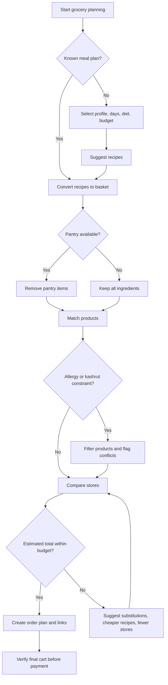

# Meal and Grocery Planner

Plan Israeli grocery baskets, suggest recipes, compare estimated supermarket costs, and produce order-ready search links for Shufersal, Rami Levy, Victory, and Yochananof. Use the skill for family planning, freelancer events, office refreshments, small-business kitchenette stocking, and weekly consumer budgeting.

## Primary outcome

Convert a household or business need into a practical plan:

1. Capture constraints: budget, city, diet, kashrut, allergies, delivery preference, pantry inventory, and dates.
2. Suggest recipes and meal patterns that match Israeli shopping habits.
3. Convert recipes into a consolidated basket.
4. Compare estimated costs across supported supermarket chains.
5. Produce supermarket search links and a structured shopping list.
6. Flag risks before checkout: missing products, minimum order gaps, allergen conflicts, budget overruns, and price freshness.

## Supported supermarket targets

| Store key | Chain | Recommended use |
|---|---|---|
| `shufersal` | Shufersal | Broad product coverage, delivery planning, predictable online catalog behavior |
| `rami_levy` | Rami Levy | Budget comparison and household staples |
| `victory` | Victory | Alternative basket pricing and regional availability checks |
| `yochananof` | Yochananof | Value comparison and family-size baskets |

The skill does not place purchases automatically. It creates planning output and search links that must be verified inside the selected supermarket cart.


## Web-validated guardrails, accessed 04/06/2026

- Treat the standard Israeli VAT rate as 18% for 2026 planning notes, with final accounting based on the receipt or tax invoice.
- Use official retailer price-transparency files when branch-level price imports are available.
- Treat built-in delivery-fee and minimum-order values as sandbox estimates; verify live values in the supermarket cart.
- Verify allergen and kashrut status on the product label or seller page before purchase.
- Use the Ministry of Economy controlled-prices path when a user asks about suspected overcharging on supervised food products.

## Quick command examples

```bash
pip install -e .
pip install -r requirements-dev.txt

meal-grocery-planner recipes --env sandbox --diet vegetarian --servings 4
meal-grocery-planner meal-plan --env sandbox --profile family --days 7 --diet low_budget
meal-grocery-planner order --env sandbox --profile family --city "חיפה" --save
```

Chain an order id into the next command:

```bash
create_response=$(meal-grocery-planner order --env sandbox --profile family --city "חיפה" --save)
order_id=$(python -c 'import json,sys; print(json.load(sys.stdin)["order_id"])' <<< "$create_response")
meal-grocery-planner show-order "$order_id" --env sandbox
meal-grocery-planner validate "$order_id" --env sandbox
```

## Python quick start

```python
from meal_grocery_planner import MealGroceryPlannerClient

client = MealGroceryPlannerClient(environment="sandbox", default_city="חיפה")

plan = client.build_meal_plan(
    profile="family",
    days=7,
    meals_per_day=1,
    diet="low_budget",
    servings=4,
    pantry=["אורז פרסי", "שמן זית"],
)

basket = client.create_basket(plan, household_size=4, pantry=["אורז פרסי"])
order = client.create_order_plan(basket, city="חיפה", preferred_stores=["rami_levy", "yochananof"])

print(order["order_id"])
print(order["estimated_total_ils"])
print(order["store_links"])
```

## Async quick start

```python
import asyncio
from meal_grocery_planner import MealGroceryPlannerClient

async def main():
    client = MealGroceryPlannerClient(environment="sandbox")
    products = await client.async_search_products("עגבניה", store="rami_levy")
    print(products[0]["price_ils"])

asyncio.run(main())
```

## Data model

### Recipe

A recipe contains a title, serving count, duration, diet tags, ingredients, preparation steps, and operational notes.

### Basket line

A basket line contains the original ingredient, matched product, estimated package count, estimated cost in ₪, and substitutions.

### Order plan

An order plan contains an id, city, environment, selected stores, line items, estimated totals, warnings, and search links.

## Decision tree



## Workflow decision rules

### Budget-first household basket

Use this when a consumer needs a weekly basket under a fixed limit.

1. Set `diet="low_budget"` when recipe flexibility exists.
2. Add pantry items before basket generation.
3. Use `compare_basket` across all supported stores.
4. Prefer one store when delivery fees would erase item-level savings.
5. If the result exceeds the limit, remove snacks and premium brands before reducing staples.

### Small-business kitchenette restock

Use this for offices, clinics, studios, salons, or workshops.

1. Use a profile name that identifies the business context.
2. Set a weekly or monthly budget.
3. Keep shelf-stable items separate from event food.
4. Add a minimum stock threshold for coffee, milk, bread, spreads, fruit, and cleaning-adjacent consumables.
5. Recheck invoices and receipts separately for accounting classification.

### Freelancer event food

Use this for workshops, meetings, and client sessions.

1. Count participants, then add a 10 percent buffer.
2. Select quick recipes and ready-to-serve items.
3. Add allergen exclusions.
4. Use `export_shopping_list(locale="he-IL")` for a Hebrew picking list.
5. Keep final supermarket confirmation screenshots or invoices for business records.

## Edge cases

| Case | Correct handling |
|---|---|
| Product appears in one store but not another | Keep the ingredient in the basket and add a warning for the missing store |
| Delivery minimum not reached | Add a warning and avoid silently adding unrelated items |
| Pantry quantity unknown | Treat pantry item as available only when the user explicitly lists it |
| Same ingredient appears in many recipes | Consolidate quantity before package rounding |
| Package size is larger than required | Round up package count and show the cost impact |
| Store price feed is stale | Mark results as estimates and request cart verification |
| Allergy exclusion removes every match | Return no match and add a warning rather than substituting blindly |
| Budget is too low for required meals | Suggest cheaper recipe mix, fewer fresh proteins, or store-brand alternatives |
| User needs kosher separation | Do not combine meat and dairy recipes in a single event menu unless explicitly requested |
| City has limited delivery coverage | Provide search links and require manual delivery confirmation |

## Troubleshooting summary

| Symptom | Likely cause | Action |
|---|---|---|
| No products returned | Query is too specific or uses a brand spelling variation | Search by generic item name |
| Basket total looks low | Package-size conversion or missing product match | Inspect lines with `matched_item = null` |
| CLI cannot import package | Package was not installed in editable mode | Run `pip install -e .` from the package root |
| Async tests fail | Missing async test plugin | Install `pytest-asyncio` from `requirements-dev.txt` |
| Hebrew output appears escaped | JSON printer did not disable ASCII escaping | Use `json.dumps(..., ensure_ascii=False, indent=2)` |

## Anti-patterns

Avoid these patterns:

- Treating search links as confirmed cart contents.
- Mixing product prices from different dates without displaying freshness.
- Using one supermarket as the only source for a budget-sensitive recommendation.
- Ignoring delivery fees and minimum-order thresholds shown in the live cart.
- Substituting allergy-sensitive products without explicit confirmation.
- Recommending business expense treatment without receipt classification.
- Hardcoding one city when delivery availability depends on address.
- Hiding missing items inside a total estimate.

## Production checklist

Before using output operationally:

1. Verify every item inside the supermarket cart.
2. Confirm delivery fee, minimum order, and delivery window.
3. Confirm current product price and package size.
4. Validate allergens and kashrut labels against the product page.
5. Keep receipts and invoices outside the planning tool.
6. Do not store payment credentials in scripts or examples.
7. Use environment variables for any private integration tokens.
8. Record the planning date in DD/MM/YYYY format for Israeli users.
9. Keep a human approval step before checkout.
10. Re-run tests after changing catalog import logic.
