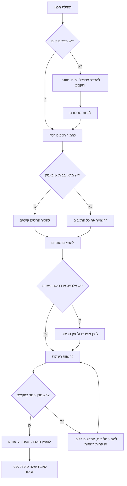

# מתכנן ארוחות וקניות

לתכנן סל קניות ישראלי, לקבל רעיונות למתכונים, להשוות אומדני מחיר, ולהפיק קישורי חיפוש להזמנה בשופרסל, רמי לוי, ויקטורי ויוחננוף. מתאים למשקי בית, עצמאים, עסקים קטנים, אירוח לקוחות, סדנאות, ומילוי מטבחון משרדי.

## תוצאה רצויה

להפוך צורך תפעולי או משפחתי לתוכנית קניות מעשית:

1. להגדיר מגבלות: תקציב, עיר, תזונה, כשרות, אלרגנים, העדפת משלוח, מלאי קיים ותאריך.
2. לבחור מתכונים שמתאימים להרגלי קנייה בישראל.
3. לאחד רכיבים לסל קניות אחד.
4. להשוות אומדן עלות בין רשתות נתמכות.
5. להפיק קישורי חיפוש ורשימת איסוף.
6. לסמן סיכונים לפני קופה: מוצר חסר, מינימום הזמנה, אלרגנים, חריגה מתקציב ומחיר לא מעודכן.

## רשתות נתמכות

| מפתח | רשת | שימוש מומלץ |
|---|---|---|
| `shufersal` | שופרסל | כיסוי רחב, תכנון משלוח, קטלוג מקוון יציב יחסית |
| `rami_levy` | רמי לוי | בדיקת מחיר למשקי בית ולמוצרי בסיס |
| `victory` | ויקטורי | השוואה נוספת וזמינות אזורית |
| `yochananof` | יוחננוף | סלי משפחה והשוואת ערך |

אין לבצע רכישה אוטומטית. יש לאמת כל מוצר בעגלת הקניות של הרשת לפני תשלום.

## התחלה מהירה

```bash
pip install -e .
pip install -r requirements-dev.txt

meal-grocery-planner recipes --env sandbox --diet vegetarian --servings 4
meal-grocery-planner meal-plan --env sandbox --profile family --days 7 --diet low_budget
meal-grocery-planner order --env sandbox --profile family --city "חיפה" --save
```

שרשור מזהה הזמנה לפעולה הבאה:

```bash
create_response=$(meal-grocery-planner order --env sandbox --profile family --city "חיפה" --save)
order_id=$(python -c 'import json,sys; print(json.load(sys.stdin)["order_id"])' <<< "$create_response")
meal-grocery-planner show-order "$order_id" --env sandbox
meal-grocery-planner validate "$order_id" --env sandbox
```

## דוגמת פייתון

```python
from meal_grocery_planner import MealGroceryPlannerClient

client = MealGroceryPlannerClient(environment="sandbox", default_city="חיפה")

plan = client.build_meal_plan(
    profile="family",
    days=7,
    meals_per_day=1,
    diet="low_budget",
    servings=4,
    pantry=["אורז פרסי", "שמן זית"],
)

basket = client.create_basket(plan, household_size=4, pantry=["אורז פרסי"])
order = client.create_order_plan(basket, city="חיפה", preferred_stores=["rami_levy", "yochananof"])

print(order["order_id"])
print(order["estimated_total_ils"])
```

## כללי החלטה



## תרחישי שימוש

### סל משפחתי בתקציב קבוע

1. לבחור `low_budget` כאשר יש גמישות בתפריט.
2. להזין פריטי מזווה קיימים לפני יצירת סל.
3. להשוות בין כל הרשתות הנתמכות.
4. להעדיף רשת אחת כאשר דמי משלוח מבטלים חיסכון קטן בין מוצרים.
5. במקרה של חריגה, להחליף מותגים יקרים לפני שמקטינים מוצרי בסיס.

### עצמאי שמארח סדנה

1. לספור משתתפים ולהוסיף מקדם ביטחון של 10 אחוז.
2. לבחור מתכונים מהירים ופריטים שמוכנים להגשה.
3. להגדיר אלרגנים להחרגה.
4. להפיק רשימת איסוף בעברית.
5. לשמור חשבונית או קבלה לצורך הנהלת חשבונות, לפי סיווג ההוצאה בפועל.

### מטבחון לעסק קטן

1. להפריד בין מוצרים שוטפים לבין אוכל לאירוע.
2. להגדיר רמות מינימום לקפה, חלב, לחם, ממרחים, פירות ומוצרי בסיס.
3. לבדוק תאריכי תפוגה למוצרים טריים.
4. לתעד את מועד התכנון בפורמט 04/06/2026.
5. לאשר הזמנה ידנית לפני תשלום.

## מקרי קצה

| מצב | טיפול נכון |
|---|---|
| מוצר מופיע רק ברשת אחת | להשאיר את הרכיב ולסמן חוסר ברשתות אחרות |
| סכום הסל נמוך ממינימום הזמנה | להציג אזהרה בלי להוסיף מוצרים לא קשורים |
| כמות במזווה אינה ידועה | להתייחס לפריט כקיים רק אם צוין במפורש |
| רכיב חוזר בכמה מתכונים | לאחד כמויות לפני עיגול לאריזות |
| האריזה גדולה מהכמות הדרושה | לעגל כלפי מעלה ולהציג את השפעת העלות |
| מחיר אינו עדכני | לסמן כאומדן ולדרוש בדיקה בעגלה |
| סינון אלרגנים מסיר כל התאמה | להחזיר שורה ללא מוצר ולא להחליף באופן אוטומטי |
| התקציב נמוך מדי | להציע תפריט זול יותר או הפחתת פריטים יקרים |
| נדרשת הפרדה בין בשר וחלב | לא לערבב תפריטי בשר וחלב לאותו אירוח ללא בקשה מפורשת |
| משלוח מוגבל לפי כתובת | להפיק קישור ולדרוש אימות באזור החלוקה |

## תקלות נפוצות

| סימפטום | סיבה אפשרית | פעולה |
|---|---|---|
| אין תוצאות חיפוש | שאילתה ממותגת או ספציפית מדי | לחפש שם מוצר כללי |
| האומדן נראה נמוך | התאמת מוצר חסרה או גודל אריזה שגוי | לבדוק שורות ללא מוצר מותאם |
| פקודת מסוף לא מזהה את החבילה | התקנה לא בוצעה במצב עריכה | להריץ `pip install -e .` מתיקיית החבילה |
| בדיקות אסינכרוניות נכשלות | חסרה תלות לבדיקות אסינכרוניות | להתקין `pytest-asyncio` |
| עברית מופיעה כרצפי יוניקוד | הדפסה עם ברירת מחדל לא מתאימה | להשתמש ב-`json.dumps(..., ensure_ascii=False, indent=2)` |

## דפוסים שיש להימנע מהם

- להתייחס לקישור חיפוש כאל עגלת קניות מאושרת.
- לערבב מחירים מתאריכים שונים בלי לציין רעננות נתונים.
- לבחור רשת אחת בלבד כאשר התקציב רגיש.
- להתעלם מדמי משלוח וממינימום הזמנה.
- להחליף מוצר עם אלרגנים בלי אישור מפורש.
- להמליץ על סיווג מס בלי לראות חשבונית או קבלה.
- לקבע עיר אחת כאשר זמינות משלוח תלויה בכתובת.
- להסתיר מוצרים חסרים בתוך אומדן סופי.

## רשימת בדיקה לפני שימוש תפעולי

1. לאמת כל פריט בעגלת הרשת.
2. לבדוק דמי משלוח, מינימום הזמנה וחלון אספקה.
3. לבדוק מחיר וגודל אריזה עדכניים.
4. לאמת אלרגנים וסימון כשרות בדף המוצר.
5. לשמור קבלות וחשבוניות מחוץ לכלי התכנון.
6. לא לשמור אמצעי תשלום בקבצי דוגמה.
7. להשתמש במשתני סביבה לכל אסימון פרטי.
8. לתעד תאריך בפורמט DD/MM/YYYY.
9. להשאיר אישור אנושי לפני קופה.
10. להריץ בדיקות לאחר שינוי יבוא מחירים.
