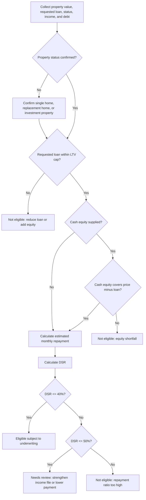

# Mortgage & Loan Eligibility Checker

Calculate preliminary Israeli mortgage eligibility, monthly repayment, loan-to-value (LTV), and payment-to-income ratio (PTI), labeled DSR in this package for consumers, freelancers, and small businesses. Use the result as an affordability screen before requesting lender approval.

## Scope

This skill supports:

- Israeli residential mortgage screening.
- Standard Bank of Israel-style LTV caps commonly used for housing loans:
  - Single home: 75%.
  - Replacement home: 70%.
  - Additional or investment property: 50%.
- PTI screening, labeled DSR in this package, with configurable defaults:
  - Review threshold: 40%.
  - Hard screen: 50%.
- Monthly payment calculation using a standard amortizing annuity formula, with a standard 30-year maximum term.
- Mixed mortgage tracks with separate rates, terms, and interest-only periods.
- Freelancer and small-business income normalization from verified net-income records.
- Practical remediation guidance for failed LTV, DSR, or equity checks.

This skill does not grant credit, submit a bank application, query a credit database, replace legal advice, replace tax advice, or create approval in principle. Validate current Bank of Israel directives, lender policy, property classification, and borrower documents before relying on an output.

## Required inputs

| Field | Meaning | Example |
|---|---|---:|
| `property_value` | Purchase price or lender-recognized valuation in ₪ | `2400000` |
| `requested_loan_amount` | Requested mortgage principal in ₪ | `1680000` |
| `property_status` | `single_home`, `replacement_home`, or `investment_property` | `single_home` |
| `net_monthly_income` | Household net monthly income after tax and recurring deductions | `28000` |
| `income_records` | Verified monthly income records; alternative to a single income value | See examples |
| `existing_monthly_debt` | Fixed monthly obligations used by lender policy, such as car loans, consumer loans, support payments, and fixed credit installments | `1500` |
| `cash_equity` | Verified available equity in ₪ | `720000` |
| `annual_rate` | Annual interest as `5.25` or `0.0525` | `5.25` |
| `term_years` | Mortgage term in years, 1-30 by default | `25` |
| `dsr_limit` | Maximum repayment ratio as `50` or `0.50` | `50` |

## Core rules

### LTV

```text
LTV = requested_loan_amount / property_value
```

Decision:

- Pass when LTV is at or below the applicable cap.
- Fail when LTV exceeds the applicable cap.
- Mark for review when LTV is within 5% of the cap, because appraisal, classification, or transaction costs can break the case.

### Monthly repayment

```text
monthly_rate = annual_rate / 12
months = term_years * 12
payment = principal * monthly_rate * (1 + monthly_rate)^months / ((1 + monthly_rate)^months - 1)
```

When the rate is 0%:

```text
payment = principal / months
```

### PTI / DSR

```text
DSR = (estimated_mortgage_payment + existing_monthly_debt) / net_monthly_income
```

Use `existing_monthly_debt` as a conservative policy bucket. For a strict regulatory PTI file, separate housing-loan repayment, prior loans secured by the same property, and fixed expenses according to the current directive.

Decision:

- `DSR <= 40%`: pass the repayment screen, subject to all other checks.
- `40% < DSR <= 50%`: mark for review.
- `DSR > 50%`: fail under the default hard screen.

## Decision tree



## Concrete examples

### First home, clear pass

```json
{
  "property_value": 2400000,
  "requested_loan_amount": 1500000,
  "property_status": "single_home",
  "net_monthly_income": 30000,
  "existing_monthly_debt": 1000,
  "annual_rate": 5.0,
  "term_years": 25,
  "cash_equity": 900000
}
```

Expected interpretation:

- LTV is 62.5%, below the 75% cap.
- Estimated payment is approximately ₪8,768.
- DSR is approximately 32.6% after existing debt.
- Outcome should be eligible, subject to normal underwriting.

### First home at the cap

```json
{
  "property_value": 2400000,
  "requested_loan_amount": 1800000,
  "property_status": "single_home",
  "net_monthly_income": 36000,
  "existing_monthly_debt": 0,
  "annual_rate": 5.25,
  "term_years": 25
}
```

Expected interpretation:

- LTV is exactly 75%.
- Result can pass the LTV rule, but should carry a review warning.
- Keep cash for appraisal gaps, purchase tax, legal fees, broker fees, insurance, moving costs, renovations, and CPI-linked increases.

### Investment property, LTV failure

```json
{
  "property_value": 2000000,
  "requested_loan_amount": 1200000,
  "property_status": "investment_property",
  "net_monthly_income": 45000,
  "annual_rate": 5.0,
  "term_years": 25
}
```

Expected interpretation:

- Investment-property cap is 50%.
- Maximum loan by LTV is ₪1,000,000.
- Requested loan exceeds the cap by ₪200,000.
- Outcome should be not eligible unless equity increases, price decreases, collateral changes, or legal classification changes.

### Freelancer with uneven income

```json
{
  "property_value": 1800000,
  "requested_loan_amount": 1100000,
  "property_status": "single_home",
  "income_records": [
    {"period": "2025-01", "net_income": 18500, "verified": true},
    {"period": "2025-02", "net_income": 21000, "verified": true},
    {"period": "2025-03", "net_income": 16500, "verified": true},
    {"period": "2025-04", "net_income": 23000, "verified": true},
    {"period": "2025-05", "net_income": 19000, "verified": true},
    {"period": "2025-06", "net_income": 19500, "verified": true}
  ],
  "existing_monthly_debt": 2200,
  "annual_rate": 5.4,
  "term_years": 25
}
```

Expected interpretation:

- Use verified net income, not gross revenue.
- Use accountant confirmation, annual tax assessment, profit-and-loss report, VAT filings where relevant, and bank statements. Treat VAT collected from customers as a liability rather than available income; the standard VAT rate verified for 2026 is 18% from 01/01/2025.
- Mark for review when DSR is high or income history is short.

### Small-business owner paid through a company

```json
{
  "property_value": 3000000,
  "requested_loan_amount": 1950000,
  "property_status": "replacement_home",
  "net_monthly_income": 42000,
  "existing_monthly_debt": 3500,
  "annual_rate": 5.6,
  "term_years": 30
}
```

Expected interpretation:

- Replacement-home cap is 70%, so the LTV cap is ₪2,100,000.
- Company profit is not automatically household income.
- Use stable salary, documented dividends, and recurring distributions only when supported.
- Add personal guarantees and business debts when lender policy treats them as household obligations.

## Edge cases

### Appraisal below contract price

Use the conservative value accepted by the lender, often the lower of contract price and accepted valuation. A ₪2,400,000 contract with a ₪2,300,000 valuation lowers a 75% cap from ₪1,800,000 to ₪1,725,000.

### Replacement-home timing

Replacement-home status can depend on selling an existing home within required legal and lender timeframes. If the sale deadline is missed, financing and tax treatment can change. Run a fallback scenario as `investment_property`.

### Gifted equity

Treat family gifts as unavailable until source-of-funds documentation is accepted. Keep a written gift confirmation, transfer evidence, and compliance documents.

### Foreign income

Convert foreign income conservatively. Use net income after foreign and Israeli tax where relevant. Keep tax returns, payslips, bank deposits, and residency evidence.

### Recent employment change

Mark for review when a borrower recently changed jobs, started a business, returned from maternity leave, completed reserve duty, or entered a sabbatical. Add employment confirmation and updated bank deposits.

### Interest-only periods

Interest-only periods reduce initial payments but increase later amortizing payments. Test both the initial payment and the post-grace payment.

### CPI-linked tracks

CPI-linked principal can grow. Stress-test inflation and show that the first-month payment is not the full risk picture.

### Existing credit obligations

Include car loans, consumer credit, fixed credit-card installments, support payments, and recurring loan repayments. Exclude ordinary card spending only when fully repaid monthly and not a credit facility.

### Business debt and guarantees

Separate household income from business cash flow. Add business debt and guarantees only when lender policy treats them as borrower obligations.

## Anti-patterns

Avoid:

- Using gross income instead of net disposable income.
- Ignoring existing debts.
- Averaging business revenue instead of net profit.
- Using contract price when valuation is lower.
- Treating an investment property as a single home without legal support.
- Ignoring purchase tax and transaction costs.
- Assuming a long term is available when borrower age or lender policy prevents it.
- Treating the calculator result as approval in principle.
- Using undocumented gifts as equity.
- Adding new unsecured debt to cover equity gaps without adding the new repayment to DSR.

## Troubleshooting quick table

| Symptom | Likely cause | Action |
|---|---|---|
| LTV failure | Loan exceeds cap | Reduce loan, add equity, lower price, or verify status |
| DSR failure | Payment plus existing debt exceeds income capacity | Lower loan, extend term if realistic, reduce debt, add verified income |
| Review warning | DSR above 40%, LTV near cap, or thin income file | Add documents and stress-test |
| Freelancer income too high | Gross revenue was used | Use net sustainable income |
| Equity failure | Verified cash below required equity | Add documented funds or revise deal |
| Track validation error | Track principals do not sum to loan | Align track totals |

## Production checklist

1. Confirm current Bank of Israel and lender-specific policy.
2. Keep policy thresholds in configuration.
3. Use the lower of contract price and accepted valuation.
4. Verify property status through legal and tax documents.
5. Verify income from source documents.
6. Normalize freelancer and small-business income over 12-24 months when available.
7. Include recurring debts and guarantees according to lender policy.
8. Stress-test rate rises, CPI linkage, and insurance costs.
9. Store input, policy version, result, and timestamp.
10. Avoid collecting unnecessary sensitive data.
11. Mask identity numbers, account numbers, and tax-file numbers in logs.
12. Present output as preliminary screening only.
13. Route DSR above 40%, LTV near cap, foreign income, recent self-employment, and gifted equity to manual review.
14. Recalculate after rate, valuation, income, property status, or track changes.

## Expected answer structure

A high-quality result includes:

- Eligibility status.
- LTV and cap.
- Estimated monthly payment.
- DSR and limit.
- Maximum loan by LTV.
- Maximum loan by DSR.
- Binding constraint.
- Failure reasons.
- Remediation steps.
- Required documents.
