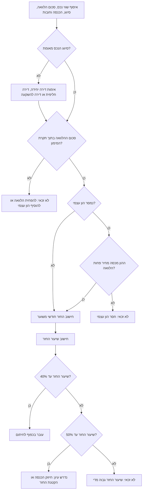

# בודק זכאות למשכנתה ולהלוואת דיור

חשבו בדיקת היתכנות ראשונית למשכנתה בישראל: שיעור מימון, החזר חודשי משוער, שיעור החזר מהכנסה נטו ותקרות לפי סוג נכס. הכלי מתאים לצרכנים, עצמאים, עוסקים קטנים ובעלי שליטה שרוצים להבין את סיכויי המעבר הראשוניים לפני פנייה לבנק.

## תחום שימוש

הכלי תומך ב:

- בדיקת משכנתה למגורים בישראל.
- תקרות שיעור מימון מקובלות:
  - דירה יחידה: 75%.
  - דירה חליפית: 70%.
  - דירה נוספת או דירה להשקעה: 50%.
- בדיקת שיעור החזר מהכנסה:
  - עד 40%: מעבר ראשוני נוח יותר.
  - מעל 40% ועד 50%: נדרש עיון וחיזוק מסמכים.
  - מעל 50%: כשל לפי ברירת המחדל.
- חישוב החזר חודשי לפי נוסחת שפיצר.
- תמהיל מסלולים עם ריביות, תקופות וגרייס.
- נרמול הכנסה לעצמאים ולעסקים קטנים לפי הכנסה נטו מאומתת.
- המלצות מעשיות לתיקון כשל בשיעור מימון, שיעור החזר מהכנסה או הון עצמי.

זוהי בדיקה ראשונית בלבד. אין לראות בתוצאה אישור עקרוני, החלטת אשראי, ייעוץ משפטי, ייעוץ מס או ייעוץ השקעות. יש לוודא את הוראות בנק ישראל, מדיניות הבנק, סיווג הנכס ומסמכי הלווה לפני הסתמכות.

## קלט נדרש

| שדה | משמעות | דוגמה |
|---|---|---:|
| `property_value` | מחיר רכישה או שווי שמאי מוכר, בש״ח | `2400000` |
| `requested_loan_amount` | סכום משכנתה מבוקש, בש״ח | `1680000` |
| `property_status` | `single_home`, `replacement_home`, או `investment_property` | `single_home` |
| `net_monthly_income` | הכנסה חודשית נטו למשק בית | `28000` |
| `income_records` | חודשי הכנסה מאומתים, חלופה להכנסה אחת | ראו דוגמה |
| `existing_monthly_debt` | התחייבויות חודשיות קבועות לפי מדיניות בנק, כגון הלוואות רכב, הלוואות צרכניות, מזונות ותשלומים קבועים | `1500` |
| `cash_equity` | הון עצמי זמין ומאומת | `720000` |
| `annual_rate` | ריבית שנתית, למשל `5.25` או `0.0525` | `5.25` |
| `term_years` | תקופת המשכנתה בשנים, 1-30 כברירת מחדל | `25` |
| `dsr_limit` | תקרת שיעור החזר, למשל `50` או `0.50` | `50` |

## כללי חישוב

### שיעור מימון

```text
שיעור מימון = סכום משכנתה מבוקש / שווי נכס
```

החלטה:

- מעבר כאשר שיעור המימון נמוך או שווה לתקרה.
- כשל כאשר שיעור המימון גבוה מהתקרה.
- עיון נוסף כאשר שיעור המימון קרוב מאוד לתקרה, כי שמאות, סיווג או עלויות עסקה עלולים לשנות תוצאה.

### החזר חודשי

```text
ריבית חודשית = ריבית שנתית / 12
מספר חודשים = תקופה בשנים * 12
החזר = קרן * ריבית חודשית * (1 + ריבית חודשית)^מספר חודשים / ((1 + ריבית חודשית)^מספר חודשים - 1)
```

בריבית 0%:

```text
החזר = קרן / מספר חודשים
```

### שיעור החזר מהכנסה

```text
שיעור החזר = (החזר משכנתה משוער + התחייבויות חודשיות קיימות) / הכנסה חודשית נטו
```

השתמשו ב-`existing_monthly_debt` כסעיף שמרני למדיניות אשראי. בתיק רגולטורי קפדני הפרידו בין החזר הלוואת הדיור, הלוואות קודמות המובטחות באותו נכס והוצאות קבועות לפי ההוראה העדכנית.

החלטה:

- עד 40%: מעבר ראשוני, בכפוף ליתר הבדיקות.
- מעל 40% ועד 50%: נדרש עיון.
- מעל 50%: כשל לפי ברירת המחדל.

## עץ החלטה



## דוגמאות

### דירה יחידה, מעבר ברור

```json
{
  "property_value": 2400000,
  "requested_loan_amount": 1500000,
  "property_status": "single_home",
  "net_monthly_income": 30000,
  "existing_monthly_debt": 1000,
  "annual_rate": 5.0,
  "term_years": 25,
  "cash_equity": 900000
}
```

פירוש:

- שיעור המימון הוא 62.5%, נמוך מתקרת 75%.
- ההחזר החודשי המשוער הוא כ-₪8,768.
- שיעור ההחזר כולל חוב קיים הוא כ-32.6%.
- תוצאה צפויה: מעבר ראשוני בכפוף לחיתום.

### דירה יחידה בתקרת המימון

```json
{
  "property_value": 2400000,
  "requested_loan_amount": 1800000,
  "property_status": "single_home",
  "net_monthly_income": 36000,
  "existing_monthly_debt": 0,
  "annual_rate": 5.25,
  "term_years": 25
}
```

פירוש:

- שיעור המימון הוא בדיוק 75%.
- התרחיש עשוי לעבור, אך רגיש לשמאות נמוכה ולעלויות עסקה.
- יש לשמור כרית למס רכישה, עורך דין, שמאי, תיווך, ביטוחים, מעבר ושיפוץ.

### דירה להשקעה, כשל בשיעור מימון

```json
{
  "property_value": 2000000,
  "requested_loan_amount": 1200000,
  "property_status": "investment_property",
  "net_monthly_income": 45000,
  "annual_rate": 5.0,
  "term_years": 25
}
```

פירוש:

- בדירה להשקעה התקרה היא 50%.
- סכום מרבי לפי שיעור מימון: ₪1,000,000.
- ההלוואה המבוקשת גבוהה מהתקרה ב-₪200,000.
- תוצאה צפויה: לא זכאי ללא הגדלת הון עצמי, הורדת מחיר, שינוי בטוחה או שינוי סיווג משפטי.

### עצמאי עם הכנסה תנודתית

```json
{
  "property_value": 1800000,
  "requested_loan_amount": 1100000,
  "property_status": "single_home",
  "income_records": [
    {"period": "01-2025", "net_income": 18500, "verified": true},
    {"period": "02-2025", "net_income": 21000, "verified": true},
    {"period": "03-2025", "net_income": 16500, "verified": true},
    {"period": "04/2025", "net_income": 23000, "verified": true},
    {"period": "05-2025", "net_income": 19000, "verified": true},
    {"period": "06-2025", "net_income": 19500, "verified": true}
  ],
  "existing_monthly_debt": 2200,
  "annual_rate": 5.4,
  "term_years": 25
}
```

דגשים:

- משתמשים בהכנסה נטו מאומתת, לא במחזור עסקאות.
- לעוסק פטור או עוסק מורשה יש לצרף שומת מס, אישור רו״ח, דוח רווח והפסד, אישורי מע״מ לפי הצורך ותנועות בנק.
- מעל שיעור החזר של 40% יש להכין הסבר לעונתיות, לקוחות מרכזיים או שינוי חריג בהכנסה.

### בעל שליטה בחברה בע״מ

```json
{
  "property_value": 3000000,
  "requested_loan_amount": 1950000,
  "property_status": "replacement_home",
  "net_monthly_income": 42000,
  "existing_monthly_debt": 3500,
  "annual_rate": 5.6,
  "term_years": 30
}
```

דגשים:

- בדירה חליפית התקרה היא 70%, כלומר עד ₪2,100,000 בדוגמה.
- רווח חברה אינו בהכרח הכנסה פנויה של משק הבית.
- יש להפריד בין שכר, דיבידנד, החזר הלוואת בעלים והוצאות פרטיות.
- ערבויות אישיות והלוואות עסקיות עשויות להיחשב התחייבות לפי מדיניות הבנק.

## מקרי קצה

### שמאות נמוכה ממחיר החוזה

השתמשו בשווי השמרני שהבנק מכיר בו, בדרך כלל מחיר חוזה או שווי שמאי מוכר, הנמוך מביניהם. חוזה של ₪2,400,000 ושמאות של ₪2,300,000 מורידים תקרת 75% מ-₪1,800,000 ל-₪1,725,000.

### דירה חליפית

סיווג דירה חליפית תלוי לעיתים במכירת הדירה הקיימת במסגרת הזמנים הנדרשת. אי-עמידה במועד עלולה לשנות מיסוי והנחות מימון. הריצו תרחיש חלופי כדירה להשקעה.

### הון עצמי במתנה

התייחסו למתנה ממשפחה כלא זמינה עד קבלת אסמכתאות מקור כספים, אישור מתנה והעברת כספים מתועדת.

### הכנסה מחו״ל

המירו מטבע בשמרנות. השתמשו בהכנסה נטו לאחר מס בחו״ל ובישראל לפי הצורך. צרפו דוחות מס, תלושים, הפקדות בנק ומסמכי תושבות.

### שינוי תעסוקתי

סמנו לעיון כאשר לווה החליף עבודה, פתח עסק, חזר מחופשת לידה, שירת במילואים או יצא לשבתון. צרפו אישור העסקה ותנועות בנק עדכניות.

### גרייס

גרייס מוריד החזר בתחילת הדרך אך מעלה את ההחזר לאחר מכן. בדקו גם את תקופת הגרייס וגם את ההחזר לאחר סיום הגרייס.

### הצמדה למדד

במסלול צמוד מדד הקרן יכולה לגדול. בצעו תרחיש לחץ למדד ולריבית, ואל תציגו את התשלום הראשון כסיכון מלא.

## טעויות נפוצות

- שימוש בברוטו במקום נטו.
- התעלמות מהלוואות קיימות.
- חישוב לפי מחזור עסקאות במקום רווח נקי.
- שימוש במחיר חוזה כאשר השמאות נמוכה יותר.
- סיווג דירה להשקעה כדירה יחידה ללא בסיס משפטי.
- התעלמות ממס רכישה, שמאי, עורך דין, תיווך וביטוחים.
- הנחה שתקופה ארוכה זמינה ללא בדיקת גיל ומדיניות בנק.
- הצגת מחשבון כאישור עקרוני.
- שימוש במתנה לא מתועדת כהון עצמי.
- סגירת פער הון עצמי בעזרת הלוואה צרכנית חדשה ללא הוספת ההחזר לשיעור ההחזר.

## פתרון תקלות קצר

| סימפטום | סיבה אפשרית | פעולה |
|---|---|---|
| כשל בשיעור מימון | ההלוואה גבוהה מהתקרה | להפחית הלוואה, להוסיף הון עצמי, להוריד מחיר או לאמת סיווג |
| כשל בשיעור החזר | החזר וחובות גבוהים ביחס להכנסה | להקטין הלוואה, להאריך תקופה אם ריאלי, לסלק חובות או לאמת הכנסה נוספת |
| נדרש עיון | שיעור החזר מעל 40%, שיעור מימון קרוב לתקרה או תיק הכנסה דל | לחזק מסמכים ולבצע תרחיש לחץ |
| הכנסת עצמאי גבוהה מדי | נעשה שימוש במחזור | להשתמש בהכנסה נטו בת קיימא |
| כשל בהון עצמי | מזומן מאומת נמוך מהנדרש | להוסיף מקור כספים מתועד או לעדכן עסקה |
| שגיאת תמהיל | סכומי המסלולים אינם שווים לסכום ההלוואה | להתאים סכומי מסלולים |

## רשימת בדיקה לפני שימוש מעשי

1. בדקו הוראות בנק ישראל ומדיניות בנק עדכניות.
2. שמרו ספי מדיניות בקובץ תצורה.
3. השתמשו בנמוך מבין מחיר חוזה ושמאות מוכרת.
4. ודאו סיווג נכס באמצעות מסמכים משפטיים ומיסויים.
5. אמתו הכנסה ממסמכי מקור.
6. לעצמאים ולעסקים קטנים, בדקו 12-24 חודשים כאשר יש מידע.
7. כללו התחייבויות וערבויות לפי מדיניות בנק.
8. בצעו תרחיש לחץ לריבית, מדד וביטוחים.
9. שמרו קלט, גרסת מדיניות, תוצאה ותאריך בפורמט DD/MM/YYYY.
10. הימנעו מאיסוף מידע אישי שאינו נדרש.
11. הסתירו מספרי זהות, חשבונות בנק ותיקי מס בלוגים.
12. הציגו תוצאה כבדיקה ראשונית בלבד.
13. העבירו לעיון ידני שיעור החזר מעל 40%, שיעור מימון קרוב לתקרה, הכנסה מחו״ל, עצמאי חדש והון עצמי במתנה.
14. חשבו מחדש לאחר שינוי ריבית, שמאות, הכנסה, סיווג או תמהיל.

## מבנה תשובה מומלץ

תוצאה טובה כוללת:

- זכאי, נדרש עיון או לא זכאי.
- שיעור מימון ותקרה.
- החזר חודשי משוער.
- שיעור החזר ותקרה.
- סכום מרבי לפי שיעור מימון.
- סכום מרבי לפי שיעור החזר.
- מגבלה קובעת.
- סיבות לכשל.
- צעדי תיקון.
- מסמכים נדרשים לחיתום.
