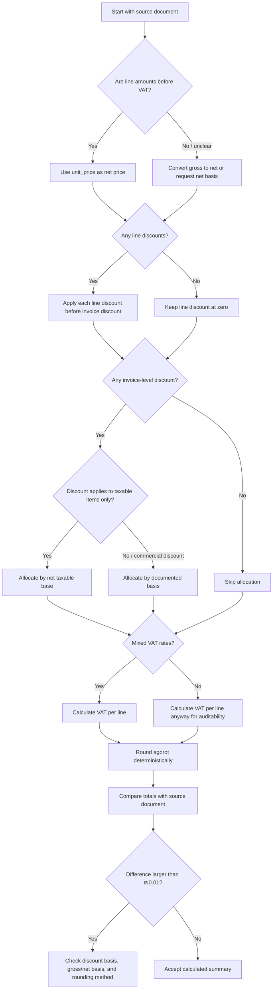

# Multi-Line Item Aggregator

## Purpose

Simplify multi-item invoices that contain several products or services, line discounts, invoice-level discounts, mixed VAT rates, and fractional agorot. Use this skill when an Israeli small business, freelancer, bookkeeper, or consumer needs a deterministic subtotal, VAT, and grand-total calculation before issuing or checking an invoice.

The skill does not replace accounting software, tax advice, or a licensed professional. Verify production documents against the official Israel Tax Authority instructions, current VAT rate, and the actual source document.

## When to use

Use this skill for:

- Quotations, invoices, pro-forma invoices, receipts, order summaries, and reimbursement summaries.
- Israeli shekel amounts where totals must be rounded to agorot.
- Per-line VAT calculations where each line can have a different VAT rate.
- Discounts applied to a single line or distributed across all lines.
- Consumer checks of bills, quotes, repair invoices, freelance invoices, and small supplier statements.

Avoid this skill for payroll, customs entries, import VAT, payroll benefits, banking interest, depreciation schedules, inventory valuation, tax filing, and official electronic invoice transmission.

## Inputs

Each invoice line should contain:

| Field | Required | Example | Notes |
|---|---:|---|---|
| `sku` | No | `CONSULT-01` | Product code, internal service code, or blank. |
| `description` | Yes | `Consulting hour` | Use the description shown on the source document. |
| `quantity` | Yes | `3.5` | Decimal quantities are supported. |
| `unit_price` | Yes | `250.00` | Price before VAT unless the source document explicitly states otherwise. |
| `vat_rate` | Yes | `18%`, `0%`, `0.18` | Normalize percentages before calculation. |
| `discount_type` | No | `amount`, `percent` | Applies only to the line. |
| `discount_value` | No | `10`, `7.5` | Amount in ₪ or percentage points. |

Invoice-level fields:

| Field | Example | Notes |
|---|---|---|
| `invoice_id` | `INV-2026-001` | Keep the issuer's original ID. |
| `invoice_date` | `15/06/2026` | Use DD/MM/YYYY for Israeli workflows. |
| `vat_number` | `515555555` | Store the supplier VAT/business number when available. |
| `invoice_discount` | `₪120` or `10%` | Allocate across lines before VAT. |
| `allocation` | `by_net` | Choose `by_net`, `by_gross`, or `equal`. |

## Core calculation order

1. Validate every line.
2. Convert quantities, unit prices, VAT rates, and discounts to precise decimals.
3. Calculate each line before discount: `quantity × unit_price`.
4. Apply line discount.
5. Allocate invoice-level discount across lines.
6. Calculate taxable base per line.
7. Calculate VAT per line.
8. Round VAT to agorot per line.
9. Calculate line total with VAT.
10. Sum line totals.
11. Report exact totals, rounded totals, and fractional agorot residuals.

## Decision tree



## Rounding policy

Use two distinct values:

- Exact value: the mathematical amount before rounding.
- Rounded value: the amount payable or displayed to two decimals.

Default rounding is half-up to ₪0.01. This matches common invoice expectations, but not every accounting system uses the same line-level or document-level rounding. When checking a supplier invoice, compare the supplier's method before assuming an error.

### Fractional agorot handling

Fractional agorot occur when exact VAT or totals contain more than two decimal places.

Example:

| Quantity | Unit price | VAT rate | Exact VAT | Rounded VAT | Residual |
|---:|---:|---:|---:|---:|---:|
| 1 | ₪0.05 | 18% | ₪0.0090 | ₪0.01 | -₪0.0010 |

Track the residual instead of hiding it. Small residuals are normal. Accumulated residuals become important in usage-based billing, metered services, marketplaces, and invoices with many tiny lines.

## Concrete examples

### Example 1: Freelancer invoice with a line discount

Input:

```json
{
  "invoice_id": "INV-2026-014",
  "invoice_date": "15/06/2026",
  "vat_number": "515555555",
  "lines": [
    {
      "sku": "CONSULT",
      "description": "Business consulting",
      "quantity": "4",
      "unit_price": "250",
      "vat_rate": "18%",
      "discount_type": "percent",
      "discount_value": "10"
    }
  ]
}
```

Calculation:

| Step | Amount |
|---|---:|
| Gross before discount | ₪1,000.00 |
| Line discount | ₪100.00 |
| Taxable base | ₪900.00 |
| VAT at 18% | ₪162.00 |
| Total | ₪1,062.00 |

### Example 2: Mixed VAT rates

Input:

```json
{
  "lines": [
    {"sku": "LOCAL", "description": "Taxable service", "quantity": "1", "unit_price": "1000", "vat_rate": "18%"},
    {"sku": "ZERO", "description": "Zero-rated item", "quantity": "1", "unit_price": "500", "vat_rate": "0%"}
  ]
}
```

Calculation:

| Line | Taxable base | VAT rate | VAT | Total |
|---|---:|---:|---:|---:|
| LOCAL | ₪1,000.00 | 18% | ₪180.00 | ₪1,180.00 |
| ZERO | ₪500.00 | 0% | ₪0.00 | ₪500.00 |
| Total | ₪1,500.00 |  | ₪180.00 | ₪1,680.00 |

### Example 3: Invoice discount allocation

A supplier gives a ₪120 commercial discount across two taxable services.

| Line | Net before invoice discount | Allocation by net | Taxable base |
|---|---:|---:|---:|
| Monthly support | ₪900.00 | ₪90.00 | ₪810.00 |
| Setup | ₪300.00 | ₪30.00 | ₪270.00 |
| Total | ₪1,200.00 | ₪120.00 | ₪1,080.00 |

Calculate VAT on the post-discount taxable base.

## Edge cases

### Quantity is fractional

Use decimal quantities for hourly services, weight, distance, metered usage, or partial subscription periods.

Example: `3.5 × ₪250 = ₪875.00`.

### Unit price contains more than two decimals

Keep the exact value until rounding. Usage billing can contain prices such as `0.0475`. Round only at the configured stage.

### Discount exceeds the line

Reject the line. A discount larger than the line usually indicates a credit note, refund, or incorrect gross/net basis.

### Invoice discount with mixed VAT rates

Allocate the discount before VAT. If the invoice combines taxable and zero-rated lines, confirm whether the discount applies to all lines or only to taxable lines. Document the basis.

### Negative quantities

Reject by default. Enable negative lines only for controlled credit-note workflows, returns, or corrections.

### Zero quantity

Reject by default. Enable only when a system must preserve an informational line.

### Source document uses gross prices

Convert gross to net before using the helper, or document that the input is gross and adjust the workflow. Do not mix gross and net unit prices in one calculation.

## Anti-patterns

- Apply an invoice-level discount after VAT without a documented reason.
- Round each intermediate value too early.
- Use binary floats for money.
- Apply a single VAT rate to an invoice with mixed tax treatments.
- Hide fractional agorot residuals.
- Use a stale VAT rate without checking the date.
- Treat a quotation, pro-forma invoice, tax invoice, receipt, and credit note as the same document.
- Use this skill to transmit official Israeli electronic invoices without an approved integration.

## Troubleshooting summary

| Symptom | Likely cause | Action |
|---|---|---|
| Difference of ₪0.01 | Rounding stage mismatch | Compare line-level versus document-level rounding. |
| Difference equals VAT on discount | Discount applied after VAT | Apply discount before VAT unless the source document proves otherwise. |
| Mixed VAT invoice has wrong VAT | Single VAT rate used | Calculate VAT per line. |
| Supplier total is higher | Gross price entered as net price | Convert gross to net. |
| Residual grows across many lines | Fractional agorot accumulation | Track residuals and apply documented adjustment. |

## Production checklist

- Confirm the current VAT rate from official sources.
- Store all inputs exactly as received.
- Use Decimal or equivalent fixed-point arithmetic.
- Keep exact values and rounded values separately.
- Save discount type, value, and reason.
- Save allocation method for invoice-level discounts.
- Preserve VAT rate per line.
- Log fractional agorot residuals.
- Compare generated totals against the source document.
- Review exceptions for credit notes and refunds.
- Add regression tests for local business scenarios.
- Keep legal/regulatory references current.
- Avoid storing unnecessary personal information.
- Protect customer, supplier, and tax identifiers.
- Record operator, timestamp, and calculation version in production systems.

## CLI quick start

Create a sample input:

```bash
python -m multi_line_item_aggregator.cli create-sample --env sandbox sample-invoice.json
```

Aggregate it:

```bash
python -m multi_line_item_aggregator.cli aggregate sample-invoice.json --invoice-id INV-1001 --invoice-date 15/06/2026 --vat-number 515555555
```

Run the typed helper directly:

```bash
python scripts/multi_line_item_aggregator_client.py sample-invoice.json --json
```

## Output interpretation

Key output fields:

| Field | Meaning |
|---|---|
| `subtotal_before_discounts` | Sum of `quantity × unit_price` before discounts. |
| `line_discounts_total` | Sum of per-line discounts. |
| `invoice_discount_total` | Invoice-level discount after conversion to amount. |
| `taxable_total` | Sum after discounts and before VAT. |
| `vat_total_exact` | Unrounded VAT sum. |
| `vat_total` | Sum of rounded line VAT. |
| `grand_total_exact` | Exact taxable total plus exact VAT. |
| `grand_total` | Payable total based on rounded lines. |
| `fractional_agorot_vat_total` | VAT residual caused by rounding. |
| `rounding_adjustment` | Difference caused by line-level rounding versus total-level expectation. |

## Validation rules

Reject input when:

- No invoice lines exist.
- Quantity is zero unless explicitly allowed.
- Quantity or unit price is negative unless negative lines are enabled.
- VAT rate is negative.
- Discount is negative.
- Percentage discount exceeds 100%.
- Fixed discount exceeds its base amount.
- Invoice discount exceeds its allocation basis.

## Maintenance guidance

Review the package whenever:

- The VAT rate changes.
- Official invoice or digital reporting requirements change.
- Accounting software changes its rounding behavior.
- Business documents start including new tax treatments.
- Marketplace, subscription, or metered billing creates more fractional agorot cases.


## Web-validated regulatory notes

Access date: 2026-06-02.

- The default VAT rate used in examples is 18%, effective from 01/01/2025 and double-confirmed for 2026.
- Israel Invoice allocation-number thresholds for 2026 were corrected against later official guidance: above ₪10,000 before VAT from 01/01/2026 and above ₪5,000 before VAT from 01/06/2026, when the legal conditions apply.
- Official Israel Invoice API documents include line fields for quantity, unit price, item discount, amount before VAT after discount, VAT rate, and VAT amount. The package remains a local calculator and does not submit API requests.
- No official Israel Invoice webhook event names were confirmed; webhook handling is outside scope.
