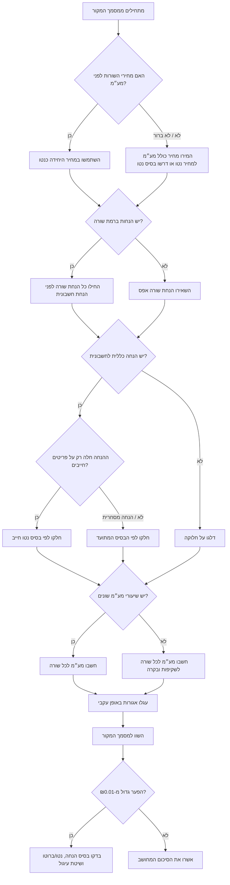

# מאגד שורות לחשבוניות מרובות פריטים

## מטרה

לפשט חישוב של חשבוניות עם כמה מוצרים או שירותים, הנחות ברמת שורה, הנחת חשבונית, שיעורי מע״מ שונים, ועיגול אגורות חלקיות. השתמשו במיומנות זו כשעסק קטן בישראל, עצמאי, מנהלת חשבונות או צרכן צריכים לבדוק סכום ביניים, מע״מ וסכום לתשלום לפני הפקה או בדיקה של חשבונית.

המיומנות אינה מחליפה תוכנת הנהלת חשבונות, ייעוץ מס או איש מקצוע מוסמך. יש לוודא מסמכי הפקה מול הוראות רשות המסים, שיעור המע״מ התקף והמסמך המקורי.

## מתי להשתמש

מתאים עבור:

- הצעות מחיר, חשבוניות מס, חשבוניות עסקה, קבלות, סיכומי הזמנה וחיובי החזר הוצאות.
- סכומים בשקלים חדשים שבהם נדרש עיגול לאגורות.
- חישוב מע״מ לכל שורה כאשר לכל שורה ייתכן שיעור מע״מ שונה.
- הנחות ברמת שורה או הנחה כללית שמחולקת בין שורות.
- בדיקת חשבונות, הצעות, חשבוניות תיקון, חשבוניות פרילנס וסיכומי ספקים.

לא מתאים עבור שכר, מכס, מע״מ ביבוא, הטבות שכר, ריבית בנקאית, פחת, ניהול מלאי, הגשת דוחות מס או שידור רשמי של חשבוניות דיגיטליות.

## שדות קלט

כל שורת חשבונית צריכה לכלול:

| שדה | חובה | דוגמה | הערות |
|---|---:|---|---|
| `sku` | לא | `CONSULT-01` | מק״ט, קוד שירות פנימי או ריק. |
| `description` | כן | `שעת ייעוץ` | השתמשו בתיאור שמופיע במסמך המקור. |
| `quantity` | כן | `3.5` | נתמכות כמויות עשרוניות. |
| `unit_price` | כן | `250.00` | מחיר לפני מע״מ, אלא אם המסמך מציין אחרת. |
| `vat_rate` | כן | `18%`, `0%`, `0.18` | נרמול אחוזים לפני חישוב. |
| `discount_type` | לא | `amount`, `percent` | חל רק על השורה. |
| `discount_value` | לא | `10`, `7.5` | סכום ב-₪ או אחוזים. |

שדות ברמת החשבונית:

| שדה | דוגמה | הערות |
|---|---|---|
| `invoice_id` | `INV-2026-001` | שמרו את מספר המסמך המקורי. |
| `invoice_date` | `15/06/2026` | בפורמט ישראלי DD/MM/YYYY. |
| `vat_number` | `515555555` | מספר עוסק/ח.פ. של הספק, כשקיים. |
| `invoice_discount` | `₪120` או `10%` | מחולק בין השורות לפני חישוב מע״מ. |
| `allocation` | `by_net` | בחירה בין `by_net`, `by_gross`, `equal`. |

## סדר החישוב

1. אמתו כל שורה.
2. המירו כמויות, מחירי יחידה, שיעורי מע״מ והנחות למספרים עשרוניים מדויקים.
3. חשבו סכום שורה לפני הנחה: `כמות × מחיר יחידה`.
4. החילו הנחת שורה.
5. חלקו הנחת חשבונית בין השורות.
6. חשבו בסיס חייב במע״מ לכל שורה.
7. חשבו מע״מ לכל שורה.
8. עגלו מע״מ לאגורות בכל שורה.
9. חשבו סכום שורה כולל מע״מ.
10. סכמו את השורות.
11. דווחו סכומים מדויקים, סכומים מעוגלים ושאריות אגורות חלקיות.

## עץ החלטה



## מדיניות עיגול

יש לשמור שני ערכים:

- ערך מדויק: הסכום המתמטי לפני עיגול.
- ערך מעוגל: הסכום לתשלום או להצגה עם שתי ספרות אחרי הנקודה.

ברירת המחדל היא עיגול חצי כלפי מעלה לאגורה אחת. זו שיטה נפוצה בחשבוניות, אך מערכות הנהלת חשבונות שונות עשויות לעגל ברמת שורה או ברמת מסמך. בבדיקת חשבונית ספק, יש לזהות קודם את שיטת העיגול של הספק.

### טיפול באגורות חלקיות

אגורות חלקיות נוצרות כאשר מע״מ או סכומים מדויקים כוללים יותר משתי ספרות אחרי הנקודה.

דוגמה:

| כמות | מחיר יחידה | שיעור מע״מ | מע״מ מדויק | מע״מ מעוגל | שארית |
|---:|---:|---:|---:|---:|---:|
| 1 | ₪0.05 | 18% | ₪0.0090 | ₪0.01 | -₪0.0010 |

אין להסתיר את השארית. פערים קטנים הם תקינים, אך הצטברות שאריות חשובה במיוחד בחיוב לפי שימוש, שירותים מדידים, זירות מסחר וחשבוניות עם הרבה שורות זולות.

## דוגמאות

### דוגמה 1: חשבונית עצמאי עם הנחת שורה

קלט:

```json
{
  "invoice_id": "INV-2026-014",
  "invoice_date": "15/06/2026",
  "vat_number": "515555555",
  "lines": [
    {
      "sku": "CONSULT",
      "description": "ייעוץ עסקי",
      "quantity": "4",
      "unit_price": "250",
      "vat_rate": "18%",
      "discount_type": "percent",
      "discount_value": "10"
    }
  ]
}
```

חישוב:

| שלב | סכום |
|---|---:|
| סכום לפני הנחה | ₪1,000.00 |
| הנחת שורה | ₪100.00 |
| בסיס חייב במע״מ | ₪900.00 |
| מע״מ 18% | ₪162.00 |
| סה״כ לתשלום | ₪1,062.00 |

### דוגמה 2: שיעורי מע״מ שונים

```json
{
  "lines": [
    {"sku": "LOCAL", "description": "שירות חייב במע״מ", "quantity": "1", "unit_price": "1000", "vat_rate": "18%"},
    {"sku": "ZERO", "description": "פריט בשיעור אפס", "quantity": "1", "unit_price": "500", "vat_rate": "0%"}
  ]
}
```

| שורה | בסיס חייב | שיעור מע״מ | מע״מ | סה״כ |
|---|---:|---:|---:|---:|
| LOCAL | ₪1,000.00 | 18% | ₪180.00 | ₪1,180.00 |
| ZERO | ₪500.00 | 0% | ₪0.00 | ₪500.00 |
| סה״כ | ₪1,500.00 |  | ₪180.00 | ₪1,680.00 |

### דוגמה 3: חלוקת הנחה כללית

ספק מעניק הנחה מסחרית של ₪120 על שני שירותים חייבים במע״מ.

| שורה | נטו לפני הנחת חשבונית | חלוקה לפי נטו | בסיס חייב |
|---|---:|---:|---:|
| תמיכה חודשית | ₪900.00 | ₪90.00 | ₪810.00 |
| הקמה | ₪300.00 | ₪30.00 | ₪270.00 |
| סה״כ | ₪1,200.00 | ₪120.00 | ₪1,080.00 |

חשבו את המע״מ על הבסיס לאחר ההנחה.

## מקרי קצה

### כמות עשרונית

השתמשו בכמות עשרונית לשעות עבודה, משקל, מרחק, חיוב לפי שימוש או חלק יחסי ממנוי.

דוגמה: `3.5 × ₪250 = ₪875.00`.

### מחיר יחידה עם יותר משתי ספרות

שמרו את הערך המדויק עד שלב העיגול. חיוב לפי שימוש יכול לכלול מחיר כמו `0.0475`.

### הנחה גדולה מסכום השורה

דחו את השורה. מצב כזה לרוב מצביע על זיכוי, החזר או בסיס נטו/ברוטו שגוי.

### הנחת חשבונית עם שיעורי מע״מ שונים

חלקו את ההנחה לפני מע״מ. אם החשבונית כוללת שורות חייבות ושורות בשיעור אפס, ודאו האם ההנחה חלה על כולן או רק על חלקן. תעדו את בסיס החלוקה.

### כמויות שליליות

דחו כברירת מחדל. אפשרו רק בתהליכי זיכוי, החזרה או תיקון מבוקרים.

### כמות אפס

דחו כברירת מחדל. אפשרו רק כשחייבים לשמור שורה אינפורמטיבית.

### מסמך מקור עם מחירים כולל מע״מ

המירו מחיר כולל מע״מ למחיר נטו לפני שימוש בכלי, או תעדו במפורש שהקלט הוא ברוטו והתאימו את התהליך. אל תערבבו מחירי נטו וברוטו באותה חשבונית.

## דפוסים שגויים

- החלת הנחת חשבונית אחרי מע״מ בלי תיעוד מתאים.
- עיגול מוקדם מדי בכל שלב ביניים.
- שימוש ב-float בינארי לחישובי כסף.
- החלת שיעור מע״מ אחד על חשבונית עם טיפולי מס שונים.
- הסתרת שאריות אגורות חלקיות.
- שימוש בשיעור מע״מ לא עדכני.
- התייחסות זהה להצעת מחיר, חשבונית עסקה, חשבונית מס, קבלה וחשבונית זיכוי.
- שימוש במיומנות לשידור רשמי של חשבוניות דיגיטליות ללא אינטגרציה מאושרת.

## פתרון תקלות מקוצר

| תסמין | גורם סביר | פעולה |
|---|---|---|
| פער של ₪0.01 | שיטת עיגול שונה | השוו עיגול ברמת שורה מול עיגול ברמת מסמך. |
| הפער שווה למע״מ על ההנחה | ההנחה חושבה אחרי מע״מ | החילו הנחה לפני מע״מ, אלא אם יש תיעוד אחר. |
| מע״מ שגוי בחשבונית מעורבת | השתמשו בשיעור מע״מ יחיד | חשבו מע״מ לכל שורה. |
| סכום הספק גבוה יותר | מחיר ברוטו הוזן כנטו | המירו ברוטו לנטו. |
| שארית גדלה בהרבה שורות | הצטברות אגורות חלקיות | עקבו אחר השאריות ותעדו התאמת עיגול. |

## רשימת בדיקה לייצור

- ודאו את שיעור המע״מ העדכני ממקור רשמי.
- שמרו את כל נתוני הקלט כפי שהתקבלו.
- השתמשו ב-Decimal או באריתמטיקה קבועת נקודה.
- שמרו ערכים מדויקים וערכים מעוגלים בנפרד.
- שמרו סוג הנחה, ערך הנחה וסיבת הנחה.
- שמרו שיטת חלוקה להנחת חשבונית.
- שמרו שיעור מע״מ לכל שורה.
- רשמו שאריות אגורות חלקיות.
- השוו את התוצאה למסמך המקור.
- בדקו חריגים לזיכויים והחזרים.
- הוסיפו בדיקות רגרסיה לתרחישים ישראליים.
- עדכנו הפניות רגולטוריות.
- אל תשמרו מידע אישי מיותר.
- הגנו על פרטי לקוחות, ספקים ומספרי עוסק.
- רשמו מפעיל, חותמת זמן וגרסת חישוב במערכות ייצור.

## התחלה מהירה ב-CLI

יצירת קובץ דוגמה:

```bash
python -m multi_line_item_aggregator.cli create-sample --env sandbox sample-invoice.json
```

חישוב החשבונית:

```bash
python -m multi_line_item_aggregator.cli aggregate sample-invoice.json --invoice-id INV-1001 --invoice-date 15/06/2026 --vat-number 515555555
```

הרצת כלי העזר המובנה:

```bash
python scripts/multi_line_item_aggregator_client.py sample-invoice.json --json
```

## פירוש שדות פלט

| שדה | משמעות |
|---|---|
| `subtotal_before_discounts` | סכום `כמות × מחיר יחידה` לפני הנחות. |
| `line_discounts_total` | סך הנחות ברמת שורה. |
| `invoice_discount_total` | הנחת חשבונית אחרי המרה לסכום. |
| `taxable_total` | סכום לאחר הנחות ולפני מע״מ. |
| `vat_total_exact` | סכום מע״מ לפני עיגול. |
| `vat_total` | סכום מע״מ לאחר עיגול שורות. |
| `grand_total_exact` | בסיס חייב מדויק ועוד מע״מ מדויק. |
| `grand_total` | סכום לתשלום לפי שורות מעוגלות. |
| `fractional_agorot_vat_total` | שארית מע״מ כתוצאה מעיגול. |
| `rounding_adjustment` | פער שנוצר מעיגול ברמת שורה מול ציפייה ברמת מסמך. |


## הערות רגולטוריות לאחר בדיקת רשת

תאריך גישה: 2026-06-02.

- שיעור המע״מ המשמש כברירת מחדל בדוגמאות הוא 18%, בתוקף מ-01/01/2025 ואומת שוב לשנת 2026.
- ספי מספר ההקצאה במודל חשבוניות ישראל לשנת 2026 עודכנו לפי הנחיה מאוחרת: מעל ₪10,000 לפני מע״מ מ-01/01/2026 ומעל ₪5,000 לפני מע״מ מ-01/06/2026, כאשר מתקיימים התנאים בדין.
- מסמכי ה-API הרשמיים כוללים שדות שורה עבור כמות, מחיר ליחידה, הנחת פריט, סכום שורה לפני מע״מ לאחר הנחה, שיעור מע״מ וסכום מע״מ. החבילה נשארת מחשבון מקומי ואינה משדרת בקשות API.
- לא אומתו שמות אירועי webhook רשמיים עבור מודל חשבוניות ישראל, ולכן טיפול ב-webhook מחוץ לתחום.
