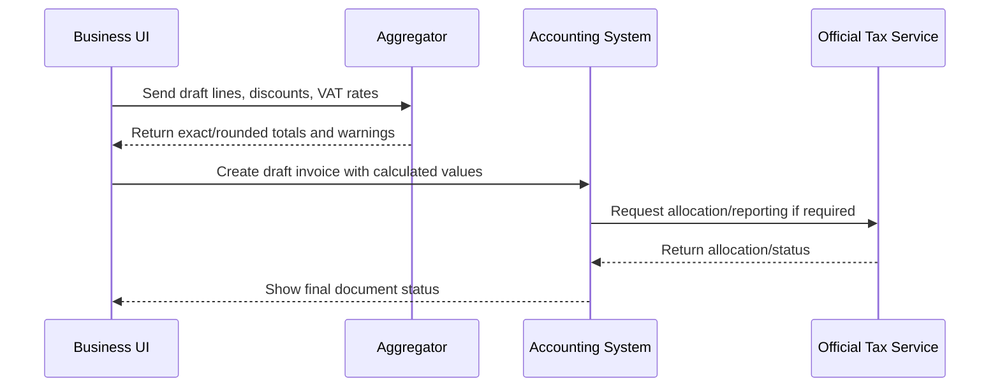

# Israeli API and Regulation Reference

## Scope

This reference identifies Israeli regulatory and technical touchpoints that commonly affect multi-line invoice aggregation. The helper does not transmit invoices, issue official tax documents, or perform authentication against government systems. Use it to calculate and validate amounts before sending data to a licensed accounting platform or an approved integration.

Verify current rules, VAT rates, schemas, and thresholds against official publications before production use.

## Main official sources to verify

| Topic | Source to verify | Why it matters |
|---|---|---|
| VAT Law and regulations | Israel Tax Authority and official legal publications | Defines tax invoice, VAT charge, rate, exemptions, zero rate, and record requirements. |
| Bookkeeping instructions | Israel Tax Authority bookkeeping directives | Affects required document fields, document sequencing, retention, and auditability. |
| Allocation Numbers / invoice reporting | Israel Tax Authority digital invoice services | May affect invoices above reporting thresholds and approved allocation-number flows. |
| Business identifiers | Registrar and Israel Tax Authority records | Validates company number, authorized dealer number, or exempt dealer status. |
| Privacy protection | Privacy Protection Law and regulations | Applies when storing customer or supplier identifiers. |
| Consumer protection | Consumer Protection Law and regulations | Relevant for consumer-facing price presentation, disclosures, and refunds. |

## Non-API skill mapping

Because this package is a calculation helper rather than an official connector, treat each regulation as a validation or workflow constraint.

| Regulation/API concern | Local equivalent in this skill |
|---|---|
| Current VAT rate | `vat_rate` per line; no hard-coded official guarantee. |
| Tax invoice line detail | `InvoiceLine` fields and calculated per-line output. |
| Discount auditability | `Discount.type`, `Discount.value`, `Discount.reason`. |
| Invoice-level commercial discount | `invoice_discount` plus allocation method. |
| Agorot rounding | exact and rounded VAT/total values. |
| Document identity | `invoice_id`, `invoice_date`, `vat_number`. |
| Transmission status | outside scope; export JSON to approved software only. |

## Request examples

### Calculation request

```json
{
  "invoice_id": "INV-2026-1001",
  "invoice_date": "15/06/2026",
  "vat_number": "515555555",
  "currency": "ILS",
  "invoice_discount": {
    "type": "amount",
    "value": "120.00",
    "reason": "Commercial discount"
  },
  "allocation": "by_net",
  "lines": [
    {
      "sku": "SUPPORT",
      "description": "Monthly support",
      "quantity": "1",
      "unit_price": "900",
      "vat_rate": "18%"
    },
    {
      "sku": "SETUP",
      "description": "Initial setup",
      "quantity": "1",
      "unit_price": "300",
      "vat_rate": "18%"
    }
  ]
}
```

### Calculation response

```json
{
  "invoice_id": "INV-2026-1001",
  "invoice_date": "15/06/2026",
  "vat_number": "515555555",
  "currency": "ILS",
  "lines": [
    {
      "sku": "SUPPORT",
      "description": "Monthly support",
      "quantity": "1",
      "unit_price": "900",
      "vat_rate": "0.18",
      "gross_before_discount": "900",
      "line_discount_amount": "0.00",
      "invoice_discount_share": "90.00",
      "taxable_base": "810.00",
      "vat_amount_exact": "145.80",
      "vat_amount": "145.80",
      "total_with_vat": "955.80"
    },
    {
      "sku": "SETUP",
      "description": "Initial setup",
      "quantity": "1",
      "unit_price": "300",
      "vat_rate": "0.18",
      "gross_before_discount": "300",
      "line_discount_amount": "0.00",
      "invoice_discount_share": "30.00",
      "taxable_base": "270.00",
      "vat_amount_exact": "48.60",
      "vat_amount": "48.60",
      "total_with_vat": "318.60"
    }
  ],
  "totals": {
    "currency": "ILS",
    "subtotal_before_discounts": "1200.00",
    "line_discounts_total": "0.00",
    "invoice_discount_total": "120.00",
    "taxable_total": "1080.00",
    "vat_total_exact": "194.40",
    "vat_total": "194.40",
    "grand_total": "1274.40"
  },
  "warnings": []
}
```

## Official API integration pattern

The package intentionally avoids direct calls to official systems. A production system should use the following separation:



## Validation examples

### VAT rate validation

Accept:

```json
{"vat_rate": "18%"}
{"vat_rate": "0.18"}
{"vat_rate": "0%"}
```

Reject:

```json
{"vat_rate": "-18%"}
{"vat_rate": "abc"}
```

### Discount validation

Accept:

```json
{"discount_type": "percent", "discount_value": "7.5"}
{"discount_type": "amount", "discount_value": "50"}
```

Reject:

```json
{"discount_type": "percent", "discount_value": "101"}
{"discount_type": "amount", "discount_value": "-1"}
```

## Error table

| Error | Condition | Suggested handling |
|---|---|---|
| `At least one invoice line is required` | Empty invoice | Block calculation and request line details. |
| `Invalid numeric value` | Non-numeric amount, quantity, or VAT rate | Highlight the field and keep original input for correction. |
| `VAT rate cannot be negative` | Negative VAT rate | Reject and verify tax treatment. |
| `Percent discount cannot exceed 100` | Discount percent above 100 | Treat as data entry error or credit-note workflow. |
| `Fixed discount cannot exceed line amount` | Amount discount larger than base | Verify whether the source is a refund or credit. |
| `Invoice discount cannot exceed allocation basis` | Invoice discount larger than eligible lines | Verify gross/net basis and allocation rules. |
| `zero quantity` | Quantity equals zero | Remove informational line or enable zero quantity by policy. |
| `negative quantity` | Negative quantity without override | Use credit-note workflow. |

## Regulatory review checklist

- Confirm document type: quotation, invoice, tax invoice, receipt, or credit note.
- Confirm that line prices are before VAT.
- Confirm current VAT rate on the document date.
- Confirm zero-rated or exempt treatment with a professional source.
- Confirm whether a discount applies before VAT.
- Confirm whether an invoice-level discount applies to all lines or only selected lines.
- Confirm official reporting requirements for the transaction amount and date.
- Confirm privacy and retention obligations before storing identifiers.

## Data retention guidance

Store:

- Source invoice identifier.
- Supplier/customer identifier required for bookkeeping.
- Calculation input.
- Calculation output.
- Version of this package.
- Operator or process identifier.
- Timestamp.

Avoid storing:

- Unneeded personal identity numbers.
- Payment card data.
- Bank credentials.
- Free-text notes containing unnecessary personal information.

## Versioning guidance

Record the package version with each calculation result. When VAT rates or rounding policies change, add migration tests and keep prior calculations reproducible.


## Web-validated 2026 updates

Access date: 2026-06-02.

### Standard VAT rate

The standard VAT rate used as the default in examples and code is 18%. This was double-confirmed against the Israel Tax Authority glossary and a 2026 PwC Worldwide Tax Summaries page. Treat the code default as a convenience default; always verify the rate by invoice date in production.

### Israel Invoice allocation thresholds

The 2026 threshold changed relative to the older July 2024 API document. Use the later VAT Implementation Order 01/2025 for current 2026 threshold guidance:

| Period | Threshold before VAT | Effect |
|---|---:|---|
| 01/01/2026 through 31/05/2026 | Above ₪10,000 | Input VAT deduction requires the tax invoice to include an allocation number when the legal conditions apply. |
| From 01/06/2026 | Above ₪5,000 | Input VAT deduction requires the tax invoice to include an allocation number when the legal conditions apply. |

The older API description listed a gradual 2026 threshold of ₪15,000 and later years of ₪10,000 and ₪5,000. The later implementation order accelerates the 2026 reduction. Keep this reference under review.

### Official endpoint references

This package does not call official APIs. The following endpoints are reference-only for teams integrating with approved software or official Tax Authority APIs:

| Service | Version/status | Sandbox host/path | Production host/path | Notes |
|---|---|---|---|---|
| Minimum amount for allocation | V2 | `https://ita-api.taxes.gov.il/shaam/tsandbox/general-information/v2/MinimumAmount` | `https://openapi.taxes.gov.il/shaam/production/general-information/v2/MinimumAmount` | Returns the minimum VAT amount requiring invoice allocation by invoice date according to the official supplement. |
| Multi Approval | V2.0 beta in the July 2024 API description | `https://ita-api.taxes.gov.il/shaam/tsandbox/Multi-invoices/v2/MultiApproval` | `https://ita-api.taxes.gov.il/shaam/production/Multi-invoices/v2/MultiApproval` | Requests allocation numbers for a batch of invoices. |

### Authentication and webhooks

The official API documents reviewed state that services use OAuth2 user-restricted authorization. No official Israel Invoice webhook event names were confirmed in the reviewed Tax Authority documents or gov.il searches. Do not implement webhook handling for this package unless a later official source documents event names and payloads.

### Official line fields relevant to this skill

The official Israel Invoice API line table includes quantity, unit price, item discount, line amount before VAT after discount, VAT rate, and VAT amount fields. This supports the package's local calculation model of multi-line invoice checking with per-line VAT and discounts. Fractional agorot handling remains a local deterministic rounding feature and is not presented as an official Tax Authority API feature.
