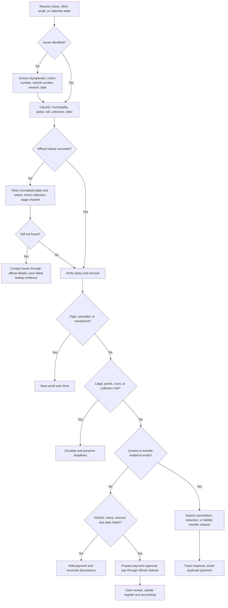
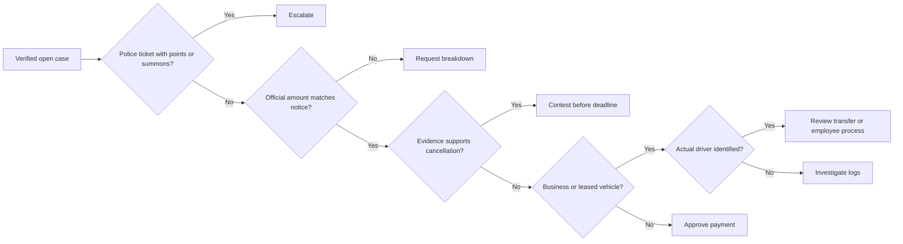

# Parking Fine Checker

Use this skill to locate, verify, organize, dispute, and prepare payment for Israeli parking, traffic, and toll fines. It supports consumers, freelancers, small businesses, office managers, finance teams, and fleet coordinators handling municipal parking fines, police traffic tickets, toll-road charges, Road 6 notices, leasing-company fine charges, and collection letters.

The workflow is operational. It helps collect identifiers, choose the official issuer channel, prevent duplicate payment, preserve evidence, and prepare accounting records. It is not legal representation, tax advice, or permission to automate official portals against their terms.

## Principles

1. Verify through an official source before payment.
2. Store receipts, appeal confirmations, and screenshots in a case folder.
3. Use the minimum identity data required by the issuer.
4. Treat toll principal, enforcement fees, collection fees, employee reimbursements, and fines as separate accounting questions.
5. Escalate police tickets with points, summons, court exposure, accidents, injury, or license consequences.
6. Never submit a driver declaration unless it is true and supported.
7. Never store payment-card numbers.

## Required input checklist

| Field | Required when | Notes |
|---|---|---|
| Vehicle number | Always | Normalize to digits only internally. |
| Notice number | Usually | Preserve the exact printed value. |
| Issuer name | Always when visible | City, police, toll operator, or collection agent. |
| Issuer type | Always | `municipality`, `police`, `toll`, `collection`, or `other`. |
| Notice date | Recommended | Internal ISO date; display as needed. |
| Due date | Recommended | Add a calendar reminder. |
| Amount in ₪ | Recommended | Store as decimal string, never float in accounting systems. |
| ID/company number | Only when required | Mask in notes. |
| Evidence | When contesting | Photos, app receipts, permits, leases, delivery documents. |

## Recommended case register

```csv
case_id,issuer_type,issuer_name,vehicle_number,notice_number,notice_date,due_date,amount_ils,status,owner_type,driver_name,business_purpose,portal_verified_at,payment_reference,appeal_reference,accounting_category,notes
```

## Canonical statuses

`new`, `needs_issuer_identification`, `lookup_not_found`, `verified_unpaid`, `verified_paid`, `duplicate_payment_risk`, `contest_candidate`, `appeal_submitted`, `liability_transfer_requested`, `approved_for_payment`, `paid`, `cancelled`, `rejected`, `collection`, `closed`.

## Decision tree



## Payment versus contest decision



## Concrete examples

### Freelancer with a municipal fine and a parking-app receipt

A freelancer receives a ₪250 Tel Aviv municipal notice dated `10-03-2026` with due date `08-06-2026`. A parking-app receipt covers the same plate, zone, and enforcement time.

Actions:

1. Normalize `12-345-67` to `1234567`.
2. Look up the notice through the municipality's official channel.
3. Confirm the portal amount and status.
4. Compare zone, plate, and time against the receipt.
5. Submit a cancellation request with the receipt and notice.
6. Save confirmation and set a follow-up reminder.

### Company car bus-lane fine

A company receives a bus-lane fine for a pooled car. Driver identity is not immediately known.

Actions:

1. Verify the fine officially.
2. Search calendar, dispatch logs, GPS, parking app, and fuel card records.
3. Identify the driver or document that the driver is unknown.
4. Review whether liability transfer is allowed.
5. Escalate when points, summons, or court options appear.
6. Record the payment or appeal decision and accounting treatment.

### Road 6 unpaid trip letter

A notice includes principal toll, enforcement fee, and collection cost.

Actions:

1. Verify through the official toll operator or customer service.
2. Request itemized trip list.
3. Compare trip dates with lease, sale, or business-use records.
4. Separate toll principal from enforcement and collection costs.
5. Pay only after account and vehicle match.
6. Store receipt and itemization.

### Duplicate payment risk

An employee says the fine was already paid personally.

Actions:

1. Collect receipt from the employee.
2. Check the official portal status.
3. Search bank and card records.
4. Mark the case `duplicate_payment_risk`.
5. Reimburse or close only after proof is reconciled.

### Wrong vehicle or sold vehicle

A fine arrives after sale or for a plate that does not match the business vehicle.

Actions:

1. Compare offense date to ownership transfer date.
2. Gather sale agreement, license transfer proof, and notice copy.
3. Submit cancellation or liability transfer request.
4. Track response and keep all confirmation numbers.

## Edge cases

### Leasing and rental vehicles

A leasing company may pay automatically and charge an administration fee. Confirm whether the original fine is closed before paying the issuer. Store the lease period, vehicle assignment, driver identity, leasing-company invoice, original fine, and receipt.

### Sole trader versus company

Israeli portals may request Israeli ID, company number, authorized dealer number, or registered owner ID. Use only the identifier indicated by the notice or issuer. Repeated guesses can create security or privacy issues.

### Disabled parking card

Check card validity, the card holder's presence where required, vehicle registration, location restrictions, and whether the specific place is still prohibited.

### Resident permit

Check permit validity, zone, vehicle number, digital registration, and street-specific restrictions.

### Parking app mismatch

The most common causes are wrong plate, wrong city, wrong zone, session expired before enforcement, private account used instead of business account, or cancellation/refund after activation.

### Collection letter

Ask for original issuer, original notice number, principal, linkage, interest, collection costs, payments already credited, and confirmation that payment will close the underlying case.

## Troubleshooting summary

| Problem | Action |
|---|---|
| Fine not found | Normalize plate, verify issuer, retry notice number, check collection stage. |
| Amount differs | Request itemized breakdown before payment. |
| Payment failed | Check card authorization; do not retry immediately. |
| Receipt missing | Request official receipt; card statement is secondary evidence. |
| Hebrew PDF unclear | Manually verify dates, amount, and notice number. |
| SMS link suspicious | Navigate manually to the official issuer domain. |
| Points or court | Escalate; do not process as a simple parking expense. |

## Anti-patterns

Avoid:

- Paying from an unverified SMS link.
- Treating every vehicle payment as a deductible business expense.
- Storing full identity numbers in general spreadsheets.
- Filing appeals without evidence.
- Missing the deadline while waiting for internal approval.
- Paying both issuer and collection agent for the same notice.
- Relying on OCR alone for Hebrew documents.
- Automatically paying fines without human approval.
- Circumventing CAPTCHA or portal protections.
- Submitting false driver declarations.

## Production checklist

- Define access to ID numbers and notices.
- Create a central register.
- Require official lookup proof before payment.
- Require evidence review before appeals.
- Define approval thresholds, for example ₪250, ₪500, and ₪1,000.
- Track every due date and appeal deadline.
- Store receipts and appeal confirmations.
- Reconcile monthly with bank and card statements.
- Separate toll principal, fines, enforcement fees, and collection fees.
- Confirm treatment with an accountant when material.
- Use approved password storage for portals.
- Remove access when staff leave.
- Test the process with the scenarios in `references/test-scenarios.md`.


## Web validation note

Use `references/verification-log.md` before relying on operational claims. The final web validation confirmed official portal-based payment and lookup flows for police traffic fines, municipal parking/enforcement tickets, Road 6 invoices and open charges, Carmel Tunnels invoices, Fast Lane invoices, and Collection Center debts. It did not confirm a universal public JSON API or official webhook event names for these workflows.
