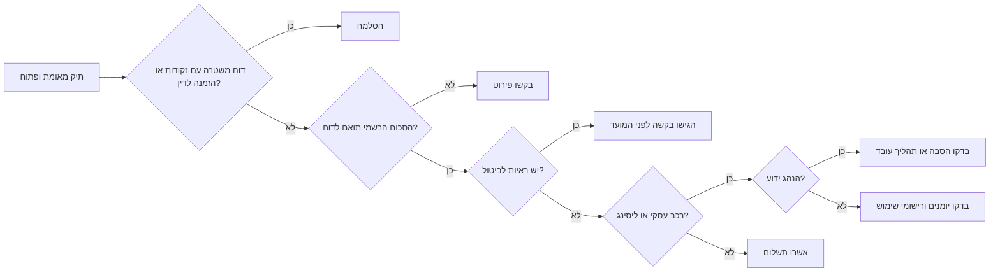

# בודק דוחות חניה, תנועה ואגרות כביש

השתמשו במיומנות זו כדי לאתר, לאמת, לתעד, לערער ולהכין תשלום עבור דוחות חניה, דוחות תנועה וחובות אגרה בישראל. המיומנות מתאימה לצרכנים, עצמאים, עסקים קטנים, מנהלי משרד, מנהלי כספים ומנהלי צי רכב שמטפלים בדוחות של רשויות מקומיות, משטרת ישראל, כביש 6, מנהרות הכרמל, הנתיב המהיר, חברות ליסינג וגורמי גבייה.

המיומנות היא תפעולית. היא מסייעת לאסוף מזהים, לבחור ערוץ רשמי, למנוע תשלום כפול, לשמור ראיות ולהכין תיעוד להנהלת חשבונות. היא אינה ייעוץ משפטי, ייעוץ מס או הרשאה לבצע איסוף אוטומטי מאתרים רשמיים בניגוד לתנאי השימוש.

## עקרונות עבודה

1. אמתו את הדוח בערוץ רשמי לפני תשלום.
2. שמרו קבלות, אישורי הגשה וצילומי מסך בתיק מסודר.
3. אספו רק מידע מזהה שנדרש לצורך הפעולה.
4. הפרידו בין אגרת נסיעה, קנס, חיוב אכיפה, הוצאות גבייה והחזר עובד.
5. הסלימו דוחות עם נקודות, הזמנה לדין, תאונה, נפגעים או חשש לשלילת רישיון.
6. אל תגישו הצהרת נהג שאינה נכונה ומגובה.
7. אל תשמרו מספרי כרטיס אשראי.

## שדות נדרשים

| שדה | מתי נדרש | הערה |
|---|---|---|
| מספר רכב | תמיד | לשמור פנימית כספרות בלבד. |
| מספר דוח | בדרך כלל | לשמור בדיוק כפי שמופיע. |
| שם גורם מנפיק | כשמופיע | עירייה, משטרה, מפעיל כביש אגרה או גבייה. |
| סוג גורם | תמיד | `municipality`, `police`, `toll`, `collection`, `other`. |
| תאריך דוח | מומלץ | במערכת: `YYYY-MM-DD`; במסמכים בעברית: `DD/MM/YYYY`. |
| מועד אחרון | מומלץ | להוסיף תזכורת ביומן. |
| סכום בש"ח | מומלץ | לשמור כמחרוזת עשרונית, למשל ₪250.00. |
| ת.ז./ח.פ./ע.מ. | רק אם נדרש | להסוות ברשימות פנימיות. |
| ראיות | בערעור/ביטול | תמונות, אישורי אפליקציה, תווים, חוזי ליסינג, מסמכי משלוח. |

## מרשם דוחות מומלץ

```csv
case_id,issuer_type,issuer_name,vehicle_number,notice_number,notice_date,due_date,amount_ils,status,owner_type,driver_name,business_purpose,portal_verified_at,payment_reference,appeal_reference,accounting_category,notes
```

## סטטוסים מומלצים

`new`, `needs_issuer_identification`, `lookup_not_found`, `verified_unpaid`, `verified_paid`, `duplicate_payment_risk`, `contest_candidate`, `appeal_submitted`, `liability_transfer_requested`, `approved_for_payment`, `paid`, `cancelled`, `rejected`, `collection`, `closed`.

## עץ החלטה

```mermaid
flowchart TD
    A[התקבל דוח, מסרון, דוא"ל או מכתב גבייה] --> B{הגורם המנפיק מזוהה?}
    B -- לא --> C[חלצו עיר/מפעיל, מספר דוח, מספר רכב, סכום ותאריך]
    C --> D[סווגו: רשות מקומית, משטרה, כביש אגרה, גבייה, אחר]
    B -- כן --> D
    D --> E{הבדיקה בערוץ הרשמי הצליחה?}
    E -- לא --> F[נסו מספר רכב מתוקנן ומספר דוח; בדקו ערוץ גבייה]
    F --> G{עדיין לא נמצא?}
    G -- כן --> H[פנו לגורם הרשמי ושמרו הוכחת כישלון בדיקה]
    G -- לא --> I[אמתו סטטוס וסכום]
    E -- כן --> I
    I --> J{שולם, בוטל או הוסב?}
    J -- כן --> K[שמרו אסמכתה וסגרו תיק]
    J -- לא --> L{יש נקודות, הזמנה לדין או סיכון גבייה?}
    L -- כן --> M[הסלימו ושמרו מועדים]
    L -- לא --> N{קיימות ראיות לביטול או הסבה?}
    N -- כן --> O[הגישו בקשה לביטול, הפחתה או הסבה]
    N -- לא --> P{הרכב, הדוח, הסכום והמועד תואמים?}
    P -- לא --> Q[עצרו תשלום ובררו פערים]
    P -- כן --> R[הכינו אישור תשלום ושלמו בערוץ רשמי]
    O --> S[עקבו אחרי תשובה והימנעו מתשלום כפול]
    R --> T[שמרו קבלה ועדכנו הנהלת חשבונות]
```

## החלטה: לשלם, לערער או להסב



## דוגמאות

### עצמאי עם דוח חניה ואישור אפליקציה

עצמאי קיבל דוח עירוני בסך ₪250 בתאריך `10/03/2026`, עם מועד אחרון `08/06/2026`. יש אישור פנגו/סלופארק לאותו רכב, אזור ושעת אכיפה.

פעולות:

1. תקננו את `12-345-67` ל-`1234567`.
2. בדקו את הדוח באתר הרשמי של העירייה.
3. ודאו סכום וסטטוס.
4. השוו אזור, מספר רכב ושעת אכיפה.
5. הגישו בקשה לביטול עם האישור והדוח.
6. שמרו אישור הגשה וקבעו תזכורת מעקב.

### רכב חברה ודוח נתיב תחבורה ציבורית

פעולות:

1. אמתו את הדוח בערוץ רשמי.
2. בדקו יומן, סידור עבודה, מערכת איתור, אפליקציית חניה וכרטיס דלק.
3. זהו את הנהג או תעדו שלא ניתן לזהות.
4. בדקו אם ניתן להסב את הדוח.
5. הסלימו אם קיימות נקודות, הזמנה לדין או חשיפה משפטית.
6. תעדו החלטה וטיפול חשבונאי.

### חוב כביש 6

פעולות:

1. אמתו מול הערוץ הרשמי של מפעיל הכביש.
2. בקשו פירוט נסיעות.
3. השוו תאריכים להסכם ליסינג, מכירה או שימוש עסקי.
4. הפרידו בין אגרת נסיעה, חיוב אכיפה והוצאות גבייה.
5. שלמו רק לאחר התאמת חשבון ורכב.
6. שמרו קבלה ופירוט נסיעות.

### חשש לתשלום כפול

עובד טוען ששילם את הדוח באופן פרטי.

פעולות:

1. בקשו קבלה מהעובד.
2. בדקו סטטוס באתר הרשמי.
3. חפשו חיובים בבנק ובכרטיסי אשראי.
4. סמנו `duplicate_payment_risk`.
5. החזירו לעובד או סגרו תיק רק לאחר התאמה.

## מקרי קצה

### ליסינג והשכרה

חברת ליסינג עשויה לשלם אוטומטית ולחייב בדמי טיפול. ודאו שהדוח המקורי נסגר לפני תשלום נוסף. שמרו תקופת ליסינג, שיוך רכב, זהות נהג, חשבונית חברת ליסינג, דוח מקורי וקבלה.

### עצמאי מול חברה בע"מ

אתרים עשויים לבקש תעודת זהות, ח.פ., ע.מ. או מזהה בעלים רשום. השתמשו רק במזהה שמופיע בדרישה או שנמסר מהרשות. אל תנסו מזהים רבים ללא צורך.

### תג נכה

בדקו תוקף תג, נוכחות בעל התג כאשר נדרש, רישום רכב, מגבלות המקום והאם המקום אסור לחניה גם עם תג.

### תו חניה אזורי

בדקו תוקף, אזור, מספר רכב, רישום דיגיטלי והגבלות רחוב ספציפיות.

### אי התאמה באפליקציית חניה

סיבות נפוצות: רכב שגוי, עיר שגויה, אזור שגוי, סיום חניה לפני האכיפה, שימוש בחשבון פרטי במקום עסקי או ביטול/זיכוי לאחר ההפעלה.

## טיפול חשבונאי תפעולי

| פריט | בדיקה נדרשת |
|---|---|
| אגרת כביש לנסיעה עסקית | לשמור קבלה ותיאור מטרה עסקית. |
| קנס חניה | לבדוק עם רואה חשבון; לא להניח שמדובר בהוצאה רגילה. |
| חיוב אכיפה או גבייה | להפריד מהקרן ולבחון טיפול מס. |
| החזר לעובד | לשמור קבלה ולמנוע רישום כפול. |
| קיזוז משכר | לבדוק דיני עבודה והסכמה מתאימה. |

## תקלות נפוצות

| בעיה | פעולה |
|---|---|
| הדוח לא נמצא | תקננו מספר רכב, אמתו גורם, נסו מספר דוח, בדקו גבייה. |
| הסכום שונה | בקשו פירוט לפני תשלום. |
| התשלום נכשל | בדקו אישור בכרטיס; אל תנסו שוב מיד. |
| אין קבלה | בקשו קבלה רשמית; דף כרטיס אשראי הוא ראיה משנית. |
| קובץ PDF בעברית לא ברור | בדקו ידנית תאריך, סכום ומספר דוח. |
| קישור מסרון חשוד | היכנסו ידנית לדומיין הרשמי. |
| נקודות או בית משפט | הסלימו; לא לסווג כהוצאת חניה רגילה. |

## דפוסי פעולה שגויים

הימנעו מ:

- תשלום דרך קישור מסרון לא מאומת.
- סיווג כל תשלום רכב כהוצאה מוכרת.
- שמירת תעודות זהות מלאות בגיליון כללי.
- ערעור ללא ראיות.
- החמצת מועד בגלל אישור פנימי.
- תשלום כפול לרשות ולגורם גבייה.
- הסתמכות על OCR בלבד במסמכים בעברית.
- תשלום אוטומטי ללא בדיקה אנושית.
- עקיפת CAPTCHA או הגנות אתר.
- הגשת הצהרת נהג לא נכונה.

## רשימת מוכנות

- הגדירו הרשאות למידע מזהה.
- צרו מרשם דוחות מרכזי.
- חייבו בדיקה רשמית לפני תשלום.
- חייבו סקירת ראיות לפני ערעור.
- הגדירו מדרגות אישור: ₪250, ₪500, ₪1,000.
- נהלו מועדים ביומן.
- שמרו קבלות ואישורי הגשה.
- בצעו התאמה חודשית מול בנק וכרטיסי אשראי.
- הפרידו אגרה, קנס, אכיפה וגבייה.
- אשרו טיפול מהותי מול רואה חשבון.
- שמרו סיסמאות במנהל סיסמאות.
- הסירו הרשאות לעובד שעזב.


## לוקליזציה ותצוגת תאריכים

הציגו תאריכים במסמכים בעברית במבנה `DD/MM/YYYY`, למשל `14/05/2026`. שמרו במערכות פנימיות תאריך תקני במבנה `YYYY-MM-DD` כדי למנוע בלבול בין יום לחודש. הציגו סכומים לציבור עם סימן `₪`, למשל `₪250.00`.


## הערת אימות מקורות

עיינו בקובץ `references/verification-log.md` לפני הסתמכות על טענה תפעולית. בדיקת המקורות הסופית אישרה תהליכים מבוססי פורטל או טופס רשמי לדוחות תעבורה, דוחות עירוניים, חשבוניות כביש 6, חיובי מנהרות הכרמל, חיובי הנתיב המהיר וחובות במרכז לגביית קנסות. לא אומת ממשק JSON ציבורי אחיד או שמות אירועי webhook רשמיים לתהליכים אלה.
