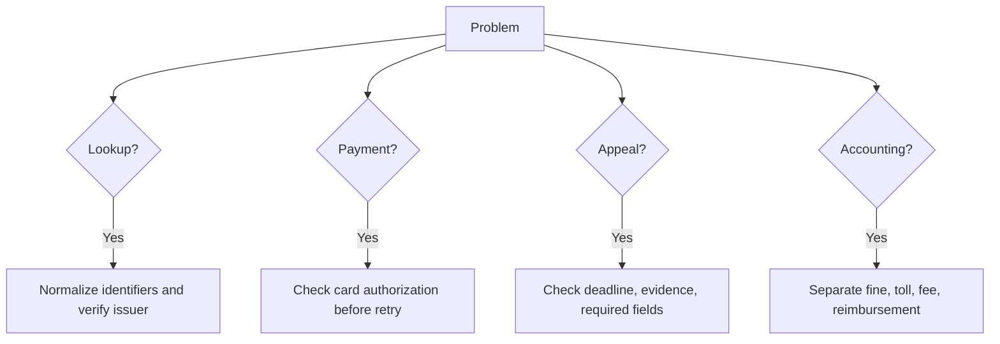

# Troubleshooting

## Fast diagnosis

## Fine not found

Causes: wrong portal, plate formatting, typo, fine not uploaded, transferred to collection, leasing company registered owner, wrong identifier.

Actions:

1. Retry plate as digits only.
2. Compare notice number manually.
3. Use the issuer named on the notice.
4. Check collection-stage channel.
5. Contact issuer and save response.

## ID/company number rejected

- Confirm registered owner.
- Distinguish private ID, company number, authorized dealer number, and leasing account.
- Use only the identifier requested by the notice.
- Avoid repeated guessing.

## Amount differs

- Save notice and portal result.
- Request breakdown.
- Identify late fee, linkage, interest, partial payment, reduction, or collection cost.
- Hold payment until reconciled.

## Payment failed

- Save failure screen.
- Check pending card authorization.
- Do not retry immediately.
- Contact issuer/payment provider.
- Mark `duplicate_payment_risk`.

## Receipt missing

- Check email, spam, and portal history.
- Request official receipt.
- Store card statement only as secondary evidence.

## Appeal blocked

- Convert attachments to PDF.
- Reduce file size.
- Use simple file names.
- Submit before deadline.
- Do not exaggerate evidence.

## Toll-road mismatch

- Request trip itemization.
- Compare dates to business records.
- Check subscription/transponder.
- Check lease or sale dates.

## Collection without breakdown

- Request original notice and itemization.
- Verify with original issuer.
- Do not pay unitemized charges.
- Escalate if enforcement action appears.

## Hebrew document issues

- Display dates as `DD/MM/YYYY`, store internally as `YYYY-MM-DD`.
- Use `₪` for Hebrew-facing amounts.
- Verify OCR results manually, especially `0/O`, `1/I`, `5/S`, notice numbers, dates, and amounts.

## Recovery checklist

- [ ] Original notice saved.
- [ ] Issuer identified.
- [ ] Official lookup attempted.
- [ ] Screenshot/PDF saved.
- [ ] Amount reconciled.
- [ ] Due date recorded.
- [ ] Payment/appeal/transfer decision documented.
- [ ] Receipt or confirmation saved.
- [ ] Accounting category reviewed.
- [ ] Case status updated.

## Verified phishing warning

Road 6 publishes a warning that payment is performed only in the personal area after full identification and warns against entering personal or payment details through links received by message or email. Apply the same caution to every fine or toll notice: navigate manually to the official domain whenever a link is unexpected.
