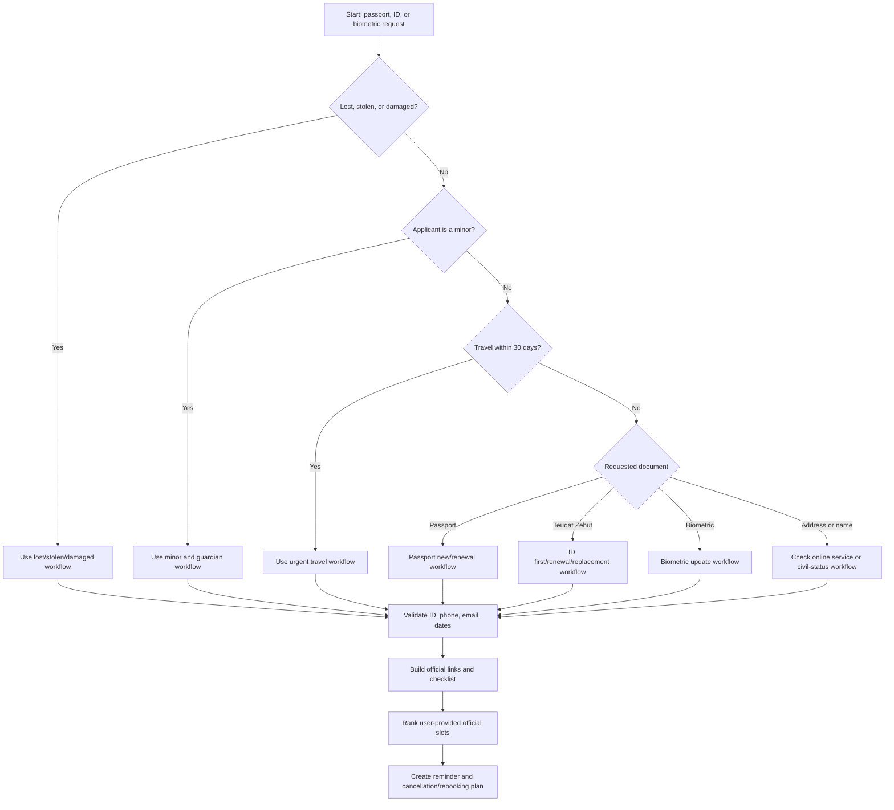

# Passport & ID Appointment Scheduler

## Purpose

Use this skill to prepare and guide appointments with the Israeli Population and Immigration Authority for passports, Teudat Zehut identity cards, biometric documentation, address updates, and name/status updates. The skill is useful for individual consumers, freelancers who need valid identity documents for banks or digital signatures, and small businesses helping employees understand document deadlines without taking control of personal accounts.

The skill is a planning and preparation assistant. Keep the final login, identity verification, payment, and appointment confirmation inside the official government or authorized appointment channel. Do not automate CAPTCHA, waiting rooms, queues, account recovery, one-time codes, or payment pages.

## Operating principles

1. Collect only facts needed to classify and prepare the appointment.
2. Validate Israeli formats before building an appointment plan.
3. Select the exact service path before searching for slots.
4. Prefer gov.il, the Population and Immigration Authority, my.gov.il, and GoVisit as the official appointment channel.
5. Avoid duplicate appointments unless the official system requires separate slots.
6. Treat minors, urgent travel, lost/stolen documents, accessibility, and guardianship as special cases.
7. Never collect passwords, OTPs, credit-card numbers, or biometric identifiers.
8. Produce a checklist, reminder plan, and cancellation/rebooking note after a slot is selected.

## Fast intake

| Field | Examples | Reason |
|---|---|---|
| Service | passport renewal, first ID, lost passport, biometric update | Maps to the correct official path |
| Applicant count | 1 adult, parent + 2 children, employee | Determines separate checklists and slot conflicts |
| City/region | Tel Aviv, Haifa, Jerusalem, Beer Sheva | Selects bureaus and nearby alternatives |
| Deadline | flight on 15/08/2026, bank KYC, employee onboarding | Controls urgency |
| Minor status | under 18, one parent available, custody order | Changes consent requirements |
| Document status | valid, expired, lost, stolen, damaged | Changes checklist and warning level |
| Accessibility | wheelchair access, companion, language needs | Changes branch and timing considerations |
| Contact | Israeli mobile, email | Used for confirmation and reminders |

Ask for dates in plain language, but store machine dates as `YYYY-MM-DD` and display Israeli dates as `DD/MM/YYYY`.

## Decision tree



## Service classification

| User phrase | Classify as | Handling |
|---|---|---|
| “Renew passport”, “passport expired” | `passport_renewal` | Bring current passport if available |
| “First passport for child” | `passport_new` + minor | Add guardian consent and child attendance checks |
| “Lost passport before flight” | `passport_lost_stolen` + urgent | Use official urgent guidance; do not guarantee issuance |
| “Teudat Zehut at age 16” | `id_first` + minor | Add parent/guardian workflow |
| “Biometric ID expired” | `id_renewal` or `biometric_update` | Verify current document and official category |
| “Lost ID” | `id_lost_stolen` | Add other identifying document and reporting notes |
| “Change address” | `address_update` | Check online service first |
| “Change name after marriage/divorce” | `name_status_update` | Add civil-status document checklist |
| “Employee needs ID for onboarding” | Personal appointment with business deadline | Employee books personally unless legally authorized |
| “Family passports” | Multi-applicant planning | Build per-person checklist and avoid overlap |

## Standard workflow

1. Identify service and applicant type.
2. Validate Teudat Zehut, phone, email, city, and date range.
3. Check whether an online self-service flow can replace an appointment.
4. Build preferred city, nearby cities, date window, time window, accessibility needs, and urgency.
5. Send the user to official booking and authentication.
6. Record only non-secret confirmation details: bureau, address, date, time, and confirmation number if user supplies it.
7. Generate required documents, reminders, and cancellation/rebooking instructions.

## Validation rules

### Teudat Zehut
A Teudat Zehut number must have 9 digits with a valid check digit. Leading zeros are allowed; `000000000` is rejected.

```python
validate_teudat_zehut("123456782")
```

Expected local result:

```json
{"valid": true, "normalized": "123456782", "error": null}
```

### Israeli phone
Accept `052-123-4567`, `+972 52 123 4567`, and `972521234567`. Normalize to `0521234567`. Reject short codes, premium numbers, and unsupported prefixes.

### Dates
Use ISO `YYYY-MM-DD` internally and display `DD/MM/YYYY` to the user.

## Appointment ranking

Rank candidate slots supplied by the user or a safe internal source with these priorities:

1. Exact official service match.
2. Preferred city.
3. Nearby city within the accepted radius.
4. Earlier date when urgency is high.
5. Time-window match.
6. Accessibility match.
7. Official source URL.
8. Lower duplicate or conflict risk.

Reject social-media slot sellers, appointment brokers, unofficial link shorteners, and any source that asks for account credentials.

## Concrete examples

### Adult passport renewal
Input: “Book passport renewal in Tel Aviv, morning next month.”

Action: classify as `passport_renewal`; validate ID and phone; set next-month window; search official channel manually; rank Tel Aviv before Ramat Gan, Givatayim, Holon, Bat Yam, and Bnei Brak if nearby options are acceptable; provide checklist for Teudat Zehut, current passport, confirmation, and payment method if required.

### Freelancer lost ID
Input: “Lost my ID and need replacement for invoices and bank KYC.”

Action: classify as `id_lost_stolen`; prepare lost-document checklist; rank earliest official slot; add post-receipt update list for bank, accountant, invoicing platform, payroll platform, and digital signature provider; avoid shared spreadsheets with full ID numbers.

### Small-business employee deadline
Input: “New employee needs valid ID by 01/09/2026.”

Action: treat as employee’s personal process; do not collect employer or employee login credentials; create employee-facing checklist; mention that personal data handling must be limited and lawful.

### Child passport
Input: “Passport for a 9-year-old before a family trip.”

Action: classify as minor passport; confirm parents/guardians, attendance, current documents, and travel date; add consent notes; rank slots with enough lead time.

### Combined passport and ID renewal
Input: “Renew biometric passport and ID together.”

Action: check whether the selected official service supports both documents in one appointment; if uncertain, instruct verification in the official channel; avoid overlapping duplicate appointments.

## Edge cases

- **Urgent travel:** ask for travel date, current passport status, and whether the traveler is a minor. Use official urgent guidance only and never guarantee issuance.
- **One parent unavailable:** direct the user to official consent requirements. Do not provide custody legal advice.
- **Address update:** check online service first because a physical appointment may be unnecessary.
- **Name/status update:** add marriage, divorce, court order, or other civil-status documents.
- **Limited mobility:** prioritize accessible bureaus and sufficient arrival buffer.
- **No Israeli mobile:** verify whether the official system accepts another contact method; do not use another person’s phone without consent.
- **Family group:** create one checklist per applicant and avoid times that require the same guardian in two places.
- **Expired but no deadline:** use standard renewal and warn that branch availability varies.


## Fees and VAT

Do not hard-code passport, identity-card, or biometric-document fees. Direct the user to the official fee table or official payment page at the time of booking. VAT is not part of the appointment-planning workflow; when a small-business user asks about VAT for records or invoicing, verify the current rate against the Israel Tax Authority before answering.

## Troubleshooting quick table

| Problem | Likely cause | Action |
|---|---|---|
| No slots | High demand or narrow date/city filter | Expand radius, date window, and check official channel later |
| SMS missing | Wrong phone format or carrier filtering | Normalize to `05XXXXXXXX`, check device and retry |
| ID rejected | Missing leading zero or checksum failure | Enter exactly 9 digits and validate locally |
| Slot disappeared | Slot was not confirmed | Select another slot and complete official confirmation |
| Payment failed | Browser/card/3-D Secure issue | Complete manually; never share card data |
| Minor blocked | Guardian or consent data missing | Use minor workflow and official requirements |
| Duplicate appointment | Multiple attempts | Keep one confirmed official appointment and cancel the rest |
| Browser stuck | Cookies, extensions, VPN | Try private window and supported browser |

## Anti-patterns

Avoid speculative slot hoarding, appointment brokers, shared logins, OTP sharing, payment sharing, scraping, CAPTCHA bypass, queue bypass, unofficial appointment trading, and sending users to a bureau without checking current document requirements.

## Production checklist

- [ ] Verify current official URLs and service rules.
- [ ] Verify current fees, branch hours, and accessibility information.
- [ ] Encrypt personal data at rest.
- [ ] Mask Teudat Zehut in logs and shared reports.
- [ ] Store no OTPs, passwords, card data, or biometric identifiers.
- [ ] Define retention and deletion policy.
- [ ] Add consent language for employee or family assistance.
- [ ] Rate-limit any official-link checks.
- [ ] Keep manual official-channel fallback.
- [ ] Test CLI on Windows, macOS, and Linux.
- [ ] Review privacy obligations for employee data.

## Output template

```markdown
Service: passport_renewal
Applicant: adult
Preferred area: Tel Aviv-Yafo
Date window: 01/08/2026 to 31/08/2026
Action: Use the official appointment channel; check Tel Aviv first and nearby bureaus second.
Bring: Teudat Zehut, current passport if available, confirmation SMS/email, payment method if required.
Reminder: Arrive 15 minutes early and verify current official requirements before leaving.
```

## Safety boundaries

Permitted: validation, checklists, official links, slot ranking from user-provided data, reminders, and `.ics` files.

Not permitted: login automation, CAPTCHA solving, queue bypassing, mass booking, appointment selling, OTP collection, payment collection, biometric-data storage, or promises of government processing times.
