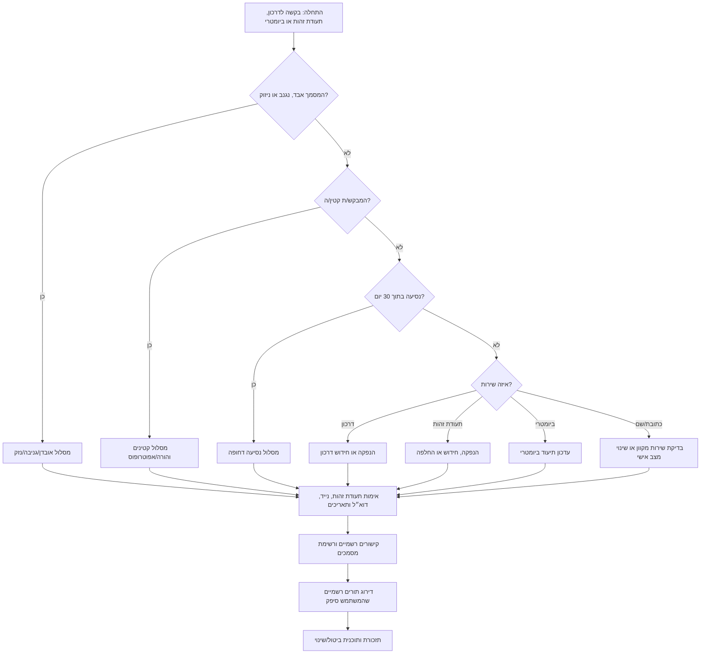

# מתאם תורים לדרכון, תעודת זהות ומסמכים ביומטריים

## מטרה

השתמשו במיומנות זו כדי להכין וללוות קביעת תור ברשות האוכלוסין וההגירה עבור דרכון ישראלי, תעודת זהות, תיעוד ביומטרי, עדכון כתובת ושינוי שם או מצב אישי. המיומנות מתאימה לאזרחים, עצמאים שצריכים מסמך תקף לבנק או לחתימה דיגיטלית, ועסקים קטנים שמסייעים לעובדים להבין מועד יעד בלי לקבל שליטה בחשבון אישי.

המיומנות מיועדת לתכנון ולהכנה בלבד. ההתחברות, ההזדהות, התשלום ואישור התור חייבים להתבצע בערוץ הרשמי. אין לבצע אוטומציה של בדיקת אנושיות, חדרי המתנה, תורים, שחזור חשבון, קודי אימות או דפי תשלום.

## עקרונות עבודה

1. אספו רק את המידע הדרוש לסיווג התור ולהכנתו.
2. אמתו פורמטים ישראליים לפני בניית תוכנית.
3. בחרו את מסלול השירות המדויק לפני חיפוש תורים.
4. העדיפו את gov.il, רשות האוכלוסין וההגירה, my.gov.il ו-GoVisit כערוץ התורים הרשמי.
5. הימנעו מתורים כפולים, אלא אם המערכת הרשמית דורשת תורים נפרדים.
6. התייחסו לקטינים, נסיעה דחופה, אובדן/גניבה, נגישות ואפוטרופסות כמקרים מיוחדים.
7. אל תאספו סיסמאות, קודי קוד חד פעמי, פרטי כרטיס אשראי או מזהים ביומטריים.
8. הפיקו בסיום רשימת מסמכים, תוכנית תזכורות והנחיית ביטול/שינוי תור.

## איסוף ראשוני מהיר

| שדה | דוגמאות | למה זה חשוב |
|---|---|---|
| שירות | חידוש דרכון, תעודת זהות ראשונה, דרכון שאבד, עדכון ביומטרי | מיפוי למסלול הרשמי |
| מספר מבקשים | מבוגר אחד, הורה ושני ילדים, עובד | קובע רשימות מסמכים וניגודי תורים |
| עיר/אזור | תל אביב, חיפה, ירושלים, באר שבע | בחירת לשכות וחלופות קרובות |
| מועד יעד | טיסה ב-15/08/2026, זיהוי בנקאי, קליטת עובד, פתיחת תיק כעוסק פטור או כעוסק מורשה | קביעת רמת דחיפות |
| קטין/ה | מתחת לגיל 18, הורה אחד זמין, צו משמורת | משנה דרישות הסכמה ומסמכים |
| מצב המסמך | בתוקף, פג תוקף, אבד, נגנב, ניזוק | משנה מסלול והתרעות |
| נגישות | כיסא גלגלים, מלווה, צורך שפתי | משפיע על לשכה ושעת הגעה |
| פרטי קשר | נייד ישראלי, דוא״ל | נדרש לאישור ותזכורות |

אחסנו תאריכים טכניים כ-`YYYY-MM-DD`, אך הציגו למשתמש תאריכים ישראליים כ-`DD/MM/YYYY`, למשל `15/08/2026`. סכומים יש להציג בשקלים, למשל `₪<amount>`; אין להתייחס לדוגמה כאל אגרה רשמית.

## עץ החלטה



## סיווג שירות

| ניסוח משתמש | סיווג | טיפול |
|---|---|---|
| “חידוש דרכון”, “דרכון פג תוקף” | `passport_renewal` | להביא דרכון קיים אם יש |
| “דרכון ראשון לילד” | `passport_new` + קטין | להוסיף הסכמת הורים ונוכחות ילד/ה לפי ההנחיות |
| “דרכון אבד לפני טיסה” | `passport_lost_stolen` + דחוף | להשתמש רק בהנחיות דחופות רשמיות |
| “תעודת זהות בגיל 16” | `id_first` + קטין | להוסיף מסלול הורה/אפוטרופוס |
| “תעודה ביומטרית פגה” | `id_renewal` או `biometric_update` | לוודא קטגוריה במערכת הרשמית |
| “איבדתי תעודת זהות” | `id_lost_stolen` | להוסיף מסמך מזהה חלופי ודיווח לפי צורך |
| “שינוי כתובת” | `address_update` | לבדוק שירות מקוון לפני תור פיזי |
| “שינוי שם אחרי נישואים/גירושים” | `name_status_update` | להוסיף מסמך מצב אישי |
| “עובד צריך תעודת זהות לקליטה” | תהליך אישי עם מועד יעד עסקי | העובד קובע בעצמו, אלא אם קיימת הרשאה תקפה ומתועדת |
| “כל המשפחה צריכה דרכונים” | תכנון רב-מבקשים | רשימה נפרדת לכל מבקש ומניעת חפיפה |

## זרימת עבודה רגילה

1. זהו שירות וסוג מבקש.
2. אמתו תעודת זהות, טלפון, דוא״ל, עיר וטווח תאריכים.
3. בדקו אם שירות עצמי מקוון מחליף תור.
4. הגדירו עיר מועדפת, ערים סמוכות, טווח תאריכים, שעות, נגישות ודחיפות.
5. הפנו את המשתמש לקביעת תור והזדהות בערוץ הרשמי.
6. תעדו רק פרטים שאינם סודיים: לשכה, כתובת, תאריך, שעה ומספר אישור אם המשתמש מספק.
7. הפיקו מסמכים נדרשים, תזכורות והנחיות ביטול/שינוי.

## אימות פורמטים ישראליים

### תעודת זהות
מספר תעודת זהות כולל 9 ספרות וספרת ביקורת. אפסים מובילים מותרים; `000000000` נדחה.

### טלפון
קלטים תקינים: `052-123-4567`, `+972 52 123 4567`, `972521234567`. הפלט המנורמל: `0521234567`. קודים קצרים ומספרי פרימיום נדחים.

### תאריכים ושקלים
הציגו `01/09/2026`, לא `09/01/26`. הציגו אגרה כ-`₪<amount>`, לא `<amount> ₪`. אין לאסוף פרטי כרטיס אשראי.

## דוגמאות מעשיות

### חידוש דרכון למבוגר
סווגו כ-`passport_renewal`; אמתו תעודת זהות ונייד; הגדירו חלון חיפוש; דרגו תל אביב לפני רמת גן, גבעתיים, חולון, בת ים ובני ברק אם המשתמש מסכים; הפיקו רשימת מסמכים: תעודת זהות, דרכון קיים אם יש, אישור תור, אמצעי תשלום אם נדרש.

### עצמאי שאיבד תעודת זהות
סווגו כ-`id_lost_stolen`; הכינו רשימת מסמכים לאובדן; דרגו תור רשמי מוקדם; הוסיפו עדכון לאחר קבלה: בנק, רואה חשבון, מערכת חשבוניות, שכר וספק חתימה אלקטרונית מאושרת. אל תשמרו מספרי תעודת זהות מלאים בגיליון משותף.

### עובד בעסק קטן
התור הוא תהליך אישי של העובד. אין לבקש סיסמה או קוד חד פעמי. צרו רשימת מסמכים לעובד והזכירו שמעסיק חייב לצמצם עיבוד מידע אישי למטרה חוקית, מוגדרת ומידתית.

### דרכון לילד/ה
סווגו כמסלול קטין; בדקו הורים/אפוטרופוסים, נוכחות, מסמכים קיימים ותאריך נסיעה; הוסיפו הסכמות; דרגו תורים עם מרווח מספיק לפני הטיסה.

### חידוש דרכון ותעודת זהות יחד
בדקו אם המערכת הרשמית מאפשרת את שני השירותים באותו תור. אם אין ודאות, הנחו לוודא בערוץ הרשמי. אל תקבעו תורים כפולים וחופפים.

## מקרי קצה

- **נסיעה דחופה:** בקשו תאריך יציאה ומצב דרכון. השתמשו בהנחיות רשמיות בלבד ואל תבטיחו הנפקה.
- **הורה אחד לא זמין:** הפנו לדרישות הסכמה רשמיות. אין לתת ייעוץ משפטי בענייני משמורת.
- **עדכון כתובת:** בדקו שירות מקוון לפני תור פיזי.
- **שינוי שם/מצב אישי:** הוסיפו נישואים, גירושים, צו בית משפט או מסמך אזרחי אחר.
- **נגישות:** העדיפו לשכה נגישה, מרווח הגעה ומלווה לפי צורך.
- **אין נייד ישראלי:** ודאו אם המערכת מקבלת ערוץ אחר; אין להשתמש במספר של אדם אחר בלי הסכמה.
- **משפחה:** רשימת מסמכים לכל מבקש ומניעת תורים חופפים.
- **מסמך פג בלי מועד יעד:** חידוש רגיל והבהרה שזמינות לשכות משתנה.

## תקלות נפוצות

| בעיה | סיבה אפשרית | פעולה |
|---|---|---|
| אין תורים | ביקוש גבוה או סינון צר | הרחיבו רדיוס ותאריכים ונסו בערוץ הרשמי |
| מסרון לא הגיע | פורמט נייד שגוי או חסימת מפעיל | נרמלו ל-`05XXXXXXXX` ונסו שוב |
| תעודת זהות נדחתה | אפס מוביל חסר או ספרת ביקורת שגויה | הזינו 9 ספרות בדיוק |
| התור נעלם | התור לא אושר סופית | בחרו תור אחר והשלימו אישור |
| תשלום נכשל | דפדפן, כרטיס או 3-D Secure | השלימו ידנית; אין למסור פרטי כרטיס |
| קטין נחסם | חסרים הורה/אפוטרופוס או הסכמה | השתמשו במסלול קטינים |
| כפילות תורים | ניסיונות חוזרים | השאירו תור רשמי אחד ובטלו כפילות |
| דפדפן תקוע | עוגיות, תוספים, VPN | נסו חלון פרטי ודפדפן נתמך |

## פעולות לא רצויות

הימנעו משמירת תורים “ליתר ביטחון”, ספסרי תורים, התחברות לחשבון של אדם אחר, שיתוף קוד חד פעמי, שיתוף פרטי תשלום, סריקה אגרסיבית, עקיפת בדיקת אנושיות, עקיפת חדר המתנה, מסחר בתורים ושליחת משתמשים ללשכה ללא בדיקת מסמכים עדכנית.

## רשימת בדיקה לסביבת ייצור

- [ ] לאמת כתובות שירות, אגרות וכללי תורים עדכניים.
- [ ] לוודא שעות פעילות ונגישות לשכות.
- [ ] להצפין מידע אישי במנוחה.
- [ ] למסך תעודת זהות ביומני מערכת ובדוחות.
- [ ] לא לשמור קוד חד פעמי, סיסמאות, פרטי כרטיס או מידע ביומטרי.
- [ ] להגדיר מדיניות שמירה ומחיקה.
- [ ] להוסיף הסכמה לסיוע לעובדים או בני משפחה.
- [ ] להגביל קצב בדיקות קישורים רשמיים.
- [ ] לשמור מסלול ידני בערוץ הרשמי.
- [ ] לבדוק ממשק שורת פקודה ב-Windows, macOS ו-Linux.
- [ ] לבדוק חובות פרטיות בעיבוד נתוני עובדים.

## תבנית פלט

```markdown
שירות: passport_renewal
מבקש: מבוגר
אזור מועדף: תל אביב-יפו
חלון תאריכים: 01/08/2026 עד 31/08/2026
פעולה: להשתמש בערוץ התורים הרשמי; לבדוק קודם תל אביב ואז לשכות סמוכות.
להביא: תעודת זהות, דרכון קיים אם יש, אישור מסרון/דוא״ל, אמצעי תשלום אם נדרש.
תזכורת: להגיע 15 דקות מוקדם ולבדוק דרישות רשמיות עדכניות לפני היציאה.
```

## גבולות בטיחות

מותר: אימות נתונים, רשימות מסמכים, קישורים רשמיים, דירוג תורים שסופקו על ידי המשתמש, תזכורות וקובצי `.ics`.

אסור: אוטומציית התחברות, פתרון בדיקת אנושיות, עקיפת תור, קביעת תורים המונית, מכירת תורים, איסוף קוד חד פעמי, גביית תשלום, שמירת מזהים ביומטריים או הבטחת זמני טיפול ממשלתיים.
