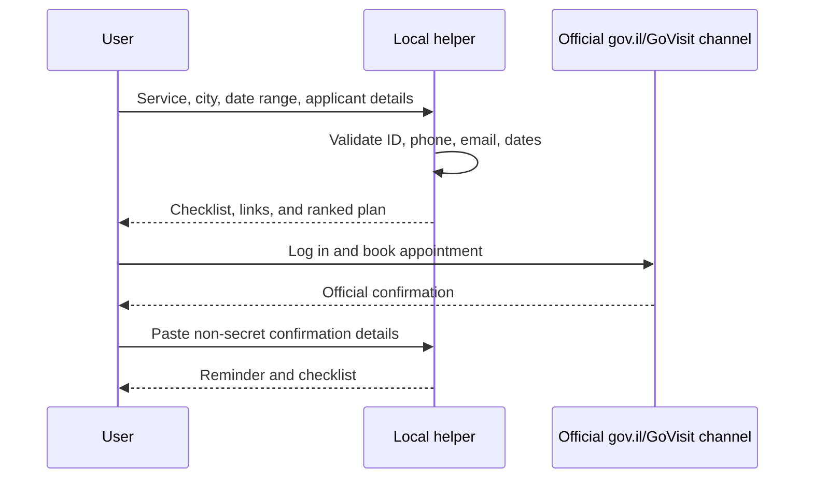

# Public interface and regulation reference

This skill does not rely on a stable public appointment-booking API. Treat official government pages as the source of truth and complete appointment booking through the official channel. The request/response examples below describe local helper interfaces only; they are not undocumented government API contracts.

## Official public sources to verify before production

| Topic | Public source | Use |
|---|---|---|
| Government services portal | https://www.gov.il/ | Search official service pages |
| Population and Immigration Authority | https://www.gov.il/he/departments/population_and_immigration_authority | Primary authority for passports, ID cards, and population services |
| Personal government area | https://my.gov.il/ | Authenticated government services entry point |
| Official appointment channel | https://govisit.gov.il/ | GoVisit appointment scheduling channel; verify current entry from gov.il |
| Privacy Protection Law, 5741-1981 | https://www.gov.il/he/pages/privacy_law | Personal-data handling obligations |
| Biometric identification law | https://main.knesset.gov.il/Activity/Legislation/Laws/pages/lawprimary.aspx?lawitemid=2000323&st=lawlaws&t=lawlaws | Biometric documentation context |
| Population Registry Law, 5725-1965 | https://main.knesset.gov.il/Activity/Legislation/Laws/pages/lawprimary.aspx?lawitemid=2001094&st=lawlaws&t=lawlaws | Population registry and identity-document context |
| Passports Law, 5712-1952 | https://main.knesset.gov.il/Activity/Legislation/Laws/pages/lawprimary.aspx?lawitemid=2000244&st=lawlaws&t=lawlaws | Passport issuance context |
| Identity Card Carrying and Presentation Law | https://main.knesset.gov.il/Activity/Legislation/Laws/pages/lawprimary.aspx?lawitemid=2000298&st=lawlaws&t=lawlaws | Identity-card context |
| VAT rate reference requested for business users | https://www.gov.il/he/pages/vat-history | VAT is out of scope for appointment booking; verify separately if business context requires it |

Verify the current official source before production use. Public pages, appointment providers, fees, and branch instructions can change. See `references/verification-log.md` for the 2026 web-validation pass. Do not hard-code fees or tax rates in appointment flows.

## Integration model



## Local request schema

```json
{
  "service": "passport_renewal",
  "document_type": "passport",
  "applicants": [
    {
      "full_name": "Example Applicant",
      "teudat_zehut": "123456782",
      "phone": "0521234567",
      "email": "person@example.co.il",
      "is_minor": false
    }
  ],
  "preference": {
    "preferred_city": "Tel Aviv-Yafo",
    "date_from": "2026-08-01",
    "date_to": "2026-08-31",
    "earliest_time": "08:00",
    "latest_time": "12:00",
    "allow_nearby": true,
    "radius_km": 25,
    "accessibility_required": false
  },
  "urgent_travel_date": null,
  "business_context": null
}
```

## Local response schema

```json
{
  "valid": true,
  "errors": [],
  "warnings": [
    "Complete final booking only through the official appointment channel.",
    "Verify current official requirements before arrival."
  ],
  "official_links": [
    {"label": "gov.il Population and Immigration Authority", "url": "https://www.gov.il/he/departments/population_and_immigration_authority"},
    {"label": "Official appointment channel", "url": "https://govisit.gov.il/"}
  ],
  "checklist": [
    "Teudat Zehut",
    "Current passport if available",
    "Official appointment confirmation SMS/email"
  ]
}
```

## Candidate slot schema

```json
{
  "bureau": "Population and Immigration Authority bureau",
  "city": "Tel Aviv-Yafo",
  "address": "Official bureau address",
  "date": "2026-08-15",
  "start_time": "09:30",
  "end_time": "10:00",
  "service": "passport_renewal",
  "source_url": "https://govisit.gov.il/",
  "accessible": true,
  "notes": "User-provided official slot"
}
```

## Local wrapper endpoints

These endpoint paths are examples for an internal wrapper around this package. They are not Israeli government API endpoints, and no official public booking API or webhook contract was confirmed during the 2026 web-validation pass.

### `POST /validate`

Request:

```json
{"teudat_zehut": "123456782", "phone": "+972 52 123 4567", "email": "person@example.co.il"}
```

Response:

```json
{"ok": true, "normalized": {"teudat_zehut": "123456782", "phone": "0521234567", "email": "person@example.co.il"}, "errors": []}
```

### `POST /plan`

Request:

```json
{"service": "passport_renewal", "preferred_city": "Jerusalem", "date_from": "2026-07-01", "date_to": "2026-07-20", "applicants": 1}
```

Response:

```json
{"service": "passport_renewal", "official_links": ["https://www.gov.il/he/departments/population_and_immigration_authority", "https://govisit.gov.il/"], "checklist": ["Teudat Zehut", "Current passport if available", "Official appointment confirmation SMS/email"]}
```

### `POST /rank-slots`

Request:

```json
{
  "preferred_city": "Haifa",
  "date_from": "2026-08-01",
  "date_to": "2026-08-15",
  "slots": [
    {"city": "Haifa", "date": "2026-08-12", "start_time": "09:00", "service": "passport_renewal", "source_url": "https://govisit.gov.il/"},
    {"city": "Krayot", "date": "2026-08-05", "start_time": "13:00", "service": "passport_renewal", "source_url": "https://govisit.gov.il/"}
  ]
}
```

Response:

```json
{"ranked": [{"city": "Haifa", "date": "2026-08-12", "start_time": "09:00", "score": 92}, {"city": "Krayot", "date": "2026-08-05", "start_time": "13:00", "score": 80}]}
```

## Error catalogue

| Code | Layer | Meaning | Recovery |
|---|---|---|---|
| `ID_EMPTY` | Validation | No ID supplied | Enter a 9-digit Teudat Zehut |
| `ID_NOT_DIGITS` | Validation | Non-digits present | Remove spaces, hyphens, and letters |
| `ID_ALL_ZERO` | Validation | Placeholder value | Enter the real ID |
| `ID_CHECKSUM` | Validation | Check digit failed | Re-check digits and leading zero |
| `PHONE_SHORT_CODE` | Validation | Short code | Use an Israeli mobile or accepted landline |
| `PHONE_PREMIUM` | Validation | Premium-like number | Use applicant contact number |
| `DATE_REVERSED` | Validation | End before start | Correct date range |
| `SERVICE_UNKNOWN` | Planning | Service cannot be mapped | Select passport, ID, biometric, address, or name/status |
| `MINOR_CONSENT_REQUIRED` | Planning | Minor applicant | Use parent/guardian workflow |
| `NO_CANDIDATES` | Ranking | No slots supplied | Paste official candidate slots |
| `UNOFFICIAL_SOURCE` | Safety | Slot source is not official | Use gov.il or official appointment channel |
| `SECRET_REQUESTED` | Safety | Password, OTP, or payment data requested | Stop and complete manually |
| `RATE_LIMIT_RISK` | Safety | Polling could stress official systems | Reduce polling and use manual flow |

## Service mapping

| Internal service | Meaning | Typical checklist |
|---|---|---|
| `passport_new` | First passport | Teudat Zehut, official confirmation, current official instructions |
| `passport_renewal` | Passport renewal | Teudat Zehut, current passport if available, confirmation |
| `passport_lost_stolen` | Lost/stolen/damaged passport | Alternative ID, loss/theft documentation if required |
| `id_first` | First Teudat Zehut | Parent/guardian documents if minor |
| `id_renewal` | ID renewal | Current ID if available |
| `id_lost_stolen` | Lost/stolen ID replacement | Alternative ID and reporting notes |
| `biometric_update` | Biometric update | Current document and official biometric instructions |
| `address_update` | Address update | Check online service first |
| `name_status_update` | Name/status update | Civil-status document and current ID |

## Privacy and regulation summary

Teudat Zehut, phone, email, and appointment confirmations are personal data. For business use, keep a documented purpose, avoid shared spreadsheets, mask IDs in logs, delete temporary data after use, and limit employee-data access. Biometric enrollment and consent must remain inside official channels.
