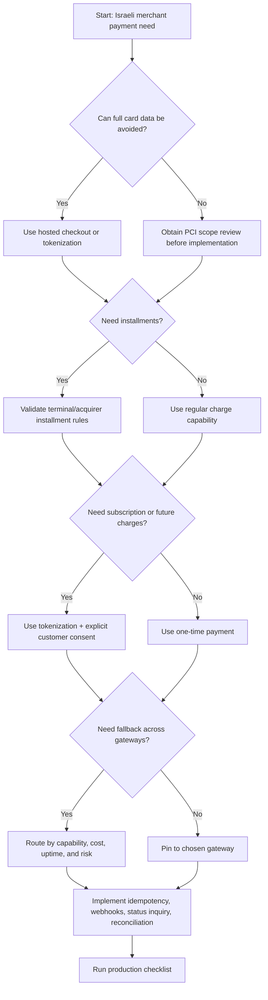
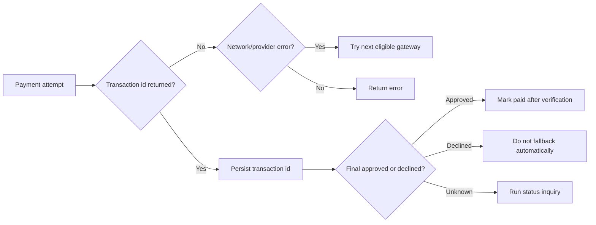

# Payment Gateway Integrator

## Purpose

Use this skill to design, implement, test, and operate a unified Israeli payment layer across Cardcom, Tranzila, Pelecard, and Grow (formerly Meshulam).

Useful cases:

- Freelancers issuing payment links and tax invoices.
- Small shops accepting ₪ card payments, installments, refunds, and cancellations.
- Service businesses charging deposits, balances, or recurring membership fees.
- Consumer apps requiring hosted checkout, tokenization, retry/fallback, webhooks, and reconciliation.
- Back-office teams needing consistent logs, dispute evidence, and gateway migration steps.

## Web-validated corrections in v3

- Use VAT at 18% for 2026 examples. The rate was verified against Israel Tax Authority sources on 02/06/2026. Keep the rate configurable.
- Treat Grow as the current source name and Meshulam as a legacy name or alias. Do not describe Meshulam as a separate live API unless the merchant contract proves it.
- Do not assume universal provider webhook event names. Normalize callbacks into internal statuses after signature checks and provider status inquiry.
- Use only official provider endpoints that were verified in `references/verification-log.md`; keep all other paths as internal orchestration paths or placeholders.

## Operating principles

1. Treat the merchant contract as authoritative. Gateway features, field names, approval requirements, currencies, and installment behavior differ by terminal, acquirer, and risk profile.
2. Prefer hosted checkout or tokenization. Never store full card number, CVV, magnetic stripe data, or unencrypted cardholder data.
3. Make every money operation idempotent. Use a stable merchant order identifier and record provider transaction identifiers.
4. Separate business state from payment state. A paid order, captured authorization, pending hosted page, and refunded transaction are different events.
5. Fail closed. Do not mark an order paid until a signed provider callback, status inquiry, or settlement reconciliation confirms approval.
6. Localize for Israel. Display amounts as `₪123.45`, dates as `DD/MM/YYYY`, and customer messages in natural Hebrew where relevant.
7. Log enough for support without exposing secrets, card data, tokens, raw signatures, or excess private identifiers.

## Quick architecture

```text
Storefront / CRM / ERP
        |
        v
Unified Payment API
        |
        +-- routing policy
        +-- idempotency store
        +-- gateway adapters
        +-- webhook verifier
        +-- reconciliation job
        |
        +--> Cardcom
        +--> Tranzila
        +--> Pelecard
        +--> Grow (formerly Meshulam)
```

## Canonical payment model

Use one internal shape and transform it per gateway.

```json
{
  "order_id": "INV-2026-0042",
  "amount_agorot": 34990,
  "currency": "ILS",
  "description": "Consulting package",
  "customer": {
    "name": "Dana Levi",
    "email": "dana@example.co.il",
    "phone": "+972501234567",
    "national_id": "123456789"
  },
  "installments": 1,
  "capture": true,
  "return_url": "https://example.co.il/pay/return",
  "notify_url": "https://example.co.il/pay/webhook",
  "metadata": {
    "invoice_type": "tax_invoice_receipt",
    "business_unit": "north"
  }
}
```

| Field | Rule |
|---|---|
| `order_id` | Stable merchant identifier for idempotency and support. |
| `amount_agorot` | Integer agorot. Reject values under 1 and avoid floating-point math. |
| `currency` | Prefer `ILS`; enable foreign currency only after contract validation. |
| `description` | Short purpose. Avoid sensitive data. |
| `customer.email` | Required for receipts, support, and checkout notifications. |
| `installments` | `1` for regular charge. Validate gateway and terminal support. |
| `capture` | `true` for immediate charge; `false` for authorization-only where supported. |
| `return_url` | Customer browser return URL; not authoritative proof. |
| `notify_url` | Signed provider callback URL; required for reliable confirmation. |

## Status normalization

| Canonical status | Meaning | Business action |
|---|---|---|
| `approved` | Funds approved or captured | Mark payment successful after verification. |
| `pending` | Async or hosted page state still open | Keep order unpaid or reserved. |
| `requires_action` | Redirect, 3-D Secure, hosted page, or customer step required | Show redirect URL. |
| `declined` | Issuer, acquirer, risk, or validation decline | Show safe message; allow another method. |
| `error` | Integration, network, malformed response, or unknown state | Query status before retry. |
| `refunded` | Refund completed | Update ledger, accounting, and customer communication. |

## Gateway selection decision tree



## Routing strategy

Capability-first routing:

1. Hosted checkout required.
2. Tokenization required.
3. Installment count supported.
4. Currency supported.
5. Refund and partial refund support.
6. Terminal enabled and credentials present.
7. SLA, report access, and support quality.

Cost/reliability routing after capability filtering:

1. Contractual transaction cost.
2. Historical approval rate.
3. Current health state.
4. Settlement/reporting fit.
5. Operational simplicity.

## Fallback rules

Safe fallback:

- Network timeout before request acceptance.
- Gateway 5xx with no transaction identifier.
- Maintenance response before authorization.
- Hosted page creation failure before customer card entry.

Unsafe automatic fallback:

- Issuer decline.
- Suspected duplicate transaction.
- Unknown status with a transaction identifier.
- Callback received after local timeout.
- Authorization-only or partial approval response.



## Implementation recipe

```python
import payment_gateway_integrator as pgi

configs = [
    pgi.GatewayConfig(
        name="cardcom",
        endpoint_url="https://secure.cardcom.solutions",
        api_key="replace-in-secret-manager",
        terminal_id="1000",
        secret="webhook-secret",
        capabilities={"hosted_checkout", "tokenization", "refund", "installments"},
        max_installments=12,
        priority=10,
    )
]

request = pgi.PaymentRequest(
    order_id="INV-2026-0042",
    amount_agorot=34990,
    currency="ILS",
    description="Consulting package",
    customer=pgi.Customer(name="Dana Levi", email="dana@example.co.il", phone="+972501234567"),
    installments=3,
    capture=True,
    return_url="https://example.co.il/pay/return",
    notify_url="https://example.co.il/pay/webhook",
)

orchestrator = pgi.IsraeliPaymentOrchestrator(configs)
response = orchestrator.charge(request)
```

Handle response:

```python
if response.status == pgi.PaymentStatus.REQUIRES_ACTION:
    print("Redirect customer:", response.redirect_url)
elif response.status == pgi.PaymentStatus.APPROVED:
    print("Approved:", response.transaction_id, response.gateway)
else:
    print("Payment failed:", response.failure_code, response.failure_message)
```

Verify callbacks:

```python
valid = orchestrator.verify_webhook(
    gateway="cardcom",
    payload=b'{"order_id":"INV-2026-0042","status":"approved"}',
    signature_header="sha256=...",
)
if not valid:
    raise ValueError("Invalid gateway signature")
```

## Edge cases

### Duplicate browser submits

Use idempotency keys based on `order_id`, amount, currency, and operation. Return the first successful or pending result for the same key. Do not create a second page for the same unpaid order unless the first page expired or was cancelled.

### Customer returns without webhook

The return page is not proof of payment. Show a "checking payment status" page, query provider status, and update the order only after signed callback or provider inquiry confirms approval.

### Webhook arrives before return page

Accept the callback, update local state, and make the return page read local payment state.

### Partial refunds

Persist refund identifiers separately from charge identifiers. Track cumulative refunded amount. Reject refund totals above captured amount. Issue accounting documents according to current bookkeeping guidance.

### Installments

Display installment count and total customer price before redirect. Some terminals support credit installments while others support regular merchant installments only. Confirm acquirer behavior and fees.

### Authorization-only

Use authorization-only only where provider and acquirer support it. Capture before authorization expiry. Reverse unused authorizations.

### Tokenized future charges

Store provider token only. Obtain clear consent for future charges, cancellation terms, and communications. Revoke unused tokens.

### Currency mismatch

Reject requests when the terminal does not support the currency. Avoid silent conversion.

### Unknown status after timeout

Never mark failed only because a local timeout occurred. Query by order identifier and transaction identifier. Treat retry as high risk until the prior attempt is resolved.

## Anti-patterns

| Anti-pattern | Risk | Safer pattern |
|---|---|---|
| Store card number or CVV | PCI and privacy exposure | Hosted page or provider token |
| Use return URL as proof | False paid orders | Signed webhook plus status inquiry |
| Retry after timeout without inquiry | Duplicate charge | Idempotency and provider status check |
| Put provider fields in business logic | Migration pain | Adapter per gateway |
| Convert all non-approved states to failure | Poor customer experience | Preserve pending/requires-action/error |
| Fallback after issuer decline | Fraud signals and duplicate attempts | Ask for another method |
| Log raw payment payloads | Secret and privacy leakage | Redact tokens, secrets, card data |
| Accept webhook without signature | Spoofed payment event | HMAC/signature verification |
| Ignore settlement reports | Accounting gaps | Daily reconciliation |

## Production checklist

### Business and legal

- Confirm merchant agreement for every active gateway.
- Confirm terminal supports intended currencies, installments, refunds, and tokenization.
- Publish cancellation, refund, delivery, privacy, and contact information.
- Ensure invoice/receipt flow fits Israeli bookkeeping obligations.
- Verify Hebrew customer copy where Hebrew customers are targeted.
- Keep transaction evidence for disputes and chargebacks.

### Security

- Use TLS for payment and webhook endpoints.
- Store credentials in a secret manager.
- Rotate credentials and webhook secrets.
- Redact logs and support screens.
- Verify webhook signatures and replay windows.
- Restrict payment admin access.
- Document PCI DSS scope.

### Reliability

- Add timeout and retry budgets per provider.
- Implement status inquiry for unknown states.
- Store raw provider status in an audit table.
- Run health checks and safe failover only.
- Queue webhook processing.
- Monitor declines, errors, timeouts, and mismatches.

### Accounting and reconciliation

- Keep immutable payment ledger entries.
- Track captured, refunded, voided, and disputed amounts separately.
- Match settlements daily.
- Keep gateway commission/VAT reports.
- Export by local date in `Asia/Jerusalem`.
- Use `DD/MM/YYYY` in human reports.

### Customer experience

- Display amount as `₪`.
- Display support contact and business identity.
- Handle expired payment links gracefully.
- Explain declines without exposing issuer codes.
- Send confirmation only after final approval.
- Explain refund timing expectations.

## Troubleshooting entry points

- Hosted page not opening: inspect endpoint, terminal, return URL, and amount format.
- Payment approved at gateway but unpaid locally: inspect webhook signature, status mapping, and idempotency.
- Duplicate charge: inspect retry behavior and provider status inquiries.
- Refund rejected: inspect settlement state, partial refund support, and amount math.
- Installments rejected: inspect terminal/acquirer setup and maximum count.
- Callback spoof suspected: inspect signature, replay nonce, timestamp, and IP logs.

See `references/troubleshooting.md`.
