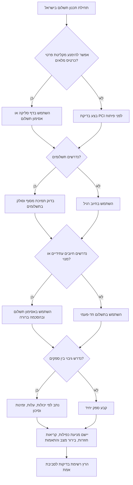

# שילוב שערי תשלום בישראל

## מטרה

השתמש במדריך זה כדי לתכנן, לפתח, לבדוק ולהפעיל שכבת תשלומים אחידה מעל Cardcom, Tranzila, Pelecard ו-Grow (לשעבר Meshulam).

מתאים במיוחד לישראל:

- עצמאי שמוציא קישור תשלום וחשבונית מס/קבלה.
- חנות קטנה שמקבלת תשלום ב-₪, תשלומים, ביטולים והחזרים.
- עסק שירותים שמחייב מקדמה, יתרה או מנוי חודשי.
- אתר צרכני שצריך דף סליקה מאובטח, אסימון תשלום, קריאות חוזרות והתאמות.
- צוות תפעול שצריך מעקב אחיד, ראיות להכחשות עסקה ותהליך מעבר בין ספקים.

## תיקוני אימות בגרסה 2.2

- השתמש בשיעור מעמ 18% בדוגמאות לשנת 2026. השיעור אומת מול מקורות רשות המסים ביום 02/06/2026. השאר את השיעור כהגדרה ניתנת לשינוי.
- התייחס אל Grow כשם הפעיל ואל Meshulam כשם קודם או כינוי בחוזים ותיקים. אל תציג את Meshulam כממשק חי נפרד בלי הסכם ספק שמוכיח זאת.
- אל תניח שמות אירוע אחידים בקריאות חוזרות של ספקים. נרמל את הקריאות למצבים פנימיים לאחר בדיקת חתימה ובירור מצב מול הספק.
- השתמש רק בנתיבי ספק רשמיים שאומתו ב-`references/verification-log.md`; השאר נתיבים אחרים כנתיבים פנימיים או כמצייני מקום.

## עקרונות עבודה

1. הסתמך על הסכם הספק והמסוף בפועל. יכולות, שמות שדות, מטבעות ותשלומים משתנים לפי מסוף, סולק ופרופיל סיכון.
2. העדף דף סליקה מאובטח או אסימון תשלום. אל תשמור מספר כרטיס מלא, CVV, נתוני פס מגנטי או נתוני אשראי לא מוצפנים.
3. הגן על כל פעולה כספית מפני כפילות. השתמש במספר הזמנה יציב ושמור את מזהה העסקה של הספק.
4. הפרד בין מצב עסקי למצב תשלום. הזמנה ששולמה, אישור מסגרת, דף סליקה פתוח ועסקה שהוחזרה אינם אותו מצב.
5. סגור כסף בזהירות. אל סמן הזמנה כמשולמת עד שקיימת קריאה חוזרת חתומה, בירור מצב מול ספק, או התאמה מול דוח סליקה.
6. הצג סכומים ותאריכים במבנה מקומי: `₪123.45` ותאריך `DD/MM/YYYY`.
7. תעד מספיק לתמיכה בלי לחשוף סודות, פרטי כרטיס, אסימונים או פרטים אישיים עודפים.

## מבנה מומלץ

```text
אתר / מערכת ניהול לקוחות / מערכת תכנון משאבים
        |
        v
ממשק תשלום אחיד
        |
        +-- מדיניות ניתוב
        +-- מנגנון מניעת כפילות
        +-- מתאמים לספקים
        +-- אימות קריאות חוזרות
        +-- התאמה יומית
        |
        +--> Cardcom
        +--> Tranzila
        +--> Pelecard
        +--> Grow (לשעבר Meshulam)
```

## מודל תשלום קנוני

```json
{
  "order_id": "INV-2026-0042",
  "amount_agorot": 34990,
  "currency": "ILS",
  "description": "חבילת ייעוץ",
  "customer": {
    "name": "דנה לוי",
    "email": "dana@example.co.il",
    "phone": "+972501234567",
    "national_id": "123456789"
  },
  "installments": 1,
  "capture": true,
  "return_url": "https://example.co.il/pay/return",
  "notify_url": "https://example.co.il/pay/webhook",
  "metadata": {
    "invoice_type": "tax_invoice_receipt",
    "business_unit": "north"
  }
}
```

| שדה | כלל |
|---|---|
| `order_id` | מזהה יציב של העסק. משמש למניעת כפילות ולתמיכה. |
| `amount_agorot` | סכום באגורות כמספר שלם. דחה ערך קטן מ-1. |
| `currency` | העדף `ILS`. אפשר מטבע זר רק לאחר בדיקת הסכם ומסוף. |
| `description` | תיאור קצר וברור. אל תכניס מידע רגיש. |
| `customer.email` | נדרש לקבלות, תמיכה והודעות דף סליקה. |
| `installments` | `1` עבור חיוב רגיל. בדוק תמיכה במסוף ובסולק. |
| `capture` | `true` לחיוב מיידי; `false` לאישור בלבד כאשר נתמך. |
| `return_url` | עמוד חזרה ללקוח; אינו הוכחת תשלום. |
| `notify_url` | כתובת קריאה חוזרת חתומה; נדרש לאישור אמין. |

## נרמול מצבים

| מצב אחיד | משמעות | פעולה עסקית |
|---|---|---|
| `approved` | החיוב אושר או נלכד | סמן תשלום כמוצלח רק לאחר אימות. |
| `pending` | דף סליקה או תשלום אסינכרוני פתוח | השאר הזמנה במצב ממתין. |
| `requires_action` | נדרש מעבר לדף סליקה, 3-D Secure או פעולה של הלקוח | הצג קישור או הפניה. |
| `declined` | דחייה של מנפיק, סולק, סיכון או ולידציה | הצג הודעה בטוחה והצע אמצעי אחר. |
| `error` | תקלה טכנית, רשת, תגובה לא תקינה או מצב לא ידוע | אל תחייב שוב בלי בירור מצב. |
| `refunded` | החזר הושלם | עדכן ספר תנועות, הנהלת חשבונות והודעת לקוח. |

## עץ החלטה



## אסטרטגיית ניתוב

סנן לפי דרישות קשיחות לפני שיקולי מחיר:

1. דף סליקה מאובטח.
2. אסימון תשלום.
3. מספר תשלומים נתמך.
4. מטבע נתמך.
5. החזר מלא וחלקי.
6. מסוף פעיל ופרטי גישה קיימים.
7. רמת שירות, דוחות ותמיכה.

לאחר סינון יכולות, מיין לפי עלות עסקה, שיעור אישורים, זמינות, התאמה לדוחות ופשטות תפעולית.

## כללי גיבוי

מותר לנסות ספק חלופי כאשר:

- אירעה חריגת זמן לפני שנוצר מזהה עסקה.
- התקבלה שגיאת 5xx בלי מזהה עסקה.
- הספק הודיע על תחזוקה לפני אישור עסקה.
- יצירת דף סליקה נכשלה לפני שהלקוח הזין כרטיס.

אל תבצע גיבוי אוטומטי כאשר:

- התקבלה דחיית מנפיק.
- קיים חשד לעסקה כפולה.
- קיים מזהה עסקה אך המצב לא ידוע.
- התקבלה קריאה חוזרת לאחר חריגת זמן מקומית.
- התקבל אישור מסגרת בלבד או אישור חלקי.

## מתכון פיתוח

```python
import payment_gateway_integrator as pgi

gateway = pgi.GatewayConfig(
    name="cardcom",
    endpoint_url="https://secure.cardcom.solutions",
    api_key="replace-in-secret-manager",
    terminal_id="1000",
    secret="webhook-secret",
    capabilities={"hosted_checkout", "tokenization", "refund", "installments"},
    max_installments=12,
)

payment = pgi.PaymentRequest(
    order_id="INV-2026-0042",
    amount_agorot=34990,
    currency="ILS",
    description="חבילת ייעוץ",
    customer=pgi.Customer(name="דנה לוי", email="dana@example.co.il", phone="+972501234567"),
    installments=3,
    return_url="https://example.co.il/pay/return",
    notify_url="https://example.co.il/pay/webhook",
)

response = pgi.IsraeliPaymentOrchestrator([gateway]).charge(payment)
```

## מקרי קצה חשובים

### לחיצה כפולה בדפדפן

הפעל מפתח מניעת כפילות לפי מספר הזמנה, סכום, מטבע וסוג פעולה. החזר את התוצאה הראשונה עבור אותה הזמנה. אל תפתח דף סליקה שני אלא אם הדף הקודם פג או בוטל.

### חזרה לאתר בלי קריאה חוזרת

עמוד החזרה אינו הוכחת תשלום. הצג "בודק מצב תשלום", בצע בירור מול הספק, ועדכן את ההזמנה רק לאחר אימות.

### קריאה חוזרת הגיע לפני עמוד החזרה

קבל את הקריאה חוזרת, עדכן מצב מקומי, וגרום לעמוד החזרה לקרוא את המצב המקומי.

### החזר חלקי

שמור מזהי החזר בנפרד ממזהי חיוב. עקוב אחר סכום החזרים מצטבר. דחה החזר מעל סכום שנלכד. הפק מסמכי הנהלת חשבונות מתאימים לפי ההנחיות התקפות.

### תשלומים

הצג מספר תשלומים וסכום כולל לפני מעבר לתשלום. קיימים הבדלים בין תשלומי קרדיט לבין תשלומים רגילים של בית עסק. בדוק עמלות והגדרות מול הסולק.

### אישור בלבד

השתמש באישור בלבד רק כאשר הספק והסולק תומכים בכך. בצע לכידה לפני פקיעת האישור. בטל מסגרת שלא נוצלה.

### חיוב עתידי בטוקן

שמור רק אסימון ספק. קבל הסכמה ברורה לחיובים עתידיים, תנאי ביטול ואמצעי קשר. בטל אסימונים שאינם נדרשים.

### אי התאמת מטבע

דחה בקשה כאשר המסוף אינו תומך במטבע המבוקש. אל תבצע המרת מטבע שקטה.

## טעויות נפוצות

| טעות | סיכון | חלופה נכונה |
|---|---|---|
| שמירת מספר כרטיס או CVV | חשיפת PCI ופרטיות | דף סליקה או אסימון ספק |
| הסתמכות על עמוד חזרה כהוכחת תשלום | סימון הזמנות לא משולמות | קריאה חוזרת חתומה ובירור מצב |
| ניסיון חוזר אחרי חריגת זמן בלי בירור | חיוב כפול | מניעת כפילות ובירור מול ספק |
| ערבוב שדות ספק בתוך היגיון עסקי | קושי במעבר ספק | מתאם נפרד לכל ספק |
| הפיכת כל מצב שאינו `approved` לכישלון | חוויית לקוח גרועה | שמירת `pending`, `requires_action`, `declined`, `error` |
| גיבוי אחרי דחיית מנפיק | ניסיונות כפולים וסימוני סיכון | בקש אמצעי תשלום אחר |
| יומני מערכת מלאים של בקשות | דליפת סודות ומידע אישי | השחרת אסימונים וסודות |
| קבלת כל קריאה חוזרת ללא חתימה | אירוע מזויף | אימות HMAC ומניעת replay |
| התעלמות מדוחות סליקה | פערים חשבונאיים | התאמה יומית |

## רשימת בדיקות לסביבת אמת

### עסקי ומשפטי

- אשר הסכם בית עסק עבור כל ספק פעיל.
- אשר שהמסוף תומך במטבע, תשלומים, החזרים ואסימון תשלום.
- פרסם תנאי ביטול, החזר, אספקה, פרטיות ופרטי קשר.
- ודא שהפקת חשבונית/קבלה מתאימה להוראות הנהלת חשבונות.
- הצג טקסט עברי תקין ללקוחות ישראלים.
- שמור ראיות לעסקאות, ביטולים והכחשות עסקה.

### אבטחה

- השתמש ב-TLS לכל נקודות התשלום והקריאות חוזרות.
- שמור סודות במנהל סודות, לא בקוד.
- בצע רוטציה למפתחות ולסודות קריאה חוזרת.
- השחר יומני מערכת ומסכי תמיכה.
- אמת חתימות קריאה חוזרת וחלון זמן.
- הגבל גישת מנהלים.
- תעד היקף PCI.

### אמינות

- הגדר חריגת זמן ותקציב ניסיונות לכל ספק.
- יישם בירור מצב למצבים לא ידועים.
- שמור מצב ספק גולמי בטבלת audit.
- הפעל גיבוי רק במקרים בטוחים.
- עבד קריאות חוזרות בתור.
- נטר דחיות, שגיאות, חריגות זמן ופערי התאמה.

### הנהלת חשבונות והתאמות

- שמור ספר תנועות תשלומים בלתי ניתן לעריכה.
- הפרד בין חיובים, החזרים, ביטולים והכחשות עסקה.
- בצע התאמה יומית לדוחות ספק.
- שמור דוחות עמלות ומע"מ.
- הפק דוחות לפי אזור זמן `Asia/Jerusalem`.
- הצג תאריכים כ-`DD/MM/YYYY`.

### חוויית לקוח

- הצג סכומים עם `₪`.
- הצג שם עסק, פרטי קשר ותיאור תשלום.
- טפל בקישור תשלום שפג תוקף.
- הצג הודעת דחייה ברורה בלי קודי מנפיק פנימיים.
- שלח אישור רק לאחר אישור סופי.
- הסבר זמני החזר צפויים.

ראה גם `references/troubleshooting.md`, `references/workflow-guide.md`, ו-`references/test-scenarios.md`.
