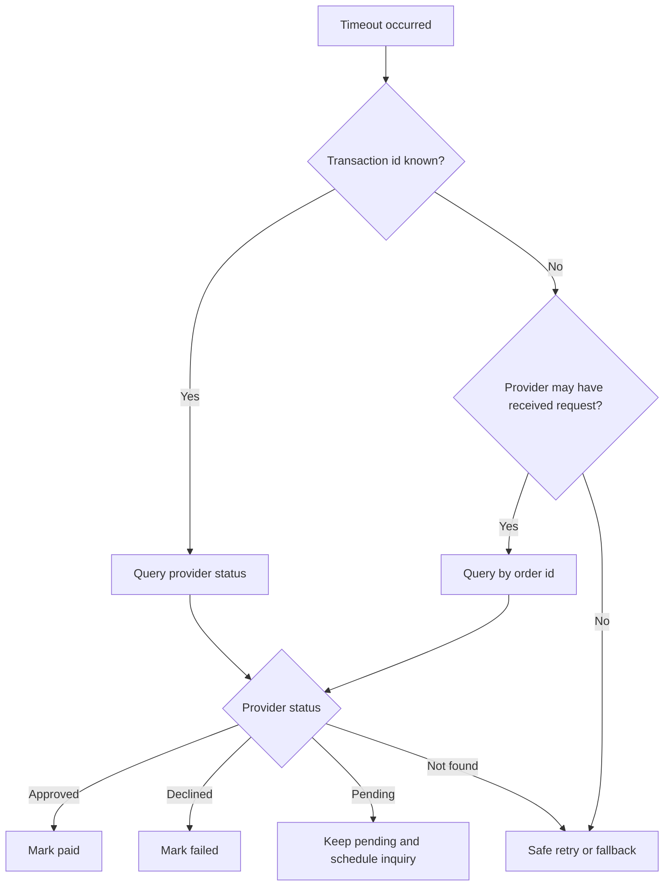

# Troubleshooting Guide

Use this guide to diagnose Israeli payment integration issues without exposing sensitive payment data.

## Fast triage checklist

1. Identify `order_id`, gateway, transaction id, amount, currency, and local state.
2. Check whether a transaction id exists.
3. Check signed webhook events.
4. Query provider status when state is unknown.
5. Inspect idempotency key and retry logs.
6. Compare amount in agorot against gateway amount format.
7. Check terminal features: installments, tokenization, refunds, currency.
8. Check credential scope and environment: sandbox versus production.
9. Review provider maintenance notices and error rate.
10. Record final resolution in the payment ledger.

## Hosted page not created

| Symptom | Likely cause | Check | Fix |
|---|---|---|---|
| HTTP 401/403 | Invalid credentials | API key, terminal, environment | Rotate credentials and use correct environment. |
| Validation error | Missing field | Required request fields | Add return URL, notify URL, amount, and order id. |
| No redirect URL | Hosted checkout not enabled | Terminal/account features | Enable hosted checkout or use supported endpoint. |
| Amount rejected | Wrong unit | Agorot versus decimal NIS | Convert using Decimal and send provider-required format. |
| Currency rejected | Terminal mismatch | Currency settings | Use `ILS` or enable currency with provider. |
| Installments rejected | Feature not enabled | `max_installments`, terminal setup | Disable option until enabled. |

## Customer paid but order is unpaid

| Symptom | Likely cause | Check | Fix |
|---|---|---|---|
| Provider shows approved | Webhook failed | Webhook logs and signature result | Replay event or query status and update state. |
| Return page says failed | Return URL trusted incorrectly | Local state transition code | Use return page as informational only. |
| Local timeout | Unknown status | Provider inquiry by order id | Mark paid only after confirmed approval. |
| Duplicate local orders | Idempotency gap | Key construction | Pin one payment attempt per order/amount. |
| Amount mismatch | Rounding issue | Agorot conversion | Use integer agorot internally. |

## Duplicate charge

| Cause | Evidence | Remediation |
|---|---|---|
| Browser double-submit | Same user, same amount, close timestamps | Add idempotency and disable double submit. |
| Retry after timeout | Same order id across attempts | Query status before retry. |
| Fallback after unknown state | Different gateways for same order | Restrict fallback to no-transaction-id failures. |
| Reused order id for new purchase | Multiple carts with same reference | Use unique order id per payment intent. |
| Webhook processed twice | Same event id duplicated | Store processed event ids. |

Customer handling:

1. Confirm both transaction ids.
2. Check which charge settled.
3. Refund the duplicate through original gateway when eligible.
4. Send customer confirmation.
5. Fix retry or idempotency rule before next release.

## Refund rejected

| Symptom | Likely cause | Fix |
|---|---|---|
| Provider says transaction not found | Wrong gateway or transaction id | Refund through original gateway. |
| Amount too high | Prior partial refund exists | Calculate remaining refundable amount. |
| Refund window closed | Provider/acquirer rule | Process manual refund if policy allows. |
| Transaction pending | Capture or settlement incomplete | Wait for eligible state or void authorization. |
| Permission error | Refund API not enabled | Enable refund permission in merchant account. |

## Installments fail

| Symptom | Likely cause | Fix |
|---|---|---|
| Request rejected immediately | Terminal lacks installment support | Disable installments or update contract. |
| Only some counts fail | Maximum count mismatch | Configure `max_installments` per gateway. |
| Customer sees different terms | Hosted page config overrides request | Align terminal page settings with checkout display. |
| Accounting mismatch | Fees/settlement differ | Reconcile by gateway report and installment plan. |

## Webhook signature fails

| Cause | Diagnostic | Fix |
|---|---|---|
| Used parsed JSON instead of raw body | Body hash differs | Verify against raw bytes. |
| Wrong secret | All callbacks fail | Rotate and update secret. |
| Header format mismatch | `sha256=` prefix not handled | Normalize prefix before compare. |
| Encoding issue | Hebrew text changes bytes | Use raw request body and UTF-8 only after verification. |
| Replay attack | Same event id repeated | Reject repeated event ids and stale timestamps. |

## Unknown status after timeout



## Settlement mismatch

| Mismatch | Check | Fix |
|---|---|---|
| Local approved, no settlement | Date boundary, report delay, failed capture | Query gateway and inspect capture state. |
| Settlement exists, local missing | Webhook outage or manual terminal charge | Create manual ledger entry with audit note. |
| Gross amount differs | Refund, installment fee, currency | Match both gross and net fields. |
| Fee missing | Report parser incomplete | Update import mapping. |
| Duplicate order id | Retry defect | Fix idempotency and link records. |

## CLI diagnostics

```bash
python scripts/payment_gateway_integrator_cli.py gateways --config config.json
```

For production, use real provider endpoints only after sandbox confirmation.

## Log redaction

Always redact:

- API keys, terminal passwords, webhook secrets.
- Card numbers, CVV, magnetic stripe data.
- Tokens when not needed for support.
- National ID unless legally and operationally required.
- Raw callback signatures when logs are widely accessible.

Safe support summary:

```json
{
  "order_id": "INV-2026-0042",
  "gateway": "cardcom",
  "transaction_id": "cc-884422",
  "status": "approved",
  "amount": "₪349.90",
  "date": "02-06-2026",
  "approval_code": "123456"
}
```

## Escalation package for provider support

Include merchant number, terminal id, transaction id, order id, amount, currency, timestamp with timezone, endpoint, redacted request/response, error code, confirmation that unsafe retry was not performed, and business impact.


## Universal webhook event names

Do not depend on a cross-provider event-name taxonomy. Cardcom emphasizes callback verification and result inquiry. Grow documents payload fields such as `transactionId`, `status`, `statusCode`, and `paymentLinkProcessId`. Store the raw payload, verify authenticity, then map to canonical statuses.
