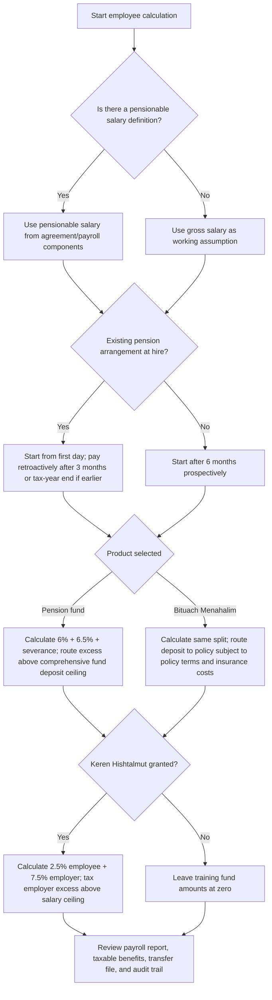
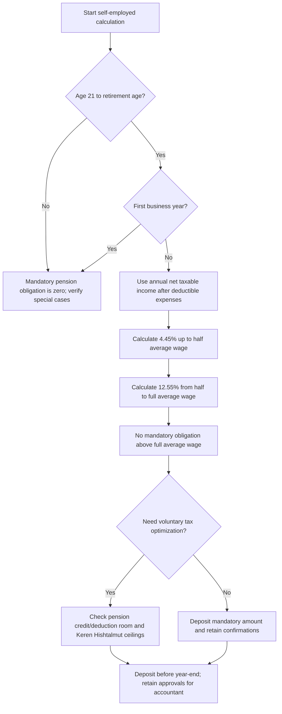

# Pension Contribution Calculator

## Purpose

Calculate mandatory and voluntary Israeli pension deposits for employees, employers, freelancers, and consumers comparing pension products. Use the calculator to determine monthly payroll splits, annual self-employed obligations, training fund ceilings, and routing between a comprehensive pension fund, supplemental pension fund, provident fund, or manager's insurance policy.

Use versioned rates. Verify tax-year ceilings before production payroll, year-end deposits, product replacement, or advice to clients. Pension and tax decisions can affect tax, insurance coverage, severance rights, disability cover, survivors cover, and retirement income.

## Scope

This skill supports:

- Employee pension deposits: employee contributions, employer contributions, and severance deposits.
- Optional full Section 14 severance funding at 8.33%.
- Keren Hishtalmut deposits for employees: 2.5% employee and 7.5% employer, with taxable employer excess above the salary ceiling.
- Self-employed mandatory pension deposits using the two-bracket obligation.
- Self-employed voluntary pension and Keren Hishtalmut ceilings.
- Bituach Menahalim comparison against pension fund routing.
- Practical payroll and year-end workflows for small businesses, freelancers, and consumers.

This skill does not replace licensed pension advice, tax advice, legal advice, payroll system certification, or product suitability analysis.

## Quick start

Run from the package root:

```bash
python scripts/pension-contribution-calculator-cli.py employee --gross-salary 12000
python scripts/pension-contribution-calculator-cli.py employee --gross-salary 20000 --hishtalmut --json
python scripts/pension-contribution-calculator-cli.py self-employed --annual-income 180000 --age 36 --hishtalmut-deposit 20566
python scripts/pension-contribution-calculator-cli.py compare --gross-salary 24000 --hishtalmut
pytest scripts/test_pension-contribution-calculator_client.py
```

Python helper:

```python
import importlib.util
from pathlib import Path

client_path = Path("scripts/pension_contribution_calculator_client.py")
spec = importlib.util.spec_from_file_location("pcc_client", client_path)
pcc = importlib.util.module_from_spec(spec)
spec.loader.exec_module(pcc)

result = pcc.employee_contributions(20_000, include_hishtalmut=True)
print(pcc.to_json(result))
```

## Core 2026 rate table

| Topic | Rate or ceiling | Notes |
|---|---:|---|
| Employee pension contribution | 6% | Monthly employee deduction from pensionable salary |
| Employer pension contribution | 6.5% | Employer תגמולים contribution |
| Employer severance minimum | 6% | Minimum funded severance deposit |
| Employer severance, full Section 14 | 8.33% | Use only when full Section 14 treatment applies |
| Employee Keren Hishtalmut | 2.5% | Optional benefit unless employment agreement requires it |
| Employer Keren Hishtalmut | 7.5% | Employer amount above salary ceiling becomes taxable income |
| Employee Keren Hishtalmut salary ceiling | ₪15,712/month | 2026 ceiling used by this package |
| Average wage for self-employed pension | ₪13,769/month | 2026 National Insurance average wage definition |
| Comprehensive pension fund deposit ceiling | ₪5,645.29/month | Route excess to an allowed supplemental product |
| Self-employed low bracket | 4.45% | Up to half the average wage |
| Self-employed high bracket | 12.55% | Between half and full average wage |
| Self-employed Keren Hishtalmut deduction ceiling | ₪13,203/year | 4.5% of qualifying income up to the annual ceiling |
| Self-employed Keren Hishtalmut profit-exempt ceiling | ₪20,566/year | Gains exemption ceiling after the lock-in period |
| Self-employed pension tax-benefit income ceiling | ₪232,800/year | Used for voluntary pension benefit ceilings |

## Decision tree: employee payroll



## Decision tree: self-employed year-end



## Calculation model

### Employee pension

The employee model separates the salary base from the product channel.

1. Set gross monthly salary.
2. Set pensionable salary. Use gross salary when no separate pensionable base exists. Use a lower pensionable salary only when the employment agreement and payroll components justify it.
3. Apply:
   - Employee pension: 6% of pensionable salary.
   - Employer pension: 6.5% of pensionable salary.
   - Employer severance: 6% minimum, or 8.33% with full Section 14 funding.
4. Route pension fund deposits:
   - Comprehensive pension fund: up to the monthly deposit ceiling.
   - Supplemental product: any excess above the ceiling.
5. For Bituach Menahalim, calculate the same contribution split but place the result in the policy bucket. Product fees and insurance premiums are not deducted by this calculator.

### Employee Keren Hishtalmut

When granted:

1. Employee deposit: 2.5% of gross salary.
2. Employer deposit: 7.5% of gross salary.
3. Employer tax-free portion: 7.5% of salary up to the monthly salary ceiling.
4. Employer taxable excess: employer deposit less the tax-free portion.

Example: gross salary ₪20,000.

- Employee deposit: ₪500.
- Employer deposit: ₪1,500.
- Tax-free employer portion: ₪15,712 × 7.5% = ₪1,178.40.
- Taxable employer excess: ₪321.60.

### Self-employed pension

Use annual net taxable income, not revenue. Split the monthly average income into two brackets:

- 4.45% on income up to half the average wage.
- 12.55% on income from half the average wage to the full average wage.
- No mandatory obligation above the full average wage.

The calculator applies age and first-year-business exemptions. Legal retirement age can depend on sex, date of birth, and transitional rules; set the retirement age explicitly when needed.

### Self-employed Keren Hishtalmut

Two ceilings matter:

- Deduction ceiling: the amount deductible from taxable income.
- Profit-exempt ceiling: the amount whose gains can receive exemption after the lock-in period.

The gap between the two can be useful: a deposit may be non-deductible yet still preserve the gains exemption up to the profit-exempt ceiling.

## Concrete examples

### Example 1: employee, ₪10,000 salary, pension only

Input:

```bash
python scripts/pension-contribution-calculator-cli.py employee --gross-salary 10000
```

Expected result:

| Component | Amount |
|---|---:|
| Employee pension | ₪600.00 |
| Employer pension | ₪650.00 |
| Employer severance | ₪600.00 |
| Total monthly retirement deposit | ₪1,850.00 |
| Employee cash outflow | ₪600.00 |
| Employer cash cost | ₪1,250.00 |

### Example 2: employee, ₪10,000 salary, pension plus Keren Hishtalmut

| Component | Amount |
|---|---:|
| Employee pension | ₪600.00 |
| Employee Keren Hishtalmut | ₪250.00 |
| Employer pension | ₪650.00 |
| Employer severance | ₪600.00 |
| Employer Keren Hishtalmut | ₪750.00 |
| Total monthly deposit | ₪2,850.00 |
| Annualized total deposit | ₪34,200.00 |

### Example 3: employee, ₪40,000 salary, full Section 14, pension fund

Use:

```bash
python scripts/pension-contribution-calculator-cli.py employee --gross-salary 40000 --section14 --json
```

The total retirement deposit can exceed the comprehensive pension fund monthly deposit ceiling. Route the excess to a supplemental pension fund, provident fund, or allowed parallel product. Do not force the full amount into a comprehensive pension fund when the monthly ceiling is breached.

### Example 4: employee, ₪20,000 salary, Keren Hishtalmut taxable excess

Use:

```bash
python scripts/pension-contribution-calculator-cli.py employee --gross-salary 20000 --hishtalmut
```

Employer Keren Hishtalmut deposit is ₪1,500. Only ₪1,178.40 is tax-free under the salary ceiling; ₪321.60 is taxable income to the employee.

### Example 5: freelancer, ₪60,000 annual net taxable income

Monthly average is ₪5,000. The entire amount sits below half the average wage.

Mandatory annual pension:

```text
₪60,000 × 4.45% = ₪2,670
```

### Example 6: freelancer, ₪300,000 annual net taxable income

The mandatory pension obligation is capped by the full average-wage bracket. Income above the full average wage does not increase the mandatory pension amount. The result is approximately ₪14,044.38 for 2026.

### Example 7: freelancer optimizing year-end deposits

A freelancer with ₪260,000 annual net taxable income can check:

- Mandatory pension obligation.
- Pension tax credit room.
- Pension deduction room.
- Keren Hishtalmut deductible ceiling.
- Keren Hishtalmut profit-exempt ceiling.

Run:

```bash
python scripts/pension-contribution-calculator-cli.py self-employed \
  --annual-income 260000 \
  --age 44 \
  --pension-deposit 38412 \
  --hishtalmut-deposit 20566 \
  --json
```

## Edge cases

### New employee with an existing pension arrangement

Start pension coverage from the first workday, then transfer deposits retroactively after three months or at tax-year end, whichever comes earlier. Keep evidence that the employee had active coverage at hiring.

### New employee without an existing pension arrangement

Start mandatory pension deposits after six months prospectively. Do not create retroactive coverage for the first six months unless a better employment agreement, collective agreement, or employer policy requires it.

### Partial pensionable salary

Some payroll components are not pensionable. Use a lower pensionable salary only when the component treatment is documented. Flag unexplained differences between gross salary and pensionable salary.

### High salary in a comprehensive pension fund

Do not assume the full contribution can enter a comprehensive pension fund. Route excess above the monthly deposit ceiling to a supplemental pension fund, provident fund, or other allowed product.

### Full Section 14

Use 8.33% severance only when the legal and contractual conditions exist. Otherwise use the 6% minimum in the calculator and flag the case for review.

### Manager's insurance issued before 2013

Do not replace an old Bituach Menahalim policy solely due to fees. A pre-2013 policy may contain a guaranteed annuity conversion factor. Product replacement must consider guarantees, insurance definitions, underwriting, and tax.

### Employee Keren Hishtalmut above salary ceiling

Employer deposits above the salary ceiling become taxable income. The deposit can still be made, but payroll must tax the benefit correctly.

### Self-employed with a loss or very low profit

Use net taxable income after expenses. No mandatory pension arises when income is zero. Voluntary deposits can still be considered for long-term savings and tax planning, subject to accountant review.

### First business year

The first year exemption can apply to self-employed mandatory pension. Track registration date and tax year separately from the first invoice date.

### Near retirement age

Retirement age rules can vary. Override the retirement age input when applying a specific legal threshold.

### U.S. persons

Israeli pension, provident, and training fund products may have foreign tax-reporting consequences. Route cross-border cases to a tax professional.

## Anti-patterns

- Use revenue instead of net taxable income for a freelancer.
- Apply Keren Hishtalmut employer tax exemption to the entire salary when salary exceeds the ceiling.
- Treat pension fund and Bituach Menahalim as interchangeable without comparing insurance costs and policy terms.
- Ignore existing pension coverage when deciding the start date for a new employee.
- Deposit above the comprehensive pension fund ceiling without routing the excess.
- Use outdated ceilings after a tax-year update.
- Assume full Section 14 applies because 8.33% is common.
- Omit taxable benefit reporting for employer Keren Hishtalmut excess.
- Treat a spreadsheet as an official payroll ledger without controls.
- Replace a pre-2013 manager's insurance policy without licensed review.
- Give personal product advice without a license.

## Troubleshooting summary

| Symptom | Likely cause | Fix |
|---|---|---|
| Employee totals look too low | Pensionable salary lower than gross salary | Confirm payroll components and employment agreement |
| High-salary pension fund deposit rejected | Comprehensive fund monthly ceiling exceeded | Split excess into supplemental product |
| Keren Hishtalmut benefit unexpectedly taxable | Salary above monthly ceiling | Add taxable employer excess to payroll |
| Freelancer amount seems too high | Revenue used instead of profit | Use annual net taxable income after deductions |
| Mandatory self-employed result is zero | First-year, age, or retirement-age exemption | Check input flags and dates |
| Year-end benefit mismatch | Rate table from wrong tax year | Update `RateTable` and evidence file |

## Production checklist

Before use in payroll or client work:

- Confirm tax year and effective date.
- Confirm current average wage, deposit ceilings, and tax ceilings.
- Confirm employee start date, existing pension arrangement, and pensionable salary.
- Confirm product type and routing instructions.
- Confirm Keren Hishtalmut entitlement and salary ceiling treatment.
- Confirm Section 14 status.
- Record calculator input, output, source rate table, run date, and reviewer.
- Reconcile payroll transfer files to fund confirmations.
- Keep an exception report for taxable employer benefits and ceiling breaches.
- Obtain licensed professional review for product replacement, severance withdrawals, pension drawdown, and cross-border cases.

## References inside this package

- `references/api-reference.md` — source registry, rate table schema, request/response examples, and error handling.
- `references/workflow-guide.md` — end-to-end operational workflows.
- `references/troubleshooting.md` — detailed troubleshooting guide.
- `references/test-scenarios.md` — test scenarios for payroll, freelance, and product comparison use.
- `references/migration-checklist.md` — migration and annual rate-update checklist.
- `scripts/pension_contribution_calculator_client.py` — typed sync and async helper.
- `scripts/pension-contribution-calculator-cli.py` — Typer CLI.
- `scripts/examples/` — runnable examples.
