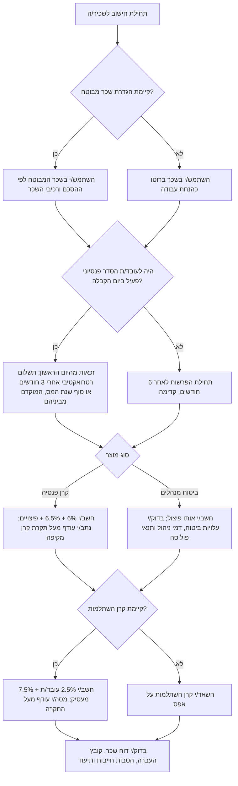
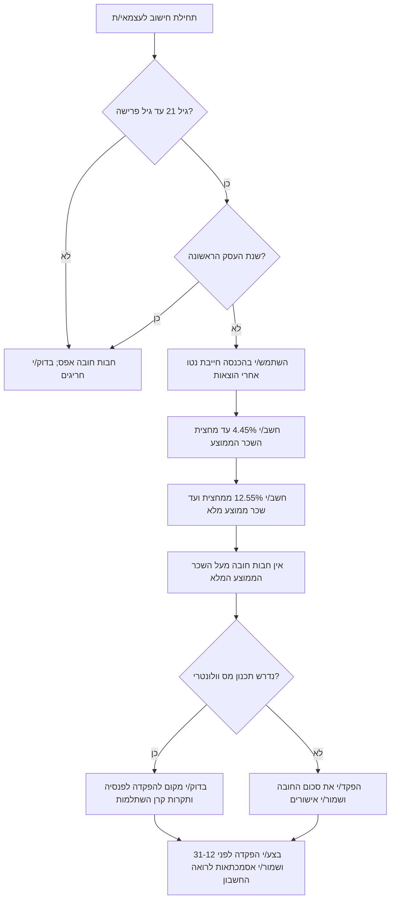

# מחשבון הפרשות לפנסיה

## מטרה

חשב/י הפרשות חובה והפרשות וולונטריות למוצרים פנסיוניים בישראל: קרן פנסיה, קרן השתלמות וביטוח מנהלים. השתמש/י במחשבון כדי לפרק את ההפקדות בין עובד/ת, מעסיק ופיצויים, לחשב חבות פנסיה לעצמאים, לזהות תקרה בקרן פנסיה מקיפה, ולבדוק מתי חלק מהפקדת המעסיק לקרן השתלמות הופך להכנסה חייבת.

השתמש/י בטבלת שיעורים לפי שנת מס. לפני שימוש בשכר, בדוח שנתי או בייעוץ ללקוח/ה, אמת/י את התקרות מול פרסומי הרשויות והקופות. החלטות פנסיוניות עלולות להשפיע על מס, כיסוי ביטוחי, פיצויי פיטורים, אובדן כושר עבודה, שארים וקצבת פרישה.

## תחולה

המחשבון מכסה:

- הפרשות פנסיה לשכירים: חלק עובד/ת, חלק מעסיק ורכיב פיצויים.
- פיצויים בשיעור 8.33% כאשר מתקיים הסדר מלא לפי סעיף 14.
- קרן השתלמות לשכירים: 2.5% עובד/ת ו-7.5% מעסיק, כולל זיהוי חלק מעסיק חייב במס מעל תקרת השכר.
- פנסיית חובה לעצמאים לפי שתי מדרגות ההכנסה.
- תקרות להפקדות וולונטריות לפנסיה ולקרן השתלמות לעצמאים.
- השוואת תזרים הפקדות בין קרן פנסיה לבין ביטוח מנהלים.
- תהליכי עבודה לעסק קטן, פרילנסר/ית וצרכן/ית פרטי/ת.

המחשבון אינו מחליף ייעוץ פנסיוני, ייעוץ מס, ייעוץ משפטי, בדיקת התאמת מוצר או אישור מערכת שכר.

## התחלה מהירה

הרצה מתיקיית החבילה:

```bash
python scripts/pension-contribution-calculator-cli.py employee --gross-salary 12000
python scripts/pension-contribution-calculator-cli.py employee --gross-salary 20000 --hishtalmut --json
python scripts/pension-contribution-calculator-cli.py self-employed --annual-income 180000 --age 36 --hishtalmut-deposit 20566
python scripts/pension-contribution-calculator-cli.py compare --gross-salary 24000 --hishtalmut
pytest scripts/test_pension-contribution-calculator_client.py
```

שימוש מפייתון:

```python
client_path = Path("scripts/pension_contribution_calculator_client.py")
spec = importlib.util.spec_from_file_location("pcc_client", client_path)
pcc = importlib.util.module_from_spec(spec)
spec.loader.exec_module(pcc)

result = pcc.employee_contributions(20_000, include_hishtalmut=True)
print(pcc.to_json(result))
```

## טבלת שיעורים לשנת 2026

| נושא | שיעור או תקרה | הערות |
|---|---:|---|
| תגמולי עובד/ת לפנסיה | 6% | ניכוי חודשי מהשכר המבוטח |
| תגמולי מעסיק לפנסיה | 6.5% | רכיב תגמולים של המעסיק |
| פיצויים — מינימום | 6% | הפקדת חובה מינימלית לרכיב פיצויים |
| פיצויים — סעיף 14 מלא | 8.33% | רק כאשר מתקיימים התנאים המשפטיים והחוזיים |
| קרן השתלמות — עובד/ת | 2.5% | הטבה שאינה חובה כללית, אלא אם נקבעה בהסכם |
| קרן השתלמות — מעסיק | 7.5% | מעל תקרת השכר, חלק המעסיק חייב במס בידי העובד/ת |
| תקרת שכר לקרן השתלמות לשכיר/ה | ₪15,712 לחודש | תקרה לשנת 2026 |
| שכר ממוצע לחישוב פנסיית חובה לעצמאים | ₪13,769 לחודש | הגדרת הביטוח הלאומי לשנת 2026 |
| תקרת הפקדה חודשית לקרן פנסיה מקיפה | ₪5,645.29 לחודש | עודף מנותב למוצר משלים מותר |
| מדרגה נמוכה לעצמאים | 4.45% | עד מחצית השכר הממוצע |
| מדרגה גבוהה לעצמאים | 12.55% | ממחצית השכר הממוצע ועד השכר הממוצע המלא |
| תקרת ניכוי בקרן השתלמות לעצמאים | ₪13,203 לשנה | 4.5% מהכנסה מזכה עד התקרה |
| תקרת הפקדה מוטבת לרווחים בקרן השתלמות לעצמאים | ₪20,566 לשנה | רווחים עשויים להיות פטורים לאחר תקופת הוותק |
| תקרת הכנסה להטבות פנסיה לעצמאים | ₪232,800 לשנה | משמשת לבדיקת זיכוי וניכוי |

## עץ החלטה: שכר עובד/ת



## עץ החלטה: עצמאי/ת בסוף שנה



## מודל החישוב

### שכירים — פנסיה

המודל מפריד בין בסיס השכר לבין המוצר שאליו מועברת ההפקדה.

1. הזן/י שכר ברוטו חודשי.
2. הזן/י שכר מבוטח. אם אין בסיס נפרד, השתמש/י בשכר ברוטו. אם רק חלק מהשכר מבוטח, ודא/י שהטיפול מגובה בהסכם עבודה וברכיבי שכר.
3. חשב/י:
   - תגמולי עובד/ת: 6% מהשכר המבוטח.
   - תגמולי מעסיק: 6.5% מהשכר המבוטח.
   - פיצויים: 6% מינימום, או 8.33% בהסדר סעיף 14 מלא.
4. בקרן פנסיה:
   - קרן פנסיה מקיפה מקבלת עד תקרת ההפקדה החודשית.
   - עודף מנותב לקרן פנסיה משלימה, קופת גמל או מוצר מותר אחר.
5. בביטוח מנהלים:
   - שיעורי ההפרשה זהים לפני דמי ניהול ועלויות ביטוח.
   - בדוק/י את תנאי הפוליסה, כיסויים ביטוחיים, החרגות ומקדם קצבה מובטח בפוליסות ישנות.

### שכירים — קרן השתלמות

כאשר קיימת זכאות לקרן השתלמות:

1. עובד/ת: 2.5% מהשכר.
2. מעסיק: 7.5% מהשכר.
3. חלק מעסיק פטור: 7.5% מהשכר עד תקרת השכר החודשית.
4. חלק מעסיק חייב: הפקדת המעסיק פחות החלק הפטור.

דוגמה: שכר ברוטו ₪20,000.

- הפקדת עובד/ת: ₪500.
- הפקדת מעסיק: ₪1,500.
- חלק מעסיק פטור: ₪15,712 × 7.5% = ₪1,178.40.
- חלק מעסיק חייב במס: ₪321.60.

### עצמאים — פנסיית חובה

השתמש/י בהכנסה חייבת נטו שנתית, לא במחזור. חלק/י את ההכנסה החודשית הממוצעת לשתי מדרגות:

- 4.45% עד מחצית השכר הממוצע.
- 12.55% ממחצית השכר הממוצע ועד השכר הממוצע המלא.
- אין חבות חובה על הכנסה מעל השכר הממוצע המלא.

המחשבון מפעיל פטור גיל ופטור שנת עסק ראשונה. גיל פרישה תלוי בנתוני העובד/ת ובדין התקף; הזן/י גיל פרישה מפורש כשנדרשת בדיקה מדויקת.

### עצמאים — קרן השתלמות

קיימות שתי תקרות שונות:

- תקרת ניכוי: סכום שמקטין הכנסה חייבת.
- תקרת רווחים מוטבת: סכום שהרווחים בגינו עשויים להיות פטורים לאחר תקופת הוותק.

הפער בין התקרות חשוב: ייתכן שסכום לא יקנה ניכוי, אך עדיין ייכנס לתקרת הרווחים המוטבת.

## דוגמאות מספריות

### דוגמה 1: שכיר/ה, שכר ₪10,000, פנסיה בלבד

```bash
python scripts/pension-contribution-calculator-cli.py employee --gross-salary 10000
```

| רכיב | סכום |
|---|---:|
| תגמולי עובד/ת | ₪600.00 |
| תגמולי מעסיק | ₪650.00 |
| פיצויים | ₪600.00 |
| סך הפקדה חודשית לפנסיה | ₪1,850.00 |
| ניכוי מהעובד/ת | ₪600.00 |
| עלות מעסיק | ₪1,250.00 |

### דוגמה 2: שכיר/ה, שכר ₪10,000, פנסיה וקרן השתלמות

| רכיב | סכום |
|---|---:|
| תגמולי עובד/ת | ₪600.00 |
| קרן השתלמות עובד/ת | ₪250.00 |
| תגמולי מעסיק | ₪650.00 |
| פיצויים | ₪600.00 |
| קרן השתלמות מעסיק | ₪750.00 |
| סך הפקדות חודשי | ₪2,850.00 |
| סך הפקדות שנתי | ₪34,200.00 |

### דוגמה 3: שכר ₪40,000, סעיף 14 מלא, קרן פנסיה

```bash
python scripts/pension-contribution-calculator-cli.py employee --gross-salary 40000 --section14 --json
```

כאשר סך ההפקדה עולה על תקרת ההפקדה לקרן פנסיה מקיפה, העודף אינו אמור להיכנס לקרן המקיפה. נתב/י את העודף לקרן משלימה, קופת גמל או מוצר מותר אחר.

### דוגמה 4: שכר ₪20,000 עם קרן השתלמות

```bash
python scripts/pension-contribution-calculator-cli.py employee --gross-salary 20000 --hishtalmut
```

הפקדת המעסיק לקרן השתלמות היא ₪1,500. מתוך סכום זה ₪1,178.40 פטורים לפי התקרה, ו-₪321.60 חייבים במס כהטבת מעסיק.

### דוגמה 5: עצמאי/ת עם הכנסה חייבת נטו ₪60,000

ההכנסה החודשית הממוצעת היא ₪5,000, ולכן כולה במדרגה הראשונה.

```text
₪60,000 × 4.45% = ₪2,670
```

### דוגמה 6: עצמאי/ת עם הכנסה חייבת נטו ₪300,000

חבות פנסיית החובה נעצרת בשכר הממוצע המלא. הכנסה מעל תקרה זו אינה מגדילה את חבות החובה. לשנת 2026 התוצאה היא כ-₪14,044.38.

### דוגמה 7: הפקדות סוף שנה לעצמאי/ת

```bash
python scripts/pension-contribution-calculator-cli.py self-employed \
  --annual-income 260000 \
  --age 44 \
  --pension-deposit 38412 \
  --hishtalmut-deposit 20566 \
  --json
```

בדוק/י חבות חובה, מקום לזיכוי, מקום לניכוי, תקרת ניכוי בקרן השתלמות ותקרת רווחים מוטבת.

## מקרי קצה

### עובד/ת חדש/ה עם הסדר פנסיוני פעיל

הזכאות מתחילה ביום העבודה הראשון. ההפקדה מבוצעת רטרואקטיבית לאחר שלושה חודשים או בסוף שנת המס, לפי המוקדם. שמור/י אסמכתה לקיום הסדר פעיל במועד הקבלה.

### עובד/ת חדש/ה ללא הסדר פנסיוני פעיל

הפרשות החובה מתחילות לאחר שישה חודשים, מכאן ואילך. אין כיסוי רטרואקטיבי לששת החודשים הראשונים, אלא אם הסכם מיטיב קובע אחרת.

### שכר מבוטח חלקי

רכיבי שכר מסוימים אינם בהכרח פנסיוניים. השתמש/י בשכר מבוטח נמוך מהברוטו רק כאשר קיימת הצדקה חוזית וחשבונאית.

### שכר גבוה בקרן פנסיה מקיפה

אין להניח שכל ההפקדה יכולה להיכנס לקרן פנסיה מקיפה. עודף מעל תקרת ההפקדה החודשית מחייב ניתוב למוצר משלים.

### סעיף 14 מלא

השתמש/י ב-8.33% רק כאשר ההסדר חל בפועל. אחרת השתמש/י במינימום 6% וסמן/י את המקרה לבדיקה.

### ביטוח מנהלים ישן

אל תחליף/י פוליסה ישנה רק בגלל דמי ניהול. בפוליסות שנפתחו לפני 2013 ייתכן מקדם קצבה מובטח. החלפה מחייבת בדיקת רישיון, כיסויים, חיתום, החרגות ומיסוי.

### קרן השתלמות מעל תקרה

חלק המעסיק מעל התקרה הוא הכנסה חייבת. ההפקדה יכולה להתבצע, אך מערכת השכר חייבת למסות את ההטבה.

### עצמאי/ת עם הפסד או רווח נמוך

חשב/י לפי הכנסה חייבת נטו אחרי הוצאות. כאשר ההכנסה אפס, אין חבות חובה. הפקדות וולונטריות עדיין עשויות להישקל בתכנון מס וחיסכון.

### שנת עסק ראשונה

פטור שנת עסק ראשונה עשוי לחול על פנסיית חובה לעצמאים. עקוב/י אחרי מועד פתיחת התיק ושנת המס, לא רק מועד החשבונית הראשונה.

## טעויות נפוצות

- שימוש במחזור במקום בהכנסה חייבת נטו של עצמאי/ת.
- מתן פטור מלא להפקדת מעסיק לקרן השתלמות גם מעל תקרת השכר.
- התייחסות לקרן פנסיה ולביטוח מנהלים כאילו הם זהים ללא בדיקת דמי ניהול, ביטוח ותנאי פוליסה.
- התעלמות מהסדר פנסיוני קיים בקביעת מועד תחילת ההפרשות.
- הפקדה מעל תקרת קרן פנסיה מקיפה ללא ניתוב לעודף.
- שימוש בתקרות ישנות אחרי עדכון שנת מס.
- הנחה שסעיף 14 חל רק מפני שמפקידים 8.33%.
- אי-דיווח על שווי הטבה חייבת בקרן השתלמות.
- החלפת ביטוח מנהלים ישן ללא בדיקה מקצועית.

## תקלות נפוצות בקצרה

| סימפטום | סיבה סבירה | פתרון |
|---|---|---|
| סך ההפקדות נמוך מדי | השכר המבוטח נמוך מהברוטו | בדוק/י רכיבי שכר והסכם עבודה |
| קופת קרן הפנסיה דוחה הפקדה גבוהה | חריגה מתקרת קרן פנסיה מקיפה | פצל/י את העודף למוצר משלים |
| קרן השתלמות הפכה לחייבת במס | שכר מעל תקרת השכר | הוסף/י את עודף המעסיק לשכר החייב |
| חבות עצמאי/ת נראית גבוהה מדי | הוזן מחזור במקום רווח | הזן/י הכנסה חייבת נטו אחרי הוצאות |
| תוצאת עצמאי/ת היא אפס | פטור גיל או שנת עסק ראשונה | בדוק/י גיל, שנת פתיחה ודגל פטור |
| הטבת סוף שנה אינה תואמת | טבלת שיעורים שגויה | עדכן/י את `RateTable` ואת תיק האסמכתאות |

## רשימת בדיקה לשימוש תפעולי

לפני שימוש בשכר או מול לקוח/ה:

- אמת/י שנת מס ותאריך תחולה.
- אמת/י שכר ממוצע, תקרות הפקדה ותקרות מס.
- בדוק/י תאריך תחילת עבודה, הסדר פנסיוני קיים ושכר מבוטח.
- בדוק/י סוג מוצר וניתוב הפקדות.
- בדוק/י זכאות לקרן השתלמות וטיפול בתקרת השכר.
- בדוק/י תחולת סעיף 14.
- שמור/י קלט, פלט, טבלת שיעורים, מועד הרצה ובודק/ת.
- בצע/י התאמה בין קובץ ההעברה לבין אישורי הקופה.
- שמור/י דוח חריגים להטבות חייבות ולחריגה מתקרות.
- העבר/י לבדיקה מקצועית מקרים של החלפת מוצר, משיכת פיצויים, פרישה ומיסוי חוצה גבולות.
