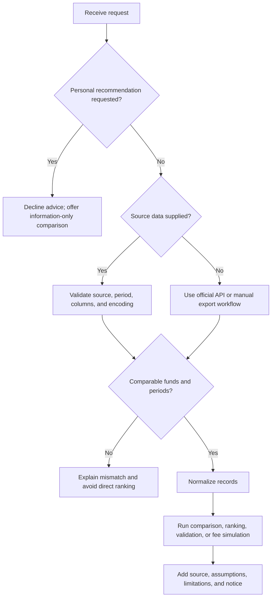
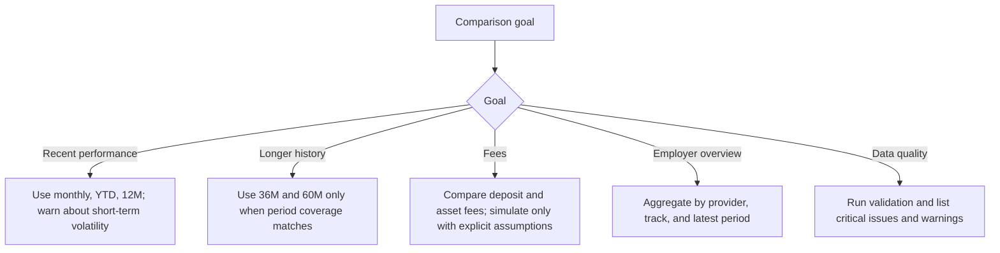

# Pension Fund Performance Tracker

## Purpose

Use this skill to collect, normalize, compare, and explain public Israeli pension fund performance and fee data for small businesses, freelancers, payroll administrators, bookkeepers, and consumers. Treat every output as information only. Do not present rankings, simulations, or comparisons as pension advice, investment advice, tax advice, insurance advice, or a recommendation to join, leave, transfer, or prefer a specific fund.

Primary sources are Pensia Net and official Israeli public data published by the Capital Market, Insurance and Savings Authority and Data.gov.il. Treat legacy Ministry of Finance references as government provenance, not as a substitute for current source verification. Source schemas can change, so record the source URL, retrieval date, reporting period, and resource or file identifier for each analysis.

## Core capabilities

- Normalize Hebrew and English source columns into a canonical schema.
- Compare latest fund records by returns, fees, provider, track, and reporting period.
- Estimate management-fee impact under explicit assumptions.
- Flag missing, stale, implausible, duplicate, or incomparable records.
- Generate neutral English or Hebrew explanations with source citations.
- Support reproducible local workflows with CLI commands and a typed Python client.

## Boundaries

Never:
- Recommend a pension fund, insurance product, transfer, or investment action.
- State that past returns predict future returns.
- Compare different target populations or tracks without warning.
- Treat missing fees as zero.
- Use marketing pages as primary data.
- Convert a public-data comparison into personal retirement, tax, or insurance advice.
- Scrape non-public systems, bypass authentication, or ignore official terms of use.

Required notice for user-facing reports:

> This comparison is for general information only. It is based on public data and explicit assumptions. It is not pension advice, investment advice, insurance advice, tax advice, or a recommendation. Consider consulting a licensed pension adviser for personal decisions.

## Source hierarchy

Web verification for the cited official sources was refreshed on 2026-06-02. See `references/verification-log.md`. Israeli VAT was verified at 18% for 2026, but VAT is not used in pension-return or management-fee calculations unless a separate business workflow explicitly asks for VAT context.


1. Data.gov.il CKAN API resource published by an official government source.
2. Official Pensia Net export downloaded from the portal.
3. Official Capital Market, Insurance and Savings Authority CSV/XLSX/JSON publication.
4. User-provided CSV or spreadsheet with clear provenance.

## Canonical schema

| Canonical field | Meaning | Examples |
|---|---|---|
| `fund_id` | Fund or track identifier | `12345` |
| `fund_name` | Fund or track name | `Comprehensive Pension - Age 50 and under` |
| `provider` | Managing company | `Example Pension Ltd.` |
| `report_date` | Reporting date or month | `2025-12-31`, `12/2025`, `31-12-2025` |
| `fund_type` | Product or fund category | `new pension fund` |
| `track_name` | Investment track | `Age 50 and under` |
| `monthly_return_pct` | Monthly reported return, percentage points | `0.82` |
| `year_to_date_return_pct` | Year-to-date return, percentage points | `6.10` |
| `trailing_12m_return_pct` | 12-month return, percentage points | `7.40` |
| `trailing_36m_return_pct` | 36-month return, percentage points | `18.20` |
| `trailing_60m_return_pct` | 60-month return, percentage points | `32.50` |
| `management_fee_deposit_pct` | Fee from contributions | `1.50` |
| `management_fee_assets_pct` | Annual fee from accumulated assets | `0.20` |
| `assets_millions_nis` | Assets under management in millions of NIS | `1234.56` |

## Column aliases

| Canonical field | Hebrew aliases | English aliases |
|---|---|---|
| `fund_id` | מספר קופה, מספר מסלול, קוד קופה, קוד מסלול | fund_id, fund number, track id |
| `fund_name` | שם קופה, שם מסלול, שם קרן | fund_name, fund name, track name |
| `provider` | גוף מנהל, שם גוף מנהל, חברה מנהלת | provider, managing company |
| `report_date` | תאריך דיווח, חודש דיווח, תקופת דיווח | report_date, reporting period |
| `monthly_return_pct` | תשואה חודשית, תשואה נומינלית חודשית | monthly return |
| `year_to_date_return_pct` | תשואה מצטברת מתחילת שנה | ytd return |
| `trailing_12m_return_pct` | תשואה 12 חודשים אחרונים | 12m return |
| `trailing_36m_return_pct` | תשואה 36 חודשים אחרונים | 36m return |
| `trailing_60m_return_pct` | תשואה 60 חודשים אחרונים | 60m return |
| `management_fee_deposit_pct` | דמי ניהול מהפקדה | deposit fee, contribution fee |
| `management_fee_assets_pct` | דמי ניהול מצבירה | asset fee, balance fee |
| `assets_millions_nis` | נכסים במיליוני ש"ח, סך נכסים | assets, total assets |

## Decision tree: request handling



## Decision tree: metric selection



## Examples

### Compare two funds

User: "Compare 12345 and 67890 by recent returns and fees."

Required steps:
1. Load latest records for both fund IDs.
2. Confirm report dates match.
3. Confirm track populations are comparable.
4. Show monthly, 12M, 36M, deposit-fee, and asset-fee values where available.
5. State that historical returns do not indicate future returns.

Suggested table:

| Metric | Fund 12345 | Fund 67890 | Note |
|---|---:|---:|---|
| Report date | 31-12-2025 | 31-12-2025 | Same period |
| Monthly return | 0.82% | 0.75% | Short-term and volatile |
| 36M return | 18.20% | 17.90% | Compare only same track population |
| Fee from deposit | 1.50% | 1.20% | Applied to contributions |
| Fee from assets | 0.20% | 0.24% | Applied to accumulated balance |

### Estimate fee impact for a freelancer

User: "Estimate the impact of a 0.2% asset fee over 20 years for ₪2,000 monthly deposits."

Use explicit assumptions:
- Monthly contribution: ₪2,000.
- Starting balance: ₪0 unless supplied.
- Annual gross return: ask for an assumption or present sensitivity at 3%, 5%, 7%.
- Deposit fee: supplied value or 0%, clearly stated.
- Asset fee: 0.2%.
- Horizon: 20 years.

Output gross no-fee balance, net with fees, estimated fee drag, total contributions, and limitations.

### Small-business overview

User: "Prepare an information-only overview for employees enrolled in three tracks."

Use aggregate, non-personal language:
- Group by provider and track.
- Show latest reporting date.
- Show returns and fees.
- Do not call any track "best" or "worst".
- Use "highest reported return in this dataset" and "lowest reported fee in this dataset".

## Edge cases

| Edge case | Handling |
|---|---|
| Different report months | Do not rank directly; align periods or state mismatch. |
| Different target populations | Split or warn before comparison. |
| Missing deposit fee | Show `not reported`; do not assume zero. |
| Missing asset fee | Show `not reported`; do not assume zero. |
| Negative return | Accept if plausible. |
| Return above 100% or below -80% | Flag as implausible; inspect parsing. |
| Decimal comma | Convert `1,23` to `1.23` only when comma is decimal separator. |
| Thousands separators | Parse `1,234.56` as `1234.56`. |
| New fund without 36M history | Compare available periods and mark missing history. |
| Duplicate rows | Flag duplicate fund/name/date rows. |
| Closed or merged fund | Preserve historical rows and disclose status if source provides it. |
| "Which fund should I choose?" | Decline advice; offer neutral comparison. |
| Private statement upload | Use only explicit fields needed for arithmetic; avoid personal advice. |

## CLI workflow

```bash
python scripts/pension-fund-tracker-cli.py normalize pensia-net.csv --output normalized.json
python scripts/pension-fund-tracker-cli.py validate normalized.json
python scripts/pension-fund-tracker-cli.py rank normalized.json --metric trailing_36m_return_pct --top 10
python scripts/pension-fund-tracker-cli.py compare normalized.json 12345 67890
python scripts/pension-fund-tracker-cli.py fee-impact --monthly-contribution 2000 --years 20 --annual-return 5 --deposit-fee 1.5 --asset-fee 0.2
```

## Production checklist

- Source is official or clearly user-provided.
- Retrieval/export date is recorded.
- Reporting period is visible.
- Compared funds share the same reporting period.
- Track population and fund type are comparable.
- IDs are treated as strings, preserving leading zeros.
- Percentages are stored as percentage points, not fractions.
- Fees are not confused with returns.
- Hebrew text and right-to-left labels are preserved.
- Currency uses `₪`.
- User-facing output includes the information-only notice.
- No recommendation or personal advice appears.
- Raw source, normalized file, command, assumptions, and output are saved.
- Pytest suite passes before release.

## Anti-patterns

Avoid:
- "Fund A is the best."
- "Move to Fund B."
- "This fund will outperform."
- "Missing fee equals 0%."
- "Different months can be ranked directly."
- "A marketing page is enough."
- "Low fee automatically means better."

Use:
- "Fund A had the highest reported 36-month return among the compared records."
- "Fund B has the lowest reported asset fee in this dataset."
- "This comparison does not account for personal pension needs, insurance coverage, tax status, employer arrangements, or future returns."

## Troubleshooting summary

| Symptom | Cause | Action |
|---|---|---|
| Garbled Hebrew | Encoding mismatch | Try UTF-8-SIG, UTF-8, then Windows-1255 |
| Empty comparison | Fund IDs do not match normalized IDs | Inspect normalized JSON |
| Impossible fee values | Percent/fraction confusion | Verify source documentation |
| Missing 36M return | New fund or omitted source field | Use available periods with caveat |
| API resource not found | Data.gov.il resource changed | Run package search and update resource ID |
| CLI import error | Missing dependencies | Install `requirements-dev.txt` |
