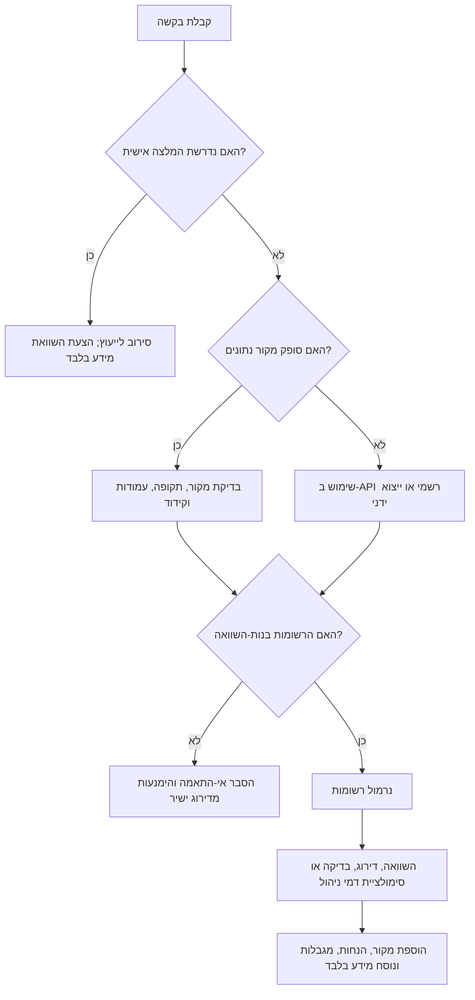
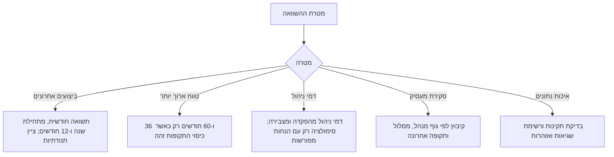

# מעקב ביצועי קרנות פנסיה

## מטרה

השתמש בסקיל כדי לאסוף, לנרמל, להשוות ולהסביר נתוני תשואה ודמי ניהול פומביים של קרנות פנסיה בישראל. הסקיל מתאים לבעלי עסקים קטנים, עצמאים, מנהלי חשבונות, חשבי שכר וצרכנים פרטיים. כל תוצר הוא מידע כללי בלבד. אין להציג דירוג, סימולציה או השוואה כייעוץ פנסיוני, ייעוץ השקעות, ייעוץ מס, ייעוץ ביטוחי או המלצה להצטרף לקרן, לעזוב קרן, לנייד כספים או לבחור מסלול.

מקורות עיקריים: פנסיה נט, נתונים רשמיים של רשות שוק ההון, ביטוח וחיסכון ומשאבי Data.gov.il. התייחס לאזכורי משרד האוצר כאל מקור ממשלתי היסטורי או פרסומי, ולא כתחליף לאימות מקור עדכני. מבני קבצים ושמות עמודות עשויים להשתנות. תעד תמיד כתובת מקור, תאריך שליפה, תקופת דיווח ומזהה משאב או שם קובץ.

## יכולות מרכזיות

- נרמול עמודות בעברית ובאנגלית לסכמת נתונים קבועה.
- השוואת רשומות אחרונות לפי תשואות, דמי ניהול, גוף מנהל, מסלול ותקופת דיווח.
- אומדן השפעת דמי ניהול תחת הנחות מפורשות.
- סימון נתונים חסרים, מיושנים, חריגים, כפולים או לא בני-השוואה.
- הפקת הסברים ניטרליים בעברית או באנגלית.
- עבודה שחוזרת על עצמה דרך CLI ולקוח Python טיפוסי.

## גבולות שימוש

אסור:
- להמליץ על קרן פנסיה, מוצר ביטוחי, ניוד או פעולה השקעתית.
- לקבוע שתשואות עבר מנבאות תשואות עתידיות.
- להשוות אוכלוסיות יעד או מסלולים שונים בלי אזהרה.
- להתייחס לדמי ניהול חסרים כ-0%.
- להשתמש בדפי שיווק כמקור נתונים ראשי.
- להפוך השוואת מידע לתכנון פרישה, מס או ביטוח אישי.
- לעקוף הזדהות, תנאי שימוש או מגבלות גישה.

נוסח חובה לדוחות משתמש:

> ההשוואה היא מידע כללי בלבד. היא מבוססת על נתונים פומביים ועל הנחות מפורשות. אין לראות בה ייעוץ פנסיוני, ייעוץ השקעות, ייעוץ ביטוחי, ייעוץ מס או המלצה. לקבלת החלטות אישיות יש לשקול פנייה לבעל רישיון מתאים.

## סדר עדיפות למקורות

1. משאב CKAN רשמי ב-Data.gov.il שפורסם על ידי גורם ממשלתי.
2. ייצוא רשמי מפורטל פנסיה נט.
3. קובץ CSV/XLSX/JSON רשמי של משרד האוצר או רשות שוק ההון.
4. קובץ משתמש עם מקור, תקופה ומשמעות עמודות מתועדים.

## סכמת נתונים

| שדה קנוני | משמעות | דוגמה |
|---|---|---|
| `fund_id` | מספר קרן או מסלול | `12345` |
| `fund_name` | שם קרן או מסלול | `פנסיה מקיפה - עד גיל 50` |
| `provider` | גוף מנהל | `חברת פנסיה לדוגמה בע"מ` |
| `report_date` | תאריך או חודש דיווח | `31/12/2025`, `12/2025` |
| `fund_type` | סוג מוצר או קרן | `קרן פנסיה חדשה` |
| `track_name` | מסלול השקעה | `עד גיל 50` |
| `monthly_return_pct` | תשואה חודשית באחוזים | `0.82` |
| `year_to_date_return_pct` | תשואה מתחילת השנה | `6.10` |
| `trailing_12m_return_pct` | תשואה ל-12 חודשים | `7.40` |
| `trailing_36m_return_pct` | תשואה ל-36 חודשים | `18.20` |
| `trailing_60m_return_pct` | תשואה ל-60 חודשים | `32.50` |
| `management_fee_deposit_pct` | דמי ניהול מהפקדה | `1.50` |
| `management_fee_assets_pct` | דמי ניהול מצבירה | `0.20` |
| `assets_millions_nis` | נכסים במיליוני ₪ | `1234.56` |

## מיפוי עמודות

| שדה קנוני | שמות עבריים נפוצים | שמות באנגלית |
|---|---|---|
| `fund_id` | מספר קופה, מספר מסלול, קוד קופה, קוד מסלול | fund_id, fund number, track id |
| `fund_name` | שם קופה, שם מסלול, שם קרן | fund_name, fund name, track name |
| `provider` | גוף מנהל, שם גוף מנהל, חברה מנהלת | provider, managing company |
| `report_date` | תאריך דיווח, חודש דיווח, תקופת דיווח | report_date, reporting period |
| `monthly_return_pct` | תשואה חודשית, תשואה נומינלית חודשית | monthly return |
| `year_to_date_return_pct` | תשואה מצטברת מתחילת שנה | ytd return |
| `trailing_12m_return_pct` | תשואה 12 חודשים אחרונים | 12m return |
| `trailing_36m_return_pct` | תשואה 36 חודשים אחרונים | 36m return |
| `trailing_60m_return_pct` | תשואה 60 חודשים אחרונים | 60m return |
| `management_fee_deposit_pct` | דמי ניהול מהפקדה, דמי ניהול מהפקדות | deposit fee |
| `management_fee_assets_pct` | דמי ניהול מצבירה, דמי ניהול מנכסים | asset fee |
| `assets_millions_nis` | נכסים במיליוני ש"ח, סך נכסים, היקף נכסים | assets |

## עץ החלטה לטיפול בבקשה



## עץ החלטה לבחירת מדדים



## דוגמאות

### השוואת שתי קרנות

בקשה: "השווה בין 12345 ל-67890 לפי תשואות ודמי ניהול."

פעולות:
1. טען את הרשומה האחרונה לכל מספר קרן.
2. ודא שתאריכי הדיווח זהים.
3. ודא שאוכלוסיית היעד וסוג המסלול בני-השוואה.
4. הצג תשואה חודשית, 12 חודשים, 36 חודשים, דמי ניהול מהפקדה ודמי ניהול מצבירה.
5. ציין שתשואות עבר אינן מעידות על תשואות עתידיות.

| מדד | קרן 12345 | קרן 67890 | הערה |
|---|---:|---:|---|
| תאריך דיווח | 31/12/2025 | 31/12/2025 | אותה תקופה |
| תשואה חודשית | 0.82% | 0.75% | קצרה ותנודתית |
| תשואה ל-36 חודשים | 18.20% | 17.90% | רק באותו סוג מסלול |
| דמי ניהול מהפקדה | 1.50% | 1.20% | חלים על הפקדות |
| דמי ניהול מצבירה | 0.20% | 0.24% | חלים על היתרה הצבורה |

### אומדן דמי ניהול לעצמאי

בקשה: "חשב השפעה של 0.2% דמי ניהול מצבירה ל-20 שנה עם הפקדה חודשית של ₪2,000."

הנחות:
- הפקדה חודשית: ₪2,000.
- יתרה התחלתית: ₪0 אם לא סופקה יתרה.
- תשואה שנתית ברוטו: דרוש הנחה או הצג רגישות ל-3%, 5%, 7%.
- דמי ניהול מהפקדה: ערך שסופק או 0%, עם ציון מפורש.
- דמי ניהול מצבירה: 0.2%.
- תקופה: 20 שנה.

הצג יתרה ברוטו ללא דמי ניהול, יתרה נטו, גרירת דמי ניהול משוערת וסך הפקדות. אל תציג המלצה.

### סקירה לעסק קטן

בקשה: "הכן סקירת מידע לעובדים בשלושה מסלולים."

כללים:
- קבץ לפי גוף מנהל ומסלול.
- הצג תקופת דיווח אחרונה.
- הצג תשואות ודמי ניהול.
- אל תכתוב "הכי טובה" או "הכי גרועה".
- כתוב "התשואה המדווחת הגבוהה ביותר בקובץ" או "דמי הניהול הנמוכים ביותר בקובץ".

## מקרי קצה

| מצב | טיפול |
|---|---|
| חודשי דיווח שונים | אין לדרג ישירות; יישר תקופות או ציין אי-התאמה. |
| אוכלוסיות יעד שונות | פצל או הזהר לפני השוואה. |
| חסרים דמי ניהול מהפקדה | הצג `לא דווח`; אל תניח 0%. |
| חסרים דמי ניהול מצבירה | הצג `לא דווח`; אל תניח 0%. |
| תשואה שלילית | קבל אם היא סבירה. |
| תשואה מעל 100% או מתחת ל-80%- | סמן כחריגה ובדוק פרשנות. |
| פסיק עשרוני | המר `1,23` ל-`1.23` רק כשזהו מפריד עשרוני. |
| מפריד אלפים | המר `1,234.56` ל-`1234.56`. |
| קרן חדשה ללא 36 חודשים | השווה תקופות זמינות וסמן חוסר היסטוריה. |
| כפילות | סמן כפילות לפי מספר קרן, שם ותאריך. |
| קרן שנסגרה או מוזגה | שמור היסטוריה וציין סטטוס אם קיים במקור. |
| "מה לבחור?" | סרב לייעוץ אישי והצע השוואת מידע. |
| דוח אישי של משתמש | השתמש רק בשדות שנמסרו לחישוב; אל תסיק המלצה. |

## תהליך CLI

```bash
python scripts/pension-fund-tracker-cli.py normalize pensia-net.csv --output normalized.json
python scripts/pension-fund-tracker-cli.py validate normalized.json
python scripts/pension-fund-tracker-cli.py rank normalized.json --metric trailing_36m_return_pct --top 10
python scripts/pension-fund-tracker-cli.py compare normalized.json 12345 67890
python scripts/pension-fund-tracker-cli.py fee-impact --monthly-contribution 2000 --years 20 --annual-return 5 --deposit-fee 1.5 --asset-fee 0.2
```

## רשימת בדיקה לפרודקשן

- המקור רשמי או סופק על ידי המשתמש עם תיעוד.
- תאריך שליפה ותקופת דיווח מופיעים בדוח.
- הקרנות המושוות באותה תקופה.
- אוכלוסיית יעד וסוג מסלול בני-השוואה.
- מספרי קרן נשמרים כמחרוזות.
- אחוזים נשמרים כנקודות אחוז ולא כשברים.
- דמי ניהול אינם מתבלבלים עם תשואות.
- עברית וכיווניות נשמרות.
- סכומים מוצגים עם ₪, לדוגמה ₪2,000.
- הדוח כולל נוסח מידע בלבד.
- אין המלצה או ייעוץ אישי.
- נשמרים מקור גולמי, קובץ מנורמל, פקודה, הנחות ופלט.
- בדיקות pytest עוברות.

## אנטי-דפוסים

הימנע:
- "קרן א' היא הטובה ביותר."
- "כדאי לעבור לקרן ב'."
- "הקרן הזאת תנצח בעתיד."
- "שדה חסר של דמי ניהול פירושו 0%."
- "אפשר לדרג חודשים שונים."
- "דף שיווק מספיק."
- "דמי ניהול נמוכים תמיד עדיפים."

השתמש:
- "קרן א' הציגה את התשואה המדווחת הגבוהה ביותר ל-36 חודשים מבין הרשומות."
- "לקרן ב' דמי הניהול מצבירה הנמוכים ביותר בקובץ."
- "ההשוואה אינה כוללת צרכים פנסיוניים אישיים, כיסוי ביטוחי, מצב מס, הסדרי מעסיק או תשואות עתידיות."

## פתרון תקלות מקוצר

| סימפטום | סיבה | פעולה |
|---|---|---|
| עברית משובשת | קידוד שגוי | נסה UTF-8-SIG, UTF-8 ואז Windows-1255 |
| השוואה ריקה | מספרי קרן לא תואמים | בדוק JSON מנורמל |
| דמי ניהול לא סבירים | בלבול אחוז/שבר | בדוק תיעוד מקור |
| חסרה תשואה ל-36 חודשים | קרן חדשה או שדה חסר | השתמש בתקופות זמינות עם הסתייגות |
| משאב API לא נמצא | מזהה Data.gov.il השתנה | הרץ package_search ועדכן resource ID |
| שגיאת CLI | חסרות תלויות | התקן `requirements-dev.txt` |
